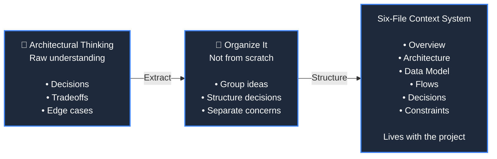

|||
|---|---|
|[claude code八荣八耻](https://juejin.cn/post/7652160519214727195)|写AI代码总翻车？3份配置直接抄|
|[受Karpathy启发的Claude Code指南=andrej-karpathy-skills](https://github.com/multica-ai/s/blob/main/README.zh.md)|用于运行和管理编码智能体,支持可复用的技能|
|[GitNexus](https://github.com/abhigyanpatwari/GitNexus)|client-side knowledge graph creator,|
|||
|||

- [2026年真正能让你coding效率起飞的12个Claude-Code-Codex高星GitHub仓库](https://juejin.cn/post/7653601975863050294)
- https://github.com/rohitg00/awesome-claude-code-toolkit#skills
- vercel-react-best-practices
- https://github.com/mattpocock/skills/blob/main/skills/productivity/grill-me

## use

- https://github.com/obra/superpowers
- https://github.com/thedotmack/claude-mem
- https://github.com/oyj123321/claude-code-eight-principles
- https://github.com/mattpocock/skills

## Todo list

- https://www.uwarp.design/blog/img2threejs-image-to-procedural-threejs-guide
  - https://github.com/img2threejs/img2threejs

## lessons

- https://github.com/mlabonne/llm-course
