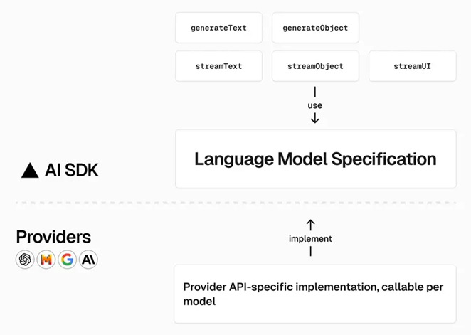

[AI SDK by Vercel](#top)

- [Providers and Models](#providers-and-models)
- [Streaming and Blocking](#streaming-and-blocking)
- [Prompts](#prompts)
- [Tool](#tool)
- [Next.js App Router Sample](#nextjs-app-router-sample)
  - [Basic](#basic)
  - [Stream Data Alongside Response](#stream-data-alongside-response)

-----------------------------------------------------

## Providers and Models

- 
  - Generative Artificial Intelligence
  - Large Language Models(LLM)

|provider||
|---|---|
|[OpenAI Provider](https://sdk.vercel.ai/providers/ai-sdk-providers/openai) |`@ai-sdk/openai`|
|[Azure OpenAI Provider](https://sdk.vercel.ai/providers/ai-sdk-providers/azure) |`@ai-sdk/azure`|
|[Anthropic Provider](https://sdk.vercel.ai/providers/ai-sdk-providers/anthropic) |`@ai-sdk/anthropic`|
|[Amazon Bedrock Provider](https://sdk.vercel.ai/providers/ai-sdk-providers/amazon-bedrock) |`@ai-sdk/amazon-bedrock`|
|[Google Generative AI Provider](https://sdk.vercel.ai/providers/ai-sdk-providers/google-generative-ai) |`@ai-sdk/google`|
|[Google Vertex Provider](https://sdk.vercel.ai/providers/ai-sdk-providers/google-vertex) |`@ai-sdk/google-vertex`|
|[Mistral Provider](https://sdk.vercel.ai/providers/ai-sdk-providers/mistral) |`@ai-sdk/mistral`|
|[Cohere Provider](https://sdk.vercel.ai/providers/ai-sdk-providers/cohere) |`@ai-sdk/cohere`|


[⬆ back to top](#top)

## Streaming and Blocking

- Blocking UI
- Streaming UI: the AI SDK is designed to make implementing streaming UIs as simple as possible., `streamText`,


## Prompts

- `generateText` or `streamUI`
- text prompts
- message prompts:
  - A message prompt is an **array** of user, assistant, and tool messages
  - Each message has a `role` and a `content` property
- multi-model messages
  - binary image(Buffer)
  - base-64 encoded image(string)
  - image Url(string)
- tool messages
  - Tools (also known as function calling) are programs that you can provide an LLM to extend it's built-in functionality
- system messages
  - the initial set of instructions given to models that help guide and constrain the models' behaviors and responses

|messages||example|
|---|---|---|
|base64-encoded image|data URL string: string with base-64 encoded content|`data:image/png;base64,...`|
|binary image|`ArrayBuffer`, `Uint8Array`, `Buffer`|`fs.readFileSync('./data/comic-cat.png')`|
|URL|http(s) URL string, URL object| `https://example.com/image.png`,`new URL('https://example.com/image.png')`|

```js
// text prompts
import { generateText } from "ai"
import { openai } from "@ai-sdk/openai"
const { text } = await generateText({
  model: openai("gpt-4-turbo"),
  prompt: "What is love?",
  // can use template literals
  prompt:
    `I am planning a trip to ${destination} for ${lengthOfStay}  days. ` + `Please suggest the best tourist activities for me to do.`,
})
// message prompts
const result = await streamUI({
  model: yourModel,
  messages: [
    { role: 'user', content: 'Hi!' },
    { role: 'assistant', content: 'Hello, how can I help?' },
    { role: 'user', content: 'Where can I buy the best Currywurst in Berlin?' },
  ],
});
// Multi-modal messages
const result = await generateText({
  model,
  messages: [
    {
      role: 'user',
      content: [
        { type: 'text', text: 'Describe the image in detail.' },
        // Binary image (Buffer)
        { type: 'image', image: fs.readFileSync('./data/comic-cat.png') },
        // Base-64 encoded image (string)
        { type: 'image', image: fs.readFileSync('./data/comic-cat.png').toString('base64') },
        // Image URL (string)
        { type: 'image', image:
            'https://github.com/vercel/ai/blob/main/examples/ai-core/data/comic-cat.png?raw=true',
        },
      ],
    },
  ],
});
```

[⬆ back to top](#top)

## Tool

- A tool is an **object** that can be called by the model to perform a specific task
- A tool consists of three properties:
  - description: An optional description of the tool that can influence when the tool is picked
  - parameters: A Zod schema or a JSON schema that defines the parameters. The schema is consumed by the LLM, and also used to validate the LLM tool calls
  - execute: An optional async function that is called with the arguments from the tool call
- The AI SDK [Core Tool Calling](https://sdk.vercel.ai/docs/ai-sdk-core/tools-and-tool-calling) and [Agents](https://sdk.vercel.ai/docs/ai-sdk-core/agents) documentation

```js
import { z } from 'zod';
import { generateText, tool } from 'ai';
const result = await generateText({
  model: yourModel,
  tools: {
    weather: tool({
      description: 'Get the weather in a location',
      parameters: z.object({
        location: z.string().describe('The location to get the weather for'),
      }),
      execute: async ({ location }) => ({
        location,
        temperature: 72 + Math.floor(Math.random() * 21) - 10,
      }),
    }),
  },
  prompt: 'What is the weather in San Francisco?',
});
```

[⬆ back to top](#top)

## Next.js App Router Sample

### Basic

1. `npx create next-app@latest my-ai-app`
2. `npm i ai @ai-sdk/openai zod`
3. Configure OpenAI API key:
   1. create a '.env.local' in root directory
   2. `OPENAI_API_KEY=xxxxxxxxx`
4. Create a Route Handler  -> create file 'app/api/chat/route.ts'
5. Wire up the UI   -> modify 'app/page.tsx'
   1. `useChat` 

```js
//app/api/chat/route.ts
import { openai } from "@ai-sdk/openai";
import { streamText, convertToCoreMessages } from "ai";
export const maxDuration = 30;
export async function POST(req) {
  const { messages } = await req.json();
  const result = await streamText({
    model: openai("gpt-4o"),                // "gpt-3.5-turbo"
    //prompt: "What is a fun thing to do in Bend, Oregon?"
    messages: convertToCoreMessages(messages),
  });
  return result.toAIStreamResponse();
}
//app/page.tsx   -- note: need transfer to client component
"use client";
import { useChat } from "ai/react";
export default function Home() {
  const { messages, input, handleInputChange, handleSubmit, isLoading } = useChat();
  return (
    <main className="flex min-h-screen flex-col items-center justify-between p-24">
      {messages.map(m => <div key={m.id}>
        {m.role === "user" ? "User: " : "AI: "}
        {m.content}
      </div>)}
      {isLoading && (
        <div><h1>Loading...</h1></div>
      )}
      <form onSubmit={handleSubmit}>
        <input value={input}
          placeholder="Say something..."
          onChange={handleInputChange}
          disabled={isLoading} />
      </form>
    </main>
  );
}

```

### Stream Data Alongside Response

- using server action
1. create 'src\app\actions.js'
2. modify 'app/page.tsx'
3. delete 'app/api/chat/route.ts'

```js
// src\app\actions.js
"use server";
import { streamText } from "ai";
import { openai } from "@ai-sdk/openai";
import { createStreamableValue } from "ai/rsc";
export async function continueConversation(messages) {
  const result = await streamText({
    model: openai('gpt-4-turbo'),
    messages,
  });
  const stream = createStreamableValue(result.textStream);
  return stream.value;
}
// app/page.tsx
"use client";
import { useState } from "react";
import { continueConversation } from "./actions";
import { readStreamableValue } from "ai/rsc";
export const maxDuration = 30;
export default function Home() {
  const [messages, setMessages] = useState([]);
  const [input, setInput] = useState('');
  return (
    <main className="flex min-h-screen flex-col items-center justify-between p-24">
       {messages.map((m, i) => (
        <div key={i} className="whitespace-pre-wrap">
          {m.role === 'user' ? 'User: ' : 'AI: '}
          {m.content}
        </div>
      ))}
      <form onSubmit={ async e => {
          e.preventDefault();
          const newMessages = [...messages, { content: input, role: 'user'}];
          setMessages(newMessages);
          setInput('');
          const result = await continueConversation(newMessages);
          for await(const content of readStreamableValue(result)) {
            setMessages([
              ...newMessages,
              { role: 'assistant', content: content }
            ]);
          }
        }
      }>
        <input value={input}
          placeholder="Say something..."
          onChange={e => setInput(e.target.value)} />
      </form>
    </main>
  );
}
```

[⬆ back to top](#top)

- [AI SDK docs](https://sdk.vercel.ai/docs)
- [Vercel AI Playground](https://sdk.vercel.ai/)
- [AI SDK, Next.js, and OpenAI Chat Example](https://github.com/vercel/ai/tree/main/examples/next-openai)
