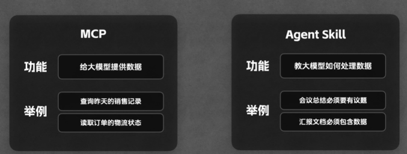
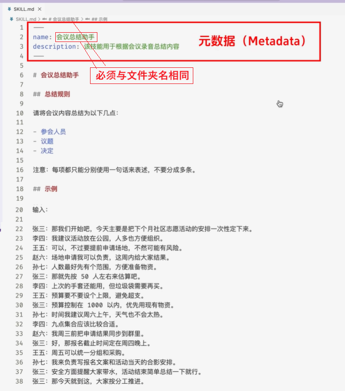
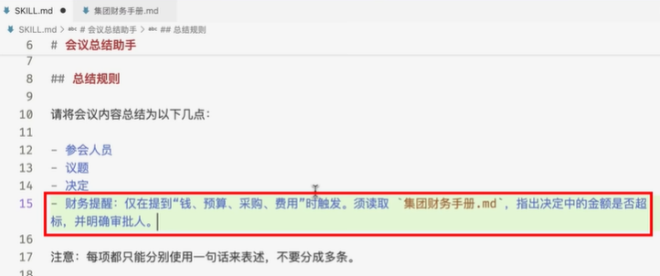
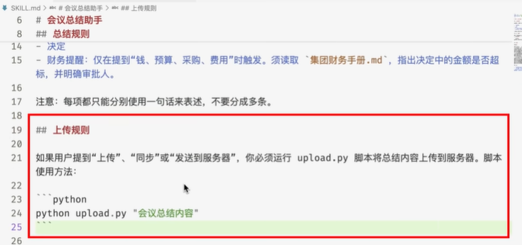

## Agent skills

- MCP connects model to data
- Skills teach model what to do with that data
- 

||||
|---|---|---|
|Matedata|必须mandatory| 目录|
|Instruction|按需加载|正文|
|Resource|按需加载|附录|

```
project
├── 📂.claude/skills/skill-name/
│       ├── 📄SKILL.md
│       ├── 📂scripts/
│       │     └── main.py
│       ├── 📂references/
│       │     └── doc.md
│       └── 📂assets/
│             └── pic.png
```
  
### Agent Skill的基本用法



### Reference + Script



- 官方建议将 Reference 归类至 references/ 文件夹，Script 归类至 scripts/ 文件夹，以保持结构清晰

## Tools

- [usufkaraaslan/Skill_Seekers](https://github.com/yusufkaraaslan/Skill_Seekers) - Convert documentation websites into Claude Skills

<details>
<summary><strong>✏️Creating Your First Skill: Step-by-Step Guide</strong></summary>

### Method 1: Use skill-creator (Recommended)

The easiest way to create a skill is to use the built-in `skill-creator`:

1. Enable the skill-creator skill in Claude
2. Ask Claude: "Use the skill-creator to help me build a skill for [your task]"
3. Answer the interactive questions about your workflow
4. Claude generates the complete skill structure for you

### Method 2: Manual Creation

1. **Create folder structure**:

   ```
   my-skill/
   ├── SKILL.md          # Main skill file with frontmatter
   ├── scripts/          # Optional executable scripts
   │   └── helper.py
   └── resources/        # Optional supporting files
       └── template.json
   ```

2. **Create SKILL.md with frontmatter**:

   ```yaml
   ---
   name: my-skill
   description: Brief description for skill discovery (keep concise)
   ---

   # Detailed Instructions

   Claude will read these instructions when the skill is activated.

   ## Usage
   Explain how to use this skill...

   ## Examples
   Provide clear examples...
   ```

3. **Add executable scripts** (optional):

   - Python, JavaScript, or other scripts Claude can execute
   - Reference them in your SKILL.md instructions

4. **Test locally**:

   - Install the skill in Claude Code or Claude Desktop
   - Test with relevant tasks
   - Iterate and refine

5. **Share**:
   - Publish to GitHub
   - Submit to this awesome list via PR
   - Share with your team via git repos or internal distribution

### Best Practices

- **Keep descriptions concise** - The frontmatter description is used for skill discovery
- **Use clear, actionable instructions** - Write instructions as if for a human collaborator
- **Include examples** - Show specific examples in your SKILL.md
- **Version your skills** - Use git tags for version management
- **Document dependencies** - List any prerequisites or required packages
- **Test thoroughly** - Verify your skill works across different scenarios

</details>

## Resources

- Agent Skill 官方规范：https://agentskills.io/home
- Skills explained（含 Anthropic 对 Skill vs MCP 解释）：https://claude.com/blog/skills-explained
- Claude Code 接入说明：https://code.claude.com/docs/en/skills
- Codex 接入说明：https://developers.openai.com/codex/skills/
- Cursor 接入说明：https://cursor.com/cn/docs/context/skills
- VS Code 接入说明：https://code.visualstudio.com/docs/copilot/customization/agent-skills

| Skill | Description |
| --- | --- |
|**[anthropics/skills](https://github.com/anthropics/skills/tree/main/skills)**| Official public repository for Skills|
|**[Claude Cookbooks - Skills](https://github.com/anthropics/claude-cookbooks/tree/main/skills)**|Example notebooks and tutorials|
|**Community Skills**||
|**[obra/superpowers](https://github.com/obra/superpowers)**|Core skills library for Claude Code with 20+ software development skills|
|**[obra/superpowers-lab](https://github.com/obra/superpowers-lab)**|Install from `superpowers-marketplace` plugin|
|**Individual Skills**||
| **[ios-simulator-skill](https://github.com/conorluddy/ios-simulator-skill)** | iOS app building, navigation, and testing through automation |
| **[ffuf-web-fuzzing](https://github.com/jthack/ffuf_claude_skill)** | Expert guidance for ffuf web fuzzing during penetration testing, including authenticated fuzzing with raw requests, auto-calibration, and result analysis |
| **[playwright-skill](https://github.com/lackeyjb/playwright-skill)** | General-purpose browser automation using Playwright |
| **[claude-d3js-skill](https://github.com/chrisvoncsefalvay/claude-d3js-skill)** | Visualizations in d3.js |
| **[claude-scientific-skills](https://github.com/K-Dense-AI/claude-scientific-skills)** | Comprehensive collection of ready-to-use scientific skills, including working with specialized scientific libraries and databases |
| **[web-asset-generator](https://github.com/alonw0/web-asset-generator)** | Generates web assets like favicons, app icons, and social media images |
| **[loki-mode](https://github.com/asklokesh/claudeskill-loki-mode)** | Multi-agent autonomous startup system - orchestrates 37 AI agents across 6 swarms to build, deploy, and operate a complete startup from PRD to revenue |
| **[Trail of Bits Security Skills](https://github.com/trailofbits/skills)** | Security skills for static analysis with CodeQL/Semgrep, variant analysis, code auditing, and vulnerability detection |
