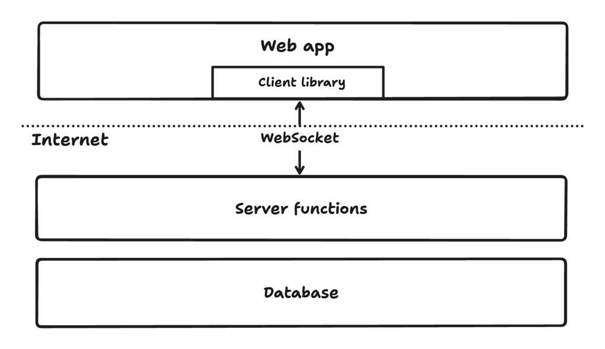
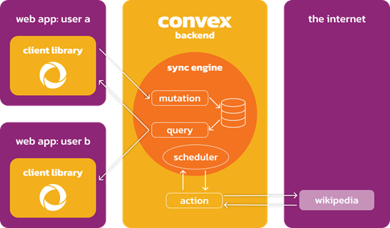
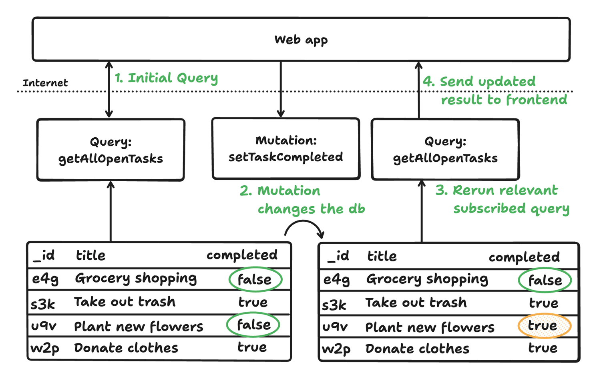

- [Convex Overview](#convex-overview)
- [Convex + Next.js](#convex--nextjs)
- [Convex with TypeScript and Schema](#convex-with-typescript-and-schema)
  - [using argument validation](#using-argument-validation)
  - [Inferring types from validators](#inferring-types-from-validators)
  - [Document types without system fields](#document-types-without-system-fields)

## Convex Overview

- Convex is the open source, reactive database where queries are TypeScript code running right in the database
- 
- **Database**:
  - Convex is a "document-relational" database.
  - The Convex database is reactive: whenever any data on which a query depends changes, the query is rerun, and client subscriptions are updated
- **Server functions**:
  - call Convex functions via **client libraries** or directly via **HTTP**
  - When create a new Convex project, automatically get a `convex/` folder where write server functions
  - `query`(read), `mutation`(write) to the db
  - use `actions` to call LLMs or send emails
  - can also durably schedule Convex functions via the `scheduler` or `cron` jobs
  - 
  - [Convex Tutorial: Calling external services](https://docs.convex.dev/tutorial/actions)
- **Client libraries**:
  - keep frontend synced with the results of server functions
  - `useQuery`  --> subscribe to this query, and the following happens to get an initial value
    - The Convex client sends a message to the Convex server to subscribe to the query
    - The Convex server runs the function, which reads data from the database
    - The Convex server sends a message to the client with the function's result
- 

```ts
/* Server functions  */
// A Convex query function
export const getAllOpenTasks = query({
  args: {},
  handler: async (ctx, args) => {
    // Query the database to get all items that are not completed
    const tasks = await ctx.db
      .query("tasks")
      .withIndex("by_completed", (q) => q.eq("completed", false))
      .collect();
    return tasks;
  },
});
// A Convex mutation function
export const setTaskCompleted = mutation({
  args: { taskId: v.id("tasks"), completed: v.boolean() },
  handler: async (ctx, { taskId, completed }) => {
    // Update the database using TypeScript
    await ctx.db.patch("tasks", taskId, { completed });
  },
});
/* Client libraries  */
// In your React component
import { useQuery } from "convex/react";
import { api } from "../convex/_generated/api";
export function TaskList() {
  const data = useQuery(api.tasks.getAllOpenTasks);
  return data ?? "Loading...";
}
```

[🚀back to top](#top)

## Convex + Next.js

1. setup
   1. `npx create-next-app@latest my-app`
   2. Install the Convex client and server library: `npm install convex`
   3. `npx convex dev`
      1. will prompt to log in with GitHub, create a project, and save your production and deployment URLs
      2. will also create a 'convex/' folder for write backend API functions in
      3. will then continue running to sync your functions with your dev deployment in the cloud
2. setup database
   1. Create sample data('sampleData.jsonl') for database
   2. Add the sample data to database: `npx convex import --table tasks sampleData.jsonl`
   3. Expose a database query: create 'convex/tasks.ts'

```ts
import { query } from "./_generated/server";
export const get = query({    //query function for reading data from database
  args: {},
  handler: async (ctx) => {
    return await ctx.db.query("tasks").collect();
  },
});
```

3. Next.js integration
   1. Create Convex provider  -->  'app/ConvexClientProvider.tsx'
   2. Wire up the ConvexClientProvider to 'app/layout.tsx'
   3. Display the data in app   -->  'app/page.tsx'
4. https://docs.convex.dev/quickstart/nextjs

```ts
// app/ConvexClientProvider.tsx
"use client";
import { ConvexProvider, ConvexReactClient } from "convex/react";
import { ReactNode } from "react";
const convex = new ConvexReactClient(process.env.NEXT_PUBLIC_CONVEX_URL!);
export function ConvexClientProvider({ children }: { children: ReactNode }) {
  return <ConvexProvider client={convex}>{children}</ConvexProvider>;
}
//  app/layout.tsx
import type { Metadata } from "next";
import { Geist, Geist_Mono } from "next/font/google";
import "./globals.css";
import { ConvexClientProvider } from "./ConvexClientProvider";
const geistSans = Geist({
  variable: "--font-geist-sans",
  subsets: ["latin"],
});
const geistMono = Geist_Mono({
  variable: "--font-geist-mono",
  subsets: ["latin"],
});
export const metadata: Metadata = {
  title: "Create Next App",
  description: "Generated by create next app",
};
export default function RootLayout({children}: Readonly<{ children: React.ReactNode }>) {
  return (
    <html lang="en">
      <body className={`${geistSans.variable} ${geistMono.variable} antialiased`}>
        <ConvexClientProvider>{children}</ConvexClientProvider>
      </body>
    </html>
  );
}
// app/page.tsx
"use client";
import Image from "next/image";
import { useQuery } from "convex/react";
import { api } from "../convex/_generated/api";
export default function Home() {
  const tasks = useQuery(api.tasks.get);    // useQuery
  return (
    <main className="flex min-h-screen flex-col items-center justify-between p-24">
      {tasks?.map(({ _id, text }) => <div key={_id}>{text}</div>)}
    </main>
  );
}
```

[🚀back to top](#top)

## Convex with TypeScript and Schema

### using argument validation

### Inferring types from validators

### Document types without system fields

- https://docs.convex.dev/understanding/best-practices/typescript

[🚀back to top](#top)

[🚀back to top](#top)

- [Convex Docs](https://docs.convex.dev/home)
- [The Ultimate Convex Crash Course](https://www.youtube.com/watch?v=_Qqvoq8JVXM)
- [The Complete Convex Crash Course](https://www.youtube.com/watch?v=DpZIkkYPd5I)
