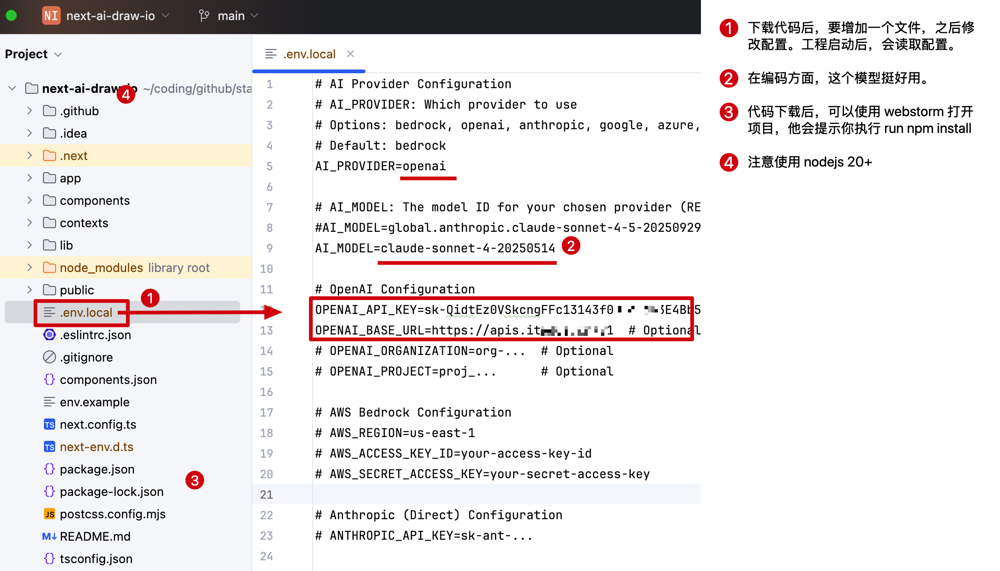

[draw.io + ai Agent](#top)

- [Draw.io Model Context Protocol (MCP) Serve](https://github.com/lgazo/drawio-mcp-server)

1. 插件安装
  - 谷歌浏览器：https://chromewebstore.google.com/detail/drawio-mcp-extension/okdbbjbbccdhhfaefmcmekalmmdjjide(opens new window)
  - 火狐浏览器：https://addons.mozilla.org/en-US/firefox/addon/drawio-mcp-extension/
2. 配置服务
3. 使用服务: 打开 https://app.diagrams.net/#
4. [next-ai-draw-io- Github基于Draw.io的二次开发](https://github.com/DayuanJiang/next-ai-draw-io)
   - 

```json
{
	"mcpServers": {
		"drawio": {
			"command": "npx",
			"args": [
			  "-y",
        "drawio-mcp-server"
			]
		}
	}
}
```

- https://origin.bugstack.cn/md/road-map/draw.io.html
