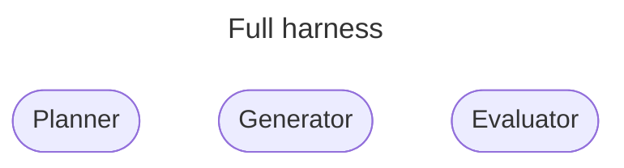
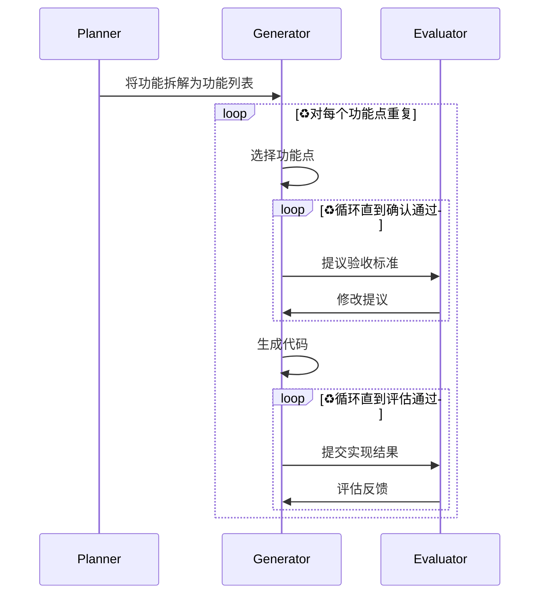
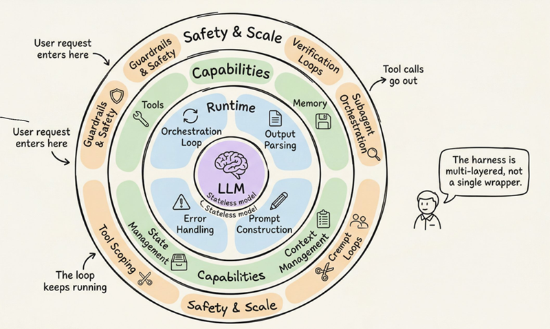
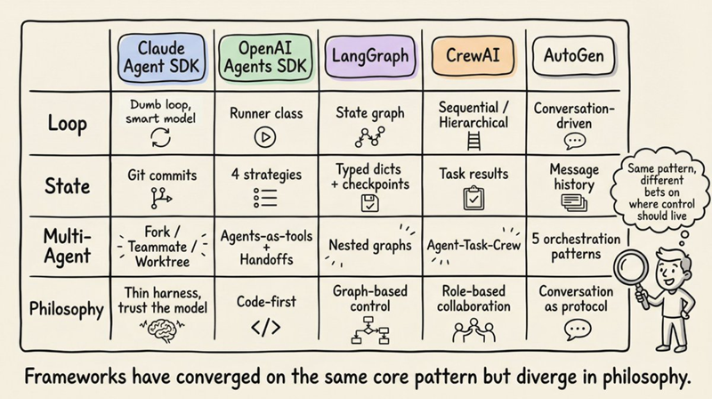
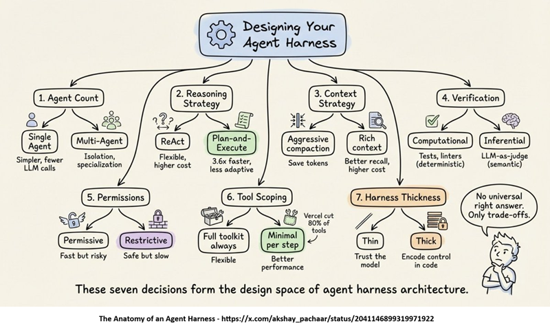
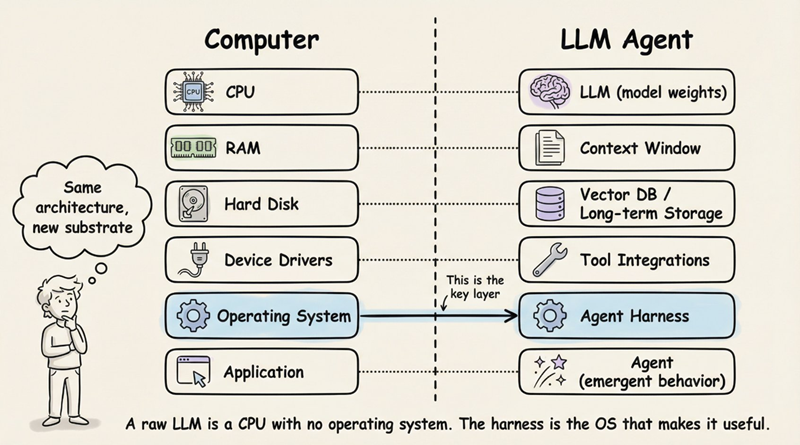

```mermaid
---
title: Full harness
---
flowchart TD
    Planner([Planner])
    Generator([Generator])
    Evaluator([Evaluator])
```

```mermaid
sequenceDiagram
    Planner->>Generator: 将功能拆解为功能列表

    loop ♻️对每个功能点重复
      Generator->>Generator: 选择功能点

      loop ♻️循环直到确认通过
        Generator->>Evaluator: 提议验收标准
        Evaluator->>Generator: 修改提议
      end

      Generator->>Generator: 生成代码

      loop ♻️循环直到评估通过
        Generator->>Evaluator: 提交实现结果
        Evaluator->>Generator: 评估反馈
      end
    end
```

- 
- 
- 
- 
- 
