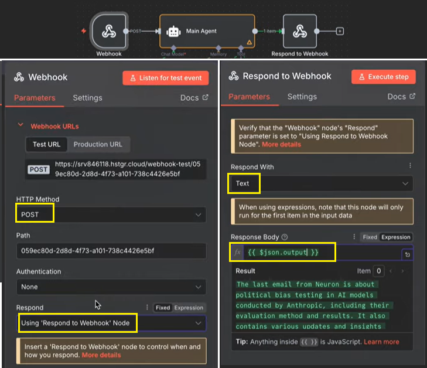
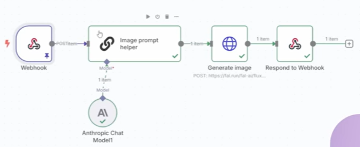

- [Sample 1 - create a custom UI for n8n systems](#sample-1---create-a-custom-ui-for-n8n-systems)
  - [Prompt](#prompt)
  - [connect to n8n](#connect-to-n8n)
- [Sample 2 - Package Your n8n Workflows Into Full Web Apps](#sample-2---package-your-n8n-workflows-into-full-web-apps)
  - [prompt](#prompt-1)
  - [General](#general)

## create a custom UI for n8n systems

### Prompt

```
Create a minimal modern chatGPT-style interface.
Use a soft pastel color palette only- no harsh or saturated tones.

Layout && style requirements:

A clean vertical chat layout with subtle glass-morphism styling on the chat container(light blur, translucent background, soft highlights).

At the top, centred, display a simple header that says "How can I help you?"

Conversation bubbles should have very soft corners and low contrast pastel background.

The input bar should be fixed at the bottom, have curved/rounded edges, a glass-morphism effect, and a simple placeholder like "Type here..."

Include smooth micro-shadows, gentle gradients, and lots of white space.

Typograhy should be light, modern and unobtrusive.

The overall aesthetic should feel calm, airy, and premium.
```

```
I have a web hook URL for an AI agent that I want to be connected to this chat interface once a message is sent. Send it to this web hook URL ... and then the response will be sent back and it should be displayed as a reply.
```

```
The responses from the Al agent will now come through in JSON, however it's returned in the chat interface as a JSON body. I want it as just raw text, so can you make it so that it strips back all of the JSON parts and leaves me with just the raw text.
it currently looks like this: [{"output":"Hello! Is there something specific you need help with? Feel free to let me know!"}]

i want it to looks like this: Hello! ls there something specific you need help with? Feel free to let me know!
```

```
On the left, I want there to be a sidebar that displays previous chats. I want it to actually have previous chat sessions in there. Create a storage system that will store chats with the timestamps and show them in the sidebar. They should only be the full chat sessions, not individual chat messages.
```

### connect to n8n

1. create 'webhook' node at the beginning
2. create 'respond to webhook'
3. 
4. 

[⬆ back to top](#top)

## Sample 2 - Package Your n8n Workflows Into Full Web Apps

- 
- 
- Payment: 
  - separate automation vs Stripe integrated
- Platforms:
  - [uxpilot](https://uxpilot.ai/): UX design
  - [supabase](https://supabase.com/): Postgres development platform
  - [Loveable](https://lovable.dev/?via=the-ai-automators): create apps and websites
  - [Perplexity](a free AI-powered answer engine that provides accurate, trusted, and real-time answers to any question)

## prompt

- prompt in uxpilot

```
create a web app that allows users to generate articles

Step 1.Generate butline: There should be a form with fields "article_title" and "article_instructions"(optional).
Step 2.Generate article: There should be a form	with Title, and outline, tone_of_voice, keywords, article citations.
Step 3. Edit and publish article: This should be a form with 3 fields: Article title, the featured image, and article content.The user will be able to edit each of these. There should be a publish button.
Step 4.Result: Should provide the user with an article link

```

- prompt in lovable

```
create a web app that allows users to generate articles

Step 1.Generate outline: There should be a form with fields "article_title" and "article_instructions"(optional).

Step 2. Generate article: There should be a form with Title, and outline, tone_of_voice, keywords, article citations.

Step 3. Edit and publish article: This should be a form with 3 fields: Article title, the featured image, and article content. The user will be able to edit each of these. There should be a publish button.

Step 3. Edit and publish article: This should be a form with 3 fields: Article title, the featured image, and article content. The user will be able to edit each of these. There should be a publish button.

Step 4.Result: Should provide the user with an article link.

Use Supabase for authentication. Include a login and logout screen. Do not allow users to register from within the app. Here is the code for the first screen
```

[⬆ back to top](#top)

## General

- Generating an article outline (using Perplexity and Anthropic Claude).
- Generating the full article content (using Anthropic Claude, responding in HTML).
- Generating a featured image (using fal.ai).
- Publishing the final article to WordPress.

> references
- https://lovable.dev/
- [How to create a custom UI for your n8n systems (full tutorial)](https://www.youtube.com/watch?v=SKCyfUBPfRQ)
- [Package Your n8n Workflows Into Full Web Apps (Step-By-Step)](https://www.youtube.com/watch?v=aUr9RBXr5Wo)

