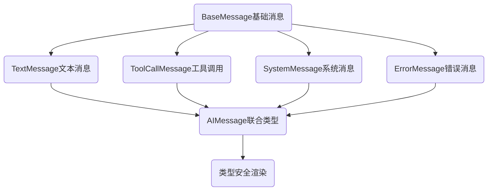
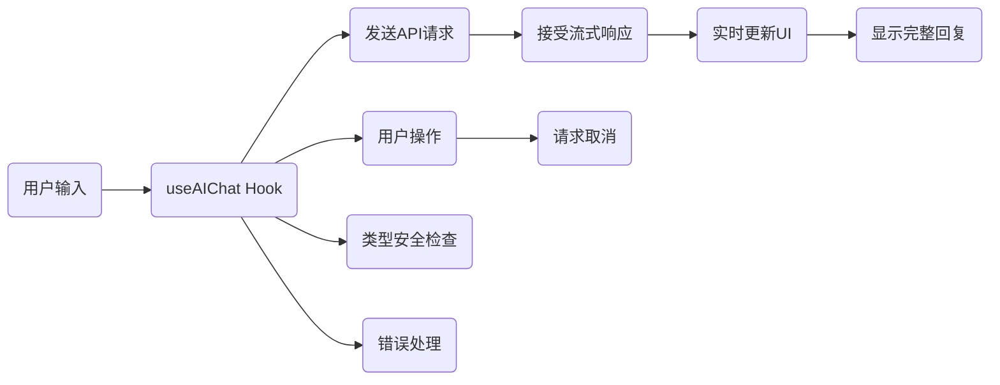
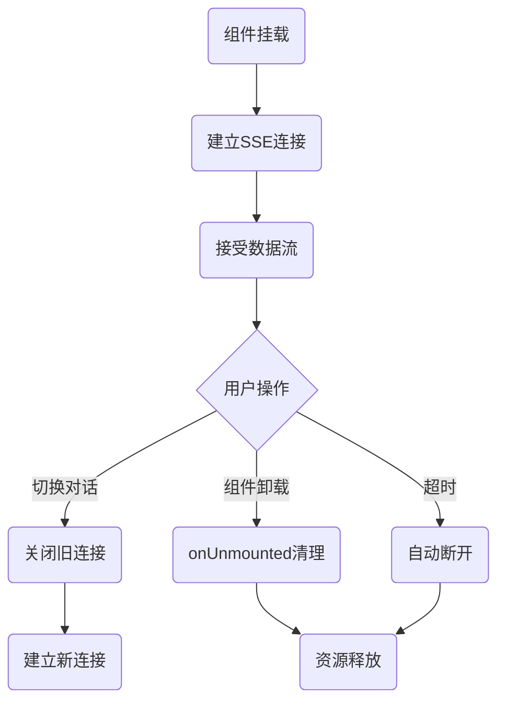

- [TS泛型接口-通用AI响应接口](#ts泛型接口-通用ai响应接口)
- [接口继承- AI消息体系](#接口继承--ai消息体系)
- [SSE实现AI流式输出](#sse实现ai流式输出)
- [异步资源管理-SEE连接管理避免内存泄露](#异步资源管理-see连接管理避免内存泄露)

## TS泛型接口-通用AI响应接口

```ts
// 通用AI响应接口
interface AIResponse<T> {
  success: boolean;
  data: T;
  message?: string;
}
const textResponse: AIResponse<string> = {
  success: true,
  data: "Hello, World!",
};

// 通用组件配置
interface ComponentConfig<T = string> {
  type: "button" | "input" | "div";
  props: Record<string, T>;
  children?: string;
}
const configResponse: AIResponse<ComponentConfig> = {
  success: true,
  data: {
    type: "button",
    props: { className: "btn-primary" },
    children: "Click Me",
  },
};
```

[🚀back to top](#top)

## 接口继承- AI消息体系



```ts
// BaseMessage基础消息
interface BaseMessage {
  id: string;
  timestamp: number;
  role: "user" | "assistant" | "system";
}
//TextMessage文本消息
interface TextMessage extends BaseMessage {
  type: "text";
  content: string;
}
// ToolCallMessage工具调用: AI要执行操作
interface ToolCallMessage extends BaseMessage {
  type: "tool_call";
  toolName: string;
  parameters: Record<string, any>;
}
// AIMessage联合类型
type AIMessage = TextMessage | ToolCallMessage;
function renderMessage(message: AIMessage) {    //
  if(message.type === "text") {
    return <p>{message.content}</p>;
  } else if(message.type === "tool_call") {
    return <TollCallIndicator name={message.toolName} parameters={message.parameters} />
  }
}
```
[🚀back to top](#top)

## SSE实现AI流式输出

- SSE: Server-Sent Events, 单向通讯，服务器推送AI生成的文本片段，前端实时渲染
- 流式输出： <mark>前端建立连接  ➡️ 后端边生成边推送 ➡️ 前端逐字显示（打字机效果）</mark>
- sample: 类型安全的聊天Hook

```ts
import { useState, useCallback, useRef } from 'react';

interface ChatMessage { 
  role: 'user' | 'assistant'; 
  content: string; 
}
interface UseAIChatOptions { 
  apiUrl: string; apiKey: 
  string; model?: string; 
}

export function useAIChat({ apiUrl, apiKey, model = 'qwen-turbo' }: UseAIChatOptions) {

  const [messages, setMessages] = useState([]);
  const [isLoading, setIsLoading] = useState(false);
  const abortControllerRef = useRef(null);

  const sendMessage = useCallback(async (userMessage: string) => {
    // 添加用户消息    
    setMessages((prev) => [...prev, { role: 'user', content: userMessage }]);
    setIsLoading(true);
    // 创建中止控制器（用于取消请求）    
    abortControllerRef.current = new AbortController();
    try {
      const response = await fetch(apiUrl, {
        method: 'POST',
        headers: {
          'Authorization': `Bearer ${apiKey}`,
          'Content-Type': 'application/json'
        },
        body: JSON.stringify({
          model,
          messages: [...messages, { role: 'user', content: userMessage }],
          stream: true         // 开启流式输出        
        }),
        signal: abortControllerRef.current.signal 
      });
      if (!response.ok) { 
        throw new Error(`API 请求失败: ${response.status}`);
      }
      // 处理流式响应      
      const reader = response.body?.getReader();
      if (!reader) throw new Error('无法读取响应流');
      let aiReply = ''; while (true) {
        const { done, value } = await reader.read(); 
        if (done) break;
        // 解码数据块        
        const chunk = new TextDecoder().decode(value); 
        const lines = chunk.split('\n');
        for (const line of lines) {
          if (line.startsWith('data: ')) {
            const data = line.slice(6); if (data === '[DONE]') break;
            try {
              const parsed = JSON.parse(data); const content = parsed.choices?.[0]?.delta?.content || '';
              aiReply += content;      // 实时更新 AI 回复              
              setMessages((prev) => {
                const lastMsg = prev[prev.length - 1];
                if (lastMsg?.role === 'assistant') {
                  return [...prev.slice(0, -1), { ...lastMsg, content: aiReply }];
                } else {
                  return [...prev, { role: 'assistant', content: aiReply }];
                }
              });
            } catch (e) {
              // 忽略解析错误（可能是空行）            
            }
          }
        }
      }
    } catch (error) {
      if (error instanceof Error && error.name === 'AbortError') {
        console.log('请求已取消');
      } else {
        console.error('聊天错误:', error);
        setMessages((prev) => [...prev, { role: 'assistant', content: '抱歉，出错了，请重试' }]);
      }
    }
    finally { setIsLoading(false); abortControllerRef.current = null; }
  }, [apiUrl, apiKey, model, messages]);
  
  // 取消当前请求  
  const cancelRequest = useCallback(() => { 
    abortControllerRef.current?.abort(); 
  }, []);

  return { messages, isLoading, sendMessage, cancelRequest };
}
```



[🚀back to top](#top)

## 异步资源管理-SEE连接管理避免内存泄露

- 组件卸载时候及时清理
- setTimeout，Promise及时清理
- 加容错，如try-catch包裹解析逻辑，超时机制，错误提示



```ts
// 改进版：带超时和自动清理
function streamChatWithTimeout(
  message: string, 
  onChunk: (chunk: string) => void,
  timeout = 30000
) {
  const eventSource = new EventSource(`/api/chat?message=${encodeURIComponent(message)}`);
  // 超时保护
  const timer = setTimeout(() => {
    eventSource.close();
    onChunk('\n\n[响应超时]');
  }, timeout);
  eventSource.onmessage = (event) => {
    clearTimeout(timer);               // 收到消息就重置超时
    onChunk(event.data);
    // 重新设置超时（防止中间停顿太久）
    setTimeout(() => eventSource.close(), timeout);
  };
   eventSource.onerror = () => {
    clearTimeout(timer);
    eventSource.close();
  };
  return () => {
    clearTimeout(timer);
    eventSource.close();
  };
}
```
