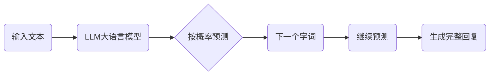
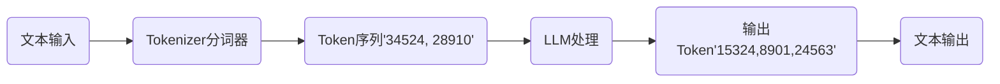

## LLM：大语言模型

- LLM(Large Language Model）： 一个训练过的文本生成器
- LLM 的使用方式
  - 在线 API 调用 
  - 本地部署
- LLM 的核心参数
  - temperature（温度）：控制输出的随机性。设成 0，回复稳定可预测；设成 1，回复更有创意但也更不可控。做代码生成，建议设 0.3 以下
  - max_tokens（最大输出长度）：限制 AI 回复的最大字数。设太小会被截断，设太大会浪费钱。一般对话场景设 500-1000 就够了
  - top_p（采样阈值）：跟 temperature 配合使用，控制用哪些词来生成回复。普通场景用默认值就行，不用调



## Token

- LLM 处理文本不是按"字"算的，是按"Token"算的。
- 一个 Token 大概是 0.75 个英文单词，或者 1-2 个中文字。不同模型的 Tokenizer（分词器）不一样，切出来的 Token 数量也有差异
- **Tokenizer（分词器）- 上下文管理**: 
  - 保留最近 N 条对话
  - 超出限制就截断
  - 重要信息做摘要压缩




```ts

// 上下文管理示例
const MAX_CONTEXT_TOKENS = 4000; // 最大上下文 Token 数
function trimContext(messages: ChatMessage[], maxTokens: number) {
  let totalTokens = 0;
  const trimmed: ChatMessage[] = [];
  // 从后往前遍历，保留最近的对话
  for (let i = messages.length - 1; i >= 0; i--) {
    const msgTokens = estimateTokens(messages[i].content);
    if (totalTokens + msgTokens > maxTokens) break;
    trimmed.unshift(messages[i]);
    totalTokens += msgTokens;
  }
  return trimmed;
}
// 粗略估算 Token 数量（中文约 1.5 字/Token）
function estimateTokens(text: string): number {
  const chineseChars = (text.match(/[\u4e00-\u9fff]/g) || []).length;
  const otherChars = text.length - chineseChars;
  return Math.ceil(chineseChars / 1.5 + otherChars / 4);
}
```

## Embedding

- 前端开发中 Embedding应用场景是：**相似度搜索**
  
 ```mermaid
flowchart
  用户提问(用户提问) -->Embedding(Embedding找相关资料)  -->Token管理(Token管理<br>控制输入长度) --> LLM生成回答(LLM生成回答) --> 展示给用户(展示给用户)
  Embedding --> 向量知识库(向量知识库) 
  向量知识库 --> Embedding
  Token管理 -.->上下文截断(上下文截断) 
  上下文截断 -.-> Token管理
```
