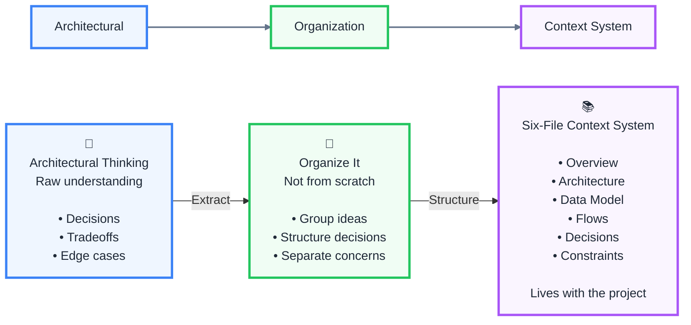

## Arichtect




## Sample of Build With AI

1. create new project by using `nextJS`
2. use following prompt
   - Clean up this next.js boilerplate
   - Strip globals.css down to just the tailwind directives
   - Delete all SVGs in the public folder, but keep the favicon
   - Remove page.module.css
   - Replace page.tsx with a minimal component that just renders a center div saying "ghost AI"
3. create 'context' folder in the root directory
4. create 'feature-specs' in 'context' folder
5. **homepage**--> use following prompt
   - read @context/feature-specs/01-design-system.md
   - update the tasks in @context/progress-tracker.md to mark this as in progress
   - then implement exactly as specified
6. create a new repository in github
   1. copy commands and execute as AI commands
7. **mainFrame page** --> use following prompt
   - read @context/feature-specs/02-editor-chrome.md
   - update the tasks in @context/progress-tracker.md to mark this as in progress
   - then implement exactly as specified
8. use following prompt: use these two components within a layout
9. use following prompt: push all the current changes to a new branch called development
10. ...
11. **clert(login/logout+auth)**-->
    1.  install official clerk skills
    2.  use following prompt: read @context/feature-specs/03-auth.md and update the tasks in @context/progress-tracker.md to mark this as in progress. Then implement the auth feature exactly as specified in the 03-auth.md file
12. **Prisma with Postgres setup**
    1. `npm i prisma tsx @type/pg -D`
    2. `npm i @prisma/client @prisma/adapter-pg dotenv pg`
    3. `npx prisma init --output ../app/generated/prisma`
    4. install prisma skill: `npx skills add prisma/skills`
    5. use following prompt: read @context/feature-specs/05-prisma.md, update the tasks in @context/progress-tracker.md to mark this as in progress, then implement exactly as specified
13. **issues handle** --> use following prompt:  Explore the current-issues.md file and deeply analyze the problem. Only when you have the analysis, give it back to me with the idea of how you're planning to solve it, and then wait for me to give you the green light to execute it

```
├── 📂context/
│    ├── 📂feature-specs
│    ├── 📄AGENTS.md
│    ├── 📄ai-workflow-rules.md
│    ├── 📄architecture-context.md
│    ├── 📄code-standards.md
│    ├── 📄progress-tracker.md
│    ├── 📄project-overview.md
│    └── 📄ui-context.md
```

- https://github.com/adrianhajdin/ghost-ai/
- [How Senior Engineers Actually Build With AI in 2026 | Build a Full Stack Systems Architecture App](https://www.youtube.com/watch?v=14RP8liACqo)
- Tools
  - codeRabbit: code review/bug(VS code extension)
  - liveblocks: Realtime and sync for the agentic web
  - triggerdev: durable AI agents and workflows
