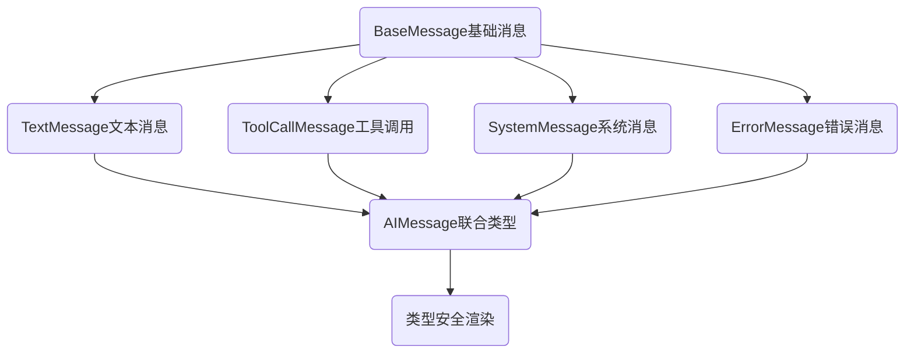
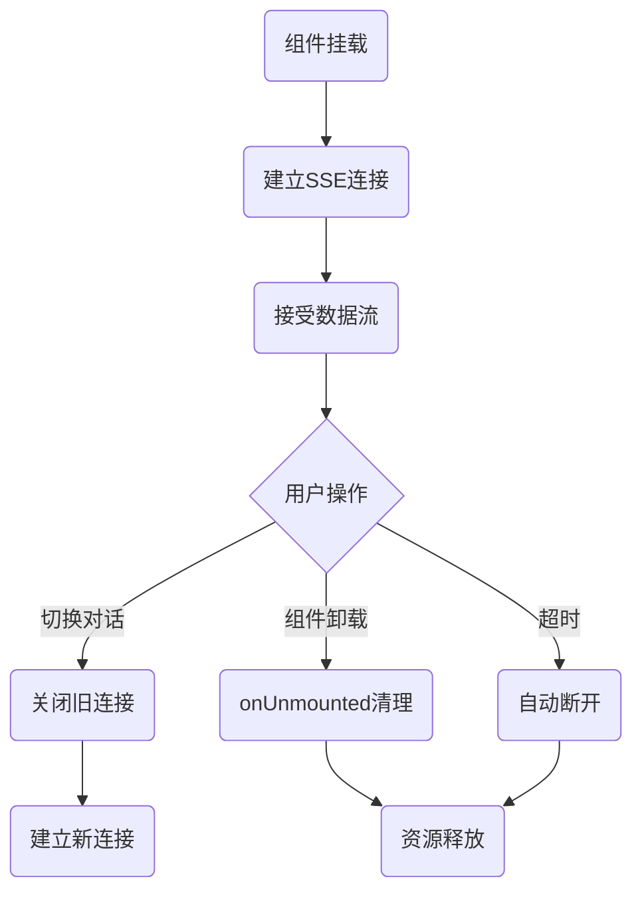

- [TS泛型接口-通用AI响应接口](#ts泛型接口-通用ai响应接口)
- [接口继承- AI消息体系](#接口继承--ai消息体系)
- [SSE实现AI流式输出](#sse实现ai流式输出)
- [异步资源管理-SEE连接管理避免内存泄露](#异步资源管理-see连接管理避免内存泄露)

## TS泛型接口-通用AI响应接口

```ts
// 通用AI响应接口
interface AIResponse<T> {
  success: boolean;
  data: T;
  message?: string;
}
const textResponse: AIResponse<string> = {
  success: true,
  data: "Hello, World!",
};

// 通用组件配置
interface ComponentConfig<T = string> {
  type: "button" | "input" | "div";
  props: Record<string, T>;
  children?: string;
}
const configResponse: AIResponse<ComponentConfig> = {
  success: true,
  data: {
    type: "button",
    props: { className: "btn-primary" },
    children: "Click Me",
  },
};
```

[🚀back to top](#top)

## 接口继承- AI消息体系



```ts
// BaseMessage基础消息
interface BaseMessage {
  id: string;
  timestamp: number;
  role: "user" | "assistant" | "system";
}
//TextMessage文本消息
interface TextMessage extends BaseMessage {
  type: "text";
  content: string;
}
// ToolCallMessage工具调用: AI要执行操作
interface ToolCallMessage extends BaseMessage {
  type: "tool_call";
  toolName: string;
  parameters: Record<string, any>;
}
// AIMessage联合类型
type AIMessage = TextMessage | ToolCallMessage;
function renderMessage(message: AIMessage) {    //
  if(message.type === "text") {
    return <p>{message.content}</p>;
  } else if(message.type === "tool_call") {
    return <TollCallIndicator name={message.toolName} parameters={message.parameters} />
  }
}
```
[🚀back to top](#top)

## SSE实现AI流式输出

- SSE: Server-Sent Events, 单向通讯，服务器推送AI生成的文本片段，前端实时渲染
- 流式输出： <mark>前端建立连接  ➡️ 后端边生成边推送 ➡️ 前端逐字显示（打字机效果）</mark>

[🚀back to top](#top)

## 异步资源管理-SEE连接管理避免内存泄露

- 组件卸载时候及时清理
- setTimeout，Promise及时清理
- 加容错，如try-catch包裹解析逻辑，超时机制，错误提示


