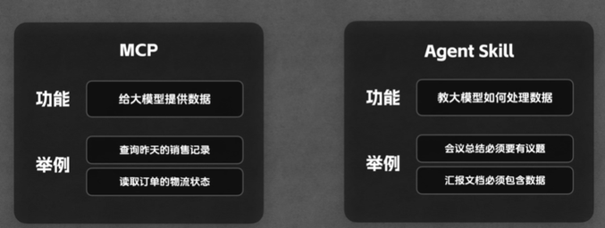
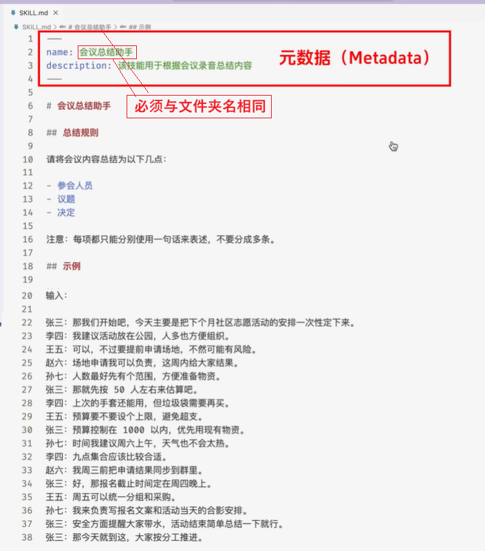
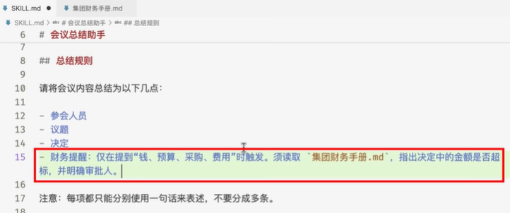
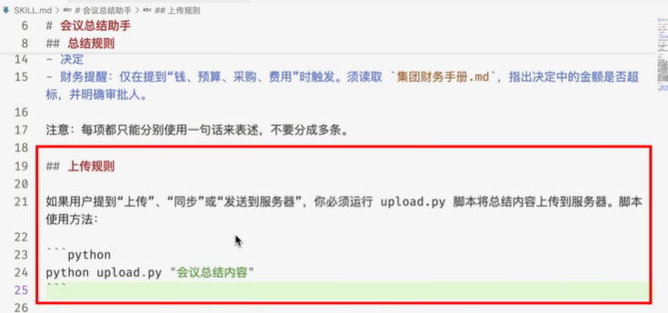

- [Agent skills介绍](#agent-skills)
  - [Agent Skill的基本用法](#agent-skill的基本用法)
  - [Reference + Script](#reference--script)
- [Tools](#tools)
  - [official skill-creator](#official-skill-creator)
  - [Skill\_Seekers](#skill_seekers)
  - [skill-lookup](#skill-lookup)
- [Basic](#basic)
- [Resources](#resources)

-----------------------------------------------------------------

## Agent skills

- MCP connects model to data
- Skills teach model what to do with that data
- 

<details>

<summary><strong>✏️Skill structure</strong></summary>

||||
|---|---|---|
|Matedata|必须mandatory| 目录|
|Instruction|按需加载|正文|
|Resource|按需加载|附录|

```
project
├── 📂.claude/skills/skill-name/
│       ├── 📄SKILL.md                 - 文件名必须大写
│       ├── 📂scripts/
│       │     └── main.py
│       ├── 📂references/
│       │     └── doc.md
│       └── 📂assets/
│             └── pic.png
```

### Agent Skill的基本用法



### Reference + Script



- 官方建议将 Reference 归类至 references/ 文件夹，Script 归类至 scripts/ 文件夹，以保持结构清晰

</details>
  
## Tools

### official skill-creator

- https://github.com/anthropics/skills/tree/main/skills/skill-creator
  
<details>

<summary>✏️Using Skill creator</summary>

1. copy 'skill-creator' folder to claude 'skills' folder
2. 在claude在输入文字：
   1. 生成一个skill，功能如下：
      1. 从一个本地文件夹中读取多个pdf格式的求职简历
      2. 分析这些简历的内容，并进行筛选，筛选规则需要参考公司的文档：包括销售人员招聘标准，开发人员招聘标准
      3. 分析完成后生成一份报告，报告格式需要参考一个本地模板文件
      4. 最后，如果用户需要发送报告，则把报告通过email发送出去，否则不发送
   2. 注意，生成的skill中markdown文件和代码注释都使用中文简体

</details>

<details>
<summary>✏️Creating Your Skill: Step-by-Step Guide</summary>

### Method 1: Use skill-creator (Recommended)

The easiest way to create a skill is to use the built-in `skill-creator`:

1. Enable the skill-creator skill in Claude
2. Ask Claude: "Use the skill-creator to help me build a skill for [your task]"
3. Answer the interactive questions about your workflow
4. Claude generates the complete skill structure for you

### Method 2: Manual Creation

1. **Create folder structure**:

   ```
   my-skill/
   ├── SKILL.md          # Main skill file with frontmatter
   ├── scripts/          # Optional executable scripts
   │   └── helper.py
   └── resources/        # Optional supporting files
       └── template.json
   ```

2. **Create SKILL.md with frontmatter**:

   ```yaml
   ---
   name: my-skill
   description: Brief description for skill discovery (keep concise)
   ---

   # Detailed Instructions

   Claude will read these instructions when the skill is activated.

   ## Usage
   Explain how to use this skill...

   ## Examples
   Provide clear examples...
   ```

3. **Add executable scripts** (optional):

   - Python, JavaScript, or other scripts Claude can execute
   - Reference them in your SKILL.md instructions

4. **Test locally**:

   - Install the skill in Claude Code or Claude Desktop
   - Test with relevant tasks
   - Iterate and refine

5. **Share**:
   - Publish to GitHub
   - Submit to this awesome list via PR
   - Share with your team via git repos or internal distribution

### Best Practices

- **Keep descriptions concise** - The frontmatter description is used for skill discovery
- **Use clear, actionable instructions** - Write instructions as if for a human collaborator
- **Include examples** - Show specific examples in your SKILL.md
- **Version your skills** - Use git tags for version management
- **Document dependencies** - List any prerequisites or required packages
- **Test thoroughly** - Verify your skill works across different scenarios

</details>


### Skill_Seekers

- [usufkaraaslan/Skill_Seekers](https://github.com/yusufkaraaslan/Skill_Seekers) - Convert documentation websites into Claude Skills

### skill-lookup

- https://github.com/f/awesome-chatgpt-prompts/tree/main/plugins/claude/prompts.chat/skills

<details>

<summary>Using skill-lookup</summary>

1. copy 'skill-lookup' folder to claude 'skills' folder
2. Asks for Agent Skills ("Find me a code review skill")
    - Wants to search for skills ("What skills are available for testing?")
    - Needs to retrieve a specific skill ("Get skill XYZ")
    - Wants to install a skill ("Install the documentation skill")
    - Mentions extending Claude's capabilities with skills

</details>

[🚀back to top](#top)

## Basic

|||
|---|---|
|Skills Website|https://skills.sh|
|Skills CLI|https://github.com/vercel-labs/skills|
|Installing the Skills CLI|`npx skills`|
|Finding Skills|`npx skills find <keywords>`|
|Installing Skills|`npx skills add https://github.com/twostraws/swiftui-agent-skill`|
|Installing Only One Skill From a Repo|`npx skills add https://github.com/twostraws/swiftui-agent-skill --skill swiftui-pro`|
|Listing Installed Skills|`npx skills list`|
|Removing Skills|`npx skills remove <skill-name>`|

### suggestion skills

- `npx skills add https://github.com/dotneet/claude-code-marketplace --skill typescript-react-reviewer`
   - TypeScript and React 19 applications with deep anti-pattern detection
- `npx skills add https://github.com/millionco/react-doctor --skill react-doctor`
   - detects security, performance, correctness, and architecture issues
- `npx skills add https://github.com/giuseppe-trisciuoglio/developer-kit --skill react-code-review`
   - provides structured, comprehensive code review for React applications
- `npx skills add https://github.com/giuseppe-trisciuoglio/developer-kit --skill nextjs-code-review`
   - Evaluates Next.js App Router code against best practices for Server Components, Client Components, Server Actions, caching strategies, and production-readiness criteria
- `npx skills add facebook/react fix`

[🚀back to top](#top)

## Resources

|||
| --- | --- | 
|**Official Skills**||
|**[anthropics/skills](https://github.com/anthropics/skills/tree/main/skills)**| Official public repository for Skills|
|**[Claude Cookbooks - Skills](https://github.com/anthropics/claude-cookbooks/tree/main/skills)**|Example notebooks and tutorials|
|**[github/awesome-copilot](https://github.com/github/awesome-copilot/tree/main/skills)**|copilot official skills|
|**Community Skills**||
|**[obra/superpowers](https://github.com/obra/superpowers)**|Core skills library for Claude Code with 20+ <mark>software development</mark> skills|
|**[obra/superpowers-lab](https://github.com/obra/superpowers-lab)**|Install from `superpowers-marketplace` plugin|
|**[wshobson claude plugin](https://github.com/wshobson/agents/tree/main/plugins)**| claude plugin, including many skills|
|**Tools+资源平台**||
|**[awesomeclaude](https://awesomeclaude.ai/awesome-claude-skills)**|offical skills资源平台|
|**[SkillsMP: Agent Skills Marketplace](https://skillsmp.com/zh)**|Agent Skills 资源平台|
|**[claude skills-library](https://skillsclaude.com/guides/skills-library)**|claude skills-library资源平台|
|**[Skills.sh](https://skills.sh/)**|The Open Agent Skills Ecosystem|
|**[UI UX Pro Max](https://github.com/nextlevelbuilder/ui-ux-pro-max-skill)**|<mark>building professional UI/UX</mark> across multiple platforms and frameworks|
|**[UI/UX Pro Max 中文教程网站](https://github.com/bbylw/ui-ux-pro-max-skill-cn)**||
|**[awesome-design-md](https://github.com/VoltAgent/awesome-design-md)**|<mark>https://getdesign.md/: collection of DESIGN.md file</mark>|
|**[](https://github.com/voltagent/awesome-openclaw-skills)**|collection of OpenClaw skills. 5,400+ skills filtered and categorized from the official OpenClaw Skills Registry|
|**Individual Skills**||
|**https://github.com/libukai/awesome-agent-skills**|Agent Skills 终极指南：快速入门、推荐技能、最新资讯与实战案例|
|**https://github.com/tsuirak/skills**|个人的技能树仓库，主要包含个人机器学习以及深度学习的笔记|
|**[MrGoonie ClaudeKit](https://github.com/mrgoonie/claudekit-skills)**|<mark> Web development</mark>|
|**https://github.com/Mindrally/skills**|240+ Claude Code skills Collection|
|**[everything-claude-code](https://github.com/affaan-m/everything-claude-code)**|Complete Claude Code configuration collection - agents, skills, hooks, commands, rules, MCPs|
|**[ComposioHQ/awesome-claude-skills](https://github.com/ComposioHQ/awesome-claude-skills)**|A curated list of awesome Claude Skills, resources|
|**[eliasjudin](https://github.com/eliasjudin/oai-skills/)**|<mark>pdf,excel</mark>|
|**[behisecc](https://github.com/behisecc/awesome-claude-skills)**|collection of skills|
|**[czlonkowski- N8N skills](https://github.com/czlonkowski/n8n-skills)**|<mark>N8N skills</mark>|
|**[voltagent](https://github.com/voltagent/awesome-claude-skills)**|skills collection of many teams, focus on <mark>workflow<mark>|
| **[ios-simulator-skill](https://github.com/conorluddy/ios-simulator-skill)** | iOS app building, navigation, and testing through automation |
| **[ffuf-web-fuzzing](https://github.com/jthack/ffuf_claude_skill)** | Expert guidance for ffuf web fuzzing during penetration testing, including authenticated fuzzing with raw requests, auto-calibration, and result analysis |A curated list of awesome Claude Skills, resources|
|**[csv-data-summarizer](https://github.com/coffeefuelbump/csv-data-summarizer-claude-skill)**|分析csv文件并生成报表|
| **[playwright-skill](https://github.com/lackeyjb/playwright-skill)** | General-purpose browser automation using Playwright |
| **[claude-d3js-skill](https://github.com/chrisvoncsefalvay/claude-d3js-skill)** | Visualizations in d3.js |
| **[claude-scientific-skills](https://github.com/K-Dense-AI/claude-scientific-skills)** | Comprehensive collection of ready-to-use scientific skills, including working with specialized scientific libraries and databases |
| **[web-asset-generator](https://github.com/alonw0/web-asset-generator)** | Generates web assets like favicons, app icons, and social media images |
|**[notebooklm-skill](https://github.com/PleasePrompto/notebooklm-skill)**|communicate directly with Google NotebookLM notebooks. Queryuploaded documents and answers exclusively from your own knowledge base|
| **[loki-mode](https://github.com/asklokesh/claudeskill-loki-mode)** | Multi-agent autonomous startup system - orchestrates 37 AI agents across 6 swarms to build, deploy, and operate a complete startup from PRD to revenue |
| **[Trail of Bits Security Skills](https://github.com/trailofbits/skills)** | Security skills for static analysis with CodeQL/Semgrep, variant analysis, code auditing, and vulnerability detection |
|**[k-dense-ai scientific skills](https://github.com/k-dense-ai/claude-scientific-skills)**||
|**[bear2u](https://github.com/bear2u/my-skills)**|个人效率工具集|

- Agent Skill 官方规范：https://agentskills.io/home
- Skills explained（含 Anthropic 对 Skill vs MCP 解释）：https://claude.com/blog/skills-explained
- Claude Code 接入说明：https://code.claude.com/docs/en/skills
- Claude Code 安装配置: https://docs.bigmodel.cn/cn/guide/develop/claude
- Codex 接入说明：https://developers.openai.com/codex/skills/
- Cursor 接入说明：https://cursor.com/cn/docs/context/skills
- VS Code 接入说明：https://code.visualstudio.com/docs/copilot/customization/agent-skills
  - https://docs.github.com/en/copilot/how-tos/use-copilot-agents/coding-agent/create-skills
