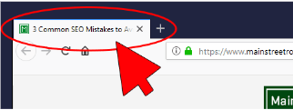

[tips for React Accessiblity](#top)

- [Accessibility Linter](#accessibility-linter)
- [AutoFocus](#autofocus)
- [Refs \& UseEffect()](#refs--useeffect)
- [Page Titles](#page-titles)

------------------------------------------------------

Web accessibility (also referred to as a11y)

- WAI-ARIA -  HTML attributes
- Semantic HTML
- Notifying the user of errors
- Focus Control   

## Accessibility Linter

- [eslint-plugin-jsx-a11y](https://github.com/jsx-eslint/eslint-plugin-jsx-a11y):  review JSX for common accessibility issues
- catch common accessibility issues during development
- react-a11y, react-axe, or eslint-plugin-jsx-a11y

## AutoFocus

```html
<form>
  <label>
    Username
    <input name="user" type="user" />
  </label>
  <label>
    Password
    <input name="user" type="password" autoFocus />
  </label>
</form>
```

## Refs & UseEffect()

```
export default function Login(props) {
 const pwinput = useRef(null);
 useEffect(() => {
   pwinput.current.focus();
 })
 return (
      <form>
        <label>
          Username
          <input name="user" type="user"  />
        </label>
        <br/>
        <label>
          Password
          <input name="user" type="password" ref={pwinput} />
        </label>
      </form>
  )
}
```

## Page Titles

- 
- [react-helmet](https://github.com/nfl/react-helmet)
- `<Helmet><title>My Page Title</title></Helmet>`

> references
- https://legacy.reactjs.org/docs/accessibility.html
- https://developer.mozilla.org/en-US/docs/Learn/Tools_and_testing/Client-side_JavaScript_frameworks/React_accessibility
- [Getting Started with Accessibility for React](https://www.telerik.com/blogs/getting-started-accessibility-react)
