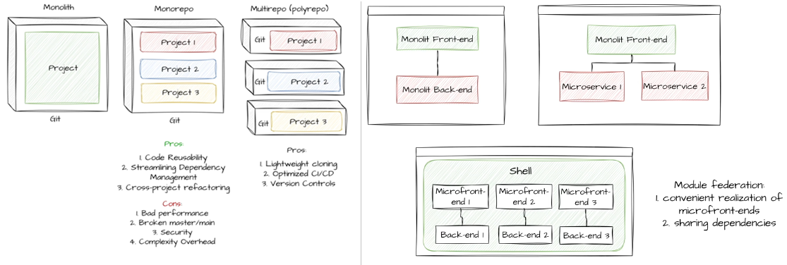
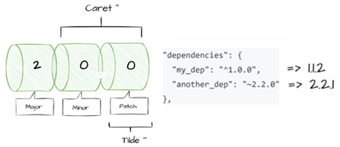
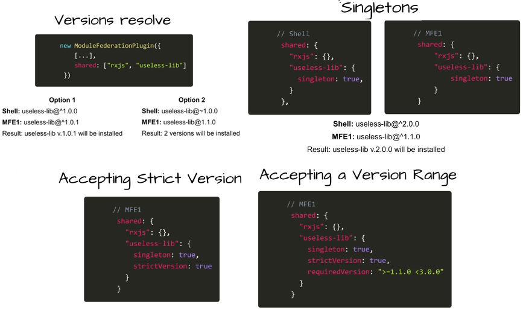
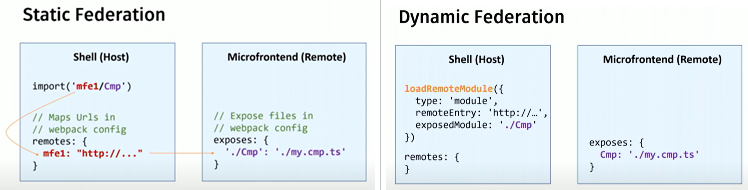
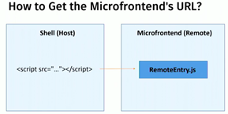
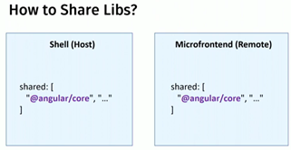
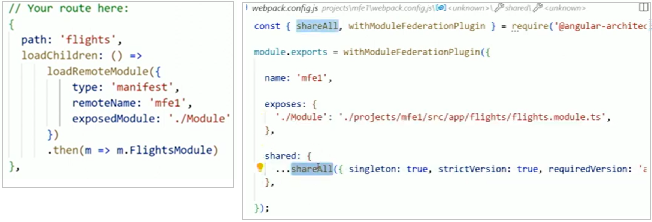
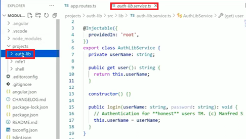
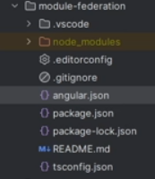
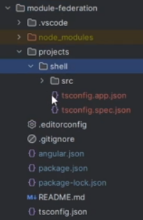

[Angular Advanced学习笔记之--Micro Frontend - Angular 16 with Module Federation](#top)

- [Monorepo, Multirepo and project structure approaches](#monorepo-multirepo-and-project-structure-approaches)
- [Module Federation concept](#module-federation-concept)
- [Module Federation project](#module-federation-project)

----------------------------------------------------------------------

### Monorepo, Multirepo and project structure approaches

- 
- 
- Version resolve
  - 

## Module Federation concept

- 
- How to get the microfrontend's url: 
  - 
- How to share libs: 
  - 
- 
- Share lib and Data
  - 
- [Tutorial: Getting Started with Webpack Module Federation and Angular](https://dev.to/manfredsteyer/tutorial-getting-started-with-webpack-module-federation-and-angular-2edd)
  - https://github.com/manfredsteyer/module-federation-plugin-example
  - [Angular based Micro frontends with module federation | Manfred Steyer | ng-conf 2022](https://www.youtube.com/watch?v=CDKK6FVvqvs)

[⬆ back to top](#top)

### Module Federation project

- Module Federation is a feature offered by Webpack that allows a JavaScript application to dynamically load modules from other applications
- preparing env: 
  - `npm install -g @angular/cli@16`
  - `npm install @angular-architects/module-federation@16.0.4 --save`
1. `ng new module-federation --create application false`
2. 
3. `ng g app shell --routing`
4. 
5. modify 'app.component', add new component to 'app' shell `ng g c shell`
6. `ng g app mf --routing`
7. add new component to 'mf', `ng g c hi`
8. add new module to 'mf', `ng g m hi --routing`
9. modify some files in 'mf'
10. `ng add @angular-architects/module-federation --project shell --port 4200 --type host`
11. modify 'projects\shell\webpack.config.js
12. `ng add @angular-architects/module-federation --project mf --port 4201 --type remote`
13. modify 'projects\mf\webpack.config.js'
14. modify 'angular.json', change port of project mf to 4201

[⬆ back to top](#top)

> References
- [angular-architects/module-federation](https://github.com/angular-architects/module-federation-plugin)
- [Tutorial: Getting Started with Webpack Module Federation and Angular](https://github.com/angular-architects/module-federation-plugin/blob/main/libs/mf/tutorial/tutorial.md)
- [article series about Module Federation](https://www.angulararchitects.io/blog/the-microfrontend-revolution-part-2-module-federation-with-angular/)
- [Implementing Micro Frontends in Angular 16 with Module Federation: A Comprehensive Guide](https://medium.com/@edelcustodiofrias/implementing-micro-frontends-in-angular-16-with-module-federation-a-comprehensive-guide-ff733374b82f)
