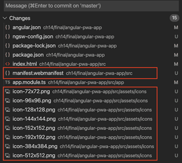
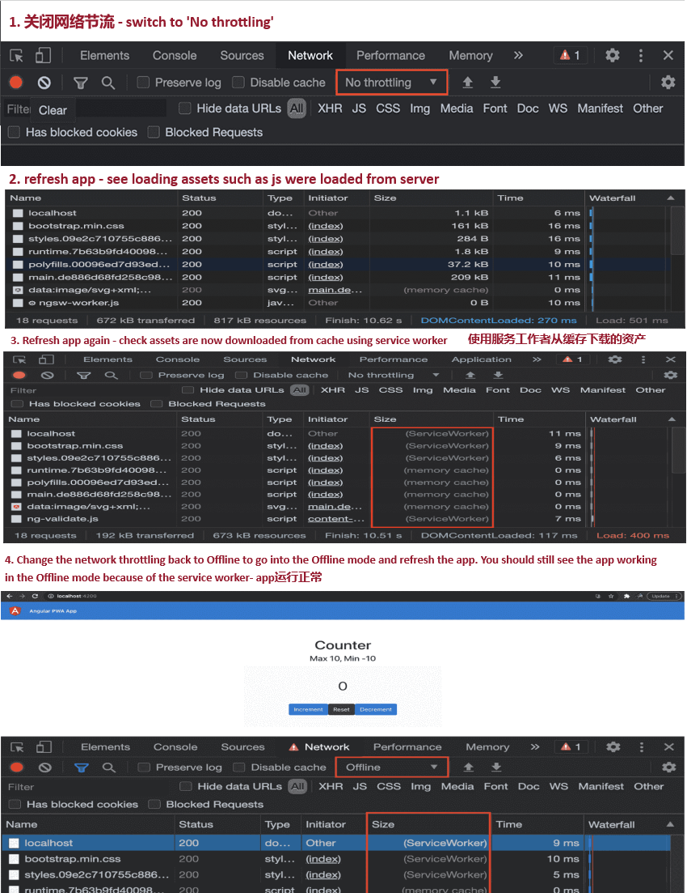

[Angular PWA架构](#top)

- [使用 Angular CLI 将现有Angular应用程序转换为PWA](#使用-angular-cli-将现有angular应用程序转换为pwa)
- [在PWA中提供定制的可安装体验](#在pwa中提供定制的可安装体验)
- [使用Angular service worker预缓存请求](#使用angular-service-worker预缓存请求)
- [为PWA创建应用程序外壳](#为pwa创建应用程序外壳)

----------------------------------------------

## 使用 Angular CLI 将现有Angular应用程序转换为PWA

- PWA涉及几个有趣的组件，其中两个是服务工作者Service worker和web清单文件。
  - Service worker帮助缓存静态资源和缓存请求
  - web清单文件包含关于应用图标、应用主题颜色等的信息
  - 缓存静态资源
- 转换方法
  1. `ts ng add @angular/pwa` - convert this app into a PWA(chapter13/start_here/angular-pwa-app)
     - 在项目中安装了'@angular/service-worker'包
     - 注册了一个名为'ngsw-worker.js'的新服务人员文件。此文件使用'ngsw-config.json'文件中的配置来决定要缓存哪些资源以及使用哪些策略
     - 
     - 
     - manifest.webmanifest： 定义PWA的清单，并包含应用程序的名称、短名称、主题颜色以及不同设备的不同图标的配置
  2. `ng build --configuration production`  再次构建应用程序
  3. `http-server dist/angular-pwa-app -p 4200`
  
```javascript
//app.module.ts
import { ServiceWorkerModule } from '@angular/service-worker';

@NgModule({
  declarations: [AppComponent, CounterComponent],
  imports: [
    //...
 ServiceWorkerModule.register('ngsw-worker.js', {
 enabled: environment.production,
 // Register the ServiceWorker as soon as the app is       stable
 // or after 30 seconds (whichever comes first).
 registrationStrategy: 'registerWhenStable:30000',
 }),
  ],
  //...
})
export class AppModule {}
```

[⬆ back to top](#top)

## 在PWA中提供定制的可安装体验

- PWA是可安装的。这意味着它们可以像本机应用程序一样安装在您的设备上。但是，当您第一次在浏览器中打开应用程序时，它完全取决于浏览器如何显示安装选项。它因浏览器而异
- Angular PWA实现自定义安装提示

## 使用Angular service worker预缓存请求

[⬆ back to top](#top)

## 为PWA创建应用程序外壳

[⬆ back to top](#top)

> References
- [十三、Angular PWA 架构](https://www.moonapi.com/news/30084.html)
- https://github.com/PacktPublishing/Angular-Cookbook
- [Angular 服务人员介绍](https://angular.io/guide/service-worker-intro)
- [什么是 PWA？](https://web.dev/what-are-pwas/)


