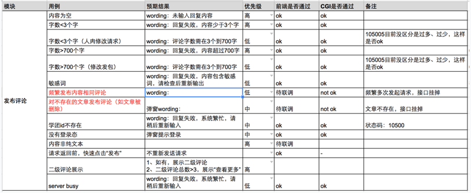

[高质量完成产品需求开发](#top)

- **what**：做什么？
- **when**：完成时间？
- **how**：如何完成？

## What

- 需求场景假设

## When

- 前端、后台 各自的工作量workload
- 前端、后台 投入研发的时间点keytime point
- 前端、后台 联调的工作量workload、时间点keytime point
- 需求提交测试的时间deadline
- 需求测试的工作量

module|use case|desired result|priority| Frond end passed| CGI passed|  comment
---|---|---|---|---|---|---

## How

- 明确需求、关键时间点
- 严控开发、自测、提测质量
- 及时暴露风险 exposure to risks timely
- 推动解决问题
- 关注线上质量

- [前端进阶之路：如何高质量完成产品需求开发](https://www.cnblogs.com/chyingp/p/how-to-finish-a-product-requirement-with-high-quality.html)
