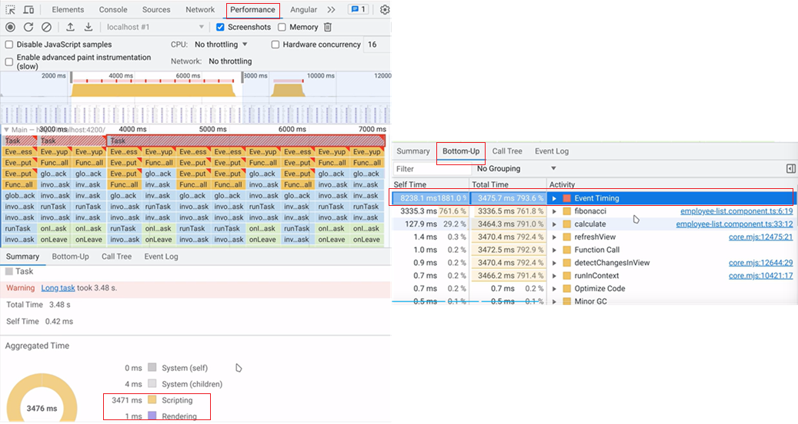

[优化 Angular 应用性能](#top)

- [先测量，再优化](#先测量再优化)
- [Change Detection Strategy- OnPush](#change-detection-strategy--onpush)
  - [Debug tips of using Angular Dev Tools](#debug-tips-of-using-angular-dev-tools)

## 先测量，再优化

- Dev tools -> performance
  - 
- Angular Dev tools --> Profiler
- 
  - using [immutable-js](https://immutable-js.com/)
- adding new **pure pipe** and ove fibonacci to pipe
- 缓存、 memoization
  - `const memo = new Map<number,number>();`
- OnPush + Async Pipe 是手牵手的好朋友

## Change Detection Strategy- OnPush

|||
|---|---|
|Default|OnPush|
|- Event<br>Browser-event, timer, promise, XHRs|- input value or reference change<br>- event in component or it's child<br>- async pipe emits new value<br>- manually|

```js
export class AppComponent implements AfterViewInit{
  @ViewChild('chart') chart!:ElementRef;
  private ngZone = inject(NgZone);
  ngAfterViewInit(): void {
    this.ngZone.runOutsideAngular(() => {
      initECharts(this.chart.nativeElement).setOptions(options);
    });
  }
}
```

### Debug tips of using Angular Dev Tools

- add following to main.ts
- `ng.profiler.timeChangeDetectio()` in Console

```js
bootstrapApplication(AppComponent, appConfig)
  .then((m) => enableDebugTools(m.components[0]))
  .catch((err) => console.error(err));
```

> References
- https://gitee.com/zhanxucong/change-detection-demo/
- https://gitee.com/zhanxucong/performance-optimization
