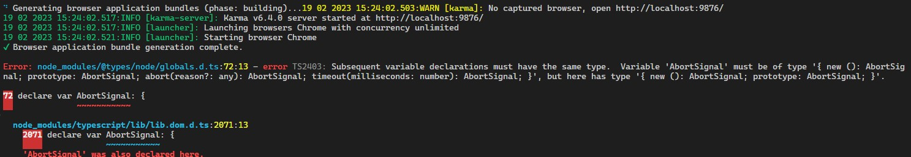

## Angular 14 to Angular 15

1. 步骤一：官方升级文档一定要阅读
2. 步骤二: 可创建一条NPM script在package.json文件中：
  - `"upgrade15": "ng update @angular/core@15 @angular/cli@15 @angular/material@15 @angular-eslint/schematics@15"`
   - `npm run upgrade15`
   - 执行此命令之前，记得把git的change先提交（包括创建这条script的修改）
3. 步骤三，上述项目中，Material的库的更新还需要一个额外步骤
   - 详情参阅[Material MDC Migration的官方文档](https://material.angular.io/guide/mdc-migration)
   - `ng generate @angular/material:mdc-migration`
4. 步骤四，这也是前作中没有提及但及其重要的：要执行下测试指令
   - `ng test`
   - 在新n的版本上对原代码进行编译和测试，有助于升级后的问题发现和解决
5. 遇到的数个问题：
   - 执行ng test遇到如下错误：
   - 
   - 解决方案：重新安装node的types。`npm i -D @types/node@latest`

[⬆ back to top](#top)

> references
- [官方升级文档](https://update.angular.io/)
- [Angular: 升级Angular 14到Angular 15](https://blog.csdn.net/alvachien/article/details/129108417)
