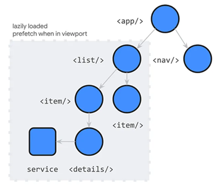

[Angular 17 New Features](#top)

- [Deferrable views 可推迟视图](#deferrable-views-可推迟视图)
  - [Which dependencies are defer-loadable](#which-dependencies-are-defer-loadable)
  - [blocks](#blocks)
  - [Triggers](#triggers)
  - [Testing](#testing)
- [New public benchmarks](#new-public-benchmarks)
- [Built-in control flow](#built-in-control-flow)
  - [Built-in for Conditional statements](#built-in-for-conditional-statements)
  - [Built-in for loop](#built-in-for-loop)
  - [Migration to Built-in control flow automatically](#migration-to-built-in-control-flow-automatically)
- [改进的服务端渲染](#改进的服务端渲染)
- [新的生命周期 Hooks](#新的生命周期-hooks)


-------------------------------------------------------------------------------

- 默认使用 Vite 和 esbuild
- New [Angular DevTools](https://angular.io/guide/devtools) 中的依赖注入调试, 可以预览：
  - 组件检查器中组件的依赖关系
  - 注入器树和依赖关系解析路径
  - 单个注入器内标明的供应商

## Deferrable views 可推迟视图

- [Deferrable views](https://angular.io/guide/defer), also know as` @defer` block, is future of lazy loading: bring performance and developer experience to the next level
- enable declarative and powerful **deferred loading** with unprecedented ergonomics
- 
- Deferrable views can be used in component template to defer the loading of select dependencies within that template. Those dependencies include components, directives, and pipes, and any associated CSS. To use this feature, you can declaratively wrap a section of your template in a @defer block which specifies the loading conditions.
- Deferrable views support a series of [triggers](https://angular.io/guide/defer#triggers), [prefetching](https://angular.io/guide/defer#prefetching), and several sub blocks used for [placeholder](https://angular.io/guide/defer#placeholder), [loading](https://angular.io/guide/defer#loading), and [error](https://angular.io/guide/defer#error) state management. You can also create custom conditions with [when](https://angular.io/guide/defer#when) and [prefetch when](https://angular.io/guide/defer#prefetching).

### Which dependencies are defer-loadable

- must be standalone. Non-standalone dependencies cannot be deferred and will still be eagerly loaded, even inside of @defer blocks.
- must not be directly referenced from the same file, outside of `@defer` blocks; this includes `ViewChild` queries.

### blocks

- `@defer`
- `@placeholder`: Angular首先渲染占位符块的内容。当它在视口中可见时,组件就会开始加载。加载完成后，Angular会删除占位符并渲染组件
- `@loading`
- `@error`

```ts
@defer (on viewport) {
  <comment-list />
} @placeholder {
      //占位符块
}
// 用于加载和错误状态的块
@defer (on viewport) {
  <comment-list/>
} @loading {
  Loading…
} @error {
  Loading failed
} @placeholder {
  
}
```

### Triggers

|triggers|use in|
|---|---|
| `on idle`|lazily load the block when the browser is not doing any heavy lifting 在浏览器闲置时延迟加载块|
| `on immediate` |start lazily loading automatically, without blocking the browser 自动开始延迟加载，不会阻塞浏览器|
| `on timer(<time>)` | delay loading with a timer|
| `on viewport` and `on viewport(<ref>)` | viewport also allows to specify a reference for an anchor element. When the anchor element is visible, Angular will lazily load the component and render it|
|`on interaction` and `on interaction(<ref>)` | enables you to initiate lazy loading when the user interacts with a particular element|
| `on hover` and `on hover(<ref>)` |triggers lazy loading when the user hovers an element|
|`when <expr>` | enables you to specify your own condition via a boolean expression|

```ts
// multiple on triggers -  always OR conditions
@defer (on viewport; on timer(5s)) {
  <calendar-cmp />
} @placeholder {
  
}
// 还提供了在渲染依赖项之前预取依赖项的能力。添加预取就像向 defer 块添加预取语句一样简单，并且支持所有相同的触发器
@defer (on viewport; prefetch on idle) {
  <comment-list />
}
```

### Testing

```ts
it('should render a defer block in different states', async () => {
  // configures the defer block behavior to start in "paused" state for manual control.
  TestBed.configureTestingModule({deferBlockBehavior: DeferBlockBehavior.Manual});

  @Component({
    // ...
    template: `
      @defer {
        <large-component />
      } @placeholder {
        Placeholder
      } @loading {
        Loading...
      }
    `
  })
  class ComponentA {}
  // Create component fixture.
  const componentFixture = TestBed.createComponent(ComponentA);
  // Retrieve the list of all defer block fixtures and get the first block.
  const deferBlockFixture = (await componentFixture.getDeferBlocks())[0];
  // Renders placeholder state by default.
  expect(componentFixture.nativeElement.innerHTML).toContain('Placeholder');
  // Render loading state and verify rendered output.
  await deferBlockFixture.render(DeferBlockState.Loading);
  expect(componentFixture.nativeElement.innerHTML).toContain('Loading');
  // Render final state and verify the output.
  await deferBlockFixture.render(DeferBlockState.Complete);
  expect(componentFixture.nativeElement.innerHTML).toContain('large works!');
});
```

[⬆ back to top](#top)

## New public benchmarks

- [angular.dev](https://angular.dev/)
- new documentation website we have new structure, new guides, improved content, and built a platform for an interactive learning journey

## Built-in control flow

- Better type checking thanks to more optimal type narrowing
- It’s a concept that primarily exists at build-time, which reduces the runtime footprint (making it “disappearing”) which could drop your bundle size by up to 30 kilobytes and further improve your Core Web Vital scores
- It is automatically available in your templates without additional imports
- Significant performance improvements

### Built-in for Conditional statements

```ts
//1. *ngIf
<div *ngIf="loggedIn; else anonymousUser">
  The user is logged in
</div>
<ng-template #anonymousUser>
  The user is not logged in
</ng-template>
// built-in if statement
@if (loggedIn) {
  The user is logged in
} @else {
  The user is not logged in
}
//2. *ngSwitch
<div [ngSwitch]="accessLevel">
  <admin-dashboard *ngSwitchCase="admin"/>
  <moderator-dashboard *ngSwitchCase="moderator"/>
  <user-dashboard *ngSwitchDefault/>
</div>
// built-in if statement
@switch (accessLevel) {
  @case ('admin') { <admin-dashboard/> }
  @case ('moderator') { <moderator-dashboard/> }
  @default { <user-dashboard/> }
}
```

[⬆ back to top](#top)

### Built-in for loop

```ts
@for (user of users; track user.id) {
  {{ user.name }}
} @empty {
  Empty list of users
}
```

### Migration to Built-in control flow automatically

- `ng generate @angular/core:control-flow`

[⬆ back to top](#top)

## 改进的服务端渲染

1. 服务端渲染新命令
   1. 静态站点生成SSR或预渲染: `npm init @angular@next`
   2. 在新项目中启用SSR: `ng new my-app --ssr`
2. 向现有应用添加服务端渲染支持： `ng add @angular/ssr`
   1. 此命令将生成服务器入口点，并自动添加 SSR 和 SSG 构建功能，同时默认启用 hydration。
   2. `@angular/ssr` 提供了与当前处于维护模式的 `@nguniversal/express-engine` 相同的功能。
   3. 如果你的项目正在使用 `express-engine`，Angular CLI 将自动将代码更新为 `@angular/ssr`
3. Firebase 现在将通过其新的框架感知CLI的早期预览，以近乎零配置自动识别和部署 Angular 应用
4. `AngularFire` 允许使用 ng deploy 部署到 Firebase
   1. `ng add @angular/fire`
   2. `ng deploy`

[⬆ back to top](#top)

## 新的生命周期 Hooks

- **afterRender** — 注册一个回调，每次应用程序完成渲染时调用
- **afterNextRender** — 注册一个回调，以便在应用程序下次完成渲染时调用

```ts
//例如，如果想实例化一个图表库，可以使用 afterNextRender
@Component({
  selector: 'my-chart-cmp',
  template: `<div #chart>{{ ... }}</div>`,
})
export class MyChartCmp {
  @ViewChild('chart') chartRef: ElementRef;
  chart: MyChart|null;
  constructor() {
    afterNextRender(() => {
      this.chart = new MyChart(this.chartRef.nativeElement);
    }, {phase: AfterRenderPhase.Write});
  }
}
```

[⬆ back to top](#top)

> References
- [Angular 17 已经到来，这次更新带来了显著的的性能提升！](https://www.nurmai.com/new/159.html)
- [Introducing Angular v17](https://blog.angular.io/introducing-angular-v17-4d7033312e4b)
