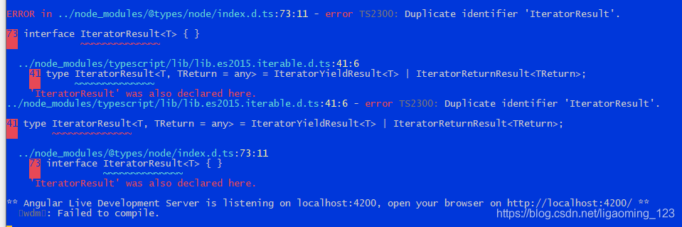
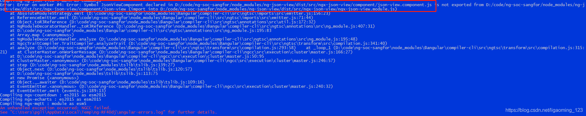
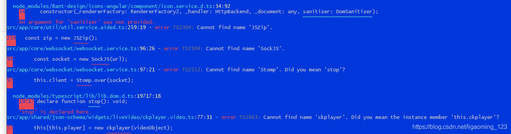

[Angular 8 to Angular 9](#top)

- [General by using command](#general-by-using-command)
- [Upgrade by manually](#upgrade-by-manually)
  - [项目结构和需要更改的文件](#项目结构和需要更改的文件)
  - [依赖项 (dependencies) 升级](#依赖项-dependencies-升级)
    - [angular.json](#angularjson)
    - [projects/web/tsconfig.app.json](#projectswebtsconfigappjson)
    - [projects/web/src/test.ts](#projectswebsrctestts)
    - [projects/web/src/polyfills.ts and projects/web/src/main.ts](#projectswebsrcpolyfillsts-and-projectswebsrcmaints)
    - [projects/app-shared/package.json](#projectsapp-sharedpackagejson)
    - [projects/app-shared/tsconfig.lib.prod.json](#projectsapp-sharedtsconfiglibprodjson)
- [升级问题记录](#升级问题记录)
  - [库不干净](#库不干净)
  - [多次注入](#多次注入)
  - [执行完毕后，启动时出错 interFace IteratorResult{}](#执行完毕后启动时出错-interface-iteratorresult)
  - [启动成功，但是页面报错ReferenceError：\_\_importDefault，](#启动成功但是页面报错referenceerror__importdefault)
  - [重新启动成功，页面报错，此时到此卡住](#重新启动成功页面报错此时到此卡住)
  - [全球化翻译报错](#全球化翻译报错)
------------------------------------------------------------------------

## General by using command

1. 升级全局Angular CLI: `npm install -g @angular/cli@latest`
2. 解决CLI和程序CLI版本不一致问题: `npm rebuild node-sass`
3. 启动更新程序，查看哪些需要更新: `ng update`, `ng update --all  --force`
4. 升级完成后，可以能有一些插件不兼容，可以通过下面的方式安装需要的版本
  - `npm i (需要的更新的组件)`
  - PS:有时候`ng update`的时候会报错，一般情况下再执行一遍即可
5. 遇到的数个报错解决
  1. 库不干净: 在执行`ng update --all --force`可以会遇到下方错误- Repository is not clean.  Please commit or stash any changes before updating.
    - 解决方式: `ng update --all  --force --allow-dirty`
  2. codelyzer依赖tslint，但是未安装对应版本
    - codelyzer报错需要对应版本的ng lint可以暂时不理会，因为现在还没有更新9对应版本的codelyzer.如果不使用tslint进行自动修复程序的可以不管，不影响正常程序运行。
    - 或者单独执行下 npm i codelyzer@latest 如果有新的会自动安装上的
  3. 多次注入
    - 报错内容:
      - A platform with a different configuration has been created. Please destroy it first. platformBrowserDynamic
    - platformBrowserDynamic被多次注入（一般为main.ts和app.module.ts），删除多余的，保留一个，可以删App.module.ts
  4. 全球化翻译报错
    - 报错如下: It looks like your application or one of its dependencies is using i18n
    - **angualr9更新了翻译组件**，需要安装新的包: ng add @angular/localize

[back to top](#top)

## Upgrade by manually

### 项目结构和需要更改的文件

```
├── projects/
│   ├──app-shared/
│   └──web/
├── angular.json
├── package.json
├── tsconfig.json
├── tslint.json
└──package.json
```

[⬆ back to top](#top)

### 依赖项 (dependencies) 升级

- @types/node 升级为 ^12.11.1 ， 所以建议将本机的 nodejs 也升级为 v12 版本

```
  "dependencies": {
    "@angular/animations": "~9.0.0",
    "@angular/common": "~9.0.0",
    "@angular/compiler": "~9.0.0",
    "@angular/core": "~9.0.0",
    "@angular/forms": "~9.0.0",
    "@angular/platform-browser": "~9.0.0",
    "@angular/platform-browser-dynamic": "~9.0.0",
    "@angular/router": "~9.0.0",
    "rxjs": "~6.4.0",
    "tslib": "^1.10.0",
    "zone.js": "~0.9.1",
    }
  "devDependencies": {
    "@angular-devkit/build-angular": "~0.900.1",
    "@angular-devkit/build-ng-packagr": "~0.900.1",
    "@angular/cli": "~9.0.1",
    "@angular/compiler-cli": "~9.0.0",
    "@angular/language-service": "~9.0.0",
    "@types/node": "^12.11.1",
    "@types/jasmine": "~3.5.0", 
    "@types/jasminewd2": "~2.0.3",
    "codelyzer": "^5.1.2",
    "jasmine-core": "~3.5.0",
    "jasmine-spec-reporter": "~4.2.1",
    "karma": "~4.3.0",
    "karma-chrome-launcher": "~3.1.0",
    "karma-coverage-istanbul-reporter": "~2.1.0", 
    "karma-jasmine": "~2.0.1",
    "karma-jasmine-html-reporter": "^1.4.2",
    "ng-packagr": "^9.0.0",
    "protractor": "~5.4.3",
    "ts-node": "~8.3.0",
    "tsickle": "^0.37.0",
    "tslint": "~5.18.0",
    "typescript": "~3.7.5" 
}
```

[⬆ back to top](#top)

#### angular.json

- Angular 9 默认采用 **ivy 引擎**， 所以应用项目 (web) 的 build 选项**需要打开 aot 编译**
- 类库项目 (app-shared) 也增加了 production 配置

```
{
  "$schema":"./node_modules/@angular/cli/lib/config/schema.json",
  "projects":{
    "web":{
      "architect":{
        "build":{
          "options":{
            "polyfills":"projects/web/src/polyfills.ts",
            "tsConfig":"projects/web/tsconfig.app.json",
            "aot":true,                            //change to true
            "assets":[
              "projects/web/src/favicon.ico",
              "projects/web/src/assets"
            ]
          },
          "configurations":{
           - "production":{ "aot":true }   // - remove
          }
        }
      }
    },
  + "app-shared":{        // add app-shared
      "architect":{
        "build":{
          "options":{
            "tsConfig":"projects/app-shared/tsconfig.lib.json",
            "project":"projects/app-shared/ng-package.json"
          }
        },
        "configurations":{
          "production":{
            "tsConfig":"projects/app-shared/tsconfig.lib.prod.json"
          }
        }
      }
    }
  }
}
```

[⬆ back to top](#top)

#### projects/web/tsconfig.app.json

- 简化了 include 以及 exclude 配置

```
{
"include": [
- "src/**/*.ts"+ "src/**/*.d.ts"- ],
- "exclude": [
- "src/test.ts",
- "src/**/*.spec.ts" ]
}
```

[⬆ back to top](#top)

#### projects/web/src/test.ts

- 对 require 进行了精确的定义

```
- declare const require: any;+ declare const require: {
+ context(path: string, deep?: boolean, filter?: RegExp): {
+ keys(): string[];
+ (id: string): T;
+ };
+ };
```

[⬆ back to top](#top)

#### projects/web/src/polyfills.ts and projects/web/src/main.ts

- Angular 9 的 localize 引入了一些变化， 需要导入 @angular/localize/init 文件， 如果没有使用 @angular/localize ， 则不需要修改

```json
//projects/web/src/polyfills.ts
import 'zone.js/dist/zone'; // Included with Angular CLI
+ import '@angular/localize/init';
//projects/web/src/main.ts
if (environment.production) { enableProdMode();
}
- registerLocaleData(zhHans, zhHansEx);+ registerLocaleData(zhHans, 'zh-Hans', zhHansEx);
```

[⬆ back to top](#top)

#### projects/app-shared/package.json

- 对等依赖项 peerDependencies 升级至 ^9.0.0 ， 增加了对 tslib:^1.10.0 的对等依赖

```
{
"name": "app-shared",
"version": "0.0.1",
"peerDependencies": {
- "@angular/common": "^8.2.14",
+ "@angular/common": "^9.0.0",
- "@angular/core": "^8.2.14"
+ "@angular/core": "^9.0.0",
+ "tslib": "^1.10.0" }
}
```

[⬆ back to top](#top)

#### projects/app-shared/tsconfig.lib.prod.json

- 这个文件是新增加的， 也就是意味着可以使用 --prod 选项来编译 Angular 类库项目

```
+ {
+ "extends": "./tsconfig.lib.json",
+ "angularCompilerOptions": {
+ "enableIvy": false
+ }
+ }
```

[⬆ back to top](#top)

## 升级问题记录

### 库不干净

- 在执行ng update --all --force可以会遇到下方错误
- Repository is not clean.  Please commit or stash any changes before updating. 
- 解决方式: `ng update --all  --force --allow-dirty`

### 多次注入

- 报错内容
- A platform with a different configuration has been created. Please destroy it first.
platformBrowserDynamic
- 解决方式: platformBrowserDynamic被多次注入（一般为main.ts和app.module.ts），删除多余的，保留一个，可以删App.module.ts

[⬆ back to top](#top)

### 执行完毕后，启动时出错 interFace IteratorResult<T>{}

- 
- `tsconfig.json`添加俩个配置项解决

```json
"skipLibCheck": true,       // 忽略所有的声明文件（*.d.ts）的类型检查
"skipDefaultLibCheck":true, // 忽略库的默认声明文件的类型检查
```

[⬆ back to top](#top)

### 启动成功，但是页面报错ReferenceError：__importDefault，

- 更新着俩个插件解决

```json
"@angular-devkit/build-angular": "~0.900.1",
"@angular-devkit/build-ng-packagr": "~0.900.1",
```

[⬆ back to top](#top)

### 重新启动成功，页面报错，此时到此卡住

- 错误信息： Unhandled Promise rejection: Directives cannot inherit Components ; Zone: <root> ; Task: Promise.then ; Value: Error: Directives cannot inherit Components
- 解决: 重新将版本回退，重新升级
  - 1）从新执行ng update @angular/cli --migrate-only --from 8 --to 9 升级脚手架
  - 2）执行ng update @angular/core @angular/cli --force升级依赖
  - 3）启动报错 An unhandled exception occurred: NGCC failed. 
    - ng-json-view这个插件报错，尝试升级解决。启动成功
    - 
  - 4）内部使用new创建外部插件报错 The name item is already defined in scope to be [object Object]
    - 手动添加typings.d.ts里面的变量
    - 

[⬆ back to top](#top)

### 全球化翻译报错

- 报错如下: It looks like your application or one of its dependencies is using i18n.
- 解决: angualr9更新了翻译组件，需要安装新的包, 执行下方代码即可
- `ng add @angular/localize`

[⬆ back to top](#top)

> References
- [Angular8升级到Angular9以及报错解决](https://blog.csdn.net/m0_37729058/article/details/104441230)
- [9 angular 更新_手工将项目升级至 Angular 9 记录](https://blog.csdn.net/weixin_26997697/article/details/112942166)
- [angualr8升级9问题记录](https://blog.csdn.net/ligaoming_123/article/details/105149401)
