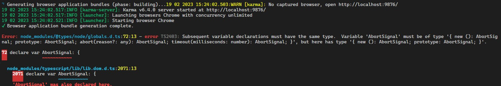

[Angular Update](#top)

- [Angular版本升级策略和注意事项](#angular版本升级策略和注意事项)
- [Angular版本升级策略](#angular版本升级策略)
- [Angular 版本升级周期](#angular-版本升级周期)
- [Angular版本升级注意事项](#angular版本升级注意事项)
- [Angular升级注意事项示例](#angular升级注意事项示例)
  - [示例 1：从 Angular 9 升级到 Angular 10](#示例-1从-angular-9-升级到-angular-10)
  - [示例 2：从 Angular 10.2 升级到 Angular 10.3](#示例-2从-angular-102-升级到-angular-103)
  - [示例 3：应对补丁版本升级 10.2.5 升级到 10.2.6](#示例-3应对补丁版本升级-1025-升级到-1026)
- [Angular 13 to Angular 14](#angular-13-to-angular-14)
- [Angular 14 to Angular 15](#angular-14-to-angular-15)

-----------------------------------------------------------------------------

## Angular版本升级策略和注意事项

## Angular版本升级策略

1. **主要版本号 (Major Version)**: Angular的主要版本号是指第一个数字，例如 Angular 10 中的 “10”。当发布新的主要版本时，通常会引入一些重大的变化，包括可能的破坏性变更。这些变化可能需要开发者进行较大的代码调整，以确保应用程序与新版本兼容
   - 示例： 如果你的应用程序使用了 Angular 10，并且你想升级到 Angular 11，你可能需要处理一些破坏性的变更，例如更新了不再支持的 API。
2. **次要版本号 (Minor Version)**: 次要版本号是指第二个数字，例如 Angular 10.2 中的 “2”。次要版本通常包含新功能的添加和一些改进，但不会引入破坏性的变更。开发者可以相对容易地将应用程序从一个次要版本升级到下一个次要版本。
   - 示例： 如果你的应用程序使用了 Angular 10.2，并且你想升级到 Angular 10.3，通常只需要关注新增功能和改进，而不用担心破坏性的变更。
3. **补丁版本号 (Patch Version)**: 补丁版本号是指第三个数字，例如 Angular 10.2.5 中的 “5”。补丁版本通常包含 bug 修复和小的改进，而且不应该引入任何新的功能或破坏性变更。升级到下一个补丁版本应该是相对容易的。
   - 示例： 如果你的应用程序使用了 Angular 10.2.5，并且你想升级到 Angular 10.2.6，主要关注 bug 修复和小改进即可

## Angular 版本升级周期

- Angular 的版本升级策略是**半年度**发布一个新版本。具体来说，Angular 的升级周期如下：
   - 主要版本升级：每隔大约半年发布一个新的主要版本。这意味着你可以期望在 Angular 10 后不久看到 Angular 11、Angular 12 等主要版本的发布
   - 次要版本升级：在主要版本发布后，通常会在几周或几个月内发布多个次要版本。这些次要版本包含新功能和改进
   - 补丁版本升级：补丁版本会随时发布，以修复 bug 和进行小的改进。通常，Angular 团队会尽快发布补丁版本，以解决已知的问题

[⬆ back to top](#top)

## Angular版本升级注意事项

|注意事项|说明|
|---|---|
|备份项目|在升级之前，确保对项目进行完整的备份，包括源代码、依赖项配置文件和数据|
|了解目标版本|确定你要升级到的目标Angular版本。Angular的版本升级通常是渐进的，因此你可能需要逐步升级到中间版本，然后再升级到目标版本|
|查看官方文档|仔细阅读Angular官方文档中的升级指南。这些指南通常包含了从一个版本升级到另一个版本时需要采取的具体步骤和注意事项|
|检查依赖项|确保你的项目依赖的第三方库和模块也支持目标Angular版本。升级可能需要你更新这些依赖项到与Angular版本兼容的最新版本|
|更新Angular CLI|如果你的项目使用Angular CLI，确保将其升级到与目标Angular版本兼容的最新版本。可以使用命令行工具来检查并更新CLI：`ng update @angular/cli`|
|检查代码风格|Angular可能会引入一些代码风格的变化。使用TSLint或ESLint等代码分析工具来确保你的代码符合最新的Angular代码风格要求|
|逐步升级|根据Angular官方文档的建议，逐步升级你的项目。首先将项目迁移到中间版本，然后再升级到目标版本。这可以帮助你逐步解决潜在的问题|
|单元测试和集成测试|确保你的单元测试和集成测试在升级后仍然能够正常运行。修复任何失败的测试用例|
|解决依赖冲突|如果在升级过程中遇到依赖冲突或版本不一致的问题，确保解决它们。可能需要手动更新依赖项版本或调整依赖关系|
|性能优化|升级后，考虑利用新版本中的性能改进。可以使用Angular性能工具来帮助你识别和解决性能问题|
|更新Angular模板|检查和更新你的Angular模板，以使用新版本中引入的任何新特性或最佳实践|
|监控和测试|在升级后，仔细监控你的应用程序，确保它在生产环境中运行正常。进行负载测试以确保性能足够好|
|文档和培训|更新项目的文档，以反映新版本的变化，并确保团队成员了解这些变化。可能需要进行培训，以帮助团队适应新的Angular版本|
|回滚计划|在升级之前制定一个回滚计划，以防升级失败或出现严重问题|
|社区支持|如果你在升级过程中遇到问题，寻求社区支持。Angular社区通常会提供有关特定问题的帮助和解决方案|

[⬆ back to top](#top)

## Angular升级注意事项示例

### 示例 1：从 Angular 9 升级到 Angular 10

- 备份代码：在升级之前，始终建议备份你的代码和依赖项。这样，如果出现问题，你可以轻松地还原到之前的状态。
- 查看官方文档：查看 Angular 官方文档中的升级指南，以了解从 Angular 9 到 Angular 10 的变化和可能的破坏性变更。
- 更新依赖项：使用 npm 或 yarn 更新 Angular 的依赖项，以安装 Angular 10。通常，你只需要运行命令 `npm install @angular/core@10` 来完成这一步。
- 检查代码：根据官方文档中的建议，检查你的代码以确保它与 Angular 10 兼容。可能需要修改一些过时的 API 调用或更新依赖项。
- 运行测试：运行你的应用程序的测试套件，以确保一切正常工作。如果测试失败，修复问题并重新运行测试。
- 逐步升级：如果你的应用程序很大或复杂，可以考虑逐步升级。首先将应用程序迁移到 Angular 9.1，然后再升级到 Angular 10。这可以帮助你更容易地跟踪问题。
- 持续更新：一旦升级到 Angular 10，确保定期更新到最新的次要版本和补丁版本，以获取新功能和 bug 修复。

### 示例 2：从 Angular 10.2 升级到 Angular 10.3

- 查看更新日志：查看 Angular 10.3 的更新日志，了解新增功能和改进。这有助于你决定是否值得升级。
- 更新依赖项：使用 npm 或 yarn 更新 Angular 的依赖项，以安装 Angular 10.3。运行命令 `npm install @angular/core@10.3`。
- 检查代码：尽管次要版本通常不会引入破坏性变更，但你仍然应该检查你的代码以确保一切正常。
- 运行测试：运行你的应用程序的测试套件，以确保新版本没有引入问题。
- 更新文档：如果 Angular 10.3 引入了一些新功能，确保更新你的文档以反映这些变化。

### 示例 3：应对补丁版本升级 10.2.5 升级到 10.2.6

- 查看更新日志：查看 Angular 10.2.6 的更新日志，以了解包含的 bug 修复和小改进。
- 更新依赖项：运行命令 npm install @angular/core@10.2.6 来更新到新的补丁版本。
- 运行测试：运行测试以确保新版本没有引入问题，特别是与已知的 bug 相关的问题。
- 维护文档：如果升级引入了文档方面的改进或修复，确保更新你的文档。

[⬆ back to top](#top)

## Angular 13 to Angular 14

1. 步骤一: `ng update @angular/core@14 @angular/cli@14 --force`
   - 该步骤会更新所有Angular的组件到14。
   - 注意，不加–force无法正常升级。
   - 同时，还要事前事后都要commit一次。
2. 步骤二: ng update @angular/material@14 --force
   - 该步骤只适用于使用了Angular Material的项目
3. 步骤三: `ng update @angular-eslint/schematics@14`
   - 该步骤是更新eslint。可以跟步骤一合并。
4. 步骤四：更新一些别的非Angular官方的组件
   - `npm i @angular/flex-layout@14.0.0-beta.41 ngx-markdown@14.0.1`
   - 奇怪的是，Angular/flex-layout在NPM上被标注为了depreciated，指向了国内无法访问的
5. 步骤五：更新typescript到4.6。官方文档说，Angular 14支持4.6，没必要安装更新的Typescript版本，免得无谓的不兼容问题。
   - npm install typescript@4.6.4 -D
6. 步骤六，更新代码：
   - If you are using MatVerticalStepper or MatHorizontalStepper make sure you switch to MatStepper
7. 步骤七：现在可以启动程序了npm run start或者ng serve
   - 另外一个问题，如果使用了moment、lodash这样的库，会报出一条warning：
   - material-moment-adapter.mjs depends on ‘moment’. CommonJS or AMD dependencies can cause optimization bailouts
   - 答案是去更新Angular.json  - `"allowedCommonJsDependencies": ["lodash","moment"]`
   - [官方文档](https://angular.io/guide/build#configuring-commonjs-dependencies)

[⬆ back to top](#top)

## Angular 14 to Angular 15

1. 步骤一：官方升级文档一定要阅读
2. 步骤二: 可创建一条NPM script在package.json文件中：
  - `"upgrade15": "ng update @angular/core@15 @angular/cli@15 @angular/material@15 @angular-eslint/schematics@15"`
   - `npm run upgrade15`
   - 执行此命令之前，记得把git的change先提交（包括创建这条script的修改）
3. 步骤三，上述项目中，Material的库的更新还需要一个额外步骤
   - 详情参阅[Material MDC Migration的官方文档](https://material.angular.io/guide/mdc-migration)
   - `ng generate @angular/material:mdc-migration`
4. 步骤四，这也是前作中没有提及但及其重要的：要执行下测试指令
   - `ng test`
   - 在新n的版本上对原代码进行编译和测试，有助于升级后的问题发现和解决
5. 遇到的数个问题：
   - 执行ng test遇到如下错误：
   - 
   - 解决方案：重新安装node的types。`npm i -D @types/node@latest`

[⬆ back to top](#top)

> references
- [官方升级文档](https://update.angular.io/)
- [Angular：升级Angular 13到Angular 14](https://blog.csdn.net/alvachien/article/details/127602168)
- [Angular: 升级Angular 14到Angular 15](https://blog.csdn.net/alvachien/article/details/129108417)
