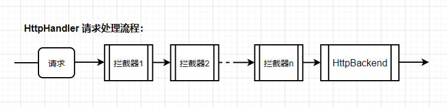

[Angular学习笔记HttpInterceptor拦截器](#top)

- [处理Http请求头 (Http Request Headers)](#处理http请求头-http-request-headers)
- [处理Http响应 (Http Response)](#处理http响应-http-response)
- [Http错误处理 (Http Error)](#http错误处理-http-error)
- [配置注入](#配置注入)
- [自动刷新Token](#自动刷新token)
- [HttpInterceptor 101](#httpinterceptor-101)

-----------------------------------------------------

- HttpInterceptor是Angular提供用于在全局应用程序级别处理HTTP请求的内置工具，拦截并处理HttpRequest或HttpResponse
- 拦截器在实战中的作用有很多，比如：统一配置网关地址，设置Http请求头，处理Http请求返回数据，统一错误处理等都是常见的需求
- 

## 处理Http请求头 (Http Request Headers)

```javascript
import { Injectable } from '@angular/core';
import { HttpInterceptor, HttpRequest, HttpHandler, HttpEvent } from '@angular/common/http';
import { Observable } from 'rxjs';
@Injectable()
export class HeaderInterceptor implements HttpInterceptor {
    public intercept(req: HttpRequest<any>, next: HttpHandler): Observable<HttpEvent<any>> {
        return next.handle(this.addToken(req, 'bearer my token'));
    }
    //为所有的请求加上token信息
    private addToken(req: HttpRequest<any>, token: string): HttpRequest<any> {
        return req.clone({ setHeaders: { Authorization: token } });
    }
}
// 应用在其他component, service
constructor(private httpClient: HttpClient) {
        this.httpClient.get('/assets/json/data.json').subscribe(ret => {
            // TODO:
        });
    }
```

[⬆ back to top](#top)

## 处理Http响应 (Http Response)

```javascript
import { HttpEvent, HttpHandler, HttpInterceptor, HttpRequest, HttpResponse } from '@angular/common/http';
import { Injectable } from '@angular/core';
import { Observable } from 'rxjs';
import { filter, map } from 'rxjs/operators';
@Injectable()
export class ResponseHandlerInterceptor implements HttpInterceptor {
    public intercept(req: HttpRequest<any>, next: HttpHandler): Observable<HttpEvent<any>> {
        return next.handle(req).pipe(
           //当返回的数据状态是200的时候，只返回body中需要的data数
            filter(event => event instanceof HttpResponse && event.status === 200),
            map((event: HttpResponse<any>) => event.clone({ body: event.body.data }))
        );
    }
}
```

[⬆ back to top](#top)

## Http错误处理 (Http Error)

```javascript
import { HttpEvent, HttpHandler, HttpInterceptor, HttpRequest } from '@angular/common/http';
import { Injectable } from '@angular/core';
import { Observable, throwError } from 'rxjs';
import { catchError, retry } from 'rxjs/operators';
@Injectable()
export class ErrorHandlerInterceptor implements HttpInterceptor {
    intercept(req: HttpRequest<any>, next: HttpHandler): Observable<HttpEvent<any>> {
        return next.handle(req).pipe(
            catchError(error => {
                switch (error.status) {
                    case 401: // Unauthorized
                        // todo
                        break;
                    case 403: // Forbidden
                        // todo
                        break;
                    default:
                        // todo
                        return throwError(error);
                }
            }),
            retry(3)
        );
    }
}
```

[⬆ back to top](#top)

## 配置注入

```
providers: [
        {
            provide: HTTP_INTERCEPTORS,
            useClass: HeaderInterceptor,
            multi: true
        },
        {
            provide: HTTP_INTERCEPTORS,
            useClass: ResponseHandlerInterceptor,
            multi: true
        },
        {
            provide: HTTP_INTERCEPTORS,
            useClass: ErrorHandlerInterceptor,
            multi: true
        }
    ]
```

[⬆ back to top](#top)

## 自动刷新Token


```javascript
// 1. Token解析与存储
interface JWT {
    sub: string;
    iat: number; // Token 生成时间戳
    exp: number； // Token 过期时间戳
}
// 2. 创建一个拦截器refresh-token.interceptor.service.ts
export RefreshTokenInterceptor implements HttpIntercetpor {
  //refreshTokenSubject声明
  private refreshTokenInProgress = false;
  private refreshTokenSubject: Subject<any> = new BehaviorSubject<any>(null);
  // shouldRefreshToken 的实现：
  get shouldRefreshToken() {
      const token = localStorage.getItem('token');
      if(token) {
        const tokenObj = JSON.parse(atob(token.splice('.')[1]));
        const maxAge = (tokenObj.exp - tokenObj.iat) * 1000 - 3000; // 生命周期 - 3秒，留点buffer，避免 token太小的极端情况导致过期。
        const shift = Math.floor(maxAge / 2); // 刷新token时间设定为token过期时间的一半
        const lastModify = localStorage.getItem('tokenLastModify');
        if (lastModify) {
            return (new Date().getTime() - Number(LastModify) > maxAge - shift); 
        } else {
            return true;
        }
      } else {
        return true;
      }
   }
  constructor () {}
  //实现intercept
  intercept(req: HttpRequest, next: HttpHandler): Observable> { 
    const  { url } = req;
    if (this.shouldRefreshToken && isNotRefreshTokenApi) { //refres token的API不需要这个逻辑，直接请求就可以了，否则循环调用 refresh token API。
        if (!this.refreshTokenInProgress) {  //refreshTokenInProgress：这个变量用于标记当前是否有获取token的动作在进行中，当这个值为true 的时候其他的API将不会重复请求refresh token
            this.refreshTokenInProgress = true;  
            this.refreshTokenSubject.next(null);  //refreshTokenSubject  置空，拦截当前请求；
            //  重新获取token，得到新的token之后, 使用新token发送原始请求。
            return this.refreshToken().pipe(
                switchMap((resp) => {
                    this.storageService.setStorage({  //跟新storage
                        ... resp, 
                        tokenLastModify: new Date().getTime(),  //更新token刷新时间。
                    });
                    this.refreshTokenSubject.next(resp.token);  //refreshTokenSubject返回非null 值， 放行其他的API
                    return next.handle(this.injectTOken(req)); //injectTOken() 方法实现替换新token， 这里将使用新token发送原始请求
                  })，
                  catchError(errorRes => this.handlError(errorRes)),
                  finalize(() => {
                        this.refreshTokenInProgress = false; //最终必须要还原 refreshTokenInProgress状态，否则会阻止后面的请求通过。
                  }) 
            )
        } else {
            return this.refreshTokenSubject.pipe(
                filter(result => result !== null),  //这个过滤器就实现当有请求token的进程发生，挂起其他请求的作用。
                take(1),
                switchMap(() => {
                    return next.handle(this.injectToken(req));
                })
            )
        }
    } else {
        return next.handle(req);
    }
}
// 3. 注入到AppModule(app.module.ts)中
{ provide: HTTP_INTERCEPTORS, useClass: RefreshTokenInterceptor, multi: true },
```

- 利用 `refreshTokenSubject.next(null)` 来阻止后面的其他http请求被真正发出（其他的API 会进入下面的 else 条件中，进而被 ` fileter(result => result !== null)` 过滤掉，不执行 `next.handle()`方法）， 而当前的这次请求会先请求刷新token的API， 当拿到新的token 存入storage并跟新获得token的时间戳，在token更新之后  执行  `this.refreshTokenSubject.next(resp.token)`，可以告知其他的API token已经刷新 ，其他的API 就会使用新token 继续之前的请求。最终，当前的请求会通过  `return next.handle(this.injectTOken(req))`带上新token真正发送Http请求。

[⬆ back to top](#top)

## HttpInterceptor 101

- [HttpInterceptor 101](https://juejin.cn/post/6911614350067236871)
- [GitHub 示例代码 10.x版本](https://github.com/llccing-demo/ng-interceptors)

[⬆ back to top](#top)

> references
- [Angular HttpInterceptor拦截器 多情景应用](https://www.jianshu.com/p/8b080a2587c2)
- [HttpInterceptor官方链接](https://angular.io/guide/understanding-communicating-with-http#http-interceptors)
- [基于Angular Http Interceptor(拦截器)实现自动刷新Token](https://www.jianshu.com/p/1db9c9f294a3)
- [【Angular中的HTTP请求】- 拦截器 HttpInterceptor 详解](https://blog.csdn.net/evanyanglibo/article/details/122368884)
- [Angular使用Interceptor(拦截器)请求添加token并统一处理API错误](https://blog.csdn.net/donjan/article/details/103592341)
- [HttpInterceptor 101](https://juejin.cn/post/6911614350067236871)
