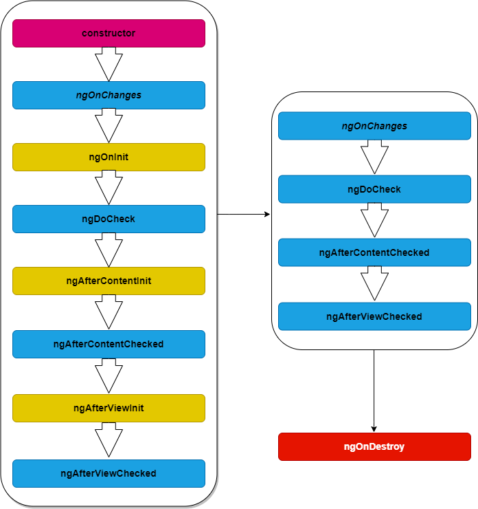
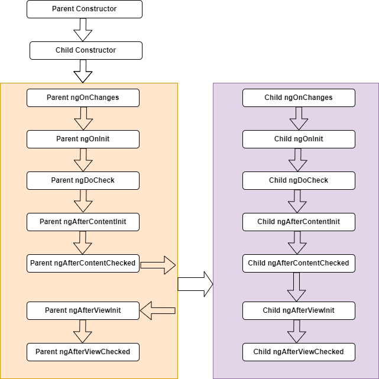

[Angular学习笔记之--父子组件生命周期钩子(lifecycle hooks)](#top)

## angular组件生命周期钩子执行过程

1. `constructor()`构造函数,初始化class，(constructor不属于Angular生命周期钩子的范畴，这里只是说明组件组件初始化会先调用构造函数)
2. `ngOnChanges()`--如果组件没有输入属性(@Input()),或者使用时没有提供任何输入属性，那么angular不会调用它；会调用多次
3. `ngOnInit()`--只调用**一次**，一般用来初始化数据，如请求数据
4. `ngDoCheck()`--紧跟在每次执行变更检测时的ngOnChanges()和首次执行变更检测的ngOnInit()后调用；会调用多次
5. `ngAfterContentInit()`--当Angular把外部内容投影进组件视图或指令所在的视图之后调用，第一次ngDoCheck()之后调用，只调用**一次**
6. `ngAfterContentChecked()`--每当Angular检查完被投影到组件或指令中的内容之后调用，在ngAfterContentInit()和每次ngDoCheck()之后调用，会调用多次
7. `ngAfterViewInit()`--当Angular初始化玩玩组件视图及其子视图之后调用，只调用**一次**
8. `ngAfterViewChecked()`--当Angular做完组件视图和子视图的变更检测之后调用；在ngAfterViewInit()和每次ngAfterContentChecked()之后调用，会调用多次
9. `ngOnDestroy()`--当Angular每次销毁组件或指令之前调用并清扫。在这里取消订阅可观察对象和分离事件处理器，以防内存泄漏

[⬆ back to top](#top)

## angular父子组件生命周期钩子过程

1. 首先调用父组件的构造函数，然后调用子组件的构造函数。
2. 当调用父组件的ngAfterContentChecked()钩子之后，会调用子组件的生命周期函数。
3. 子组件的ngAfterContentChecked()钩子执行完之后，会在调用子组件的子组件的生命周期钩子(如果有的话)。
4. 子组件执行ngAfterViewChecked()钩子后，父组件继续执行其余的生命周期钩子。
5. 当发生变更检测时，父组件先触发ngDoCheck() => ngAfterContentChecked()，然后子组件触发 ngOnChanges() => ngDoCheck() => ngAfterContentChecked() => ngAfterViewChecked(),最后父组件调用ngAfterViewChecked()。

[⬆ back to top](#top)

> https://www.cnblogs.com/sparkler/p/16864656.html
