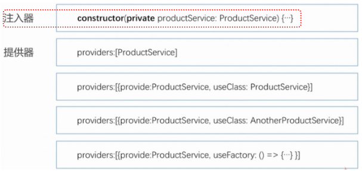

[Angular重要概念](#top)

- [依赖注入](#依赖注入)
- [Change Deteccion](#change-deteccion)
- [指令](#指令)
- [路由](#路由)
  - [路由参数传递 – 参数传递的几种方式](#路由参数传递--参数传递的几种方式)
- [样式](#样式)
- [模板](#模板)
  - [TemplateRef 与 ViewContainerRef](#templateref-与-viewcontainerref)
  - [ViewChild和ViewChildren](#viewchild和viewchildren)
- [DOM绑定与HTML属性绑定](#dom绑定与html属性绑定)
- [Ngrx](#ngrx)

-------------------------------------------

## 依赖注入



## Change Deteccion

引起状态变化(异步)：

- Events
- XHR
- Times

## 指令

组件是一种特殊的指令（组件是一种带模板的指令）

- 结构型指令 --改变元素的布局
- 属性型指令 --改变外观和行为

## 路由

|名称|	简介|
|---|---|
|Routes|	路由配置，保存着那个URL对应展示哪个组件，以及在哪个RouterOutlet中展示组件|
|RouterOutlet|	在Html中标记路由呈现位置的占位符指令|
|Router|	负责在运行时执行路由的对象，可以通过调用器navigate() 和navigateByUrl()方法来导航到一个指定的路由|
|RouterLink|	在Html中声明路由导航用的指令|
|ActivedRoute|	当前激活的路由对象，保存着当前路由的信息，如路由地址，路由参数等|


### 路由参数传递 – 参数传递的几种方式

```ts
普通方式传递数据  |  /product?id=1&name=iphone => ActivatedRoute.queryParams[id];
rest方式传递数据  |  {path:/product/:id}      => /product/1                         =>    ActivatedRoute.params[id];
路由配置传递数据  |  {path:/product,component:ProductComponent,data:[{madeInChina:true}]} => ActivatedRoute.data[0][madeInChina];
```

## 样式

|样式|简介|
|---|---|
|ngClass| 用于条件动态指定样式类，适合对样式做大量更改的情况|
|ngStyle| 用于条件动态指定样式，适合少量更改的情况|
|`[class.yourcondition]="condition"` |直接对应一个条件|

## 模板

|模板|简介|
|---|---|
|`<ng-template>`| 用于定义模板，使用 * 语法糖的结构指令，最终都会转换为 <ng-template> 模板指令，模板内的内容如果不进行处理，是不会在页面中显示|
|`<ng-container>`| 是一个逻辑容器，可用于对节点进行分组，但不作为 DOM 树中的节点，它将被渲染为 HTML中的 comment 元素，它可用于避免添加额外的元素来使用结构指令|
|`<ng-content>` |是一个占位符，有些类似于router-outlet|

### TemplateRef 与 ViewContainerRef

|||
|---|---|
|TemplateRef|用于表示内嵌的 template 模板元素，<br>通过 `TemplateRef` 实例，可以方便创建内嵌视图(Embedded Views)，<br>且可以轻松地访问到通过`ElementRef`封装后的 `nativeElement`。<br>需要注意的是组件视图中的 template 模板元素，经过渲染后会被替换成 comment 元素|
|ViewContainerRef|用于表示一个视图容器，可添加一个或多个视图。<br>通过 `ViewContainerRef` 实例，可以基于 `TemplateRef` 实例创建内嵌视图，并能指定内嵌视图的插入位置，<br>也可以方便对视图容器中已有的视图进行管理。简而言之，`ViewContainerRef` 的主要作用是创建和管理内嵌视图或组件视图|

### ViewChild和ViewChildren

|||
|---|---|
|ViewChild| 用于获取模板视图中的元素或直接调用其组件中的方法。它支持 Type 类型或 string 类型的选择器，同时支持设置 read 查询条件，以获取不同类型的实例。比如ElementRef和ViewContainerRef|
|ViewChildren| 用来从模板视图中获取匹配的多个元素，返回的结果是一个 `QueryList` 集合|


## DOM绑定与HTML属性绑定

- DOM属性绑定: 
  - `<input value="yan" (input)="doOninput($event)" >`
- HTML属性绑定:
  - `<td [attr.colspan]="colspanSize" align="center">Hello</td>`
  - `protected colspanSize: number =2;`

||DOM绑定	|HTML绑定|
|---|---|---|
|相同情况下|	一个元素的id
|有html属性无dom属性|		|表格中td的colspan|
|有dom属性无html属性|	textContent属性	|
|关于值|	dom表示当前值|	html表示初始化值|
|关于可变|	dom值是可变的	|html值是不可变的|

## Ngrx

- 
- 

|||
|---|---|
|View |相当于component，主要在显示使用者界面|
|Action |当component 有任何 event 時，会对 Ngrx 发出 action|
|Middleware |负责存取对 server 端的 API|
|Dispatcher |负责接受 component 传来的 action，并将 action 传给 reducer|
|Store |可是为 Ngrx 在浏览器端的资料库，各 component 的资料都可统一放在这里|
|Reducer |根据dispatcher 传来的 action，决定该如何写入state。<br>当 state 有改变时，將通知有subscribe该state的component自动更新|
|State |存放在 store 內的资料|


> [Angular重要概念](https://blog.csdn.net/WuLex/article/details/101866544)
