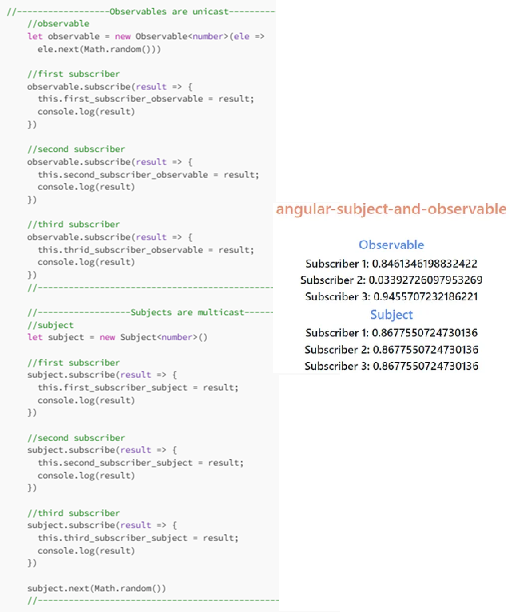
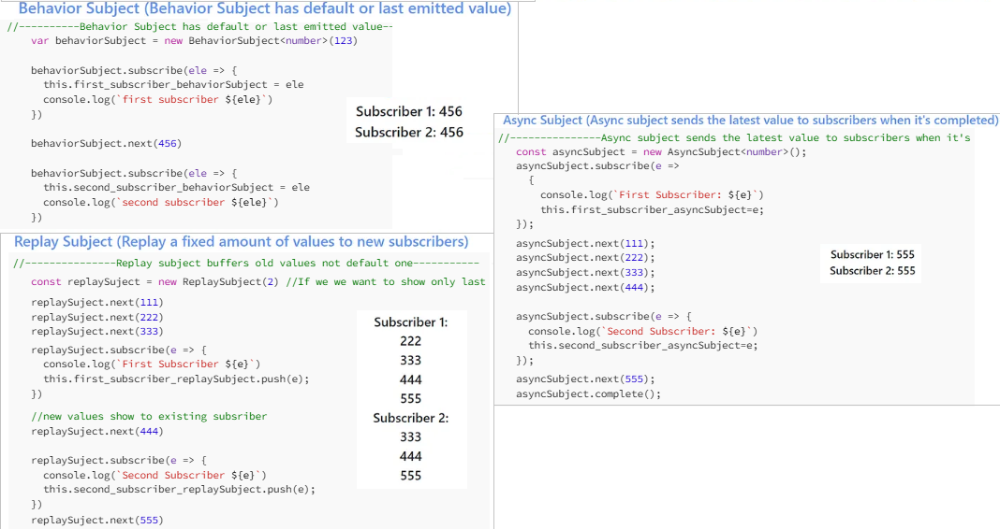

[解析四种主题Subject](#top)
- [Subject](#subject)
- [BehaviorSubject](#behaviorsubject)
- [ReplaySubject](#replaysubject)
- [AsyncSubject](#asyncsubject)

|   |是否存储数据|是否需要初始值|何时向订阅者发布数据|
|---|---|---|---|
|Subject|否|否|及时发布，有新数据就发布|
|BehaviorSubject|是，存储最后一条数据或初始值|是|及时发布，有新数据就发布|
|ReplaySubject|是，存储所有数据|否|及时发布，有新数据就发布|
|AsyncSubject|是，存储最后一条数据|是|延时发布，只有当数据源complete时候才发布|

|   |||
|---|---|---|
|Subject|- a multicast observable that maintains a list of observers and notifies all of them when a new value is emitted using the next() method<br>- It does not have an initial value, so subscribers only receive values emitted after they subscribe|when you need a simple multicast subject without any additional features|
|BehaviorSubject|- It has an **initial value** and will immediately emit the initial value to any subscriber as soon as they subscribe, even if no values have been emitted yet using the next() method<br>- After the initial value is emitted, it behaves like a regular Subject and notifies subscribers about new values emitted using next()|when you want to provide the last known value to new subscribers, such as the current state of an application or the latest data fetched from an API|
|ReplaySubject|- can buffer and replay a specific number of values to new subscribers<br>- When you create a ReplaySubject, you can specify the buffer size, which determines how many previous values should be replayed to new subscribers|when you want to provide a history of values to new subscribers or when you need to cache values for later use|
|AsyncSubject|- **only emits the last value** when it completes<br>- It will not emit any values until the subject’s complete() method is called. When completed, it will emit the last value (if any) to subscribers|when you need to wait for an operation to complete before emitting a final value, such as waiting for an HTTP request to finish and emitting the response as a single value|
-----------------------------------------

## Subject

- **多点广播( Multicasted Observables)**: Subject是Observable的一个特殊类型，可将流中的值广播给众多观察者(Observer)
- Subject本身既可以是Observable也可以是Observer，也就是说subject既可以作为一个数据源，也可以本身成为一组订阅者的代理
  - 每一个Subject就是一个Observable流: 在Subject内部，订阅(subscribe)不会引起一个新的接收数据的过程。类似于其他库或语言中的注册事件侦听器(addListener)，它会直接把给定的Observer放入到一个注册列表中
  - 每一个Subject也是一个观察者, 拥有next(v)、error(e)和complete()方法
    - 多个Observers能够从同一个Observable流中获取数据
- Subject的订阅者只有在订阅后，才能接收到数据源发射过来的值

```javascript
//创建一个Rxjs Subject, 数据的类型是number
let subject1: Subject<number> = new Subject<number>();
subject1.next(100);    //Subject的next方法来emit(发射)1条数据， 在订阅数据源之前发射
// 订阅者在订阅数据源subject1之前， 订阅者也只能收到如下代码C之后发射的数据
subject1.subscribe((res:number) => console.info("Subject A", res)); //C
subject1.subscribe((res:number) => console.info("Subject B", res));
subject1.next(200);
subject1.next(300);
//output， 无法接收到订阅之前的数据
subjectA 200
subjectB 200
subjectA 300
subjectB 300
```

- Subject是微信公众号，Observable是微信用户
- 1个Subject可以对应n个不同的Observable，Observable只要向Subject要求接收，每次Subject的更新都能即时收到。
- 就如1个微信公众号可以有n个没用必然关系的微信用户，只要微信用户关注了微信公众号，每次微信公众号的更新都能及时收到。

```javascript
//使用Subject和Observable，来取得http请求的response，并显示
//user-login.service.ts
export class UserLoginService {  
    //微信公众号(Subject)
    public subject: Subject<UserModel> = new Subject<UserModel>();
    constructor(public http:Http) {
        console.log("Angular2---------UserLoginService.constructor");
    }
    //给微信用户(Observable)关注提供的方法
    public get currentUser():Observable<UserModel>{
        return this.subject.asObservable();
    }
    public login(user: UserModel) {
       console.log("Angular2---------UserLoginService.login");
       let body = JSON.stringify(user);
       return this.http.post("http://172.28.197.13:8899/login", body)
                  .map((response: Response) => {
                      let userResponseJson = new UserModel();
                      userResponseJson = response.json();
                      //微信公众号(Subject)更新
                      this.subject.next(Object.assign({}, userResponseJson));
                      localStorage.setItem("currentUser",JSON.stringify(userResponseJson));
                      if (userResponseJson && !userResponseJson.errCode) {
                          console.log("Angular2---------UserLoginService.login SUCCESSED");
                      } else {
                          console.log("Angular2---------UserLoginService.login FAILED");
                      }
                      return response;
                  })
                  .subscribe(
                          data => {
                              console.log("Angular2---------UserLoginService.login subscribe data : " + JSON.stringify(data.json()));
                          },
                          error => {
                              console.log("Angular2---------UserLoginService.login err");
                              console.error(error);
                          }
                  );
    }
}
//user-login.component.ts
export class UserLoginComponent implements OnInit {
    public errorMessage: string = "";    
    public userModel: UserModel = new UserModel();
    public currentUser: UserModel;
    constructor(public userLoginService: UserLoginService) {
        console.log("Angular2---------UserLoginComponent.constructor");
    }
    ngOnInit() {
        console.log("Angular2---------UserLoginComponent.ngOnInit");
        //执行微信用户(Observable)关注操作(就是那个[给微信用户(Observable)关注提供的方法])。
        //每次微信公众号(Subject)有更新，以下subscribe中的处理都会重复执行。
        this.userLoginService.currentUser.subscribe(
                data => {
                    this.currentUser = data;
                    console.log("Angular2---------UserLoginComponent.ngOnInit data : " + JSON.stringify(data));
                    if(this.currentUser) {
                        this.errorMessage = this.currentUser.errMsg;
                    }
                }
         )
    }
    public doLogin():void {
        console.log("Angular2---------UserLoginComponent.doLogin"); 
        this.userLoginService.login(this.userModel);
    }
}
```

## BehaviorSubject

- BehaviorSubject是可以存储最后一条数据或者初始默认值的
- 订阅者无论何时订阅到数据源，始终都能拿到**最新**的或者**初始**的数据，但也**只能拿到一条数据**

```javascript
let subject2: BehaviorSubject<number> = new BehaviorSubject<number>(0);
subject2.next(100);
subject2.subscribe((res: number) => console.info("behavior-subjectA ", res));
subject2.next(200);
subject2.subscribe((res: number) => console.info("behavior-subjectB ", res));
subject2.next(300);
//output
behavior-subjectA 100
behavior-subjectA 200
behavior-subjectB 200
behavior-subjectA 300
behavior-subjectB 300
```

## ReplaySubject

- ReplaySubject会存储数据流中的所有数据，无论何时订阅到subject3，订阅者都能获取了订阅之前数据流里的所有数据，然后依旧获取到接下来获取的到的新数据
- 如处理input text change事件时，需要拿到用户输入的所有字符，也就是数据流的所有数据，这个时候使用ReplaySubject

```javascript
let subject3: ReplaySubject<number> = new ReplaySubject<number>();
subject3.next(100);
subject3.next(200);
subject3.subscribe((res: number) => console.info("replay-subjectA ", res));
subject3.next(300);
subject3.subscribe((res: number) => console.info("replay-subjectB ", res));
subject3.next(400);
//output
replay-subjectA 100
replay-subjectA 200
replay-subjectA 300
replay-subjectB 100
replay-subjectB 200
replay-subjectB 300
replay-subjectA 400
replay-subjectB 400
```

## AsyncSubject

- AsyncSubject只会存储数据流里的最后一条数据， 而且只有在数据流complete时才会将值发布出去
- AsyncSubject主要是用来处理异步操作，当数据源是异步请求或者事件处理时，可能会发射出很多数据，如果我们只希望数据源的异步操作完成的时候，订阅者才能接收到值，这个时候就可以使用AsyncSubject

```javascript
let subject4: AsyncSubject<number> = new AsyncSubject<number>();
subject4.next(100);
subject4.next(100);
subject4.subscribe((res: number) => console.info("async-subjectA ", res));
subject4.next(300);
subject4.subscribe((res: number) => console.info("async-subjectB ", res));
subject4.next(400);
subject4.subscribe((res: number) => console.info("async-subjectC ", res));
subject4.complete();
subject4.subscribe((res: number) => console.info("async-subjectD ", res));
subject4.next(500);   //数据源已经complete了，就无法再发射新数据
//output
async-subjectA 400
async-subjectB 400
async-subjectC 400
async-subjectD 400
```

- 
- 

> Reference
- [【Rxjs】 - 解析四种主题Subject](https://segmentfault.com/a/1190000012669794)
- http://reactivex.io/rxjs/manual/overview.html#subject
- [[译]RxJS06——Subject](https://segmentfault.com/a/1190000009904799)
- [Angular学习：Subject和Observable](https://blog.csdn.net/superpeepi_csdn/article/details/72673122)
- [Observable and Subjects in Angular](https://medium.com/@jaydeepvpatil225/observables-and-subjects-in-angular-a4d73dfa5bb)
