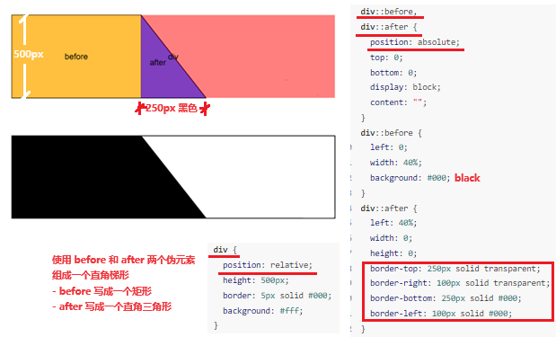

## layout

- 

## 混合模式

在 CSS 中，主要是 background-blend-mode 属性和 mix-blend-mode 两个属性来实现元素的混合模式。

- `background-blend-mode` - 指定 HTML 元素的背景层（包括背景颜色、背景图片等）之间的混合模式。
- `mix-blend-mode` - 指定一个 HTML 元素的内容（包括文字、内嵌图像等）与其下方 HTML 元素的混合模式。
- 标准混合模式有16个
- 分离混合模式: 
  - 在 normal、multiply、screen、darken、lighten、color-dodge、color-burn、hard-light、soft-light、difference、exclusion 这 11 种标准混合模式中还可以加上前缀 difference，形成如 difference-normal 等分离混合模式，用于独立控制 RGB 通道和 alpha 通道的混合
  - 分离混合模式由于其计算的简单性和效率，在某些情况下可能更适合性能敏感的应用场景
- CSS Paint API混合模式
  - 一种允许开发者使用 JavaScript 编写自定义绘制逻辑来生成 CSS 背景、边框、内容等图像的现代 Web 技术
  - CSS Paint API 混合模式需要在支持 CSS Paint API 的浏览器中才能使用，是一种特殊的混合模式，如** plus-darker**、plus-lighter 等
  - 配合 mix-blend-mode 属性，CSS Paint API 可以实现更加动态、灵活且复杂的颜色混合效果

|||
|---|---|
|Normal（默认）|不进行特殊混合，上层的 HTML 元素直接盖住下层的 HTML 元素 这是默认的混合模式，相当于没有混合|
|Multiply（正片叠底）|将上层 HTML 元素中的颜色与下层 HTML 元素的颜色的每一个分量进行相乘，一般情况下，计算后的结果颜色比原本的颜色更暗 对于上层 HTML 元素中的颜色是纯黑色或纯白色的，混合后的结果将分别保持下层 HTML 元素的颜色不变或变为纯黑色|
|Screen（滤色）|类似于两层幻灯片重叠的效果，上层 HTML 元素的颜色与下层 HTML 元素的颜色的互补色相乘，然后取反 一般情况下，计算后的结果颜色比原本的颜色更亮 对于上层 HTML 元素中的颜色是纯黑色或纯白色的，混合后会使下层 HTML 元素的颜色不变或变为纯白色|
|Overlay（叠加）|结合了 Multiply 和 Screen 模式的特点 对于下层 HTML 元素的颜色较暗的区域，使用 Multiply 模式 对于下层 HTML 元素的颜色较亮的区域，使用 Screen 模式 这种模式可以增强对比度|
|Darken（变暗）|对于每个像素位置，取上层 HTML 元素的颜色与下层 HTML 元素的颜色中较暗的那个颜色作为结果颜色 该模式倾向于保留两个层叠的 HTML 元素中最深的色彩|
|Lighten（变亮）|类似于 Darken，只不过取的是两层 HTML 元素的颜色中较亮的那个颜色作为结果颜色 该模式倾向于保留两个层叠的 HTML 元素中最浅的色彩|
|Color-Dodge（颜色减淡）|上层 HTML 元素的颜色根据下层 HTML 元素的颜色信息中的亮度调整自身亮度，使得结果颜色变亮 当下层 HTML 元素的颜色较暗时，影响较小 当下层 HTML 元素的颜色接近白色时，上层 HTML 元素的颜色会明显变亮甚至完全变为白色|
|Color-Burn（颜色加深）|与 Color-Dodge 反过来，上层 HTML 元素的颜色根据下层 HTML 元素的颜色信息中的亮度调整自身亮度，使得结果颜色变暗 当下层 HTML 元素的颜色较亮时，影响较小 当下层 HTML 元素的颜色接近黑色时，上层 HTML 元素的颜色会明显变暗甚至完全变为黑色|
|Hard-Light（强光）|类似于 Overlay，但作用于下层 HTML 元素的颜色 上层 HTML 元素的颜色类似于一个光源，对下层 HTML 元素的颜色施加明暗影响 若上层 HTML 元素的颜色为纯黑色或纯白色，则会使下层 HTML 元素的颜色变暗或变亮|
|Soft-Light（柔光）|与 Hard-Light 相似，但效果更为柔和 上层 HTML 元素的颜色对下层 HTML 元素的颜色的明暗影响较小，产生类似半透明材料覆盖的效果|
|Difference（差值）|计算上层 HTML 元素的颜色与下层 HTML 元素的颜色之间的色差，结果为两者之间的对比色 当两层颜色相同时，结果为黑色 当两层颜色互补时，结果为白色|
|Exclusion（排除）|与 Difference 类似，但产生的对比度较低 结果颜色比 Difference 模式更柔和，且不会出现纯黑色或纯白色|
|Hue（色相）|取上层 HTML 元素的颜色信息中的色相与下层 HTML 元素的颜色信息中的饱和度和亮度，生成新的颜色 下层 HTML 元素的颜色信息中的色调被上层 HTML 元素的颜色信息中的色调替换，但饱和度和亮度保持不变|
|Saturation（饱和度）|取下层 HTML 元素的颜色信息中的色相与亮度，以及上层 HTML 元素的颜色信息中的饱和度，生成新的颜色 下层 HTML 元素的颜色信息中的饱和度被上层 HTML 元素的颜色信息中的饱和度替换，其他属性保持不变|
|Color（颜色）|取上层 HTML 元素的颜色信息中的色相与饱和度，以及下层 HTML 元素的颜色信息中的亮度，生成新的颜色 下层 HTML 元素的颜色信息中的色调和饱和度被上层 HTML 元素的颜色信息中的色调和饱和度替换，亮度保持不变|
|Luminosity（亮度/明度）|取上层 HTML 元素的颜色信息中的亮度，与下层 HTML 元素的颜色信息中的色相和饱和度结合，生成新的颜色 下层 HTML 元素的颜色信息中的亮度被上层 HTML 元素的颜色信息中的亮度替换，色调和饱和度保持不变|
