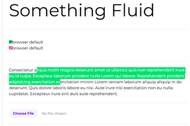

[top(#top)]
- [class tips](#class-tips)
- [some tips](#some-tips)
- [responsive](#responsive)
- [Custom Styles \& Reusability](#custom-styles--reusability)
  - [Using arbitrary values](#using-arbitrary-values)
  - [Theme variables](#theme-variables)
  - [using directive](#using-directive)
- [using cn+clsx](#using-cn)
-----------------------------------------------------

1. `@layer`: define custom CSS
   - `@layer base { }`
   -` @layer components { }`
   - `@layer utilities { }`
2. `@theme`
3. `@plugin`: `@plugin "@tailwindcss/typography`
   
## class tips

|class|Scene|
|---|---|
|container||
|size-xxx||
|divide-y-xxx||
|space-y-xxx||
|line-clamp-xxx|text ecllipse|
|truncate|text ecllipse|
|bg-gradient-to-r from-orange-500 to-black via-white from-20% via-70% to-90%||
|ring-xxx ring-red ring-offset-xxx|button|
|animation-ping||
|sr-only, lg:not-sr-only|will hide in screen, but only for screen reader|
|typography |such as prose|

[⬆ back to top](#top)

## some tips

```html
{/* Fluid text */}
      <p className='text-[min(10vw,70px)]'>Something Fluid</p>
      <br /><hr /><br />
{/* Accent */}
      <div className='my-4 flex flex-col'>
        <label htmlFor=""><input type="checkbox" checked className='accent-green-500' />browser default</label>
        <label htmlFor=""><input type="checkbox" checked className='accent-pink-500' />browser default</label>
      </div>
      <br /><hr /><br />
{/* highlight */}
      <div className='selection:bg-green-400 selection:text-white'>
        <p>Consectetur aliqua mollit magna deserunt amet ut ullamco quis non reprehenderit irure eu id culpa. Excepteur laborum proident nulla Lorem qui labore. Reprehenderit proident adipisicing exercitation exercitation minim Lorem veniam laborum aliquip aliquip in do deserunt. Quis dolore laboris labore eu nisi. Aute irure nisi exercitation non eu nulla cupidatat. Excepteur irure sint duis aute reprehenderit.</p>
      </div>
      <br /><hr /><br />
{/* using file */}
      <input type="file" className='block w-full text-sm text-slate-500 file:mr-4 file:rounded-full file:border-0 file:bg-violet-50 file:px-4 file:py-2 file:text-sm file:font-semibold file:text-violet-700 hover:file:bg-gray-500' />
{/* less javascript */}
      <br /><hr /><br />
{/* Caret */}
      <textarea className='w-full caret-green-500 p-2' name="" id=""></textarea>
{/* 大段文字滚动时候底部半透明效果 */
<div className='h-40 overflow-auto pb-20 mask-[linear-gradient(to_top,transparent_20%,black_80%)]'>a long text...</div>
```



[⬆ back to top](#top)

## responsive

1. Targeting mobile screens
   - <mark>Don't use 'sm:' to target mobile devices</mark>
   - <mark>Use unprefixed utilities to target mobile, and override them at larger breakpoints</mark>
   - `<div class="text-center sm:text-left"></div>`
   - `<!-- This will center text on mobile, and left align it on screens 640px and wider -->`
2. Targeting a breakpoint range
   - **By default**, styles applied by rules like <mark>`md:flex`</mark> will apply at that breakpoint and stay applied at <mark>larger breakpoints</mark>
3. [Using arbitrary values](https://tailwindcss.com/docs/adding-custom-styles#using-arbitrary-values)
   - use the `min` or `max` variants to generate a custom breakpoint
   - `<div class="max-[600px]:bg-sky-300 min-[320px]:text-center">`

|Variant	|Media query|
|---|---|
|`max-sm`	|`@media (width < 40rem) { ... }`|
|`max-md`	|`@media (width < 48rem) { ... }`|
|`max-lg`	|`@media (width < 64rem) { ... }`|
|`max-xl`	|`@media (width < 80rem) { ... }`|
|`max-2xl`|`@media (width < 96rem) { ... }`|

[⬆ back to top](#top)

## Custom Styles & Reusability

### Using arbitrary values

- Arbitrary variants:
  - `<li class="lg:[&:nth-child(-n+3)]:hover:underline">{item}</li>`
  - `<div class="bg-[url('/what_a_rush.png')]">`      <-- an underscore (_) instead of whitespace(' ')
  - `<div class="before:content-['hello\_world']">`   <-- an underscore (_) instead of whitespace(' ')

[⬆ back to top](#top)

### Theme variables

- Theme variables are special CSS variables defined using the @theme directive that influence which utility classes exist in your project
- [default theme variable reference](https://tailwindcss.com/docs/theme#default-theme-variable-reference)

```css
@import "tailwindcss";
@theme {
  --color-mint-500: oklch(0.72 0.11 178);
}
// using
<div class="bg-mint-500">
```

|Namespace	|Utility classes|
|---|---|
|`--color-*`	|Color utilities like bg-red-500, text-sky-300, and many more|
|`--font-*`	|Font family utilities like font-sans|
|`--text-*`	|Font size utilities like text-xl|
|`--font-weight-*`|	Font weight utilities like font-bold|
|`--tracking-*`	|Letter spacing utilities like tracking-wide|
|`--leading-*`	|Line height utilities like leading-tight|
|`--breakpoint-*`	|Responsive breakpoint variants like sm:*|
|`--container-*`	|Container query variants like @sm:* and size utilities like max-w-md|
|`--spacing-*`	|Spacing and sizing utilities like px-4, max-h-16, and many more|
|`--radius-*`	|Border radius utilities like rounded-sm|
|`--shadow-*`	|Box shadow utilities like shadow-md|
|`--inset-shadow-*`	|Inset box shadow utilities like inset-shadow-xs|
|`--drop-shadow-*`|	Drop shadow filter utilities like drop-shadow-md|
|`--blur-*`	|Blur filter utilities like blur-md|
|`--perspective-*`|	Perspective utilities like perspective-near|
|`--aspect-*`|	Aspect ratio utilities like aspect-video|
|`--ease-*`	|Transition timing function utilities like ease-out|
|`--animate-*`	|Animation utilities like animate-spin|


[⬆ back to top](#top)

### using directive

- `@base`
- `@theme`: define your project's custom design tokens, like fonts, colors, and breakpoints:
- `@layer`: <mark>inline</mark> any existing utility classes into your own custom CSS
- [Functions and directives](https://tailwindcss.com/docs/functions-and-directives)

```ts
@layer components {
  .card {
    @apply m-10 rounded-lg bg-white px-6 py-8 shadow-xl ring-1 ring-slate-900/5 dark:bg-black
  }
  .gradientbutton {
    @apply bg-linear-to-r from-purple-500 to-blue-500 hover:from-purple-600 hover:to-blue-600 focus:outline-none focus:ring focus:ring-purple-300 active:bg-blue-700 px-6 py-3 rounded-lg text-white font-semibold shadow-md transform hover:scale-105 transition duration-300 ease-in-out
  }
}
// using in html
<button className='gradientbutton'>Click me</button>
```

[⬆ back to top](#top)

## using cn

1. using `cn`
2. using `clsx`

```
import { cn } from "@/lib/utils";
import clsx from "clsx";
<div className={clsx("text-3xl font-bold", delta > 0 ? "text-green-500" : "text-red-500")}></div>
<div className={cn('group relative flex items-start md:-ml-12', className)}></div>
<div className={cn("text-lg font-medium",
  volumeChangePercentage24h > 0 ? "text-green-500" : "text-red-500",
  isDisabled && 'opacity-50' // More conditional styles
)}>{volumeChangePercentage24h}%</div>

const isActive = true;
const className = cn("bg-red-500", {
  "text-white": isActive,
  "text-gray-500": !isActive,
});
console.log(className); // "bg-red-500 text-white"

const MyButton = ({ isDisabled, isPrimary }) => {
  const buttonClasses = cn(
    'px-4 py-2 rounded-md', // Base classes
    {
      'bg-blue-600 text-white': isPrimary, // Conditional primary styles
      'bg-gray-400 text-gray-700 cursor-not-allowed': isDisabled, // Conditional disabled styles
    },
    isDisabled && 'opacity-50' // More conditional styles
  );
  return <button className={buttonClasses} disabled={isDisabled}>Click Me</button>;
};
```

-[10 Tailwind Classes I Wish I Knew Earlier](https://www.youtube.com/watch?v=x1RJ5Q09PqM)
