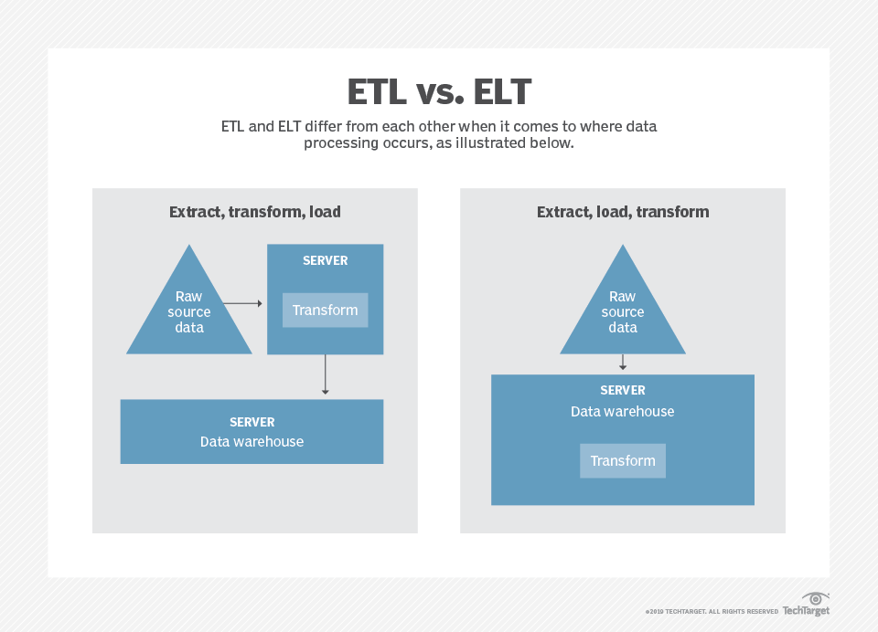

## [DP-900](#top)

- [Core data concepts](#core-data-concepts)
- [Data roles and services](#data-roles-and-services)
- [ETL vs ELT](#etl-vs-elt)
- [Relational Database in Azure](#relational-database-in-azure)
- [Non-Relational Database in Azure](#non-relational-database-in-azure)


### Core data concepts

- Data Formats
  - structured data: data that adheres to a fixed schema
  - semi-structured data
  - unstructured data
- Data stores
  - File stores:
    - General file formats:   Delimited text files, JSON, XML, BLOB
    - Optimized file formats:
      - **Avro**: row-based format. It was created by Apache. Each record contains a header that describes the structure of the data in the record. This header is stored as JSON. The data is stored as binary information.
      - **ORC**(Optimized Row Columnar format) organizes data into columns rather than rows. It was developed by HortonWorks for optimizing read and write operations in Apache Hive (Hive is a data warehouse system that supports fast data summarization and querying over large datasets). An ORC file contains stripes of data. Each stripe holds the data for a column or set of columns. A stripe contains an index into the rows in the stripe, the data for each row, and a footer that holds statistical information (count, sum, max, min, and so on) for each column.
      - **Parquet**: columnar data format. It was created by Cloudera and Twitter. A Parquet file contains row groups. Data for each column is stored together in the same row group. Each row group contains one or more chunks of data. A Parquet file includes metadata that describes the set of rows found in each chunk. An application can use this metadata to quickly locate the correct chunk for a given set of rows, and retrieve the data in the specified columns for these rows. Parquet specializes in storing and processing nested data types efficiently. It supports very efficient compression and encoding schemes.
  - Databases
    - Relational databases
    - Non-relational databases
      - key-value databases:
      - Document databases
      - Column family databases
      - Graph databases
  - OLTP(OnLine Transactional Processing) solutions supports so-called ACID semantics
    - **Atomicity** – each transaction is treated as a single unit
    - **Consistency** – transactions can only take the data in the database from one valid state to another.
    - **Isolation** – concurrent transactions cannot interfere with one another, and must result in a consistent database state.
    - **Durability** – when a transaction has been committed, it will remain committed
- Analytical data processing
  - **Data lakes** are common in large-scale data analytical processing scenarios
  - **Data warehouses** are an established way to store data in a relational schema that is optimized for read operations
  - **OLAP(online analytical processing) model** is an aggregated type of data storage that is optimized for analytical workloads

[go to top](#top)

### Data roles and services

- Data role: three key job roles
  - Database administrators: manage databases, assigning permissions to users, storing backup copies of data and restore data in the event of a failure.
  - Data engineers: manage infrastructure and processes for data integration across the organization, applying data cleaning routines, identifying data governance rules, and implementing pipelines to transfer and transform data between systems.
  - Data analysts: explore and analyze data to create visualizations and charts that enable organizations to make informed decisions.
- Data services in Azure
  - Azure SQL: Azure SQL database, Azure SQL Managed intance, Azure SQL VM
  - Azure database for open-source relational databases
    - Azure database for MySQL
    - Azure database for MariaDB
    - Azure database for PostgreSQL
  - Azure Cosmos DB: global-scale non-relational(NoSQL) database
  - Azure storage:
    - Blob containers
    - File shares
    - Tables: key-value storage for applications that need to read and write data values quickly
  - Azure Data Factory:
    - define and schedule data pipelines to transfer and transform data.
    - Data engineers to build Extract, tranform and Load(ETL) solutions
  - Azure Synapse Analytics
    - Pipelines, SQL, Apache Spark, Azure Synapse Data Explorer
    - Data engineers can use Azure Synapse Analytics to create a unified data analytics solution that combines data ingestion pipelines, data warehouse storage, and data lake storage through a single service.
    - Data analysts can use SQL and Spark pools through interactive notebooks to explore and analyze data, and take advantage of integration with services such as Azure Machine Learning and Microsoft Power BI to create data models and extract insights from the data
  - Azure Databricks
    - combines the Apache Spark data processing platform with SQL database semantics and an integrated management interface to enable large-scale data analytics.
    - Data engineers can use existing Databricks and Spark skills to create analytical data stores in Azure Databricks.
    - Data Analysts can use the native notebook support in Azure Databricks to query and visualize data in an easy to use web-based interface.
  - Azure HDInsight:  provides Azure-hosted clusters for popular Apache open-source big data processing technologies
    - Apache Spark
    - Apache Hadoop
    - Apache HBase
    - Apache Kafka
  - Azure Stream Analytics:  a real-time stream processing engine
  - Azure Data Explorer: a standalone service that offers the same high-performance querying of log and telemetry data as the Azure Synapse Data Explorer runtime in Azure Synapse Analytics
  - Microsoft Purview: provides a solution for enterprise-wide data governance and discoverability
  - Microsoft Power BI: a platform for analytical data modeling and reporting
- Analytics types
  - **Descriptive**, What's happen?
  - **Diagnostic**,  Why's happen?
  - **Predictive**, What will happen?
  - **Prescriptive**, What actions should I take? what should I do NEXT?
  - **Cognitive analytics**, what can I INFER?

[go to top](#top)

### ETL vs ELT

- ELT is a variation of the Extract, Transform, Load (ETL), a data integration process in which transformation takes place on an intermediate server before it is loaded into the target. In contrast, ELT allows raw data to be loaded directly into the target and transformed there
- 


```
                  ETL                                        ELT
----------------------------------------------|-------------------------------------------------------
- data is fully processed BEFORE destination  |   - Performs transformations AFTER on the destination
- High upfront work                           |   - More agility/experimentation
- Destination data is                         |   - Enabled by recent technologies:
  - compliant                                 |     - Data Lakes
  - Well-structured                           |     - MPP(Azure Synapse Analytics)
  - Easily queried                            |     - Polybase
- Tools: SSIS/Data Factory                    |   - Tools: SSIS/Data Factory
```

[go to top](#top)

### Relational Database in Azure

- Types - from PaaS to SaaS
  - SQL Server on an Azure VM
  - Azure SQL Database
  - Azure SQL Editions
- The SQL language
  - Vendor-specific languages
    - Transact-SQL(Microsoft)
    - PL/SQL(Oracle)
    - pgSQL(PostgreSQL)
  - Dialect choice
    - Vendor-specific has more features
    - ANSI-SQL allows cross-platform support
- Data Manipulation Language(DML)
  - select, insert, update, delete, merge
- Data Definition Language(DDL)
  - create, alter, rename, drop
- Azure Querying Tools

```
                     |          Azure SQL                   |  Azure MySQL/MariaDB  |   Azure PostgreSQL
---------------------|--------------------------------------|-----------------------|--------------------------
Graphical Interface  | SQL Server Management Studio(SSMS)   |                       |
(GUI)                | Visual Studio(SSDT)                  |  MySQL Workbench      |    pgAdmin
                     | Azure Portal                         |                       |
---------------------|--------------------------------------|-----------------------|--------------------------
Command-line         |      sqlcmd                          |    mysql              |    psql
Azure Cloud Shell    |                                      |                       |
---------------------|--------------------------------------|-----------------------|--------------------------
Azure Data Studio    |    Yes                               |    No                 |   yes(installl extension)
```

- DB Management Tools
  - Graphical Interface: Azure Portal
- Automation Options(Scripting)
  - Azure CLI
  - Azure PowerShell
  - ARM templates(JSON-based)
- DB security
  - Firewalls
    - Enable On PRemises outgoing ports
      - Azure SQL:  1433
      - PostfreSQL: 5431
      - MySQL/MariaDB:  3306
  - Encryption:  SSL and At Rest(SQL uses TDE-Transparent Data Encryption)
  - Advanced Threat Protection(in preview for Open Source DBs)
- Authentication and Permissions
  - Authentication validates your identity
    - All but MariaDB support both SQL and Azure AD
    - Azure AD advantages
      - Centralized Identity Management
      - Multifactor Authenitication(MFA)
  - Permissions define what you can do, two levels
    - Azure resource level(RBAC)
    - DB level(db_owner, db_ddladmin)

[go to top](#top)

### Non-Relational Database in Azure

- Types:
  - Unstructured(Audio, Video, Images...)
  - Semi-Structured
- Semi-Structured File format
  - JSON
  - Parquet(columnar)
  - ORC(columnar)
  - AVRO(row-based, binary)
- Format
  - Key-value stores
    - fastest NoSQL format
    - can have variable number of columns
    - extremely fast read/write(date ingestion)
    - limitations
      - can search only on the key
      - no Updates(only insert/delete)
    - examples: Azure tables/Cosmos DB(Table API)
  - Document DB
    - Typically JSON
    - Flexible schema
    - Can query both key and values
    - one document  might contain ALL info about an entity
    - Data Repetition might occur
    - Not fast as key-value, but much better search
    - examples:  Cosmos DB(SQL API)
  - Column-Family DBs
    - Similar to Relatinal
    - Faster retrieval
    - Think COLUMNS, not ROWS
    - examples:  Apache Cassandra, Cosmos DB(Cassandra API)
  - Graph DBs
    - use to model complex relationships
    - consists of:
      - Nodes(info on objects)
      - Edges(info on relationships)
    - can perform complex analysis FAST, without joins/subqueries
    - example: Cosmos DB(Gremlin API)
- Azure Cosmos DB
  - Microsoft's main NoSQL Database
  - PaaS level(managed service)
  - Multi-model, supporting
    - key-value:     Table API
    - documents:     SQL API
    - Graph:         Gremlin API
    - Column-Family: Cassandra API
  - VERY fast(<10 ms at 99% SLA)
  - Encryption at rest and in motion
  - Used by Skype, XBox, O365 and Azure
- Cosmos DB APIs
  - SQL API
    - Native/Recommended
    - Document-based
    - Sopports SQL-like commands
  - Gremlin API(Graph): also allows SQL-like and JSON
  - Migration APIs:
    - Table API(Azure Tables): supports multiple read replicas and write regons
    - Mongo API: supports JSON documents and Mongo code
    - Casandra API: Also minimizes migration effort
  - 
  - DBs and Containers
    - 
  - Cosmos DB Management Tasks
    - Provision with: Portal, CLI, powerShell or ARM
    - Performance defined as Request Units/Second(RU/s)
      - RU/s can be set at DB And container levesl
    - Auto intra-Regin Replication
      - one-click Multi-master Global Replication available(at extra cost)
    - Data explorer for querying(Azure Portal)
    - Cosmos DB Data Migration Tool for migrations(from GitHub)
- Azure Storage
  - Blob storage: Azure Blob storage
    - microsoft's BLOB(binary large object) solution
    - supports massive amounts of data(along with metadata)
    - Azure data lake Gen2 runs on Blob storage
    - Data is encrypted(supports BYOK)
    - Common uses:
      - Images/Documents for websites
      - Audio/Video streaming
      - Backups
      - Storage for data analytics
    - Blob storage Management Tasks
      - configure Access Tiers:
        - Hot(fastest, more expensive)
        - Cool(for less frequently access)
        - Archive(cheapest, but can take hours to 'rehydrate')
      - Configure replication options, such as
        - LRS(Locally-Redundant Storage): lowest-cost with basic protection against server rack and drive failures
        - GRS(Geo-Redundant storage): intermedia with failover capabilities in a secondary region. Recommended for backup scenarios
        - RA-GRS(Read-Access Geo-Redundant): based on GRS, but it also provides an option to read from secondary region, regardless of whether initating a failover
  - File storage: Azure File storage
    - Enables File shares on the cloud
    - supports SMB 3.0, and is in preview for NFS(Linux)
    - Upload using Azure Portal or AZCopy
    - Data is Endcrypted at rest(Support BYOK)
    - Two Performance Tiers:  Standard(HDD), Premium(SSD)
    - Main use case: Migrating file shares from On Premises windows servers
  - Table storage: Azure Tables
    - Microsoft's Key-value store
    - Simle service, with no schema, relationships, foreign-keys
    - VERY fast, regardless of db size
    - Robust(several TBS)
    - Ideal for fast Data Ingestion(IoT/Telematics)
    - Multiple Read Replicas, but NOT multiple write regions(use Cosmos DB instead)
  - Queue storage:
