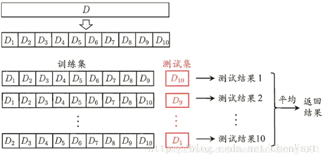

[KFold----交叉验证](#top)

- [交叉验证基本原理](#交叉验证基本原理)
- [KFold](#kfold)

### 交叉验证基本原理

- 训练集（train set）: 用于模型拟合的数据样本
  - 验证集（development set）: 
    - 验证集是模型训练过程中单独留出的样本集，它可以用于调整模型的超参数和用于对模型的能力进行初步评估
    - 不参与训练, 这样可以相对客观的评估模型对于训练集之外数据的匹配程度
    - 在普通的机器学习中常用的交叉验证(Cross Validation又称循环验证): 将原始数据分成K组(K-Fold)，将每个子集数据分别做一次验证集，其余的K-1组子集数据作为训练集，这样会得到K个模型。这K个模型分别在验证集中评估结果，最后的误差MSE(Mean Squared Error)加和平均就得到交叉验证误差。交叉验证有效利用了有限的数据，并且评估结果能够尽可能接近模型在测试集上的表现，可以做为模型优化的指标使用
- 测试集
  - 测试集是与训练独立的数据，完全不参与训练，用来评估模最终模型的泛化能力(评估)。但不能作为调参、选择特征等算法相关的选择的依据

|类别  | 验证集|测试集|
|---|---|---|
|是否被训练到 |否 |否|
|作用|	用于调超参数，监控模型是否发生过拟合（以决定是否停止训练）|	为了评估最终模型泛化能力|
|使用次数|	多次使用，以不断调参	|仅仅一次使用|
|缺陷|	模型在一次次重新手动调参并继续训练后所逼近的验证集，可能只代表一部分非训练集，导致最终训练好的模型泛化性能不够	|测试集为了具有泛化代表性，往往数据量比较大，测试一轮要很久，所以往往只取测试集的其中一小部分作为训练过程中的验证集|

### KFold

- K折交叉验证用于模型调优，找到使得模型泛化性能最优的超参值。找到后，在全部训练集上重新训练模型，并使用独立测试集对模型性能做出最终评价。K折交叉验证使用了无重复抽样技术的好处：每次迭代过程中每个样本点只有一次被划入训练集或测试集的机会。
- K折交叉验证，就是将数据集等比例划分成K份，以其中的一份作为测试数据，其他的K-1份数据作为训练数据。然后，这样算是一次实验，而K折交叉验证只有实验K次才算完成完整的一次，也就是说交叉验证实际是把实验重复做了K次，每次实验都是从K个部分选取一份不同的数据部分作为测试数据（保证K个部分的数据都分别做过测试数据），剩下的K-1个当作训练数据，最后把得到的K个实验结果进行平分。
- 
- 判断验证
  - 如果训练数据集相对较小，则增大k值
    - 增大k值，在每次迭代过程中将会有更多的数据用于模型训练，能够得到最小偏差，同时算法时间延长。且训练块间高度相似，导致评价结果方差较高。
  - 如果训练集相对较大，则减小k值
    - 减小k值，降低模型在不同的数据块上进行重复拟合的性能评估的计算成本，在平均性能的基础上获得模型的准确评估。
- 经验总结
  - 运用Kfold交叉验证时，在一个限度内k的值越大越好。因为k越大我们验证的次数就越多，最后取出来的平均数越能代表训练模型的准确度。但是k是需要在一个限度之内的。k太大有两个坏处：
    1. 容易给机器造成过重负担，花费大量时间。
    2. 每一次验证的测试集（或验证集）中数据太少，很难得到准确的误报率。
  - 总体而言，**k一般取10**，取值依不同项目情况而定，当然一定存在`k<n（训练集数据条数）`
- `sklearn.model_selection.KFold(n_splits=3, shuffle=false, random_state=none)`
  - n_splits：表示划分几等份
  - shuffle：在每次划分时，是否进行洗牌
    - ①若为Falses时，其效果等同于random_state等于整数，每次划分的结果相同
    - ②若为True时，每次划分的结果都不一样，表示经过洗牌，随机取样的
  - random_state：随机种子数，如果设置了具体数值比如42（随便一个具体数值），那么每次运行结果都是一样的，不会随机产生结果，即每次运行结果都可以复现

```python
from sklearn.model_selection import KFold
import numpy as np
x = ['a', 'b', 'c', 'd']
kf = DFold(n_splits=4)
for train, test in kf.split(x):
  printf(train, test)
  print("------------")
  print(np.array(x)[train], np.array(x)[test])
  print("*"*50)
```

> [KFold----交叉验证](https://blog.csdn.net/xiaohutong1991/article/details/107924703)
