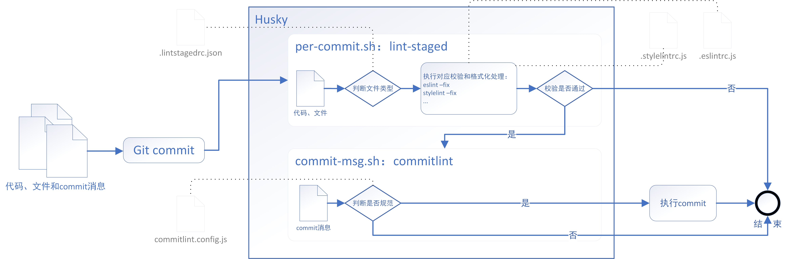

[项目前端工程化配置](#top)

- [TypeScript项目前端工程化配置](#typescript项目前端工程化配置)
  - [初始化](#初始化)
  - [安装 TypeScript 的依赖](#安装-typescript-的依赖)
  - [Eslint \& Prettier](#eslint--prettier)
- [Husky](#husky)
- [Commitlint](#commitlint)
- [Jest](#jest)
- [Github Actions](#github-actions)

--------------------------------------------------------------------------------------

## TypeScript项目前端工程化配置

### 初始化

1. `npm init -y`
2. 创建src文件夹
3. 写入index.ts
4. 在package.json需要添加如下配置项

```
   "main": "index.js",
+  "type": "module",
   "scripts": {
     "test": "echo \"Error: no test specified\" && exit 1"
   },
+  "publishConfig": {
+    "access": "public"
+  }
```

- 从Node v12.0.0开始，只要设置了 `"type": "module"`, Node 会将整个项目视为ESM规范，就可以直接写裸写import/export。
- `publishConfig` 表示当前项目发布到NPM的访问级别，它有 restricted和public两个选项
  - restricted表示我们发布到NPM上的是私有包（收费），访问级别默认为restricted
  - 开源项目标记为public

[⬆ back to top](#top)

### 安装 TypeScript 的依赖

1. `npm i typescript -D`,  `npx tsc --init`
2. 添加修改 tsconfig.json 的配置项，如下
3. 将编译后的文件路径添加到 package.json，并在 scripts 中添加编译命令
   1. `types` 配置项是指定编译生成的类型文件，如果 compilerOptions.declarationDir 指定的是dist，也就是源码和 .d.ts 同级，那么types可以省略

```
//tsconfig.json
{
  "compilerOptions": {
    /* Basic Options */
    "baseUrl": ".",       // 模块解析根路径，默认为 tsconfig.json 位于的目录
    "rootDir": "src",     // 编译解析根路径，默认为 tsconfig.json 位于的目录
    "target": "ESNEXT",   // 指定输出 ECMAScript 版本，默认为 es5
    "module": "ESNext",   // 指定输出模块规范，默认为 Commonjs
    "lib": ["ESNext", "DOM"], // 编译需要包含的 API，默认为 target 的默认值
    //"lib": ["ESNext", "DOM", "WebWorker"],       // 如果项目涉及到WebWorker API
    "outDir": "dist",     // 编译输出文件夹路径，默认为源文件同级目录
    "sourceMap": true,    // 启用 sourceMap，默认为 false
    "declaration": true,  // 生成 .d.ts 类型文件，默认为 false
    "declarationDir": "dist/types", // .d.ts 类型文件的输出目录，默认为 outDir 目录
    /* Strict Type-Checking Options */
    "strict": true,          // 启用所有严格的类型检查选项，默认为 true
    "esModuleInterop": true, // 通过为导入内容创建命名空间，实现 CommonJS 和 ES 模块之间的互操作性，默认为 true
    "skipLibCheck": true,    // 跳过导入第三方 lib 声明文件的类型检查，默认为 true
    "forceConsistentCasingInFileNames": true, // 强制在文件名中使用一致的大小写，默认为 true
    "moduleResolution": "Node",              // 指定使用哪种模块解析策略，默认为 Classic
  },
  "include": ["src"]                        // 指定需要编译文件，默认当前目录下除了 exclude 之外的所有.ts, .d.ts,.tsx 文件
} 
//package.json
-  "main": "index.js",
+  "main": "dist/index.js",
+  "types": "dist/types/index.d.ts"
   "type": "module",
-   "scripts": {
-     "test": "echo \"Error: no test specified\" && exit 1"
-   },
+   "scripts": {
+     "dev": "tsc --watch",
+     "build": "npm run clean && tsc",
+     "clean": "rm -rf dist"
+  },
   "publishConfig": {
     "access": "public"
   }
```

[⬆ back to top](#top)

4. 验证配置是否生效，在 index.ts 写入

```typescript
const calc = (a: number, b: number) => {
  return a - b
}
console.log(calc(1024, 28))
```

5. 在控制台中执行 `npm run build && node dist/index.js`, 会在 dist 目录中生成 types/index.d.ts、index.js、index.js.map，并打印 996

[⬆ back to top](#top)

### Eslint & Prettier

-  Eslint: JavaScript代码质量检查工具，开发团队可以确保项目中的 JavaScript 代码符合一致的标准和最佳实践, 它有助于提高代码的可维护性、一致性和可读性。从而提高开发效率和代码质量
-  Prettier: 一个代码格式化工具，用于自动化地格式化代码，使其符合一致的编码风格和规范。它支持多种编程语言，包括 JavaScript、TypeScript、HTML、CSS、JSON、Markdown 等，旨在减轻开发人员在代码风格上的决策负担，从而提高代码的可读性和一致性

1. 首先安装 eslint，然后利用 eslint 的命令行工具生成基本配置
   1. `npm i eslint -D`
   2. `npx eslint --init`
      1. 生成的配置文件名称是.eslintrc.cjs而不是.eslintrc.js？因为将项目定义为ESM，`eslit --init`会自动识别type，并生成兼容的配置文件名称，如果改回.js结尾，再运行eslint将会报错。 出现这个问题是eslint内部使用了`require()`语法读取配置。同样，这个问题也适用于其他功能的配置，比如后面Prettier、Commitlint等，配置文件都不能以xx.js结尾，而要改为当前库支持的其他配置文件格式，如：`.xxrc`、`.xxrc.json`、`.xxrc.yml`
   3. 验证配置是否生效，修改index.ts
   4. 在package.json中添加lint命令
   5. 因为是 Typescript 项目所以还要添加Standard规范提供的 TypeScrip 扩展配置(其他规范同理)
      1. `npm i eslint-config-standard-with-typescript -D`
   6. 添加修改 `.eslintrc.cjs`

```typescript
 //生成的.eslintrc.cjs文件
 module.exports = {
  env: {
    browser: true,
    es2021: true,
    node: true
  },
  extends: [
    'standard'
  ],
  parser: '@typescript-eslint/parser',
  parserOptions: {
    ecmaVersion: 12,
    sourceType: 'module'
  },
  plugins: [
    '@typescript-eslint'
  ],
  rules: {
  }
}
//index.ts
   const calc = (a: number, b: number) => {
    return a - b
  }
- console.log(calc(1024, 28))
+ // console.log(calc(1024, 28))
// package.json
  "scripts": {
    "dev": "tsc --watch",
    "build": "npm run clean && tsc",
+   "lint": "eslint src --ext .js,.ts --cache --fix",
    "clean": "rm -rf dist"
  },
// 添加修改 .eslintrc.cjs
module.exports = {
-     extends: ['standard']
+     extends: ['standard', 'eslint-config-standard-with-typescript'],
      parser: '@typescript-eslint/parser',
      parserOptions: {
        ecmaVersion: 12,
        sourceType: 'module',
+       project: './tsconfig.json'
      },
}
```

[⬆ back to top](#top)

2. 把 prettier 集成到 eslint 的校验中
   1. 安装 prettier 并初始化配置文件, `npm i prettier -D`,  `echo {}> .prettierrc.json`
   2. 在.prettierrc.json添加配置，这里只需要添加和所选规范冲突的部分

```
{
  "semi": false,           // 是否使用分号
  "singleQuote": true,     // 使用单引号代替双引号
  "trailingComma": "none"  // 多行时尽可能使用逗号结尾
}
```

3. 安装解决冲突, 需要用到的两个依赖, `npm i eslint-config-prettier eslint-plugin-prettier -D`
   1. `eslint-config-prettier` 关闭可能与 prettier 冲突的规则
   2. `eslint-plugin-prettier` 使用 prettier 代替 eslint 格式化
4. 再添加修改 .eslintrc.cjs
5. 验证配置是否生效，修改index.ts, 在控制台执行`lint`,这里prettier和eslint的行为已保持一致，如果没有报错，那就成功了

```typescript
// .eslintrc.cjs
  module.exports = {
- extends: ['standard', 'eslint-config-standard-with-typescript'],
+ extends: ['standard', 'eslint-config-standard-with-typescript', 'prettier'],
  parser: '@typescript-eslint/parser',
  parserOptions: {
    ecmaVersion: 12,
    sourceType: 'module',
    project: './tsconfig.json',
  },
- plugins: ['@typescript-eslint'],
+ plugins: ['@typescript-eslint', 'prettier'],
- rules: {},
+ rules: {
+   'prettier/prettier': 'error'
+ },
}
// index.ts
-  const calc = (a: number, b: number) => {
+  const calc = (a: number, b: number): number => {
    return a - b
  }
- // console.log(calc(1024, 28))
+ console.log(calc(1024, 28))
```

[⬆ back to top](#top)

## Husky

- Husky主要用于在 Git 提交钩子（Git Hooks）中运行脚本。Git 提交钩子是在 Git 版本控制系统的特定事件发生时执行的自定义脚本，例如在代码提交前执行一些检查或验证(不能保证每个人在提交代码之前执行一遍lint校验，所以需要git hooks 来自动化校验的过程，否则禁止提交)
- 
- Husky 的主要用途是帮助开发团队在代码提交前执行一些预定义的操作，以确保代码的质量和一致性。常见的用例包括：
  - 代码风格检查： 在提交代码之前运行 ESLint、Prettier 或其他代码风格检查工具，以确保代码遵循一致的编码风格
  - 单元测试： 在提交前运行单元测试，以确保代码没有破坏现有功能
  - 提交消息验证： 检查提交消息是否符合规范，以便生成清晰的提交日志
1. 安装Husky并生成.husky文件夹, `npm i husky -D`, `npx husky install` 
2. 需要在每次执行npm install时自动启用husky, 

[⬆ back to top](#top)

## Commitlint

- 用于检查 Git 提交消息是否符合指定的规范的命令行工具。它通常与 Husky 和 Commitizen 等工具一起使用，以确保团队在提交代码时遵循一致的提交消息规范
1. 安装 Commitlint: `npm i @commitlint/config-conventional @commitlint/cli -D`
2. 将Commitlint添加到钩子: `npx husky add .husky/commit-msg 'npx --no-install commitlint --edit "$1"'`
3. 创建'.commitlintrc'，并写入配置
   - 注意，这里配置文件名使用的是.commitlintrc而不是默认的.commitlintrc.js
4. 测试钩子是否生效，修改index.ts，让代码正确
   - 此时，提交一条不符合规范的commit，提交将会失败， 如： 
     - `git add .`
     - `git commit -m 'add eslint and commitlint'`
   - 修改为正确的commit，提交成功！: ` git commit -m 'ci: add eslint and commitlint'`

```typescript
// 3. 创建'.commitlintrc'，并写入配置
{
  "extends": [
    "@commitlint/config-conventional"
  ]
}
// 4. 测试钩子是否生效，修改index.ts，让代码正确
  const calc = (a: number, b: number): void => {
    console.log(a - b)
  }
- // calc(1024, 28)
+ calc(1024, 28)
```

[⬆ back to top](#top)

## Jest

1. 安装jest，和类型声明@types/jest，它执行需要ts-node和ts-jest： `npm i jest @types/jest ts-node@9.1.1 ts-jest -D`
   - 这里暂时固定了ts-node的版本为 v9.1.1，新版的ts-node@v10.0.0会导致jest报错，等待官方修复，详见：[issues](https://link.juejin.cn/?target=https%3A%2F%2Fgithub.com%2Ffacebook%2Fjest%2Fissues%2F11453)
2. 初始化配置文件： `npx jest --init`
3. 修改jest.config.ts文件
4. 将测试命令添加到package.json中
5. 创建测试文件夹__tests__和测试文件__tests__/calc.spec.ts
6. 修改index.ts
7. 在calc.spec.ts中写入测试代码
8. 验证配置是否生效:  在控制台执行test，`npm run test`, 将会看到测试覆盖率 100% 的结果
9. 最后给__tests__目录也加上lint校验, 修改package.json
   - 这里如果直接执行npm run lint将会报错，提示__tests__文件夹没有包含在tsconfig.json的include中，当添加到include之后，输出的dist中就会包含测试相关的文件, 使用typescript-eslint官方给出的解决方案
10. 新建一个tsconfig.eslint.json文件，写入以下内容：
11. 在.eslintrc.cjs中修改
12. 然后验证配置是否生效，直接提交我们添加的测试文件,能正确提交说明配置成功:  
    - `git add .`
    - `git commit -m 'test: add unit test'`

```typescript
//3. 修改jest.config.ts文件
   // A preset that is used as a base for Jest's configuration
-  // preset: undefined,
+  preset: 'ts-jest'
// 4. 将测试命令添加到package.json中
  "scripts": {
    "dev": "tsc --watch",
    "build": "npm run clean && tsc",
    "lint": "eslint src --ext .js,.ts --cache --fix",
    "clean": "rm -rf dist",
    "prepare": "husky install",
+   "test": "jest"
  },
// 6. 修改index.ts
  const calc = (a: number, b: number): number => {
    return a - b
  }
- // console.log(calc(1024, 28))
+ export default calc
// 7. 在calc.spec.ts中写入测试代码
import calc from '../src'
test('The calculation result should be 996.', () => {
  expect(calc(1024, 28)).toBe(996)
})
// 9. 最后给__tests__目录也加上lint校验, 修改package.json
  "scripts": {
    "dev": "tsc --watch",
    "build": "npm run clean && tsc",
-   "lint": "eslint src --ext .js,.ts --cache --fix",
+   "lint": "eslint src __tests__ --ext .js,.ts --cache --fix",
    "clean": "rm -rf dist",
    "prepare": "husky install",
    "test": "jest"
  },
// 新建一个tsconfig.eslint.json文件，写入以下内容：
{
  "extends": "./tsconfig.json",
  "include": ["**/*.ts", "**/*.js"]
}
//在.eslintrc.cjs中修改
  parserOptions: {
    ecmaVersion: 12,
    sourceType: 'module',
-   project: './tsconfig.json'
+   project: './tsconfig.eslint.json'
  },
```

[⬆ back to top](#top)

## Github Actions

[⬆ back to top](#top)

- [超全面的前端工程化配置指南](https://youmoxiang.blog.csdn.net/article/details/129518510)
- https://www.typescriptlang.org/tsconfig
- https://prettier.io/docs/en/
- [前端工程化 - Husky的使用](https://blog.csdn.net/LETEfly/article/details/132908523)
