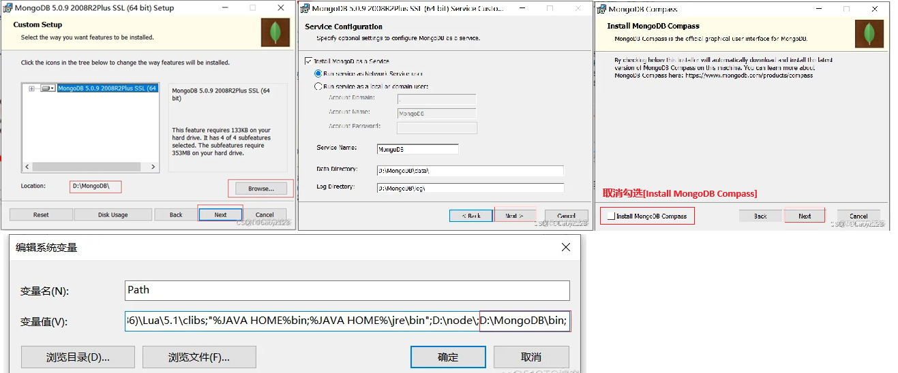

[MongoDB的使用](#top)

- [MongoDB安装](#mongodb安装)
- [配置MongoDB服务为本地服务](#配置mongodb服务为本地服务)
- [MongoDB常用的命令](#mongodb常用的命令)
- [MongoDB数据库可视(图形)化管理工具](#mongodb数据库可视图形化管理工具)
- [MongoDB数据的操作 - 查询](#mongodb数据的操作---查询)
  - [指定查询返回的字段](#指定查询返回的字段)
  - [模糊条件查询](#模糊条件查询)
  - [条件查询对照：（MongoDB 与 传统数据库 比对）](#条件查询对照mongodb-与-传统数据库-比对)
  - [逻辑查询](#逻辑查询)
  - [聚合查询](#聚合查询)
  - [explain查询](#explain查询)
- [MongoDB数据的操作 - update](#mongodb数据的操作---update)
  - [整体更新](#整体更新)
  - [局部更新](#局部更新)
  - [upsert](#upsert)
  - [批量更新](#批量更新)
- [type操作符](#type操作符)

------------------------------------------

## MongoDB安装

- 
- 测试MongoDB是否安装成功
  - `cd C:\MongoDB\bin`
  - `mongod --dbpath C:\MongoDB\data\db`
  - 打开浏览器输入`http://localhost:27017/`查看返回信息
- 
- 

## 配置MongoDB服务为本地服务

- `mongod --dbpath=C:\mongodb\data\db --logpath=C:\mongodb\log\MongoDB.log --install --serviceName "MongoDB"`
- `services.msc` -> 查看 MongoDB Server (MongoDB) 服务啦

## MongoDB常用的命令

- 前提是用[cmd管理员]模式运行
- `mongod -version`
- `net start MongoDB`
- `net stop MongoDB`
- `sc delete MongoDB`
- MongoDB数据库的相关配置信息，是存储在mongodb安装目录bin目录中的`mongod.cfg`文件中

```js
dbpath=D:\Mongo\data              //数据库路径
logpath=D:\Mongo\logs\mongo.log   //日志输出文件路径
logappend=true                    //错误日志采用追加模式
journal=true                      //启用日志文件，默认启用
quiet=true                        //这个选项可以过滤掉一些无用的日志信息，若需要调试使用请设置为false
port=27017
```

命令|功能
---|---
`db.help()`|显示数据库操作命令，里面有很多的命令
**数据库**  |  ---
`use <db name>`|如果数据库不存在，则创建数据库，否则切换到指定数据库
`db.dropDatabase()`|切换到数据库后, 执行删除命令
**显示**  |  ---
`show users`|显示用户
`show dbs`|显示数据库列表
`show collections`|显示当前数据库中的集合（类似关系数据库中的表）
**collection集合**  |
`db.createCollection('collection');`|
`db.collection.insert({title: 'MongoDB 教程'})`|单条插入, 批量插入可以自己写for循环，里面就是insert
`db.collection.update({name:""},{name:"description"});`| 第一个参数为“查找的条件”，第二个参数为“更新的值”
`db.collection.save(document)`|
`db.collection.remove({})`, `db.collection.deleteMany({})`|移除集合中的所有数据,类似常规 SQL 的 truncate 命令
`db.collection.remove({name: "jack"});`, `db.collection.deleteMany({ status : "A" })`|移除集合中的所有找到的记录
`db.collection.remove({name: "jack"}, 1);`,`db.collection.deleteOne( { status: "D" } )`|移除集合中的第一条找到的记录
`db.collection.count()`|
`db.collection.drop()` | 删除整个集合
`db.collection.help()`|显示集合操作命令，同样有很多的命令，foo指的是当前数据库下，一个叫foo的集合，并非真正意义上的命令
`db.collection.find();`|查找所有, 对于当前数据库中的foo集合进行数据查找（由于没有条件，会列出所有数据）
`db.collection.find().pretty()`|同上，但格式化显示
`db.collection.find({ a : 1 })`|对于当前数据库中的foo集合进行查找，条件是数据中有一个属性叫a，且a的值为1

[⬆ back to top](#top)

## MongoDB数据库可视(图形)化管理工具

- 下载地址：https://www.mongodb.com/try/download/compass

## MongoDB数据的操作 - 查询

### <mark>指定查询返回的字段</mark>

```js
db.student.find({sex: "女"}, {_id: 0, name: 1, age: 1})
// 相当于：select name, age from student where sex = '女';
或者：1 === true， 0 === false
db.student.find({sex: "女"}, {_id: false, name: true, age: true})
```

- <mark>子文档查询</mark>

```js
// 子文档查询
db.student.find({"score.shuxue": 60 });
db.student.find({"score": {"shuxue": 60 }});
// 多个子文档查询 $elemMatch 表示必须是同一个子对象满足多个条件
db.student.find({"score": {$elemMatch: {"yuwen": 80, "shuxue": 60, "yinyu": 70 });
```

### <mark>模糊条件查询</mark>

|查询||相当于|
|---|---|:---|
|大于查询|`db.student.find({"score": {$gt: 60}}).pretty()`|`select * from student where score > 60;`|
|小于查询|`db.student.find({"score": {$lt: 60}})`|`select * from student where score < 60;`|
|大于等于查询|`db.student.find({"score": {$gte: 80}})`|`select * from student where score >= 80;`|
|小于等于查询|`db.student.find({"score": {$lte: 80}})`|`select * from student where score <= 80;`|
|正则表达式查询<br>查找名字中以 “沐” 开头的记录|`db.student.find({"name": /^沐/g})`|`select * from student where name like '沐%';`|
|正则表达式查询<br>查找名字中包含 “沐” 的记录|`db.student.find({"name": /沐/g})`|`select * from student where name like '%沐%';`|

### <mark>条件查询对照</mark>：（MongoDB 与 传统数据库 比对）

|SQL（MySql、SqlServer) |   MQL（MongoDB）||
|---|---|:---|
|`a = 1` |`{a : 1}`||
|`a <> 1`|`{a : { $ne : 1 }}`|不等于`$ne`不存在 或 存在 但 不等于|
|`a > 1`|`{a : { $gt : 1 }}`|大于 `$gt` 存在 并 大于|
|`a >= 1`|`{a : { $gte : 1 }}`|大于等于 `$gte` 存在 并 大于等于|
|`a < 1`|`{a : { $lt : 1 }}`|小于 `$lt`存在 并 小于|
|`a <= 1`|`{a : { $lte : 1 } }`|小于等于 `$lte` 存在 并 小于等于|

### <mark>逻辑查询</mark>

|SQL（MySql、SqlServer) |   MQL（MongoDB）|
|---|---|
|`a = 1 AND b = 1` |`{ a : 1，b : 1 }` 或 `{ $and : [ { a : 1 }, { b ：1 } ] }`|
|`a =1 OR b = 1`|`{ $or : [ { a : 1 } , { b : 1 } ] }`|
|`a IS NULL`|`{ a : { $exists : false } }`|
|`a IN (1，2，3)`|`{ a : { $in: [1, 2, 3] } }`|

|||
|---|---|
|查询 age >= 18 并且 age <= 26|`db.student.find({age: {$gte: 18, $lte: 26}});`|
|另一种$and形式|`db.student.find({$and:[{"score":60 , "age":12}, {"score":80 , "age":15}]})`<br>`db.student.find({$or: [{"age": 18}, {"age": 25}]})`<br>相当于：`select * from student where age = 18 or age = 25;`|
|||
|AND 和 OR 联合使用|`db.user.find({"likes": {$gt:50}, $or: [{"by": "菜鸟"},{"title": "MongoDB"}]}).pretty()`|

### <mark>聚合查询</mark>

- MongoDB聚合框架(Aggregation Framework)是一个计算框架，它可以：
  1. 可作用在一个或 几个集合上
  2. 对集合中的数据进行一系列的运算
  3. 可将数据转化为所期望数据形式，如（数学计算，统计，类型，格式处理等）
- 对效果而言，聚合查询相录于传统SQL查询中的，`ORDER BY`，`GROUP BY`，`LIMIT`，`LEFT OUTER JOIN`，`AS`等
- **note**:
  - 同时使用sort,skip,limit，无论位置先后，最先执行顺序 <mark>sort -> skip -> limit</mark>
  - skip和limit方法只适合小数据量分页，如果是百万级效率就会非常低，因为skip方法是一条条数据数过去的，建议使用where

|步骤 |作用 |SQL等价运算符|
|---|---|:---|
|`$match` |过滤 |WhERE|
|`$project` |投影 |AS|
|`$sort` |排序 |ORDER BY|
|`$group` |分组 |GROUP BY|
|`$skip` |结果限制 |SKIP|
|`$limit` |结果限制 |LIMIT|
|`$lookup` |左外连接(多表操作) |LEFT OUTER JOIN|
|`$graphLookup` |图搜索 |N/A|
|`$facet` |分面搜索 |N/A|
|`$bucket` |分面搜索 |N/A|
|`$unwind` |展开数组 |N/A|

```js
/* 1.升降排序查找：（1 升序， -1 降序）*/
db.student.find().sort({"age": 1});   // 升序
db.student.find().sort({"age": -1});  // 降序
/* 2.复制 */
db.student.find().limit(10);  // 相当于：selecttop 10 * from student;
/* 3.查询第 10 条以后的数据 */
db.student.find().skip(10);
db.student.find({"title":"MongoDB"}).limit(2)  // 只显示两条
// 相当于：select * from student where id not in (selecttop 10 * from student);
/**
* 4.查询 10 到 20 之间的数据（这就是项目中常见的列表分页查询
* 列表分页
* limit：就是 pageSize
* skip ：就是第几页 * pageSize
*/
db.student.find().limit(20).skip(10);  // 10 到 20 之间的数据
/* 5.查询某个结果集的记录条数（统计数量） */
db.student.find({age: {$gte: 18}}).count();
// 相当于：select count(*) from student where age >= 18;
// 如果要返回限制之后的记录数量，要使用 count(true)或者 count(非 0)
db.student.find().limit(20).skip(10).count(true);
/* 6.展开数据查询：查询某个学生各个学科的成绩 */
db.student.aggregate([{$unwind: '$score'}])
/* 7.查询结果限制： 例如：查询学生集合(表)中的所有女生的姓名和年龄！ */
db.student.aggregate([
    {$match: "sex": "女"},    // 只取性别为女性的
    {$skip: 100},    // 跳过100条
    {$limit: 30},    // 只取30条
    {$project: {    // 只返回姓名 和 年龄这两个字段
        '姓名': 'name',
        '年龄': 'age'
    }}
])
```

### <mark>explain查询</mark>

- 对游标调用 该方法，就可以得到查询细节
- explain 会返回一个文档，而不是游标本身

```js
// 查询时加上explain() 方法会返回查询使用的索引情况，耗时和扫描文档数的统计信息
db.student.find({name:"沐枫"}).explain()
// 在explain() 方法中加上"executionStats"参数 可看查 查询具体的执行时间
db.student.find({name:"沐枫"}).explain("executionStats")
```

[⬆ back to top](#top)

## MongoDB数据的操作 - update

```js
db.collection.update(
   <query>,
   <update>,
   {
     upsert: <boolean>,
     multi: <boolean>,
     writeConcern: <document>
   }
)
```

- query : update的查询条件，类似sql update查询内where后面的。
- update : update的对象和一些更新的操作符（如$,$inc...）等，也可以理解为sql update查询内set后面的
- upsert : 可选，这个参数的意思是，如果不存在update的记录，是否插入objNew,true为插入，默认是false，不插入。
- multi : 可选，mongodb 默认是false,只更新找到的第一条记录，如果这个参数为true,就把按条件查出来多条记录全部更新。
- writeConcern :可选，抛出异常的级别

### 整体更新

- `db.user.update({"age":33})`

### 局部更新

- `$inc` 和 `$set`(如果“文档”中没有此key，则会创建key)
- `db.user.update({"name": "jack"}, {$inc:{"age", 30}})   #increase 30`
- `db.user.update({"name": "jack"}, {$set:{"age", 10}})`

### upsert

- mongodb创造出来的“词”，这个upsert操作就是说：如果没有查到，就在数据库里面新增一条，其实这样就是避免了在数据库里面判断是update还是add操作，使用起来很简单, 将update的第三个参数设为true即可
- `MongoDB Enterprise > db.user.update({"name": "jacddak"}, {$inc:{"age", 10}}, true)`

### 批量更新

- 在update的第四个参数中设为true即可
- `db.user.update({"name": "jacddak"}, {$inc:{"age", 10}}, true, true)`

[⬆ back to top](#top)

## type操作符

- db.user.find({"title" : {$type : 2}})

类型|数字
---|---
Double|1
String|	2
Object|	3
Array|	4
Binary data|	5
Undefined|	6, 已废弃。
Object id|	7
Boolean|	8
Date|	9
Null|	10
Regular Expression|	11
JavaScript|	13
Symbol|	14
JavaScript (with scope)|	15
32-bit integer|	16
Timestamp|	17	 |
64-bit integer|	18
Min key	|255,	Query with -1.
Max key	|127

[⬆ back to top](#top)

> reference: https://cloud.tencent.com/developer/article/2056528
