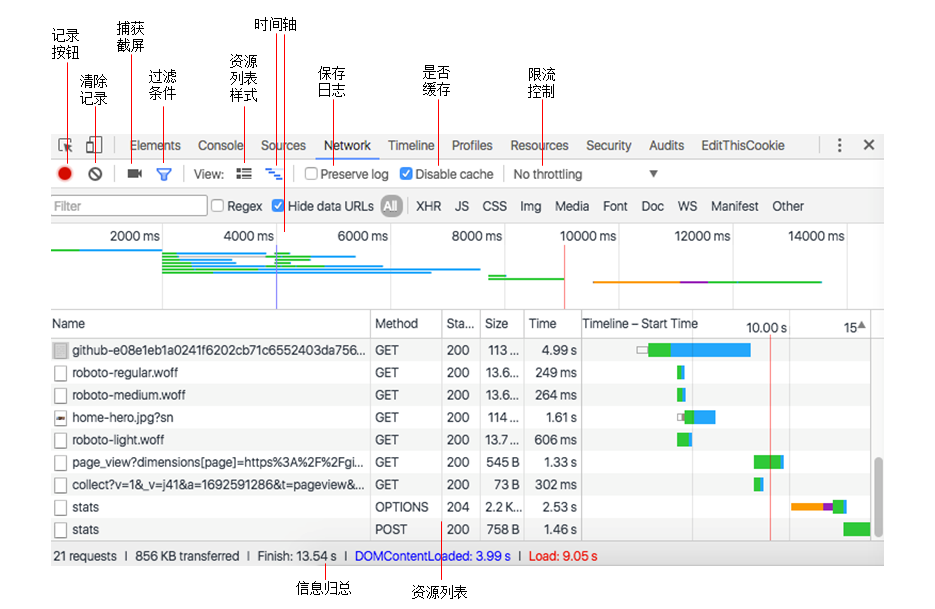
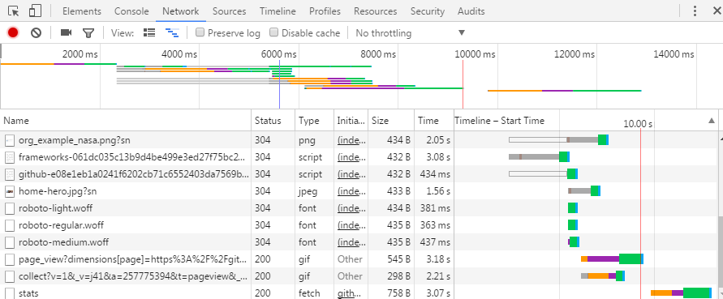
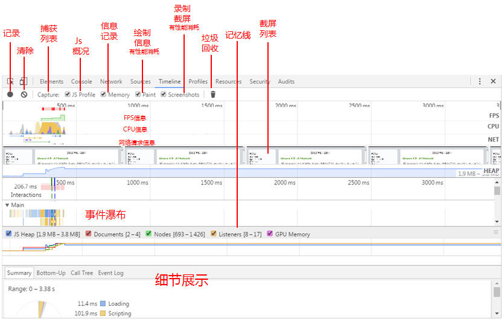

[Chrome DevTools features](#top)

- [常用快捷键](#常用快捷键)
- [1. 在控制台(Console)中获取DOM元素- $0 in console(command line API)](#1-在控制台console中获取dom元素--0-in-consolecommand-line-api)
- [2. Selector selecting](#2-selector-selecting)
- [3. Edit any text on the page](#3-edit-any-text-on-the-page)
- [4. Filmstrip mode on the Network tab - capture screenshots during a page load](#4-filmstrip-mode-on-the-network-tab---capture-screenshots-during-a-page-load)
- [5. Snippet code](#5-snippet-code)
- [6. 6. 利用Chrome的工作空间，编辑本地文件-在console保存文件，设置断点](#6-6-利用chrome的工作空间编辑本地文件-在console保存文件设置断点)
- [7. Search, Find and Edit with Chrome DevTools](#7-search-find-and-edit-with-chrome-devtools)
- [8. 截图: 节点截图/截全屏](#8-截图-节点截图截全屏)
- [9. 其他](#9-其他)
- [获取资源加载列表方法window.performance.getEntries()](#获取资源加载列表方法windowperformancegetentries)
- [Network面板](#network面板)
  - [过滤条件](#过滤条件)
  - [时间轴](#时间轴)
- [Performance面板](#performance面板)
  
----------------------------------------------

## 常用快捷键

快捷键|功能|面板
---|---|---
ctrl+shift+p|command menu|Developer tools
Ctrl+P/ctrl+O|快速查找文件|Developer tools
Ctrl+Shift+O(或Ctrl+P -> 键入@)|查找函数定义<br>|Source panel
Ctrl+Shift+F|全局查找： 在源代码中搜索(该搜索也支持正则表达式)，在通过js钩子查找代码位置时很有用|Developer tools
---|---|---
Ctrl+G -> :num|跳到指定行|Sources编辑框**Example**:
Ctrl+D|**多列内容选择&匹配相同选项**<br>多列内容选择：按住Alt键，当鼠标箭头变为“+”号后，点击鼠标<br>匹配相同选项：选中需要匹配的元素，快捷键Ctrl+D（Cmd + D for mac）|Sources编辑框
Shift+鼠标点击|在颜色预览中，可在rgba,hsl和hexadecimal三种格式中，来回切换|样式区
在Sources编辑框中,CTRL+鼠标点击|多行插入符编辑内容|Sources编辑框
在Sources编辑框中,按下Ctrl+U|撤销编辑，快速输入，快速删除|Sources编辑框
Ctrl+F, 在filter中输入GC|在Timeline的Summary中，查看Garbage collection|Developer tools

## 1. 在控制台(Console)中获取DOM元素- $0 in console(command line API)

gives you a reference to the currently selected DOM node in the Elements panel - DOM-style representation of the object

- `$r` is a reference to the react component
- `$(selector)` : returns the reference to the first DOM element with the specified CSS selector
- `$$(selector)` : returns an array of elements that match the given CSS selector. This command is equivalent to calling `document.querySelectorAll()`，获取并返回一个数组。
- `$0, $1, $2, $3, $4` — 代表你在Chrome调试器中操作不同DOM元素的历史记录，且最多记录5次，故而只有$0-$4这五个变量。$0代表最近一次，依次类推(先进先出); 即Elements 面板中最近选中的5个元素, 最后选择的是$0
- https://developers.google.com/web/tools/chrome-devtools/console/command-line-reference

[back to top](#top)

## 2. Selector selecting

- `.section-inner p:nth-of-type(2)`

## 3. Edit any text on the page

- type `document.designMode = "on"` in console to turn on design mode, then click and type any text on the page

## 4. Filmstrip mode on the Network tab - capture screenshots during a page load

- Click on the camera icon to enable the Filmstrip
- Reload the page to capture the screenshots. The screenshots are displayed above the Overview

## 5. Snippet code

- [Run snippets of code from any page
](https://developers.google.com/web/tools/chrome-devtools/debug/snippets/?hl=en) - `Source -> Snippets`
- the snippet code will behave the same as your application code with regards to DOM access, relative URLs, cookies, and CORSs stuff

[back to top](#top)

## 6. 6. 利用Chrome的工作空间，编辑本地文件-在console保存文件，设置断点

Chrome的工作空间，也是非常强大的，它可以直接编辑和保存你的本地文件，无需额外的操作，例如复制、粘贴。怎么配置它呢？

- F12打开Chrome调试器
- 找到Sources栏，出现在左侧的控制面板，点击鼠标右键，选择Add Folder To Workspace。或者，直接将你整个工程文件夹，拖拽到调试器中。
  - 这样操作后，不管你打开哪个页面，都会出现刚才你操作的文件。为了更加有用，你可以将页面中用到的文件映射到相应的文件夹，允许在线编辑和简单的保存
- 将console中执行的代码保存为文件，这样就可以设置点： 在console中输入代码的最后一行加上 `//@ sourceURL=filename.js`, 会在 Scripts 面板中有个叫 filename.js的文件, 然后就和外部js文件一样了，又可以断点调试了（可以再调试面板中CTRL+O，输入文件名即可）

[back to top](#top)

## 7. Search, Find and Edit with Chrome DevTools

Search, Find and Edit|From Panel|keyboard shortcut
---|---|---
Searching within all sources|any panel| win: Ctrl+Shift+f, mac: Cmd+Opt+f
Searching a source|source panel|win: Ctrl+f, mac: Cmd+f
Searching source file names and paths|source panel|win: Ctrl+p, mac: Cmd+p, 
Searching console input/output|console panel|win: Ctrl+f, mac: Cmd+f
Searching file names and URL search values|network panel|win: Ctrl+f, mac: Cmd+f
Searching a .css file for specific selector|source panel|Shift+Ctrl+o, mac: Shift+Cmd+o
Searching a .js file for specific function|source panel|Shift+Ctrl+o, mac: Shift+Cmd+o
Finding a DOM node using a selector - 1|elements panel|win: Ctrl+f, mac: Cmd+f -> Enter a CSS selector, such as `.km.content`
Finding a DOM node using a selector - 2|console panel| Enter:[`$$('selector')`](https://developers.google.com/web/tools/chrome-devtools/console/command-line-reference#selector)

http://developer.telerik.com/featured/16-ways-to-search-find-and-edit-with-chrome-devtools/

[back to top](#top)

## 8. 截图: 节点截图/截全屏

**8.1 节点截屏**

- 在element panel选中任意元素节点
- 使用快捷键 Ctrl+Shift+p (Windows) 或 Cmd + Shift + p (Mac), 点击Capture node screenshot, 图片会自动下载


**8.2 截全屏**

- 方法1： 使用快捷键 Ctrl+Shift+p (Windows) 或 Cmd + Shift + p (Mac), 点击Capture full size screenshot, 图片会自动下载
- 方法2：


[back to top](#top)

## 9. 其他

new console
- quick source

Lighthouse is integrated directly into the Chrome Developer Tools, under the "Audits" panel.
https://github.com/GoogleChrome/lighthouse

[back to top](#top)

## 获取资源加载列表方法window.performance.getEntries()

- connectEnd：浏览器与服务器完成建立用以检索资源的网络连接的时间戳
- connectStart：浏览器与服务器开始建立用以检索资源的网络连接的时间戳
- damainLookupEnd：浏览器完成资源的域名解析的时间戳
- damainLookupStart：浏览器开始进行资源的域名解析的时间戳
- duration：资源请求从开始到结束的时间差
- entryType：PerformanceEntry对象的类型，该对象封装一个单一的性能指标作为性能表的一部分，此类型值
  - 是"frame","mark","measure","navigation","resource","server"的其中一个。
- fetchStart：浏览器开始获取资源的时间戳
- initiatorType：资源文件的类型
- name：资源的url
- redirectEnd：接收到重定向资源的最后一个响应字节的时间戳
- redirectStart：启动重定向以获取资源的开始时间戳
- requestStart：浏览器从服务器请求资源的开始时间戳
- responseEnd：浏览器接收到资源最后一个字节的时间戳，或者关闭传输连接的时间戳
- responseStart：浏览器接收到服务器的响应的第一个字节的时间戳
- secureConnectionStart：浏览器开始握手协议，以保护当前连接的安全性，握手开始的时间
- startTime：浏览器开始获取资源前的时间戳(整个过程的开始时间)
- workerStart：如果当前上下文是"worker"，返回开始获取资源的时间戳，否则返回0(应该是应用于双工通信的)

[back to top](#top)

## Network面板



### 过滤条件

- domain：资源所在的域，即url中的域名部分。如 domain:api.github.com
- has-response-header：资源是否存在响应头，无论其值是什么。如 has-response-header：Access-Control-Allow-Origin
- is：当前时间点在执行的请求。当前可用值：running
- larger-than：显示大于指定值大小规格的资源。单位是字节(B),但是K(kB)和M(MB)也是可以的~ 如larger-than:150K
- method：使用何种HTTP请求方式。如 GET
- mime-type：也写作content-type，是资源类型的标识符。如 text/html
- scheme：协议规定。如 HTTPS
- set-cookie-name：服务器设置的cookies名称
- set-cookie-value：服务器设置的cookies的值
- set-cookie-domain：服务器设置的cookies的域
- status-code：HTTP响应头的状态码

### 时间轴

- 
- 蓝色线代表DOM已加载完成，橙色线表示页面加载完(包括资源引用), 也可以用代码对这两个事件进行监听，在这两个事件完成的时间点做对应的操作

```javascript
  window.addEventListener('DOMContentLoaded',function(e){
      e.cancelBubble = true;
      console.log(window.performance.now());
    },true);
    window.addEventListener('load',function(e){
      e.cancelBubble = true;
      console.log(window.performance.now());
    },true);
```

## Performance面板



[back to top](#top)

> Reference

- https://developers.google.com/web/tools/chrome-devtools/
- [Twelve Fancy Chrome DevTools Tips](https://hackernoon.com/twelve-fancy-chrome-devtools-tips-dc1e39d10d9d)
- [15个关于Chrome的开发必备小技巧[译]](http://www.cnblogs.com/giggle/p/5966991.html)
- [前端调试效率低？试试这10个“Chrome开发者工具”使用技巧](https://www.cnblogs.com/kuangke/p/5460611.html)
