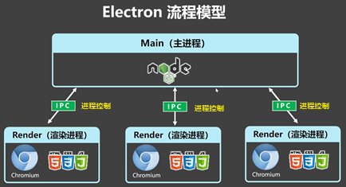
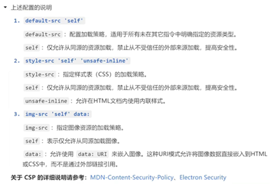
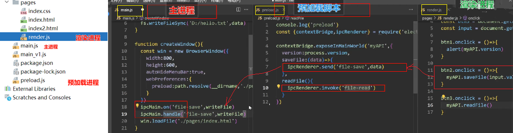
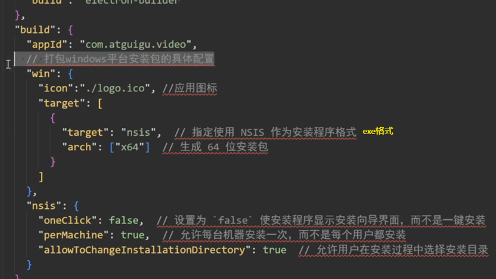
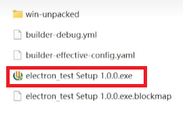

[Electron学习1--初识](#top)
- [Setup](#setup)
- [完善窗口行为(对应官网的管理窗口生命周期)](#完善窗口行为对应官网的管理窗口生命周期)
- [自动重启](#自动重启)
- [preload预加载](#preload预加载)
- [打包工具](#打包工具)

-------------------------------------------------------



## Setup

1. `npm init`
   1. **author和description是必填**
   2. add `"start": "electron .",` to package.json
2. `npm i electron -D`
3. create 'main.js' and 'pages' folder, 'pages/index.css', 'pages/index.html'
4. Others:
   1. `ctrl + shift + i` 弹出调试窗口
   2. [内容安全策略（CSP） - HTTP | MDN](https://developer.mozilla.org/zh-CN/docs/Web/HTTP/CSP)
   3. 

## 完善窗口行为(对应官网的管理窗口生命周期)

- windows所有的窗口都关闭了，应用就自动退出
- mac退出应用需要快捷键command+q,不然是关闭窗口command+w

```js
//main.js
app.whenReady().then(() => {
  createWindow()
  app.on('activate', () => {    // 管理窗口的生命周期   激活窗口
    if (BrowserWindow.getAllWindows().length === 0) createWindow()   //mac
    })
})
function createWindow() {            //创建窗口
  const win = new BrowserWindow({
      width: 800,
      height: 600,
      autoHideMenuBar: true,
  })
  win.loadFile('./pages/index.html')     //窗口引入的内容
}
// 管理窗口的生命周期   退出
app.on('window-all-closed', () => {
  if (process.platform !== 'darwin') app.quit()
})
```

[⬆ back to top](#top)

## 自动重启

- 使用nodemon自动重启
- `npm i nodemon -D`
- modify package.json
  - `"start-cp": "electron .",`
  - `"start": "nodemon --exec electron ."`
- 配置'nodemon.json'规则
  - 在terminal输入`r`也会自动刷新

```js
{
  "ignore": [
    "node_modules",
    "dist"
  ],
  "restartable": "r",
  "watch": ["*.*"],
  "ext": "html,js,css"
}
```

[⬆ back to top](#top)

## preload预加载

- 
- 功能：将主进程的数据传递到渲染进程，引入了渲染进程
  - 预加载是在渲染进程运行，但可以读取部分主进程Node api
- 执行过程： 主进程  -->  预加载进程  -->  渲染进程

```js
//===== 主进程添加代码如下
const path = require("node:path");
function createWindow() {
    const win = new BrowserWindow({
        //...
        webPreferences: {
            preload: path.resolve(__dirname, './preload.js'), // 绝对路径，引入预加载js
        }
    })
    win.loadFile('./pages/index.html')
}
//====== 预加载进程添加代码如下
// 可以使用部分 node api
// 打印目录环境
// console.log(__dirname) // 这个不可用
// 打印版本
console.log(process.versions)       // 这个可以用, node version
const {contextBridge} = require('electron');
// 定义了一个对象myAPI，将其传给渲染进程
contextBridge.exposeInMainWorld("myAPI", {
    version: process.version
})
//====== 渲染进程使用如下
  console.log(myAPI.version);
```

|||
|---|---|
|需要导入的组件|`const {contextBridge, ipcRenderer} = require('electron');`<br>`const {app, BrowserWindow, ipcMain} = require('electron')`|
|单向通信，渲染进程->主进程|渲染进程发送`ipcRenderer.send('file-save', data);`<br>主进程接收`ipcMain.on('file-save', writeFile)`|
|单向通信，主进程->渲染进程|主进程发送`win.webContents.send('信道', 'hello!')`<br>渲染进程接收`ipcRenderer.on('message', callback);`|
|双向通信|主进程`ipcMain.handle('file-read', readFile)`<br>渲染进程`return ipcRenderer.invoke('file-read');// 就是一个信道，消息的订阅发送`|

- `ipcRenderer.invoke`的返回值是Promise

[⬆ back to top](#top)

## 打包工具

- `npm i electron-builder -D`
- modify 'package.json'
- 
- `npm run build`
- 
- [electron builder打包时，出现errorOut=ERROR: Cannot create symbolic link-CSDN博客](https://blog.csdn.net/vifaceeeeee/article/details/134693524)
- [electron-vite](https://cn.electron-vite.org/)

[⬆ back to top](#top)

> references
- 禹神：一小时快速上手Electron，前端Electron开发教程
  - [bilibili](https://www.bilibili.com/video/BV1sE421N7M5/)
  - [学习笔记](https://blog.csdn.net/ganjiee0007/article/details/139971510)
  - [github](https://github.com/sui5yue6/my-electron-app)
- [Electron-cn-official](https://www.electronjs.org/zh/)
- [[electron] vscode添加electron代码补全](https://blog.csdn.net/qq_47500842/article/details/136277345)
