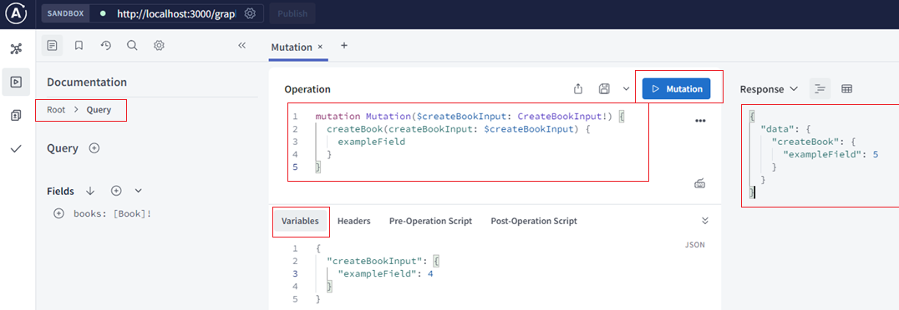

[Vue3+Nest+GraphQL+Prisma 入门全栈开发图书管理系统](#top)

- [Project setup- Server](#project-setup--server)
- [Nest集成GraphQL](#nest集成graphql)
  - [生成TypeScript定义-Generate Typescript](#生成typescript定义-generate-typescript)
  - [验证](#验证)
- [Prisma ORM + MongoDB](#prisma-orm--mongodb)
  - [Prisma setup](#prisma-setup)
  - [Use Prisma Client in your NestJS services](#use-prisma-client-in-your-nestjs-services)
  - [GraphQL类型校验TS模型- prisma-nestjs-graphql](#graphql类型校验ts模型--prisma-nestjs-graphql)
- [Front End- vue](#front-end--vue)
  - [Setup](#setup)
  - [Integration GraphQL to project - Vue Apollo](#integration-graphql-to-project---vue-apollo)
  - [CORS issue](#cors-issue)

-------------------------------------------------------

## Project setup- Server

- `npm i -g @nestjs/cli`
- `nest new project-name`
- 打开浏览器并导航到 `http://localhost:3000/`
- `nest g resource books`

```
├── 📂client/
|     ├── 📂src/
|     │   ├── 📂service/
|     │   │   └── 📄index.ts
|     │   ├── 📄app.vue
|     │   └── 📄main.ts
├── 📂server/
|     ├── 📂prisma/
|     │   ├── 📄prisma.service.ts
|     │   ├── 📄schema.prisma
|     │   └── 📄seed.ts
|     ├── 📂src/
|     │   ├── 📂@generated/
|     │   ├── 📂authors/
|     │   │   ├── 📄authors.module.ts
|     │   │   └── 📄authors.service.ts
|     │   ├── 📂books/
|     │   │   ├── 📂entities/
|     │   │   │       └── book.entity.ts
|     │   │   ├── 📄books-author.resolver.ts
|     │   │   ├── 📄books.graphql
|     │   │   ├── 📄books.module.ts
|     │   │   ├── 📄books.resolver.ts
|     │   │   └── 📄books.service.ts
|     │   ├── app.controller.ts       - A basic controller with a single route 带有单个路由的基本控制器
|     │   ├── app.module.ts           - The root module of the application 应用程序的根模块
|     │   ├── app.service.ts          - A basic service with a single method 带有单个方法的基本服务
|     │   ├── main.ts                 - The entry file of the application which uses the core function NestFactory to create a Nest application instance 应用程序入口文件。它使用 NestFactory 用来创建 Nest 应用实例
```

[⬆ back to top](#top)

## Nest集成GraphQL

- 内置的 `@nestjs/graphql`
- Nest 提供了两种构建 GraphQL 应用程序的方式
  - 模式优先: 使用GraphQL SDL（模式定义语言）
  - 代码优先: 仅使用装饰器和 TypeScript 类来生成相应的 GraphQL schema
1. `npm i @nestjs/graphql @nestjs/apollo graphql apollo-server-express`
2. Apollo playground:
   1. 配置graphql，在'app.module.ts'中加入
   2. `http://localhost:3000/graphql`      --> graphql playground

```ts
import { Module } from '@nestjs/common';
+import { GraphQLModule } from '@nestjs/graphql';
+import { ApolloDriver, ApolloDriverConfig } from '@nestjs/apollo';
@Module({
  imports: [
+    GraphQLModule.forRoot<ApolloDriverConfig>({
+      driver: ApolloDriver,
       typePaths: ['./**/*.graphql'],     // 模式优先
+    }),
  ],
})
export class AppModule {}
```

4. Apollo Sandbox
   1. 配置graphql，在'app.module.ts'中加入
   2.  `http://localhost:3000/graphql`      --> graphql Sandbox

```ts
import { ApolloDriver, ApolloDriverConfig } from '@nestjs/apollo';
import { ApolloServerPluginLandingPageLocalDefault } from '@apollo/server/plugin/landingPage/default';
@Module({
  imports: [
    BooksModule,
    GraphQLModule.forRoot<ApolloDriverConfig>({
      driver: ApolloDriver,
      typePaths: ['./**/*.graphql'],
      playground: false,
      plugins: [ApolloServerPluginLandingPageLocalDefault()],
    }),
  ],
  controllers: [AppController],
  providers: [AppService],
})
export class AppModule {}
```




[⬆ back to top](#top)

### 生成TypeScript定义-Generate Typescript

1. create 'generate-typings.ts' in root directory
2. `npm i ts-morph -D`
3. run `ts-node generate-typings` command line, will generate 'graphql.ts' in root directory
4. `"start:dev": "nest start --watch"`

### 验证

- [管道的应用场景-验证](https://docs.nestjs.cn/10/pipes): 对输入数据进行验证，如果验证成功继续传递; 验证失败则抛出异常
- 类验证器- 'class-validator':
  1. `npm i --save class-validator class-transformer`
  2. modify 'src\books\dto\create-book.input.ts'
- [全局管道](https://docs.nestjs.cn/10/pipes?id=%e5%85%a8%e5%b1%80%e7%ae%a1%e9%81%93)
  - modify 'src\main.ts'
- 

```ts
// 类验证器 src\books\dto\create-book.input.ts
import { CreateBookInput } from '../../graphql';
import { MinLength } from 'class-validator';
export class CreateBookDto extends CreateBookInput{
    @MinLength(1)
    name: string;
}
//全局管道 src\main.ts
import { ValidationPipe } from '@nestjs/common';
async function bootstrap() {
  const app = await NestFactory.create(AppModule);
  app.useGlobalPipes(new ValidationPipe());
  await app.listen(3000);
}
```

```
mutation Mutation($createBookInput: CreateBookInput!) {
  createBook(createBookInput: $createBookInput) {
    id
    name
    author {
      name
    }
  }
}
{
  "createBookInput": {
    "authorId": "1",
    "name": "2",
    "type": "3"
  }
}
```

[⬆ back to top](#top)

## Prisma ORM + MongoDB

### Prisma setup

1. `npm install prisma -D`
   - `npm install prisma typescript ts-node @types/node --save-dev`
2. `npx prisma init` - set up Prisma ORM project by creating your Prisma Schema file
   1. creates a new directory called 'prisma' that contains a file called **'schema.prisma'**, which contains the Prisma schema with your database connection variable and schema models
   2. creates the **'.env'** file
   3. modify 'server\prisma\schema.prisma' and 'server\.env' file
   4. if password contains special characters which will be URL-encoded: `encodeURIComponent("a%c")`
3. `npm install @prisma/client`
   1. 
   2. `npx prisma generate` -> initial prisma client
   3. Querying the database
4. [seed database in Prisma ORM](https://www.prisma.io/docs/orm/prisma-migrate/workflows/seeding): 初始化数据
   1. Create a new file named 'seed.ts' inn prisma directory
   2. Add the `prisma.seed` field to 'package.json' file
   3. `npx prisma db seed`

[⬆ back to top](#top)

### Use Prisma Client in your NestJS services

- [Use Prisma Client in your NestJS services](https://docs.nestjs.com/recipes/prisma#use-prisma-client-in-your-nestjs-services)
- create a new file: 'prisma\prisma.service.ts'

```ts
import { Injectable, OnModuleInit } from '@nestjs/common';
import { PrismaClient } from '@prisma/client';
@Injectable()
export class PrismaService extends PrismaClient implements OnModuleInit {
  async onModuleInit() {
    await this.$connect();
  }
}
```

### GraphQL类型校验TS模型- prisma-nestjs-graphql

1. `npm i prisma-nestjs-graphql -D`
   - [prisma-nestjs-graphql](https://github.com/unlight/prisma-nestjs-graphql#readme): Generate object types, inputs, args, etc. from prisma schema file for usage with @nestjs/graphql module
2. add following to  `prisma\schema.prisma`
3. `npm run prisma:generate`
4. `npm i graphql-type-json`
5. modify 'src\books\books.resolver.ts' and 'src\books\books-author.resolver.ts'
6. delete 'src\books\dto'

```ts
// prisma\schema.prisma
generator nestgraphql {
    provider = "node node_modules/prisma-nestjs-graphql"
    output = "../src/@generated/prisma-nestjs-graphql"
    fields_Validator_from = "class-Validator"
    fields_Validator_input = true
}
model Book {
  id String @id @default(auto()) @map("_id") @db.ObjectId
  /// @Validator.MinLength(1)
  name String @unique
  type String?
  author Author @relation(fields: [authorId], references: [id])
  authorId String  @db.ObjectId
}
model Author {
  id     String @id @default(auto()) @map("_id") @db.ObjectId
  name   String
  // 1 男性 2 女性
  gender Int
  /// @Validator.IsEmail()
  email  String
  books  Book[]
}
```

[⬆ back to top](#top)

## Front End- vue

### Setup

1. `npm create vite@latest`
2. [element-plus](https://element-plus.org/zh-CN/guide/installation.html)
   1. `npm i element-plus`
   2. modify 'client\src\main.ts'

```ts
import ElementPlus from 'element-plus'
import 'element-plus/dist/index.css'

createApp().use(ElementPlus).mount('#app')
```

[⬆ back to top](#top)

### Integration GraphQL to project - Vue Apollo

- [Vue Apollo: Effortless GraphQL in your Vue app](https://apollo.vuejs.org/): integrates apollo in your Vue components with declarative queries
1. `npm i graphql graphql-tag @apollo/client`
2. create an ApolloClient instance in 'client\src\main.ts'
3. VS Code IDE integration
    1. install Apollo GraphQL extension
    2. creating a 'apollo.config.js' file in the root folder of the Vue project
4. [Composition API Method](https://apollo.vuejs.org/guide-composable/setup.html)
   1. `npm install --save @vue/apollo-composable`
   2. Connect Apollo Client to Vue

```ts
//client\src\main.ts
import { createApp, provide, h } from 'vue'
import './style.css'
import App from './App.vue'
import ElementPlus from 'element-plus'
import 'element-plus/dist/index.css'
import { ApolloClient, createHttpLink, InMemoryCache } from '@apollo/client/core'
import { provideApolloClient } from "@vue/apollo-composable";
// HTTP connection to the API
const httpLink = new createHttpLink ({
    // You should use an absolute URL here
    uri: 'http://localhost:3000/graphql',
  })
  // Cache implementation
  const cache = new InMemoryCache()
  // Create the apollo client
  const apolloClient = new ApolloClient({
    link: httpLink,
    cache,
  })
  createApp({
    setup() {
      provideApolloClient(apolloClient)
    },
    render:() => h(App)
  }).use(ElementPlus).mount('#app')
//client\apollo.config.js
module.exports = {
    client: {
      service: {
        name: 'my-app',
        // URL to the GraphQL API
        url: 'http://localhost:3000/graphql',
      },
      // Files processed by the extension
      includes: [
        'src/**/*.vue',
        'src/**/*.js',
      ],
    },
  }
```

5. [Fetching data-query+mutations](https://apollo.vuejs.org/guide-composable/query.html)
   1. create 'client\src\service\index.ts'
   2. using in App.vue: `import { useBooks, useAuthors, useAddAuthor, useAddBook } from './service/index'`

```ts
//client\src\service\index.ts
import { useQuery, useMutation } from '@vue/apollo-composable'
import gql from 'graphql-tag'
export const useBooks = () => {
    const { result, refetch } = useQuery(gql`
        query getBooks {
          books {
            id
            name
            type
            author {
              name
            }
          }
        }
      `)
  return { result, refetch }
}
export const useAuthors = () => {
  const { result, refetch } = useQuery(gql`
    query getAuthors {
      authors {
        id
        name
      }
    }
  `)
  return { result, refetch }
}
export const useAddAuthor = () => {
  const { mutate, onDone } = useMutation(gql`
    mutation createAuthor ($createAuthorInput: CreateAuthorInput!) {
      createAuthor (createAuthorInput: $createAuthorInput) {
        id
      }
    }
  `)
  return { mutate, onDone}
}
export const useAddBook = () => {
  const { mutate, onDone } = useMutation(gql`
    mutation createBook ($createBookInput: CreateBookInput!) {
      createBook (createBookInput: $createBookInput) {
        id
      }
    }
  `)
  return { mutate, onDone}
}
```

[⬆ back to top](#top)

### CORS issue

- nest server side: https://docs.nestjs.com/security/cors
  - add `app.enableCors();` to 'server\src\main.ts'
- client side: https://github.com/apollographql/apollo-client/issues/8358

```ts
// client\src\main.ts
const httpLink = new HttpLink ({
    // You should use an absolute URL here
    uri: 'http://localhost:3000/graphql',
    fetchOptions: {
        mode: 'no-cors',  // no-cors, *cors, same-origin
    },
  })
```

[⬆ back to top](#top)

> References
- [nestjs-official](https://docs.nestjs.com/)
- [Nest中文手册](https://docs.nestjs.cn/10/introduction)
- https://www.bilibili.com/video/BV1K44y197Za
- 我的新教程0到1建站实战：https://luobogor.gitee.io/2024/03/06/build-gpts-website-01-gpts-scraping?utm_source=bilibili
- 代码仓库：https://github.com/luobogor/stars-books-admin
- [Nest官方文档](https://docs.nestjs.com)
- [Nest中文文档](http://static.kancloud.cn/juukee/nestjs/2666734)
- [运行一个Express GraphQL服务器](https://graphql.bootcss.com/graphql-js/run)
- [Prisma MongoDB 入门](https://www.prisma.io/docs/getting-started/setup-prisma/start-from-scratch/mongodb-typescript-mongodb)
- [Prisma CLI](https://www.prisma.io/docs/reference/api-reference/command-reference)
- [Prisma Client API](https://www.prisma.io/docs/reference/api-reference/prisma-client-reference)
- [Prisma Seed](https://www.prisma.io/docs/guides/database/seed-database)
- [Vue Apollo 安装](https://v4.apollo.vuejs.org/guide/installation.html#compatibility)
- [Vue Apollo 查询 API](https://v4.apollo.vuejs.org/guide-composable/query.html)
- [GraphQL Server Example](https://github.com/prisma/prisma-examples/tree/latest/typescript/graphql-nexus#getting-started)