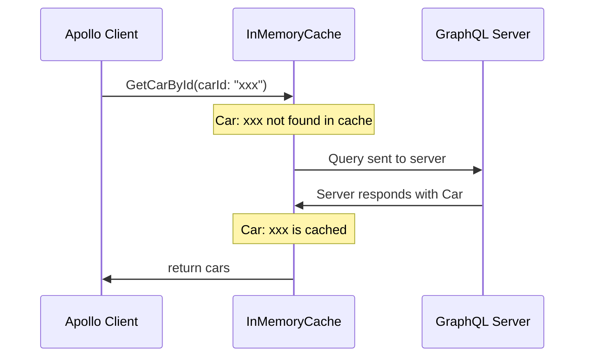

## sequence diagram

```
sequenceDiagram
    Apollo Client->>InMemoryCache: GetCarById(carId: "xxx")
    Note over InMemoryCache: Car: xxx not found in cache
    InMemoryCache->>GraphQL Server: Query sent to server
    GraphQL Server->>InMemoryCache: Server responds with Car
    Note over InMemoryCache: Car: xxx is cached
    InMemoryCache->>Apollo Client: return cars
```



> References
- [mermaid official samples](https://docs.mermaidchart.com/mermaid-oss/syntax/examples.html#examples)
