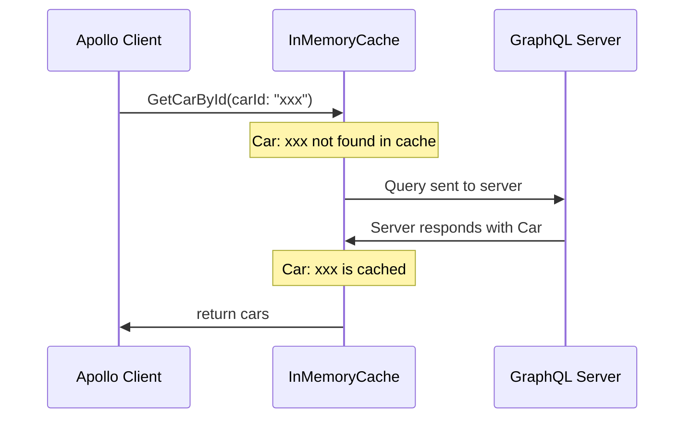
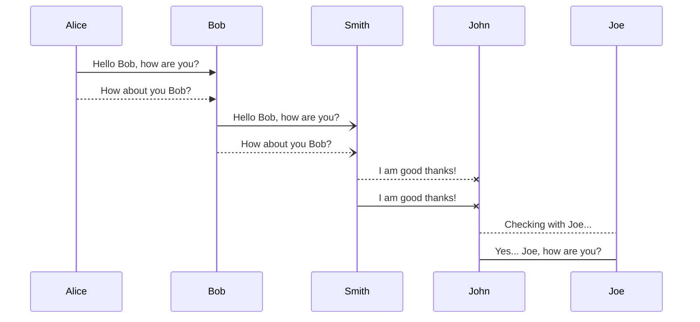
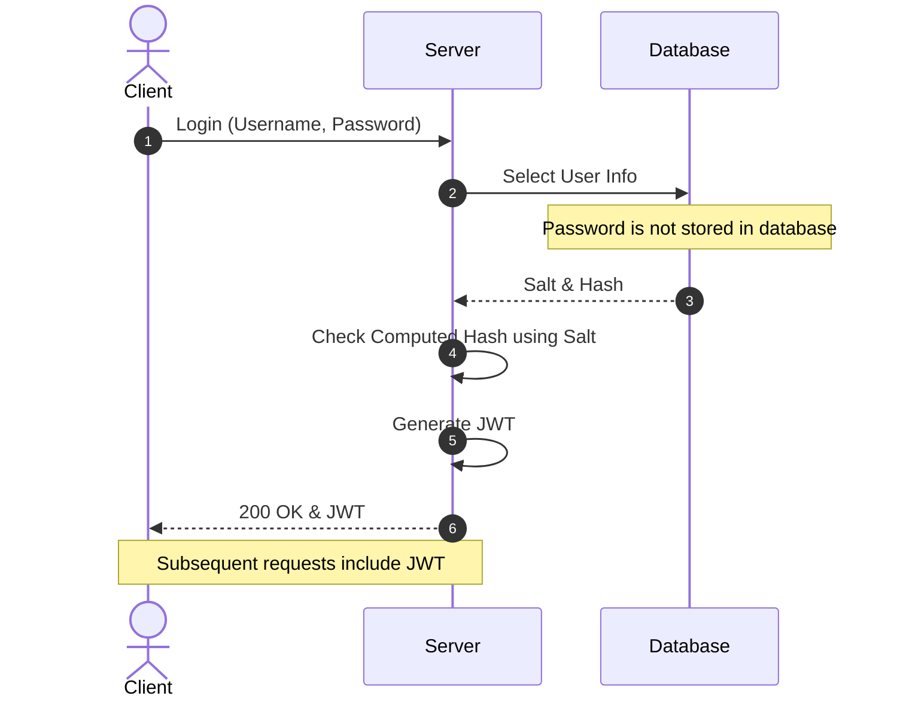
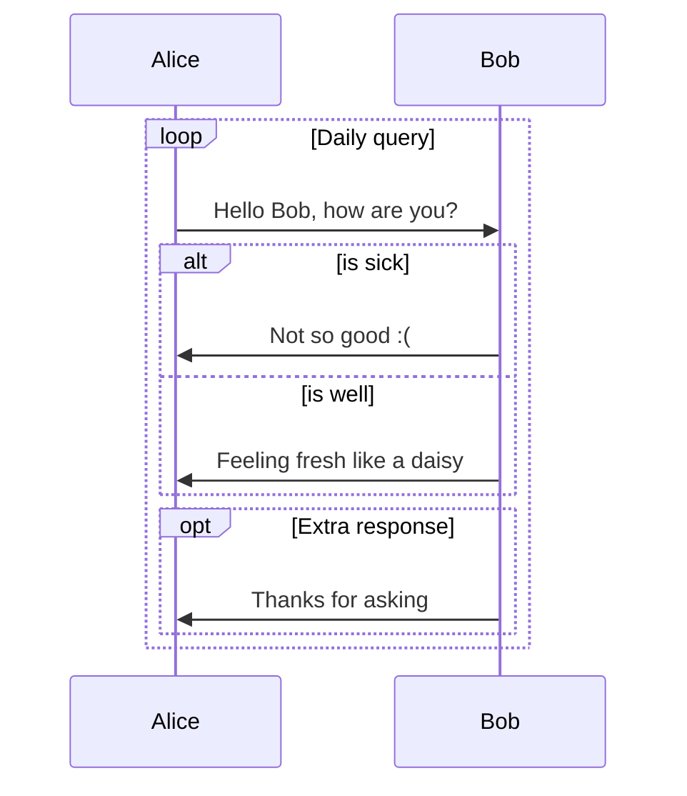
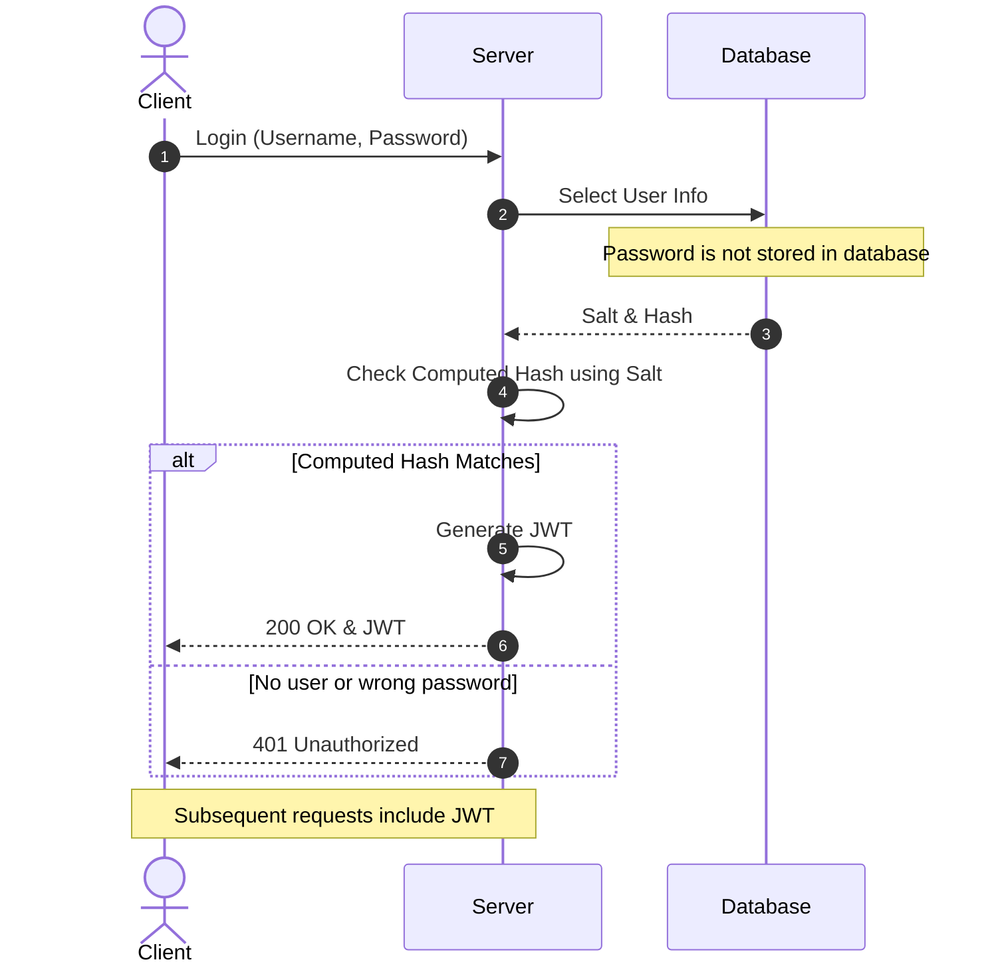
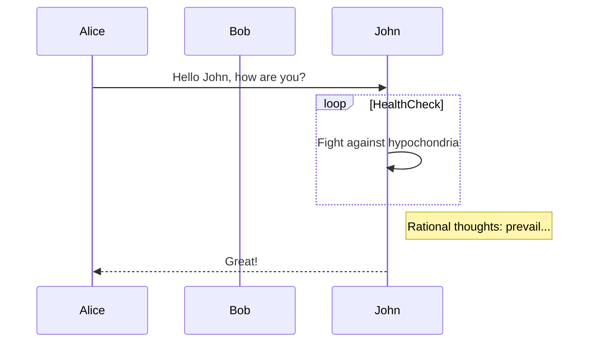
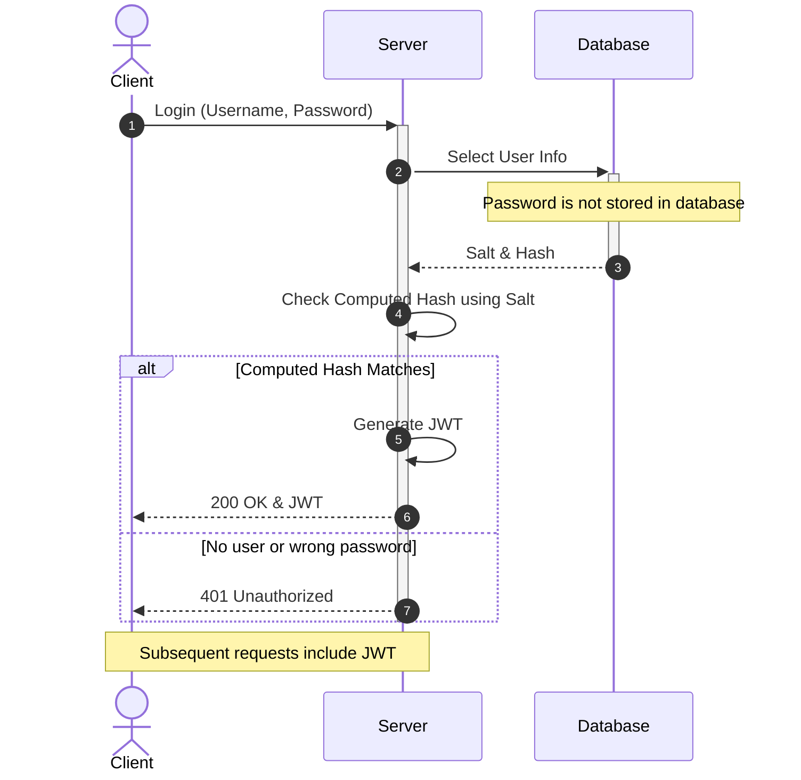
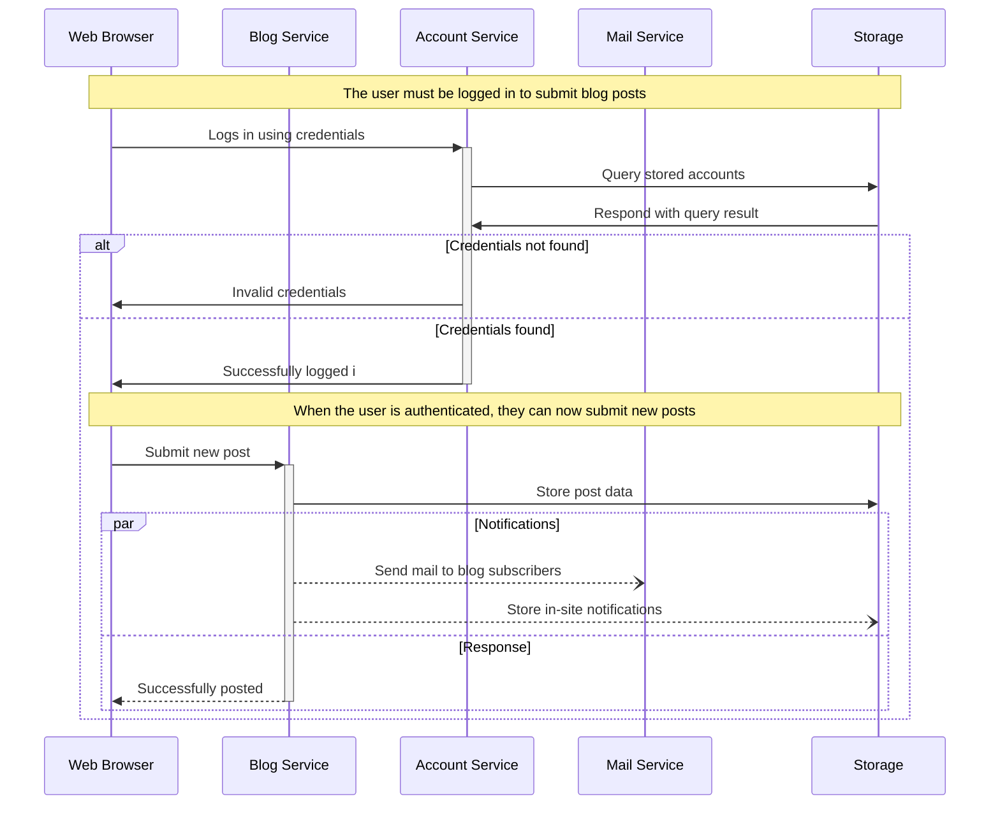
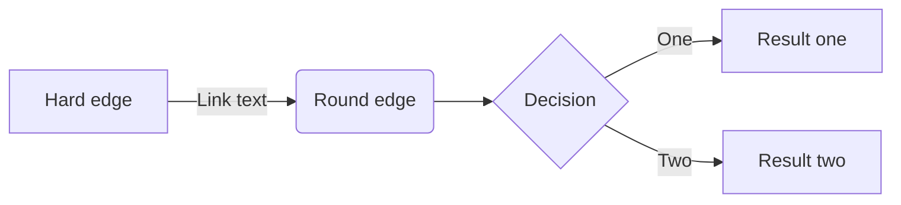

[top](#top)

- [sequence diagram](#sequence-diagram)
  - [Basic sequence diagram](#basic-sequence-diagram)
  - [SequenceDiagram: number on the line](#sequencediagram-number-on-the-line)
  - [SequenceDiagram: Loops, alt and opt](#sequencediagram-loops-alt-and-opt)
  - [SequenceDiagram: Message to self in loop](#sequencediagram-message-to-self-in-loop)
  - [Sequence Diagram: Indicating Activation](#sequence-diagram-indicating-activation)
- [flowchart](flowchart)

## sequence diagram

```
sequenceDiagram
    Apollo Client->>InMemoryCache: GetCarById(carId: "xxx")
    Note over InMemoryCache: Car: xxx not found in cache
    InMemoryCache->>GraphQL Server: Query sent to server
    GraphQL Server->>InMemoryCache: Server responds with Car
    Note over InMemoryCache: Car: xxx is cached
    InMemoryCache->>Apollo Client: return cars
```



### Basic sequence diagram

```
sequenceDiagram
  Alice->>Bob: Hello Bob, how are you?
  Alice-->>Bob: How about you Bob?
  Bob-)Smith: Hello Bob, how are you?
  Bob--)Smith: How about you Bob?
  Smith--xJohn: I am good thanks!
  Smith-xJohn: I am good thanks!
  John-->Joe: Checking with Joe...
  John->Joe: Yes... Joe, how are you?
```



[⬆ back to top](#top)

### SequenceDiagram: number on the line

```
sequenceDiagram
    autonumber
    actor C as Client
    participant S as Server
    participant DB as Database
    C->>S: Login (Username, Password)
    S->>DB: Select User Info
    note over DB: Password is not stored in database
    DB-->>S: Salt & Hash
    S->>S: Check Computed Hash using Salt
    S->>S: Generate JWT
    S-->>C: 200 OK & JWT
    note over C, S: Subsequent requests include JWT
```



[⬆ back to top](#top)

### SequenceDiagram: Loops, alt and opt

```
sequenceDiagram
    loop Daily query
        Alice->>Bob: Hello Bob, how are you?
        alt is sick
            Bob->>Alice: Not so good :(
        else is well
            Bob->>Alice: Feeling fresh like a daisy
        end
        opt Extra response
            Bob->>Alice: Thanks for asking
        end
    end
```



**If / Else with Alt Blocks**

```
sequenceDiagram
    autonumber
    actor C as Client
    participant S as Server
    participant DB as Database
    C->>S: Login (Username, Password)
    S->>DB: Select User Info
    note over DB: Password is not stored in database
    DB-->>S: Salt & Hash
    S->>S: Check Computed Hash using Salt
    alt Computed Hash Matches
        S->>S: Generate JWT
        S-->>C: 200 OK & JWT
    else No user or wrong password
        S-->>C: 401 Unauthorized
    end
    note over C, S: Subsequent requests include JWT
```



[⬆ back to top](#top)

### SequenceDiagram: Message to self in loop

```
sequenceDiagram
    participant Alice
    participant Bob
    Alice->>John: Hello John, how are you?
    loop HealthCheck
        John->>John: Fight against hypochondria
    end
    Note right of John: Rational thoughts: prevail...
    John-->>Alice: Great!
```



[⬆ back to top](#top)

### Sequence Diagram: Indicating Activation

|||
|---|---|
|C->>+S: Login (Username, Password)| activate S|
|DB-->>-S: Salt & Hash|deactivate DB|

**Auth**

```
sequenceDiagram
    autonumber
    actor C as Client
    participant S as Server
    participant DB as Database
    C->>+S: Login (Username, Password)
        S->>+DB: Select User Info
        note over DB: Password is not stored in database
        DB-->>-S: Salt & Hash

        S->>S: Check Computed Hash using Salt
        alt Computed Hash Matches
            S->>S: Generate JWT
            S-->>C: 200 OK & JWT
        else No user or wrong password
            S-->>C: 401 Unauthorized
        end
    deactivate S
    note over C, S: Subsequent requests include JWT
```



**Blogging app service communication**

```
sequenceDiagram
    participant web as Web Browser
    participant blog as Blog Service
    participant account as Account Service
    participant mail as Mail Service
    participant db as Storage
    Note over web,db: The user must be logged in to submit blog posts
    web->>+account: Logs in using credentials
    account->>db: Query stored accounts
    db->>account: Respond with query result

    alt Credentials not found
        account->>web: Invalid credentials
    else Credentials found
        account->>-web: Successfully logged i
        Note over web,db: When the user is authenticated, they can now submit new posts
        web->>+blog: Submit new post
        blog->>db: Store post data
        par Notifications
            blog--)mail: Send mail to blog subscribers
            blog--)db: Store in-site notifications
        and Response
            blog-->>-web: Successfully posted
        end
    end
```



[⬆ back to top](#top)

## flowchart



> References
- [mermaid official samples](https://mermaid.ai/open-source/intro/)
- [Sequence Diagrams in Markdown with Mermaid.js](https://newdevsguide.com/2023/04/10/mermaid-sequence-diagrams/)
