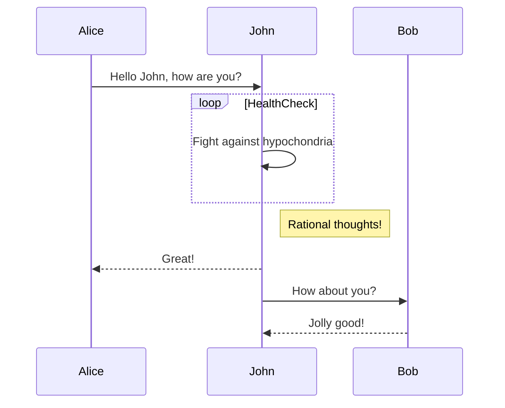

```
├── 📂IDE/
|    ├──📂 Atom/
|    ├── 📂Eclipse/
|    ├── 📂VSCode/
|    |     ├── 📄VSCode快捷键,插件,主题集锦.md	Update VSCode快捷键,插件,主题集锦.md
|    |     ├── 📄my-vsCode.md	Update my-vsCode.md
|    |     └── 📄vsCodeOpenFolder.reg
|    ├── 📂markdown/
|    |     ├── 📄Markdown表情大全.md
|    |     ├── 📄markdown-writing-sample.md
|    |     ├── 📄markdown文件公式大全.md
|    |     └── 📄typora.md
|    ├── 📄ygwin及Git的mintty终端配色配置.md
|    ├── 📄Create Cygwin及Git的mintty终端配色配置.md
|    ├── 📄GitHub美化主页设计.md
|    ├── 📄IntelliJ IDEA配置.md
|    ├── 📄Source Map应用技巧.md
|    ├── 📄node+npm_update.md
│    └── 📦notepad++-plugin.zip                  # JSONFormat, Markdown view       
```

|||||
|---|---|---|---|
|⬆ back to top|👉 goto|🤖 Introduction|⚙️ Tech Stack|
|🔋 Features|🤸 Quick Start|🕸️ Snippets|🔗 Links|
|🚀 More|🚨 Tutorial|📚 Storybook|⚛️ React |
|🪝 Hooks|⚡️ Optimized performance|⚙️ configuration|🛠 Tools|
|🧩 ShadCN |🎨 Tailwind|📱💻🖥️ responsive|🔑 Token|
|🌳 Tree-shakeable|🧪 Ready to test|🗄️DB |🌐 API Call|
|💅 Emotion|✨ Prettier|🚥 GitHub Actions|📐 ESLint|
|✅ Chromatic |📦 npm |💳 payments|♿ Accessibility|
|other|---|---|---|
|💥 Actions to |🎛 Controls to interactively |📂📝📕📧 Docss|🔍 Interactions|
|🏎 Test-runner|☁ Cloud|🏡🐈|⭐🌙晚安|
|🍜|🍞zασα|☾˚‧º· 𝓖𝓸𝓸𝓭 𝓝𝓲𝓰𝓱𝓽 ☾˚‧º·|🛌🎶|
|🌷 | ◡̈近日欣喜|🧸|( 展开|
|💡👁️ |💰 |📊 |🙌|
|⏳👥|💬|📹 📸📺🎥|⏰ 📤 🤖 ⚖️ ☕ 💃 🎤🔥|


