|Question|Answer|
|---|---|
|Tell me about yourself|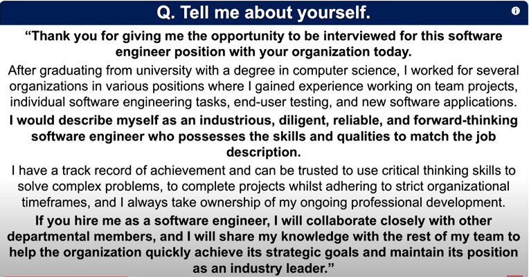|
|Why do you want to work at Amazon?|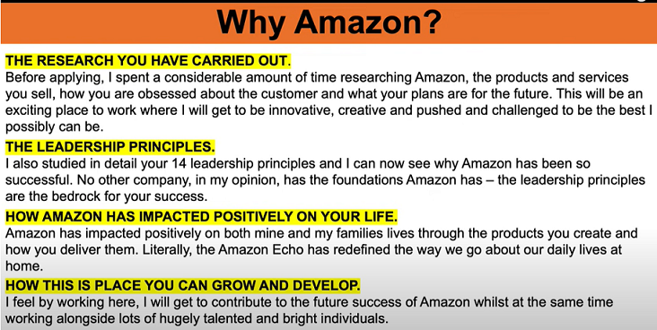 |
|Tell me about a time when you improved a process?|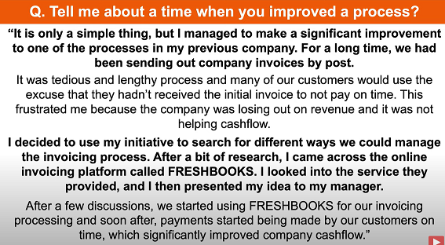|
|What are your strengths?|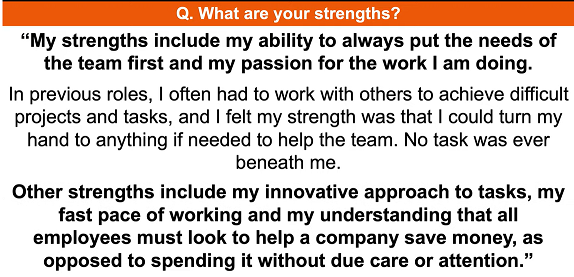|
|Tell me about a time when you did something that was outside of your responsibility at work|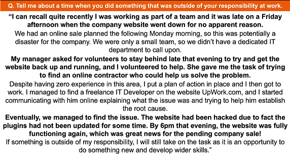|
|How would you react if the people in your team do not agree with your opinions or ideas?|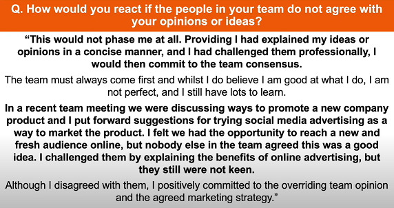|
|Tell me about a time you had to deal with a difficult customer or client.|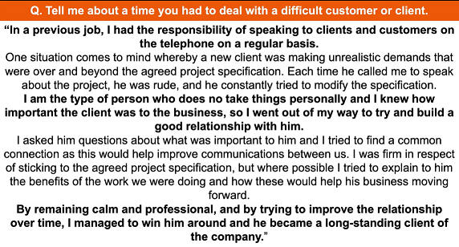|
|Tell me about a time when you took a risk at work.|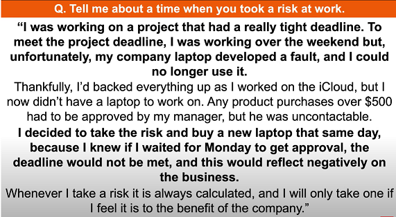|
|What’s your biggest weakness?|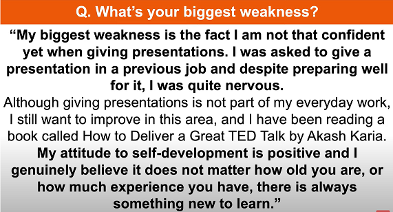|
|Tell me about the time when you showed initiative at work. |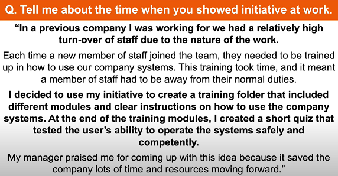|
|where do you see yourself in five years|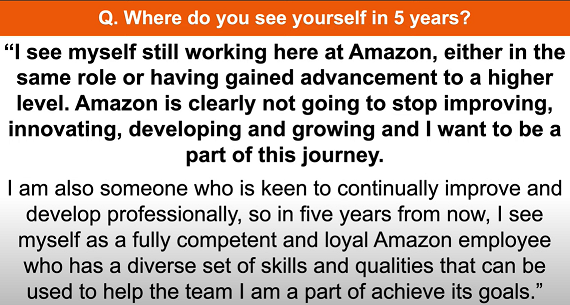|
|Why did you decide to become a Software Engineer? | 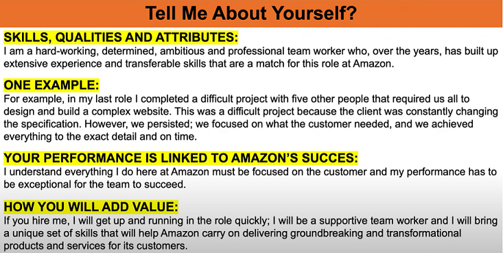 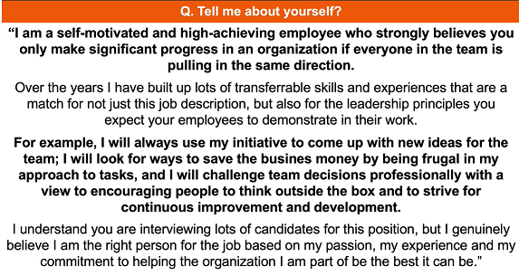|
|Tell me about a project you completed successfully|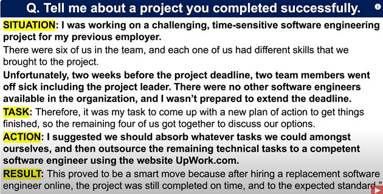|
|What are the most important skills and qualities needed to become a great Software Engineer? ||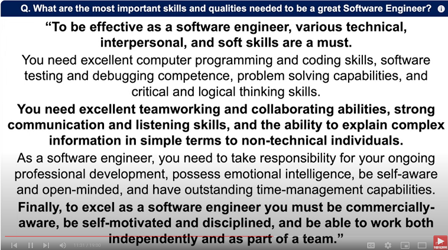|
|What’s your biggest weakness? |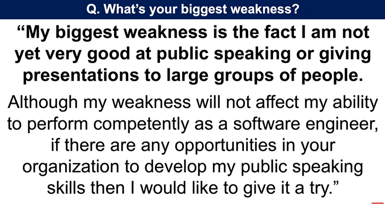|
|Why should we hire you as a Software Engineer? |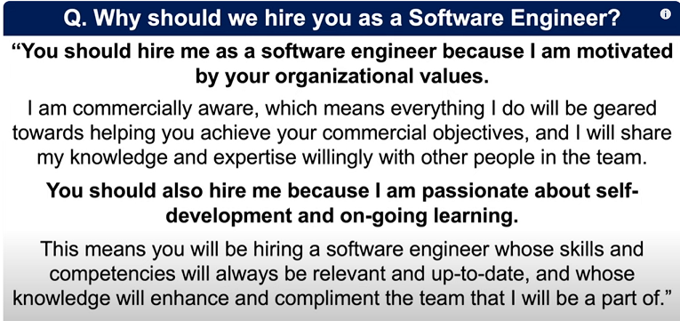|
|Why do you want to work for our company as a Software Engineer?||
|What do you like and dislike the most about being a Software Engineer?||
|What can you bring to our company?|"I believe I can bring a combination of technical expertise and creative problem-solving to your company. Additionally, I have a track record of working effectively in team environments, collaborating closely with designers and back-end developers to deliver high-quality projects on time.  My proactive approach to staying updated with the latest industry trends and technologies means I can contribute innovative solutions that keep the company at the forefront of digital experiences. Moreover, I’m passionate about user experience and always strive to create interfaces that are not only visually appealing but also intuitive and accessible.  I’m confident that my skill set and dedication to continuous learning and improvement will be valuable assets to your team."|
|How would you deal with a situation where a manager insisted on a project specification that you knew was not workable?||
|What steps do you take to keep your technical knowledge as a Software Engineer relevant and up-to-date?||
|How did your previous company benefit from your technical knowledge and expertise?||
|How would you explain something technical to a non-technical person? |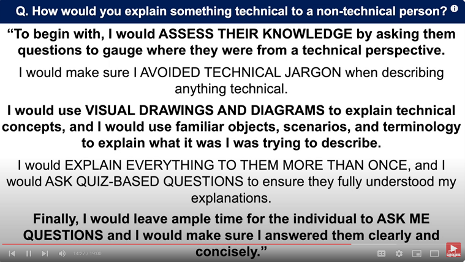|
| When you encounter bugs and issues during software engineering projects, what problem-solving process do you use?||
|How would you respond to a team member who disagreed with the work you’ve carried out as a Software Engineer?|
|Tell me a time when you worked as part of a team to solve a complex task.||
| Where do you see yourself in 5 years?|"In five years, I see myself as a more experienced and skilled front-end developer who has made significant contributions to successful projects.  I aim to take on more complex challenges and assume a leadership role within the team, mentoring junior developers and helping to shape the direction of our projects.  I’m particularly interested in specializing in advanced JavaScript frameworks and exploring the integration of emerging technologies like AI and VR into web development to create innovative user experiences. I also see myself continuing to learn and grow with the company, adapting to new trends and technologies that emerge in the industry.  My goal is to be a valuable asset to the team, not just in terms of my technical abilities, but also through my collaborative spirit and commitment to excellence.  Ultimately, I want to contribute to the company’s success and be part of its long-term vision."|
|How you would handle the stress and pressure of being a Software Engineer? ||
|Why do you want to leave your current job?||
|What are your strengths? ||
|What are your salary expectations as a Software Engineer?||
|Tell me about a time when you had to manage competing deadlines||
|Tell me about yourself and why you wnat to become a software Engineer| |
|What skills and qualities are needed to be a software engineer?|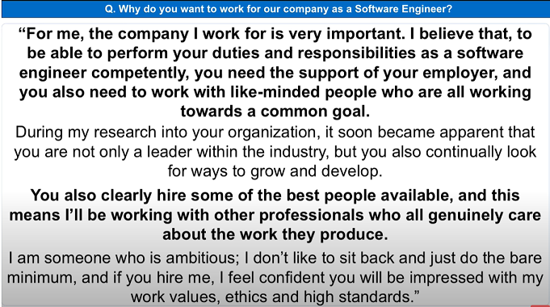|
|Tell me what you expect to be doing on a daily basis as a software engineer?|**Coding**: Writing and optimizing front-end code in HTML, CSS, and JavaScript. **Collaboration**: Working with designers and back-end developers to integrate and refine features. **Testing**: Ensuring cross-browser compatibility and responsive design. **Problem-Solving**: Debugging issues and improving user experience. **Debugging and troubleshooting** any front-end issues that arise, and implementing fixes to improve the user experience. **Participating in code reviews** to maintain code quality and share knowledge with peers. **Staying informed about new technologies** and industry best practices to continuously refine my skills and apply innovative solutions.|
|What are your strengths?||
|What are your weaknesses?||
|What are your weaknesses?|I have trouble asking for help & may overcommit or refrain from delgating, even though I am burning out. I have learned to recognize when I am feeling burned out so I can reach out for help. While I do enjoy working independently,  I have been able to produce high-quality work when I'm able to pull others in and collaborate. I sometimes lack confidence which can prevent me from speaking up or contributing in a meeting or conversation. I have been intentional about voicing my ideas an optnions in meetings when I feel it is appropriate and will add value.  Because of this, my team ended up running with my idea for managing customer inquiries, and our customer satisfaction ratings increased from 89% to 98%|
|What are your salary expectations as a software engineer?|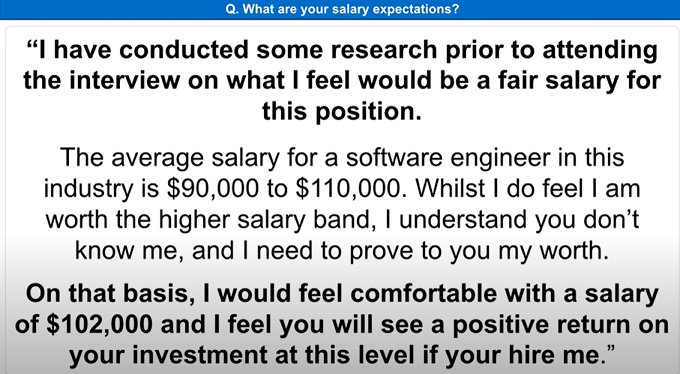|
|Where do you see yourself in five years' time?||
|Why should we hire you?||
|Why do you want to work for our company as a Software Engineer?
|How would you deal with a member of your team who disagreed with the work you carried out as a Software Engineer?|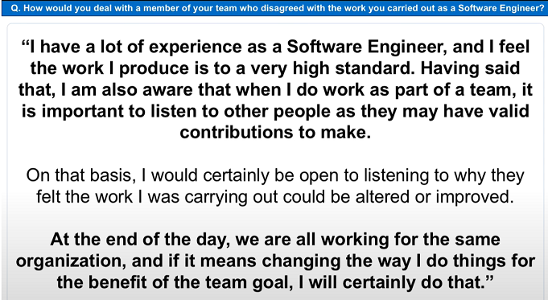|
|Tell me a time when you worked as part of a team to solve a complex task?|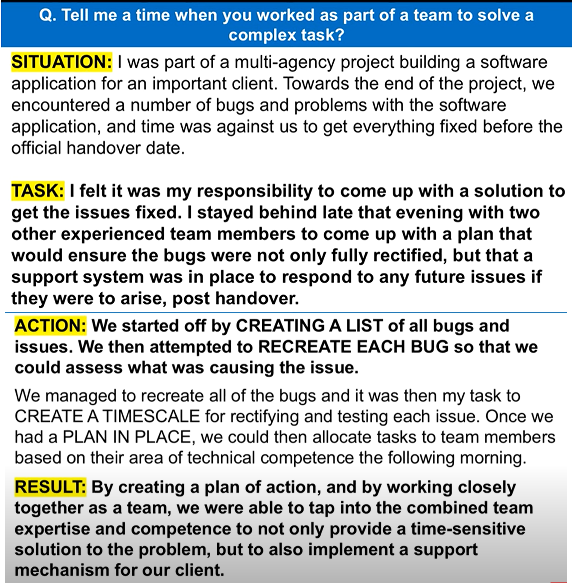|
|Tell me how you would handle the stress and pressure of being a Software Engineer? |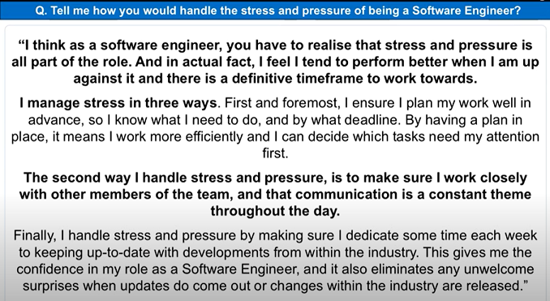|
|What are the skills and qualities needed to be a software Engineer?||
|Tell me about a time that you had to make a decision at work, but you did not have all the data available|**Situation**: “In my previous role as a front-end developer, we were working on a major redesign of our company’s e-commerce website. The project was on a strict deadline due to the upcoming holiday season.” **Problem**: “Two weeks before the launch, we encountered an issue where the user analytics data was incomplete due to a tracking bug. This data was crucial for optimizing the checkout flow, and we didn’t have time to wait for a full data set.” **Action**: “I convened a meeting with the development team and stakeholders to discuss potential solutions. We decided to use the partial data we had, combined with industry best practices and our team’s expertise, to make an educated guess on the checkout design.  I also proposed setting up A/B testing to quickly gather real-time user feedback post-launch.” **Result**: “The decision paid off. We launched the website on time, and the initial A/B testing showed a significant improvement in the checkout process. We continued to refine the design as more data became available, which ultimately increased our conversion rate by 15%.” Reflection: “This experience taught me the importance of adaptability and making informed decisions in the face of uncertainty. It also highlighted the value of having a flexible and proactive team that can collaborate effectively under pressure.”|
|ask questions| 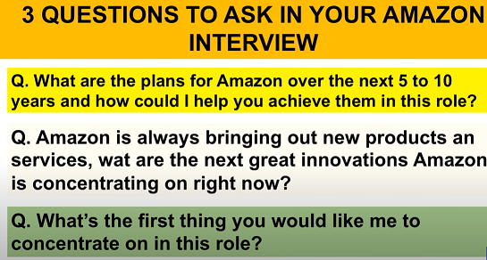|

## Questions to ask at the End of an Interview
- 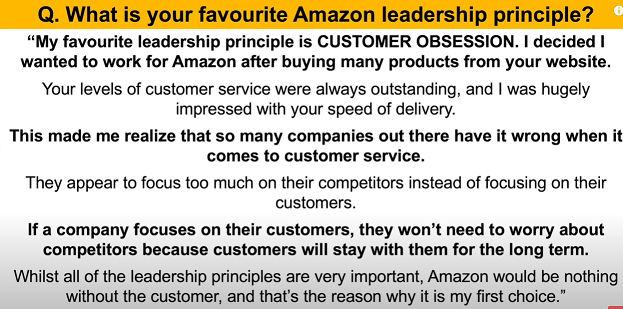
- What is your favorite part about working here in this organization.
- What make people stay in this organization
- What is biggest challenges or opportuntie of this organization or department is facing in the next six months to a year
- how did u describe the work environment here
- Role-based
  - Could u tell me a typical day or week looks like in this position 
  - what u want a person in this position to accomplish in their first 30, 60 and 90 days
  - What challenges or opportunties do u foresee thsi position taking on in next six months
  - How my performance be measured in this position
  - What are the next steps in the interview process
- Hesitation question
  - Based on what we've talked about today, is there anything that is causing you hesitation about my fit for this position
  - How do I compare to other candidates you've interviewed for this role
  - do you have any hesitations about my qualifications
  - Is there anything I can clarify for you
  - Have I answered all of the questions that you have for me|
