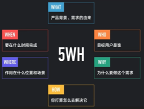
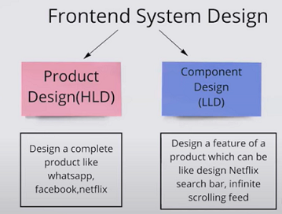
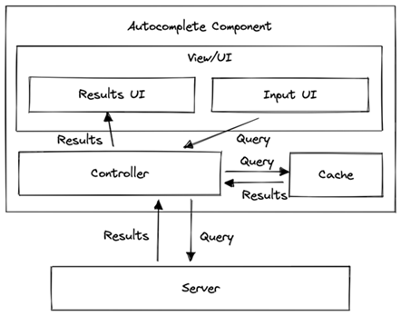
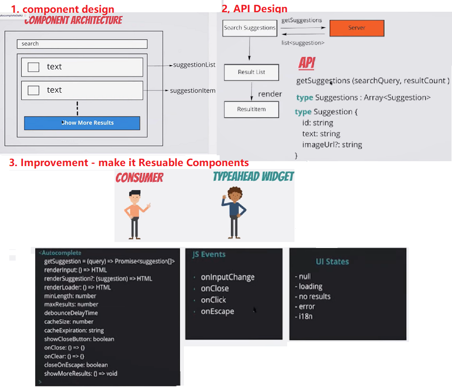
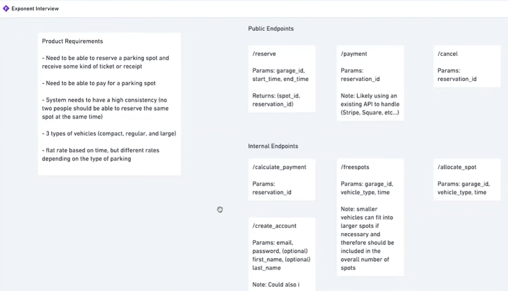
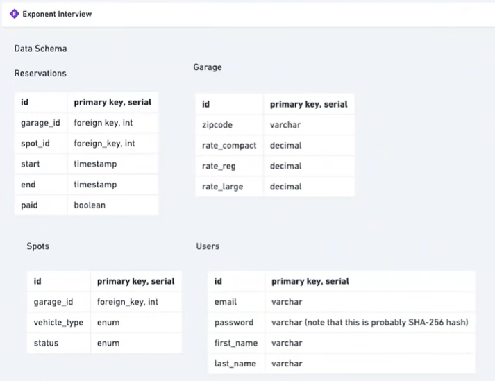
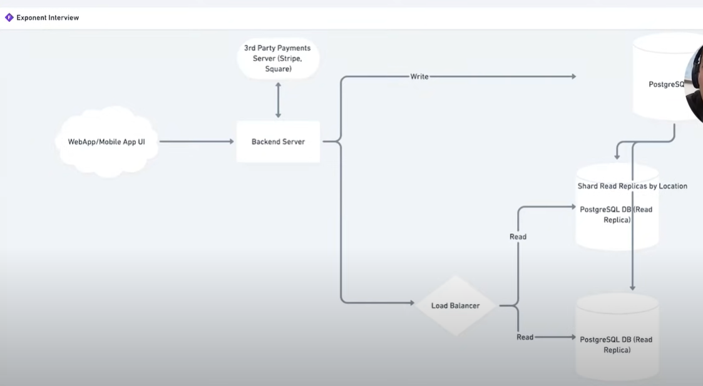
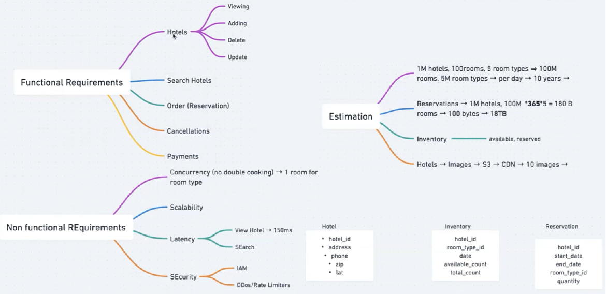

[System Design Interview Preparation](#top)

- [Tips for Answering](#tips-for-answering)
- [Front End system design - Autocomplete or Typeahead](#front-end-system-design---autocomplete-or-typeahead)
  - [General](#general)
  - [Autocomplete Architecture](#autocomplete-architecture)
  - [Component design/API Design/Improvement](#component-designapi-designimprovement)
  - [Optimizations and deep dive](#optimizations-and-deep-dive)
- [Application Design -News Feed Application](#application-design--news-feed-application)
  - [Requirements exploration](#requirements-exploration)
  - [Architecture / high-level design](#architecture--high-level-design)
  - [Data model](#data-model)
- [API definitions](#api-definitions)
- [Optimizations and deep dive](#optimizations-and-deep-dive)
- [Well-designed HTML forms](#well-designed-html-forms)
- [Common Frontend System Design Interview Questions](#common-frontend-system-design-interview-questions)
- [Sample Question \& Answer Outline](#sample-question--answer-outline)
- [Design Parking Garage](#design-parking-garage)
- [Design Amazon Prime Video](#design-amazon-prime-video)
- [Design a Hotel Booking Service](#design-a-hotel-booking-service)
- [online book store](#online-book-store)

----------------------------------------------------------------
- Scalable, reliable, cost optimal, performance
- Requirements clarification
- 

|Users/Customers|Scale(read and write)|performance|cost|
|---|---|---|---|
|who will use the system|How many read queries per second|What is expected write-to-read data delay|should the design minimize the cost of development|
|how the system will be used|How much data is queried per request|what is expected p00 latency for read queries|should design minimize the cost of maintenance|
||How many video views are processed per second|||
||Can there spikes in traffic|||

[⬆ back to top](#top)

## Tips for Answering

- **Start with requirements**: Clarify functional and non-functional requirements.
- **Draw a diagram**: Sketch the main components and their interactions.
- **Discuss trade-offs**: Compare different libraries/tools/approaches.
- **Address scalability, maintainability, and performance**
- **Mention monitoring and observability**.
- **Talk about testing and deployment**

[⬆ back to top](#top)

## Front End system design - Autocomplete or Typeahead

### General

- Clarify the question
  - what is the goal of this feature? What kind of results should be supported?
    - **Text, image, media (image accompanied with text)**
  - Do I need to build just he autocomplete feature or the entire search bar with filters?
  - Do we need to support fuzzy search?
  - Should we consider typing errors while search
  - What devices will this component be used on?
- General Plan
  - Functional requirements
  - Non functional requirements
  - component architecture
  - Props & events
  - performance
  - Accessiblity
- Functional requirements
  - show suggestions on user input
  - debounce when user stops typing
  - search results should be customisable
  - supports both static data and data coming from an API
- Non functional requirements
  - Network efficient
  - should be configurable
    - cache size
    - minumum search query length
    - search results
  - performance
  - Generic enough to support different platforms
  - Accessibility
  - browser support
  - cross devices(desktop, mobile, tablet)

| Functional requirement | Non functional requirements |
|---|---|
|show suggestions on user input |network efficient|
|debounce when user stop typing|should be configurable- cache size, minumum search query length, search results|
|search results should be customisable|performance|
|supports both static data and data coming from api|generic to support different platforms browser support cross devices(desktop, mobile, tablet)|
||accessibility|

### Autocomplete Architecture

|||
|---|---|
|Input field UI|- Handles user input and passes the user input to the controller.
|Results UI (Popup)|- Receives results from the controller and presents it to the user - Handles user selection and informs the controller which input was selected|
|Cache|- Stores the results for previous queries so that the controller can check if sending a request to the server.|
|Controller|- Controller (MVC) pattern. All the components in the system interact with this component. - Passes user input and results between components - Fetches results from the server if the cache is empty for a particular query|

- [System Design - Autocomplete](https://www.greatfrontend.com/questions/system-design/autocomplete)

### Component design/API Design/Improvement

### Optimizations and deep dive

|||
|---|---|
|Network|- Handling concurrent requests/race conditions - Failed requests and retries - Offline usage|
|Cache|- Cache structure - Cache structures - Caching strategy|
|Performance|- Loading speed - Debouncing/throttling - Memory usage - Virtualized lists|
|User experience|- Autofocus - Handle different states - Handle long strings - Mobile-friendliness - Keyboard interaction - Typos in search - Query results positioning|
|Accessibility|- semantic HTML or use the right aria roles if using non-semantic HTML - `aria-haspopup` to indicate that the element can trigger an interactive popup element - `aria-expanded` to indicate whether the popup element is currently displayed - Mark the results region with `aria-live` so that when new results are shown, screen reader users are notified - `aria-autocomplete` type of autocompletion interaction model the combobox will dynamically help users complete text input, whether suggestions will be shown as a single value inline (`aria-autocomplete="inline"`) or in a collection of values (`aria-autocomplete="list"` - Google uses `aria-autocomplete="both"` while Facebook and X use `aria-autocomplete="list"` - Keyboard interaction: hit enter to perform a search, Up/down arrows to navigate the options, escape to dismiss the results popup if it is visible|

[⬆ back to top](#top)

## Application Design -News Feed Application

- Design a news feed application that contains a list of feed posts users can interact with, e.g. Facebook
- [System design News Feed (e.g. Facebook)](https://www.greatfrontend.com/questions/system-design/news-feed-facebook)
  
### Requirements exploration

- What are the core features to be supported?
  - Browse news feed containing posts by the user and their friends
  - Liking and reacting to feed posts
  - Creating and publishing new posts
  - Commenting and sharing posts
- What kind of posts are supported?
  - types of posts, primarily text or image-based posts
- What pagination UX should be used for the feed?
  - **Infinite scrolling**, meaning more posts will be added when the user reaches the end of their feed
- Will the application be used on mobile devices?
- 

### Architecture / high-level design

|||
|---|---|
|Server|Provides HTTP APIs to fetch feed posts and to create new feed posts|
|Controller|Controls the flow of data within the application and makes network requests to the server|
|Client store|Stores data needed across the whole application|
|Feed UI|Contains a list of feed posts and the UI for composing new posts - **Feed posts**: Presents the data for a feed post and contains buttons to interact with the post (like/react/share) -**Post composer**: WYSIWYG (what you see is what you get) editor for users to create new feed posts|
|Rendering approach|- Server-side rendering (SSR) - Client-side rendering (CSR)|

### Data model

|Entity|	Source	|Belongs to	|Fields|
|---|---|---|---|
|Feed	|Server	|Feed UI	|`posts` (list of Posts), `pagination` (pagination metadata)|
|Post|	Server|	Feed post|	`id`, `created_time`, `content`, `author`, `reactions`, `image_url`|
|User	|Server|	Client store|	`id`, `name`, `profile_photo_url`|
|NewPost	|User input (Client)|Post composer UI	|`message`, `image`|

[⬆ back to top](#top)

### API definitions

[⬆ back to top](#top)

### Optimizations and deep dive

[⬆ back to top](#top)

## Well-designed HTML forms

1. Well-structured and semantically correct.
2. Easy to use and navigate (keyboard).
3. Accessible with ARIA attributes and proper labels.
4. Has support for client and server side validation.
6. Well-styled and consistent with the rest of the application.

[⬆ back to top](#top)

## Common Frontend System Design Interview Questions

1. Design a scalable web application (e.g., Twitter feed, Instagram, or a dashboard)
  - How would you structure the frontend codebase?
  - How would you split components and manage state?
  - Which frameworks/libraries would you choose and why?

2. How do you handle large-scale state management in a complex single-page application (SPA)?
  - Local vs global state
  - Libraries: Redux, MobX, Zustand, Context API, etc.
3. How would you design a performant, mobile-friendly web page that loads under 2 seconds?
  - Code splitting
  - Lazy loading
  - Image optimization
  - Critical CSS, performance budgets
4. How do you architect for SEO and SSR (Server-Side Rendering)?
  - Static Site Generation (SSG) vs SSR vs Client-side rendering
  - Frameworks: Next.js, Nuxt, Astro, Gatsby
5. How would you design a real-time collaborative editor (like Google Docs) from a frontend perspective?
  - WebSockets/WebRTC vs polling
  - Data synchronization
  - Optimistic updates
6. How would you handle error boundaries and logging in a large web application?
  - Error boundaries in React
  - Centralized logging and monitoring
7. How would you implement authentication and authorization in your frontend?
  - OAuth, JWT, session management
  - Route guards, protected components
8. How do you ensure accessibility (a11y) and internationalization (i18n)?
  - Best practices/tools
  - Testing strategies
9. How would you design a component library for use across multiple products?
  - Theming, customizability
  - Versioning and distribution
10. How do you ensure code quality in a large frontend codebase?
  - Linting, formatting, testing (unit, integration, E2E), code reviews

[⬆ back to top](#top)

## Sample Question & Answer Outline

||
|---|
|1. Design the frontend architecture for a social media feed (like Twitter)|
|- **Component Structure**: Split into Feed, Post, User, Sidebar, Notification components - **State Management**: Use Redux for global state, React Query for async data fetching/caching - **Performance**: Use virtualization  (react-window) for long feeds, code splitting for routes- **SSR/SEO**: Use Next.js for SSR and SEO-friendly pages - **Authentication**: Use JWT, protect sensitive routes - **Error Handling**: Error boundaries for React, centralized error logging - **Monitoring**: Integrate Sentry for error monitoring and performance metrics - **Testing**: Use Jest/React Testing Library for unit/integration tests; Cypress for E2E|
|2. design a scalable and maintainable frontend architecture for a large web application, such as an e-commerce platform/a large-scale dashboard application|
|- **Componentization**: Break the UI into reusable, self-contained components (e.g., ProductCard, Cart, UserProfile). Use a component-based framework like React, Vue, or Angular - **State Management**: Use local state for UI-specific data and global state management (like Redux, Zustand, or Context API) for shared data such as user authentication or cart contents - **Routing**: Implement client-side routing (React Router, Vue Router) to enable navigation between pages without full page reloads - **API Handling**: Abstract API calls into services or hooks, handle errors globally, and and cache data/background updates where possible (React Query/SWR) - **Code Splitting**: Use dynamic imports and lazy loading to split code into smaller bundles, so users only load what's necessary - **Styling**: Use CSS-in-JS, CSS Modules, or a CSS framework to scope styles and prevent conflicts - **Testing**: Write unit tests for components, integration tests for flows, and E2E tests for critical paths - **Performance**: Optimize images, use a CDN, leverage browser caching, and monitor performance using tools like Lighthouse and Sentry - **Accessibility**: Follow a11y best practices and use semantic HTML|
|3. How would you ensure your frontend web app is performant and loads quickly, even on slow networks, especially on mobile devices?|
|- **Image Optimization(Optimize Asset)**: Use responsive images (srcset), compress assets, and serve images in next-gen formats (WebP, AVIF), use SVGs for icons - **Code Splitting**: Implement code splitting to reduce initial JavaScript payload - **Minification & Compression**: Minify JS/CSS, enable Brotli or Gzip on the server - **Lazy Loading**: Defer offscreen images/components using loading="lazy" and React.lazy/Suspense.  **Critical CSS**: Inline critical CSS and defer non-essential styles - **Caching**: Leverage browser and CDN caching for static assets - **Minification & Compression**: Minify JS/CSS and enable Gzip/Brotli compression on the server - **Avoid Render-blocking Resources**: Load scripts asynchronously/defer, and preconnect to critical resources - **Performance Monitoring**: Use tools like Lighthouse to audit performance and set performance budgets - **Progressive Enhancement**: Use skeleton loaders and optimize for time-to-interactive - **Service Workers**: Implement service workers for offline support and caching|
|4. How do you handle state management in large scale SPAs?|
|- **Local vs Global State**: Keep UI state (modals, form inputs) local to components. Store global state (user authentication, theme, cart) in a centralized store (Redux, MobX, Zustand) - **Async State**: Use libraries like React Query or SWR for server state, caching, and background updates - **Modularization**: Split state logic into slices/modules to avoid a monolithic store - **Performance**: Use selectors, memoization, and avoid unnecessary re-renders - **Persistence**: Persist critical state (theme, auth) in localStorage/sessionStorage with proper security considerations - **Testing**: Write tests for reducers, actions, and async logic|
|5. How would you design the frontend for a real-time chat application?|
|- **WebSockets**: Use WebSockets for real-time bidirectional communication - **Component Structure**: Separate components for ChatList, MessageInput, MessageList, UserStatus - **Optimistic UI**: Show sent messages immediately while awaiting server confirmation - **State Management**: Use Context or a state manager for chat data; keep connection state local - **Error Handling**: Show reconnection status, handle dropped connections gracefully - **Performance**: Virtualize long message lists (e.g., with react-window) - **Notifications**: Implement browser notifications for new messages - **Security**: Escape user content to prevent XSS|
|6. How would you implement authentication and authorization on the frontend?|
|- **Authentication**: Use OAuth or JWT for authentication; keep tokens in HTTP-only cookies for security<br- **Session Management**: Refresh tokens before expiry, handle logout on token expiry - **Route Protection**: Use route guards or HOC components to protect sensitive routes and redirect unauthenticated users - **Role-Based Access**: Conditionally render UI based on user roles/permissions from the token or API - **API Integration**: Attach tokens to API requests and handle 401/403 responses gracefully|
|7. What steps would you take to ensure accessibility (a11y) and internationalization (i18n) in your frontend?|
|- **Accessibility**: Use semantic HTML, ARIA attributes, ensure keyboard navigation, provide alt text for images, test with screen readers - **Internationalization**: Use i18n libraries (react-i18next), externalize text, support RTL layouts, and handle date/number localization - **Testing**: Include accessibility tests (axe-core, Lighthouse) and verify translations with language switchers|
|8. How would you approach error handling and monitoring in a frontend application?|
|- **Error Boundaries**: Use React Error Boundaries to catch and display fallback UIs for component errors - **Global Error Handling**: Centralize error handling for API calls, display user-friendly messages, and log errors - **Monitoring**: Integrate tools like Sentry or LogRocket to capture runtime and user errors - **User Feedback**: Show non-intrusive notifications or modals for errors and allow users to retry actions|

[⬆ back to top](#top)

## Design Parking Garage

## Design Amazon Prime Video

- scope
  - list functional requirement or non=functional requirement 
 

## Design a Hotel Booking Service

## online book store 

- what：做什么？
- when：完成时间？
- how：如何完成？

### What

- ask
  - scale: 
  - performance
  - whether it needs an API
- online book store 
  - Ebooks or Regular books
  - how many users: 6M users
  - transactions:   500 per second(TPS)

[⬆ back to top](#top)
