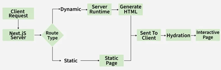

[Next.js Interview Questions and Answers](#top)

- [How Next.js Works?](#how-nextjs-works)
- [What is the difference between Next.js and React JS?](#what-is-the-difference-between-nextjs-and-react-js)
- [Difference between the pre-rendering types available in Next.js](#difference-between-the-pre-rendering-types-available-in-nextjs)
- [What is client-side rendering, and how does it differ from server-side rendering?](#what-is-client-side-rendering-and-how-does-it-differ-from-server-side-rendering)
- [How do you pass data between pages in a Next.js application?](#how-do-you-pass-data-between-pages-in-a-nextjs-application)
- [Authentication and Authorization](#authentication-and-authorization)
  - [What is JWT and how does it work?](#what-is-jwt-and-how-does-it-work)
  - [OAuth](#oauth)
  - [react and oauth2](#react-and-oauth2)
----------------------------------------------------

## How Next.js Works?
Next.js works as a React framework that handles rendering, routing, and optimization automatically, making web apps faster and SEO-friendly.

- <mark>Pre-rendering</mark>: Pages can be rendered on the server (SSR) or per-rendered at build time (SSG) for faster load and better SEO.
- <mark>File-based routing</mark> automatically maps pages to URLs.
- <mark>API Routes</mark>: Allows backend functionality within the application. Each file inside pages/api/ automatically becomes an API endpoint.
- <mark>Automatic Code Splitting</mark>: Loads only the necessary JavaScript for each page, improving performance.
- Optimized Builds</mark>: Bundling, minification, and image optimization happen out-of-the-box.
- <mark>Easy Deployment</mark>: Supports multiple deployment options like static site hosting and serverless functions, simplifying the release process

[⬆ back to top](#top)

## What is the difference between Next.js and React JS?

|Next.js|React|
|---|---|
|an open-source framework based on Node.js and Babel, seamlessly integrates with React to facilitate the development of single-page apps|a JavaScript library, empowers the construction of user interfaces through the assembly of components|
|Supports SSR and Static Site Generation (SSG)|Primarily client-side rendering (CSR)|
|Built-in features like Image Optimization, SSR, and automatic static optimization|No out-of-the-box performance optimization|
|Enhanced by SSR and SSG for better SEO and faster load time|Requires extra configuration for SEO optimization|

[⬆ back to top](#top)

## Difference between the pre-rendering types available in Next.js

|Static Generation (SG)|Server-Side Rendering (SSR)|
|---|---|
|HTML is pre-generated at build time|HTML is generated on each request|
|The pre-generated HTML can be reused on every request|HTML is generated anew for each request|
|Recommended for performance and efficiency|Suitable for cases where content changes frequently or cannot be determined at build time|
|Export the page component or use 'getStaticProps'|Export 'getServerSideProps'|
|Less dependent on server resources during runtime|Depends on server resources for generating content dynamically.|
|Easily cache static HTML|Requires server-side caching mechanisms|
|Scales well as static content can be served efficiently|May require additional server resources to handle dynamic content generation|

[⬆ back to top](#top)

## What is client-side rendering, and how does it differ from server-side rendering?

- Server-Side Rendering (SSR): Sends a fully rendered HTML page from the server to the browser.
- Client-Side Rendering (CSR): Sends an initially minimal HTML page, which is then populated and rendered using JavaScript in the browser.
- CSR may result in slower initial page load compared to SSR but allows for highly interactive client-side applications

[⬆ back to top](#top)

## How do you pass data between pages in a Next.js application?

- **URL Query Parameters**: Send data through the URL and access it via the useRouter hook.
- **Router API**: Use Next.js routing to programmatically navigate and pass state.
- **State Management Libraries**: Use tools like Redux or React Context to share data across pages.
- **Server-Side Data Fetching**: Use `getServerSideProps` to fetch data on the server and pass it as props to the page component.

[⬆ back to top](#top)

## Authentication and Authorization

- **Authentication** is the process of verifying the identity of a user or system. It ensures that the entity attempting to access a system is who they claim to be
- **Authorization** determines what an authenticated user is allowed to do. It defines the permissions and access levels granted to the user

### What is JWT and how does it work?

- "JSON Web Token (JWT) is a compact, URL-safe token used to represent claims between two parties. It works by encoding a JSON object into a string, which is then signed using a cryptographic algorithm to ensure its integrity and authenticity."
- consists of three parts: 
  - **header**：contains metadata about the token and the algorithm used for signing
  - **payload**：holds the claims
  - **signature**： ensures the token's integrity

### OAuth

- OAuth (Open Authorization) is an open standard for access delegation. It allows users to grant third-party applications limited access to their resources without exposing their credentials
- Key Concepts of OAuth
  - **Resource Owner**: The user who owns the data
  - **Client**: The application requesting access to the resource
  - **Resource Server**: The server hosting the protected resources
  - **Authorization Server**: The server that authenticates the resource owner and issues access tokens
  - **Access Token**: A token that grants the client access to the resource server
- OAuth Flow
  - Authorization Request: The client requests authorization from the resource owner.
  - Authorization Grant: The resource owner grants permission.
  - Access Token Request: The client exchanges the authorization grant for an access token from the authorization server.
  - Access Token Response: The authorization server issues an access token.
  - Resource Request: The client uses the access token to access protected resources from the resource server.
  - Resource Response: The resource server returns the requested data to the client
- Common Authentication Methods
  - Basic Authentication: nvolves sending a username and password with each request, typically encoded in Base64. It is simple but not secure unless used over HTTPS.
  - Token-Based Authentication: (like JWT) to authenticate users. Tokens are issued upon successful login and are sent with each request
  - Multi-Factor Authentication (MFA): Requires two or more verification methods, enhancing security by combining something you know (password)

### react and oauth2

- [Auth0](https://www.auth0.com)
- [Clerk](https://clerk.com/docs): for nextJS app

[⬆ back to top](#top)

> https://www.geeksforgeeks.org/reactjs/next-js-interview-questions-answers/
