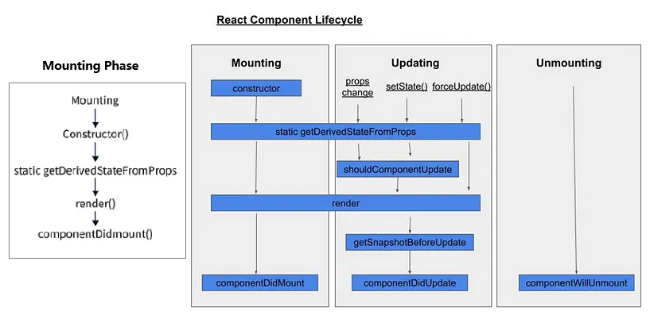
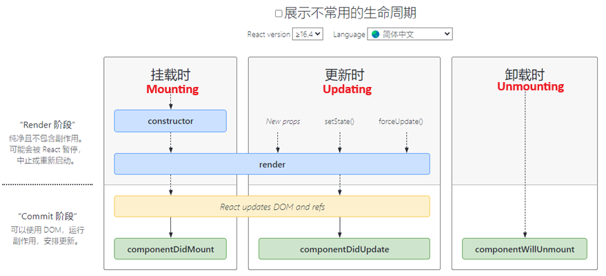
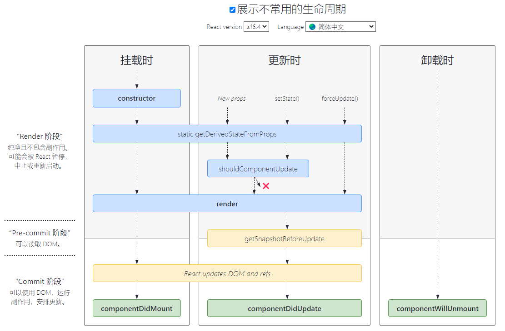

- [React Interview Questions & Answers](https://github.com/sudheerj/reactjs-interview-questions)
- [coding-exercise](https://github.com/sudheerj/reactjs-interview-questions/tree/master/coding-exercise)

--------------------------------------------------------------------------
- [State vs props](#state-vs-props)
- [The Virtual DOM (VDOM)](#the-virtual-dom-vdom)
- [React Component Lifecycle](#react-component-lifecycle)
- [Passing Data between Parent and Child Component](#passing-data-between-parent-and-child-component)
  - [using useState](#using-usestate)
  - [using callback function](#using-callback-function)
- [higher-order component (HOC)](#higher-order-component-hoc)
- [lazy function](#lazy-function)
- [How to re-render the view when the browser is resized?](#how-to-re-render-the-view-when-the-browser-is-resized)
- [What is flux](#what-is-flux)
--------------------------------------------------------------------------
## State vs props

```
                          state                           |    props
an object that holds some information that may change     | inputs to components
over the lifetime of the component                        | pass data to child component
used for internal communication inside a component        | props.reactProp
useState()                                                | 
```

## The Virtual DOM (VDOM) 

is an in-memory representation of Real DOM. The representation of a UI is kept in memory and synced with the "real" DOM. It's a step that happens between the render function being called and the displaying of elements on the screen. This entire process is called **reconciliation**.

## React Component Lifecycle

- 
- [Understanding the React Component Lifecycle: A Deep Dive into the Life of a React Component](https://medium.com/@arpitparekh54/understanding-the-react-component-lifecycle-a-deep-dive-into-the-life-of-a-react-component-74813cb8dfb5)

**React Lifecycle Methods diagram**

- 
- 
- https://projects.wojtekmaj.pl/react-lifecycle-methods-diagram/

## Passing Data between Parent and Child Component

### using useState

- data is typically passed from a child component to a parent component using callback functions
- The parent component can pass down a function as a prop to the child component, and the child component can call this function to send data back to the parent

```jsx
//Parent:
const ParentComponent = () => {
  const [dataFromChild, setDataFromChild] = useState(null);
  const handleDataFromChild = (data) => {  // Callback function to receive data from the child
    setDataFromChild(data);
  };
  return (
    <div>
      <h2>Parent Component</h2>
      <p>Data from Child: {dataFromChild}</p>
      <ChildComponent sendDataToParent={handleDataFromChild} />
    </div>
  );
};
//Child:
const ChildComponent = ({ sendDataToParent }) => {
  const dataToSend = 'Hello from Child!';
  // Function to send data to the parent on some event (e.g., button click)
  const sendDataToParentOnClick = () => {
    sendDataToParent(dataToSend);
  };
  return (
    <div>
      <h3>Child Component</h3>
      <button onClick={sendDataToParentOnClick}>Send Data to Parent</button>
    </div>
  );
};
```

### using callback function

```js
// Child
const Button = ({ text, onButtonClick }) => {
    return <button onClick={() => onButtonClick("hello")}>{text}</button>;
};
// Parent
const App = () => {
    const onButtonClick = (value) => {
        console.log("OnButtonClick in parent", value);
    };
    return (
        <div>
            App <Button text="Add" onButtonClick={onButtonClick} />
        </div>
    );
};
```

## higher-order component (HOC) 

is a function that takes a component and returns a new component. Basically, it's a pattern that is derived from React's compositional nature.

## lazy function

- React.lazy function supports default exports only
- `const SomeComponent = lazy(() => import("./IntermediateComponent.js"))`

## How to re-render the view when the browser is resized?

use the `useState` hook to manage the width and height state variables, and the `useEffect` hook to add and remove the `resize` event listener. The `[]` dependency array passed to useEffect ensures that the effect only runs once (on mount) and not on every re-render

## What is flux

- Flux is an application design paradigm used as a replacement for the more traditional MVC pattern
- Action(Reducer)
- dispatcher
- Store

