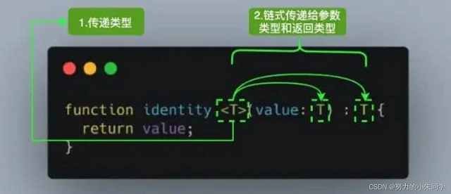

[TypeScript学习笔记---泛型Generics](#top)

- [泛型的概念](#泛型的概念)
- [泛型的基本使用](#泛型的基本使用)
  - [在函数中使用](#在函数中使用)
  - [在接口中使用-泛型接口](#在接口中使用-泛型接口)
  - [在类中使用-泛型类](#在类中使用-泛型类)
  - [在泛型里使用类类型](#在泛型里使用类类型)
- [泛型约束](#泛型约束)
- [泛型工具类Utility Type](#泛型工具类Utility-Type)
- [Using in Angular](#using-in-angular)
  - [Using as parameters](#using-as-parameters)
  - [Using in type/class/interface](#using-in-typeclassinterface)

------------------------------------------------------------------

## 泛型的概念

- Generics是一种创建可复用代码的方式，类似于代码组件的概念。具体来说，就是在定义接口、函数或类的时候，不预先指定参数、返回值的类型，而是在使用时，根据具体情况来指定相应的类型
- T，表示Type，是一个抽象类型，只有在调用函数时，才会确认具体的类型，这样就能适用于不同类型的数据。调用函数时，先把类型传递给 <T>中的T，然后再链式传递给参数类型和返回值类型。
- 

```typescript
function identity<T>(arg: T): T {
  return arg;
}

// 多个类型参数 1
function identity<T, U>(value: T, message: U) : T {
  console.log(message);
  return value;
}
// 调用时，使用 <> 定义好对应类型变量的类型 像传参一样 一一对应
console.log(identity<Number, string>(68, "Semlinker"));
// 在调用函数时，也可以省略使用 <> 显式设定类型，编译器可以自动根据我们的参数类型来得知对应类型
console.log(identity(68, "Semlinker"));

// 多个类型参数 2
function extend<T, U>(first: T, second: U): T & U {   // 这个函数用来合并两个对象，其语法为通过逗号分隔 <T, U, K>
  for(const key in second) {
    (first as T & U)[key] = second[key] as any
  }
  return first as T & U
}

// 多个类型参数 3，比如可以同时定义泛型 T 和 泛型 U：
function swap<T, U>(tuple: [T, U]): [U, T] {
    return [tuple[1], tuple[0]];
}
swap<number, string>([7, 'seven']); // ['seven', 7]
```

[⬆ back to top](#top)

## 泛型的基本使用

### 在函数中使用

```typescript
function fn<T> (arg:T):T{
  return arg;
}
//需要什么类型就可以给什么类型，类似于函数的传参
fn<number>(666);       //fn(666) 返回值是number类型 666
fn<string>('黄雨萌')   //fn('黄雨萌')  返回值是string类型 黄雨萌
fn<boolean>(true);    //fn(true) 返回值是布尔类型 true
```

- 泛型约束与索引类型: 设计一个函数，这个函数接受两个参数，一个参数为对象，另一个参数为对象上的属性，通过这两个参数返回这个属性的值, 正确写法
- 第二个参数 key 是不是存在于 obj 上是无法确定的，因此需要对这个 key 也进行约束，把它约束为只存在于 obj 属性的类型，这个时候需要借助索引类型进行实现`< U extends keyof T >`，用索引类型 keyof T 把传入的对象的属性类型取出生成一个联合类型，这里的泛型 U 被约束在这个联合类型中

```typescript
function getValue<T extends object, U extends keyof T>(obj: T, key: U) {
  return obj[key] // ok
}
const a = {
  name: 'xiaomuzhu',
  id: 1
}
```

### 在接口中使用-泛型接口

```typescript
interface Person<T> {
    <T, Y>(name: T, age: Y): T
}
let people:Person = function(name,age){
    return name
}
people("黄雨萌", 18)
//----------------------------------
interface ReturnItemFn<T> {
    (para: T): T
}
// 声明函数
const returnItem: ReturnItemFn<number> = para => para
```

### 在类中使用-泛型类

```typescript
class Friends<T, Y> {
    name: T
    age: Y
    constructor(name:T, age:Y) {
        this.name = name
        this.age = age
    }
}
let wife = new Friends("黄雨萌", 18) // 实例对象 Friends{name: '黄雨萌', age: 18}
//------------------------------------------
class Stack<T> {
    private arr: T[] = []
    public push(item: T) {
        this.arr.push(item)
    }
    public pop() {
        this.arr.pop()
    }
}
```

### 在泛型里使用类类型

- 在TypeScript使用泛型创建工厂函数时，需要引用构造函数的类类型

```typescript
function create(c: {new(): T; }): T {
    return new c();
}
// 一个更高级的例子，使用原型属性推断并约束构造函数与类实例的关系
class BeeKeeper {
    hasMask: boolean;
}
class ZooKeeper {
    nametag: string;
}
class Animal {
    numLegs: number;
}
class Bee extends Animal {
    keeper: BeeKeeper;
}
class Lion extends Animal {
    keeper: ZooKeeper;
}
function createInstance(c: new () => A): A {
    return new c();
}
createInstance(Lion).keeper.nametag;  // typechecks!
createInstance(Bee).keeper.hasMask;   // typechecks!
```

[⬆ back to top](#top)

## 泛型约束

- 如果我们不对泛型的类型变量进行约束，那么其类型理论上是可以是任何类型，那这样只能使用所有类型共有的属性或方法，否则就会报错
- 添加泛型约束收缩类型主要有以下两种方式：
  - 指定更具体的类型
  - 添加约束: 方式就是通过`extend`s关键字为类型变量添加约束

```typescript
function trace<T>(arg: T): T {
  console.log(arg.size); // 报错 Error: Property 'size doesn't exist on type 'T'
  return arg;
}
interface Sizeable {
  size: number;
}
function trace<T extends Sizeable>(arg: T): T {
  console.log(arg.size);
  return arg;
}
// 继承系统内置接口
function getValue<T extends object, U extends keyof T>(obj: T, key: U) {
  return obj[key]
}
const a = {
  name: 'xiaomuzhu',
  id: 1
}
getValue(a,'1');
```

[⬆ back to top](#top)

## 泛型工具类Utility Type

- 为了方便开发，TS内置了一些常用的工具类型，比如 Partial、Required等
- 基础特性:
  - `typeof`: 在JS中是用来判断值的类型，在TS中，typeof不仅能判断基本数据类型，还可以判断接口类型, 以及获取对象的属性类型结构，作为一个类型赋值给类型变量
  - `in`: 用来遍历枚举类型
  - `infer`（不清晰）: 在条件类型语句中，可以用infer声明一个类型变量并使用
  - `extends`: 主要用于给泛型添加约束
  - 映射类型: 根据已经存在的类型创建出新的类型，那被创建的新类型，称为映射类型
- 内置工具类型
  - `Partial<T>` 结合keyof 和 in ，将某类型的所有属性变成可选
    -  Partial 也有它的局限性：只支持对第一层属性进行处理，如果要处理的类型中有嵌套属性，则第二层往下就不会再处理。但如果想要对嵌套属性也进行处理，可以自己实现
  - `Required`: 将某类型的所有属性变成必选
  - `Readonly<T>` 的作用是将某个类型所有属性变为只读属性，也就意味着这些属性不能被重新赋值
  - `Pick` 从某个类型中挑出部分属性出来
  - `ReturnType`用来得到一个函数的返回值类型
  - `Exclude<T, U>` 的作用是将某个类型中属于另一个的类型移除掉，简单来说就是取不同的部分
  - `Extract<T, U>` 的作用是从T中提取出 U，简单来说就是取相同的部分
  - `NonNullable<T>` 的作用是用来过滤类型中的 `null` 及 `undefined` 类型
  - `Record`、`Omit`、`Parameters`等

```typescript
// infer
type ReturnType<T> = T extends (
  ...args: any[]
) => infer R ? R : any;
// extends
interface Lengthwise {
  length: number;
}
function loggingIdentity<T extends Lengthwise>(arg: T): T {
  console.log(arg.length);
  return arg;
}
// 映射类型
interface TestInterface{    // 已存在的接口类型
    name:string,
    age:number
}
type OptionalTestInterface<T> = {   // 处理已存在类型 并生成新类型的方法
  [p in keyof T]+?:T[p]
}
type newTestInterface = OptionalTestInterface<TestInterface>  // 获取新类型
// --------------------------------------------------
// 工具类型 Partial<>
type Partial<T> = {
  [P in keyof T]?: T[P];
};
interface UserInfo {    // 已存在的接口类型
    id: string;
    name: string;
}
type NewUserInfo = Partial<UserInfo>;  // 使用Partial
const xiaoming: NewUserInfo = {
    name: 'xiaoming'
}
// Partial 也有它的局限性：只支持对第一层属性进行处理，如果要处理的类型中有嵌套属性，则第二层往下就不会再处理。但如果想要对嵌套属性也进行处理，可以自己实现
type DeepPartial<T> = {
  [U in keyof T]?: T[U] extends object ? DeepPartial<T[U]> : T[U]    // 如果是 object，则递归类型
};
type PartialedWindow = DeepPartial<T>; // 现在T上所有属性都变成了可选啦
// Required
type Required<T> = {
    [P in keyof T]-?: T[P]   // 其中 -? 是代表移除 ? 这个 modifier 的标识
};
//  Readonly
type Readonly<T> = {
 readonly [P in keyof T]: T[P];
};
interface Todo {  // 使用
 title: string;
}
const todo: Readonly<Todo> = {
 title: "Delete inactive users"
};
todo.title = "Hello"; // Error: cannot reassign a readonly property
// Pick
type Pick<T, K extends keyof T> = {
    [P in K]: T[P];
};
interface Todo {   // 使用
  title: string;
  description: string;
  completed: boolean;
}
type TodoPreview = Pick<Todo, "title" | "completed">;
const todo: TodoPreview = {
  title: "Clean room",
  completed: false,
};
// ReturnType
type ReturnType<T extends (...args: any[]) => any> = T extends (
  ...args: any[]
) => infer R ? R : any; // infer在这里用于提取函数类型的返回值类型
type Func = (value: number) => string; // 使用
const foo: ReturnType<Func> = "1";  // ReturnType获取到 Func 的返回值类型为 string，所以，foo 也就只能被赋值为字符串了。
// Exclude
type Exclude<T, U> = T extends U ? never : T;
type T0 = Exclude<"a" | "b" | "c", "a">; // "b" | "c"   // 使用
type T1 = Exclude<"a" | "b" | "c", "a" | "b">; // "c"   // 使用
// Extract
type Extract<T, U> = T extends U ? T : never;
type T0 = Extract<"a" | "b" | "c", "a" | "f">; // "a"    // 使用
type T1 = Extract<string | number | (() => void), Function>; // () =>void
// NonNullable
type NonNullable<T> = T extendsnull | undefined ? never : T;
type T0 = NonNullable<string | number | undefined>; // 使用 string | number
type T1 = NonNullable<string[] | null | undefined>; // 使用 string[]
// omit   可以剔除已定义对象中，自己不需要的一部分形成新的定义类型。
interface UserObj {
  readonly name: string; // readonly 只读属性 只能初始化定义 不能二次赋值
  age: number;
  id: number;
  sex: 0 | 1;
  address: string;
  weight: number;
}
type Person = Omit<UserObj, "number" | "sex" | "address" | "weight">;  // 剔除省略自己不需要的
// 此时Person 等同于 Person1
interface Person1 {
  readonly name: string;
  id: number;
}
```

[⬆ back to top](#top)

## Using in Angular

### Using as parameters

```javascript
export class APIService {
  /** Constructor for the generic resource service */
  constructor(
    protected http: HttpClient,
    @Inject(ENV_TOKEN) protected environment: IEnvironment,
  ) {}
  private getHttpHeader(prms: Params = {}): HttpHeaders {
    return new HttpHeaders(prms)
      .set('Content-type', 'application/json')
      .set('Accept', 'application/json, text/plain, */*');
  }
  private getHttpParams(prms: Params = {}): HttpParams | undefined {
    if (Object.keys(prms ).length === 0) {
      return undefined;
    }
    return new HttpParams({fromObject: mapValues(prms, (v) => {
      return String(v);
    })});
  }
  /** Getting a resource URL */
  private buildUrl(...params: PrimitiveType[]): string {
    return coerceArray(params)
      .filter(it => !!it)
      .map(it => it.toString())
      .join('/');
  }
  /** To send data to a server to create a resource.  */
  create<T>(endpoint: string, item: T, options?: Partial<IRequestParams>): Observable<T> {
    return this.fetch<T>('POST', endpoint, item, options);
  }
  /**  An API to send data to a server to get a resource by id */
  get<T>(endpoint: string | PrimitiveType[], options?: Partial<IRequestParams>): Observable<T> {
    return this.fetch<T>('GET', endpoint, undefined, options);
  }
  /** To send data to a server to update a resource by id */
  update<T>(endpoint: string | PrimitiveType[], item: T, options?: Partial<IRequestParams>): Observable<T> {
    return this.fetch<T>('PUT', endpoint, item, options);
  }
  /** To send data to a server to delete a resource by id */
  delete<T>(endpoint: string, id: number | string, options?: Partial<IRequestParams>): Observable<T> {
    return this.fetch<T>('DELETE', [endpoint, id], undefined, options);
  }
  /** To send data to a server to get a list of resources using passed in parameters */
  load<T>(endpoint: string | PrimitiveType[], payload: unknown, options?: Partial<IRequestParams>): Observable<T> {
    return this.fetch<T>('POST', endpoint, payload, options);
  }
  fetch<T>(
    method: HttpMethod,
    endpoint: PrimitiveType | PrimitiveType[],
    payload: unknown = null,
    params: Partial<IRequestParams> = {}
  ): Observable<T> {                   // NOTE: request.ResponseType depends on underlying type
    const _params = {
      responseType: 'json',
      ...params
    };
    const url = this.buildUrl(...coerceArray(endpoint));
    const options: Partial<IRequestOptions> = {
      headers: this.getHttpHeader(_params.headers),
      params: this.getHttpParams(_params.params),
      body: payload ? JSON.stringify(payload) : undefined, // Ensure that the payload is text
      responseType: _params.responseType,
      reportProgress: _params.reportProgress,
      observe: _params.observe
    };
    options.body = payload ? JSON.stringify(payload) : undefined;
    return this.http.request<T>( method, url, options);
  }
  getJson<T>(path: string): Observable<T> {
    return this.http.get<T>(path);
  }
}
//------------------------------------------------------------------
export class PositionAccountCriteria extends PayloadEntity<IPositionAccountCriteria> {
  constructor(criteria: Partial<IPositionAccountFilter>, pager: IPage) {
    super(
      {
        searchString: criteria.searchString ?? '',
        sortBy: criteria.sortBy ?? '',
        sortDirection: criteria.sortDirection ?? 'ASC',
        securityCode: criteria.securityCode ?? '',
        accountProgramCodes: PositionAccountCriteria.valueMapper(criteria?.accountProgramCodes),
        repCodes: PositionAccountCriteria.valueMapper(criteria?.repCodes),
        includeAccountStateCodes: PositionAccountCriteria.valueMapper<string>(
          criteria?.includeAccountStateCodes,
        ),
        includeTradingStateCodes: PositionAccountCriteria.valueMapper<string>(
          criteria?.includeTradingStateCodes,
        ),
        planTypeCodes: PositionAccountCriteria.valueMapper(criteria?.planTypeCodes),
        accountCurrencyCodes: PositionAccountCriteria.valueMapper(criteria?.accountCurrencyCodes),
      },
      pager,
    );
  }
  private static valueMapper<T>(collection: IItem<T>[]): T[] {
    return size(collection) > 0 ? collection.map((it) => it.value).filter((it) => !!it) : null;
  }
}
```

### Using in type/class/interface

```javascript
export interface IDataViewSource<T> {
  source?: T[];
  pager?: IPage;
  sorter?: ISort;
  selected?: T[];
} 
//RequestsService<T> 和 AdhocSellRequestsService（AdhocSellRequestsService extends RequestsService<AdhocSellEntity>）
export abstract class RequestsService<T> extends AbstractFilterService<IRequestsFilter> {
  private readonly REQUEST_SEARCH_URL = 'workflows/search';
  protected readonly totalRecordCountSubject$ = new BehaviorSubject<number>(undefined);
  abstract get INITIAL_FILTER(): Partial<IRequestsFilter>;
  protected abstract mapToDataSource(response: IDataResponse<T>, pager: IPage, sorter: ISort): IDataViewSource<T>;
  protected abstract get EMPTY_FILTER(): Partial<IRequestsFilter>;
  protected abstract createFilterByAttributeValues(criteria: Partial<IRequestsFilter>): FilterBaseType[];
  get totalRecordCount$(): Observable<number> {
    return this.totalRecordCountSubject$.pipe();
  }
  constructor(
    protected readonly http: HttpClient,
    @Inject(ENV_TOKEN) protected environment: IEnvironment,
    protected readonly storageService: StorageService,
    protected readonly dialogService: DialogService,
    protected readonly messageService: MessageService,
  ) {
    super(http, environment, storageService);
  }
  //...
}
//
export class AdhocSellRequestsService extends RequestsService<AdhocSellEntity> {
  //...
}
```

[⬆ back to top](#top)
> references
- [TypeScript 学习笔记（四）--- 泛型（Generics）](https://blog.csdn.net/weixin_45092437/article/details/124020962)
- [Typescript 泛型(generic)](http://blog.stickdream.com/views/ts/2019/typescript-generic.html)
