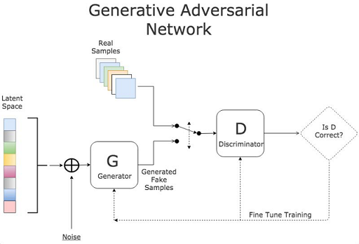

[机器学习之神经网络模型-深度学习模型分类总结](#top)

- [前馈神经网络(Feedforward Neural Network)](#前馈神经网络feedforward-neural-network)
  - [全连接神经网络FCN](#全连接神经网络fcn)
  - [卷积神经网络CNN-Convolutional Neural Networks](#卷积神经网络cnn-convolutional-neural-networks)
  - [残差网络ResNet -Residual Networks](#残差网络resnet--residual-networks)
  - [生成对抗网络GAN- Generative Adversarial Network](#生成对抗网络gan--generative-adversarial-network)
  - [变分自动编码器VAE -Variational Auto Encoder](#变分自动编码器vae--variational-auto-encoder)
  - [Transformer](#transformer)
- [反馈神经网络(Feedback Neural Network)](#反馈神经网络feedback-neural-network)
  - [循环神经网络RNN -Recurrent Neural Network](#循环神经网络rnn--recurrent-neural-network)
  - [长短期记忆网络LSTM- Long Short-Term Memory](#长短期记忆网络lstm--long-short-term-memory)
  - [Hopfield网络](#hopfield网络)
- [图神经网络GNN -Graph Neural Networks](#图神经网络gnn--graph-neural-networks)
- [模型常见应用场景](#模型常见应用场景)
- [补充](#补充)
  - [softmax函数](#softmax函数)

------------------------------------------

- 神经网络模型基本结构可以分为：前馈神经网络,反馈神经网络和图神经网络
  - Feedforward Neural Network也被称为多层感知机（multi-layer perceptron，MLP）
    - 不同的神经元属于不同的层，由输⼊层-隐藏层-输出层构成，信号从输⼊层往输出层单向传递，中间无反馈
    - 信息从输入层开始输入，每层的神经元接收前一级输入，并输出到下一级，直至输出层。整个网络信息输入传输中无反馈（循环）。即任何层的输出都不会影响同级层，可用一个有向无环图表示
    - 前馈神经⽹络中包含激活函数（sigmoid函数、tanh函数等）、损失函数（均⽅差损失函数、交叉熵损失函数等）、优化算法（BP算法）等
  - Feedback Neural Network中，神经元不但可以接收其他神经元的信号，而且可以接收自己的反馈信号。和前馈神经网络相比，反馈神经网络中的神经元具有记忆功能，在不同时刻具有不同的状态。反馈神经网络中的信息传播可以是单向也可以是双向传播，因此可以用一个有向循环图或者无向图来表示
  - 图神经网络: 图（graph）是一种在拓扑空间内按图结构组织来关系推理的函数集合，包括社交网络、知识图谱、分子图神经网络等
    - 图神经网络通常有以下几种网络模型：图卷积网络、图自编码器、图生成网络、图循环网络、图注意力网络

## 前馈神经网络(Feedforward Neural Network)

常见的前馈神经网络包括感知机、卷积神经网络CNN、全连接神经网络FCN、生成对抗网络GAN、RBF神经⽹络等

### 全连接神经网络FCN

- 全连接神经网络是深度学习最常见的网络结构，
- 有三种基本类型的层: 输入层、隐藏层和输出层。当前层的每个神经元都会接入前一层每个神经元的输入信号
- 在每个连接过程中，来自前一层的信号被乘以一个权重，增加一个偏置，然后通过一个非线性激活函数，通过简单非线性函数的多次复合，实现输入空间到输出空间的复杂映射
- 

### 卷积神经网络CNN-Convolutional Neural Networks

- 图像具有非常高的维数，因此训练一个标准的前馈网络来识别图像将需要成千上万的输入神经元，除了显而易见的高计算量，还可能导致许多与神经网络中的维数灾难相关的问题
- 卷积神经网络提供了一个解决方案，利用卷积和池化层，来降低图像的维度。由于卷积层是可训练的，但参数明显少于标准的隐藏层，它能够突出图像的重要部分，并向前传播每个重要部分, 传统的CNNs中，最后几层是隐藏层，用来处理“压缩的图像信息”
- 整体架构：输入层——卷积层——池化层——全连接层——输出层
- 
  - 输入层：以图片为例，输入的是一个三维像素矩阵，长和宽表示图像的像素大小，深度表示色彩通道（黑白为1，RGB彩色为3）
  - 卷积层：卷积层也是一个三维矩阵，它的每个节点（单位节点矩阵）都是上一层的一小块节点（子节点矩阵）加权得来，一小块的尺寸一般取33或55。此层的作用是对每一小快节点进行深入分析，从而提取图片更高的特征
  - 池化层：池化层不会改变三维矩阵的深度，其作用是缩小矩阵，从而减少网络的参数
  - 全连接层：跟全连接神经网络作用一样
  - Softmax层：得到当前样例属于不同种类的概率分布，并完成分类
- 卷积神经网络CNN的优点：
  - 良好的容错能力、并行处理能力和自学习能力，可处理环境信息复杂，背景知识不清楚，推理规则不明确情况下的问题
  - 它允许样本有较大的缺损、畸变，运行速度快，自适应性能好，具有较高的分辨率
  - 它是通过结构重组和减少权值将特征抽取功能融合进多层感知器，省略识别前复杂的图像特征抽取过程

### 残差网络ResNet -Residual Networks

- 深层前馈神经网络有一个问题，随着网络层数的增加，网络会发生了退化（degradation）现象：随着网络层数的增多，训练集loss逐渐下降，然后趋于饱和，当再增加网络深度的话，训练集loss反而会增大。为了解决这个问题，残差网络使用跳跃连接实现信号跨层传播
- 

### 生成对抗网络GAN- Generative Adversarial Network

- 生成对抗网络是一种专门设计用于**生成图像**的网络
- 由两个网络组成: 一个鉴别器和一个生成器。
  - 鉴别器的任务是区分图像是从数据集中提取的还是由生成器生成的，
  - 生成器的任务是生成足够逼真的图像，以至于鉴别器无法区分图像是否真实
  - 随着时间的推移，在谨慎的监督下，这两个对手相互竞争，彼此都想成功地改进对方。最终的结果是一个训练有素的生成器，可以生成逼真的图像
  - 鉴别器是一个卷积神经网络，其目标是最大限度地提高识别真假图像的准确率，而生成器是一个反卷积神经网络，其目标是最小化鉴别器的性能
- 

### 变分自动编码器VAE -Variational Auto Encoder

- 自动编码器学习一个输入（可以是图像或文本序列）的压缩表示，例如，压缩输入，然后解压缩回来匹配原始输入，而变分自动编码器学习表示的数据的概率分布的参数
- 不仅仅是学习一个代表数据的函数，它还获得了更详细和细致的数据视图，从分布中抽样并生成新的输入数据样本
- 

### Transformer

- Transformer是Google Brain提出的经典网络结构，由经典的Encoder-Decoder模型组成
- 整个Encoder层由6个左边Nx部分的结构组成。整个Decoder由6个右边Nx部分的框架组成，Decoder输出的结果经过一个线性层变换后，经过softmax层计算，输出最终的预测结果
- 

[back to top](#top) 
  
## 反馈神经网络(Feedback Neural Network)

常见的反馈神经网络包括循环神经网络RNN、长短期记忆网络LSTM、Hopfield网络和玻尔兹曼机

### 循环神经网络RNN -Recurrent Neural Network

- 循环神经网络是一种特殊类型的网络，它包含环和自重复，因此被称为“循环”, RNN在全连接神经网络的基础上增加了前后时序上的关系，可以更好地处理比如机器翻译等的与时序相关的问题
- RNN之所以称为循环神经网络，即一个序列当前的输出与前面的输出也有关。具体的表现形式为网络会对前面的信息进行记忆并应用于当前输出的计算中，即隐藏层之间的节点不再无连接而是有连接的，并且隐藏层的输入不仅包括输入层的输出还包括上一时刻隐藏层的输出。
- RNN用于解决训练样本输入是连续的序列,且序列的长短不一的问题，比如基于时间序列的问题。基础的神经网络只在层与层之间建立了权连接，RNN最大的不同之处就是在层之间的神经元之间也建立的权连接。
- RNNs通常用于**处理顺序任务**，如逐字生成文本或预测时间序列数据(例如股票价格)。它们还可以处理任意大小的输入
- 
- 循环神经网络的输入是序列数据，每个训练样本是一个时间序列，包含多个相同维度的向量。网络的参数如何通过训练确定？这里就要使用解决循环神经网络训练问题的 Back Propagation Through Time 算法，简称BPTT。
- 循环神经网络的每个训练样本是一个时间序列，同一个训练样本前后时刻的输入值之间有关联，每个样本的序列长度可能不相同。训练时先对这个序列中的每个时刻的输入值进行正向传播，再通过反向传播计算出参数的梯度值并更新参数
- RNN包含四个步骤，简述如下：
  - 正向计算每个神经元的输出值
  - 反向计算每个神经元的误差项 ，它是误差函数对神经元的加权输入的偏导数
  - 计算每个权重的梯度
  - 用随机梯度下降算法更新权重
- 循环神经网络在进行反向传播时也面临梯度消失或者梯度爆炸问题，这种问题表现在时间轴上。如果输入序列的长度很长，人们很难进行有效的参数更新。通常来说梯度爆炸更容易处理一些。梯度爆炸时我们可以设置一个梯度阈值，当梯度超过这个阈值的时候可以直接截取。有如下三种方法解决梯度消失的问题：
  - 合理的初始化权重值。初始化权重，使每个神经元尽可能不要取极大或极小值，以躲开梯度消失的区域
  - 使用 ReLu 代替 sigmoid 和 tanh 作为激活函数
  - 使用其他结构的RNNs，比如长短时记忆网络（LSTM）和 门控循环单元 （GRU），这是最流行的做法

[back to top](#top)

### 长短期记忆网络LSTM- Long Short-Term Memory

- LSTM结构是专门为解决RNN在学习长的的上下文信息出现的梯度消失、爆炸问题而设计的
- LSTM结构中加入了内存块。这些模块可以看作是计算机中的内存芯片——每个模块包含几个循环连接的内存单元和三个门(输入、输出和遗忘，相当于写入、读取和重置)。信息的输入只能通过每个门与神经元进行互动，因此这些门学会智能地打开和关闭，以防止梯度爆炸或消失
- 

### Hopfield网络

- Hopfield神经网络是一种单层互相全连接的反馈型神经网络
- 每个神经元既是输入也是输出，网络中的每一个神经元都将自己的输出通过连接权传送给所有其它神经元，同时又都接收所有其它神经元传递过来的信息
- 

## 图神经网络GNN -Graph Neural Networks

- GNN是直接在图数据结构上运行的神经网络。GNN的典型应用便是节点分类。
- 图神经网络就是将图数据和神经网络进行结合，在图数据上面进行端对端的计算
- 
- 图神经网络的计算过程总结起来就是聚合邻居。图神经网络是直接在图上进行计算，整个计算的过程，沿着图的结构进行，这样处理的好处是能够很好的保留图的结构信息。而能够对结构信息进行学习，正是图神经网络的能力所在。图数据无处不在，图神经网络的应用场景自然非常多样
- 

[back to top](#top)

## 模型常见应用场景

|模型|应用场景|
|---|---|
|Recurrent Neural Networks(RNN)|sentimnent analysis|
|Convolutional Neural Networks(CNN)|Object detection in images/video|
|Long Short-Term Memory(LSTM)|stock price prediction|
|Artificial Neural networks(ANN)|Banking fraud Prediction|

## 补充

### softmax函数

- 输出结果某种处理后，变成0-1之间，这个处理我们就叫做校准。那我们要用什么东西来校准呢？
- softmax函数可以将未规范化的预测变换为非负并且总和为1，同时要求模型保持可导。其函数形式为  $\hat y = softmax(0), 其中 \quad\hat y_i = \frac{exp(o_j)}{\sum_k exp(o_k)}$
  - 对于所有的j总有$\quad 0<=\hat{y_j} <= 1$ 可以视为一个正确的概率发布。softmax运算不会改变未规范化的预测o之间的顺序，只会确定分配给每个类别的概率
  - softmax回归是一个线性模型

[back to top](#top)

> references
- [一文全览神经网络模型](https://blog.csdn.net/qq_40877422/article/details/120875237)
- 

[back to top](#top)
  
