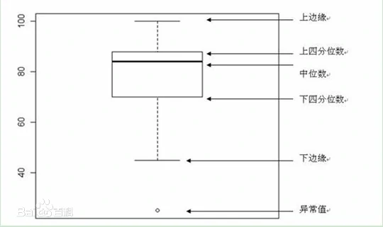
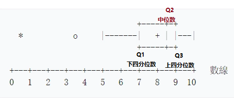
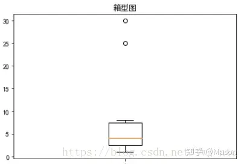
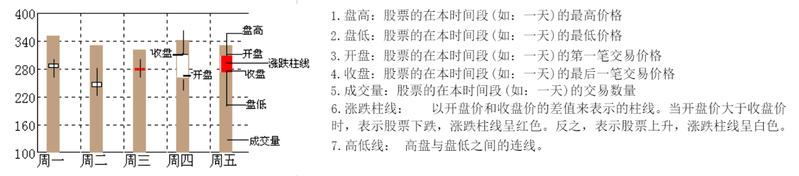

[统计学图](#top)

- [统计学之箱形图](#统计学之箱形图)
  - [箱形图绘制方法](#箱形图绘制方法)
  - [箱形图五要素](#箱形图五要素)
- [统计学之股价图](#统计学之股价图)

## 统计学之箱形图

- 箱形图主要用于反映原始数据分布的特征，还可以进行多组数据分布特征的比较
- 箱形图最大的优点就是不受异常值的影响，可以以一种相对稳定的方式描述数据的离散分布情况
- 
- 
  - 这组数据显示出：
    - 最小值(minimum)=5
    - 下四分位数(Q1)=7
    - 中位数(Med--也就是Q2)=8.5
    - 上四分位数(Q3)=9
    - 最大值(maximum)=10
    - 平均值=8
    - 四分位间距$(interquartile range)={\displaystyle Q3-Q1}=2$ (即ΔQ)
  - 在区间 Q3+1.5ΔQ, Q1-1.5ΔQ 之外的值被视为应忽略(farout)
    - farout: 在图上不予显示，仅标注一个符号∇
    - 最大值区间： Q3+1.5ΔQ
    - 最小值区间： Q1-1.5ΔQ
  - 最大值与最小值产生于这个区间。区间外的值被视为outlier显示在图上.
    - mild outlier = 3.5
    - extreme outlier = 0.5

### 箱形图绘制方法

- 箱形图提供了一种只用5个点对数据集做简单总结的方式。这5个点包括中点、Q1、Q3、分部状态的高位和低位。箱形图很形象的分为中心、延伸以及分布状态的全部范围。
箱形图中最重要的是对相关统计点的计算,相关统计点都可以通过百分位计算方法进行实现。
- 先找出一组数据的上边缘、下边缘、中位数和两个四分位数；然后， 连接两个四分位数画出箱体；再将上边缘和下边缘与箱体相连接，中位数在箱体中间。

### 箱形图五要素

- 中位数Q2，即二分之一分位数。所以计算的方法就是将一组数据平均分成两份，取中间这个数。
  - 如果原始序列长度n是奇数，那么中位数所在位置是$(n+1)/2$
  - 如果原始序列长度n是偶数，那么中位数所在位置是$n/2$，$n/2+1$，中位数的值等于这两个位置的数的算数平均数
- 上四分位数Q1
  - 强调一下，四分位数的求法，是将序列平均分成四份。具体的计算目前有$(n+1)/4$与$(n-1)/4$两种，一般使用$(n+1)/4$
- 下四分位数Q3
  - 下四分位数所在位置计算方法同上，只不过是$(1+n)/4*3=6.75$，这个是个介于第六个位置与第七个位置之间的地方
- 内限: 两个T形的盒须就是内限
  - T形线段所延伸到的极远处，是$Q3+1.5IQR$(其中，$IQR=Q3-Q1$)与剔除异常值后的极大值两者取最小
  - 下面的T形线段所延伸到的极远处，是Q1-1.5IQR与剔除异常值后的极小值两者取最大

[back to top](#top)

## 统计学之股价图

