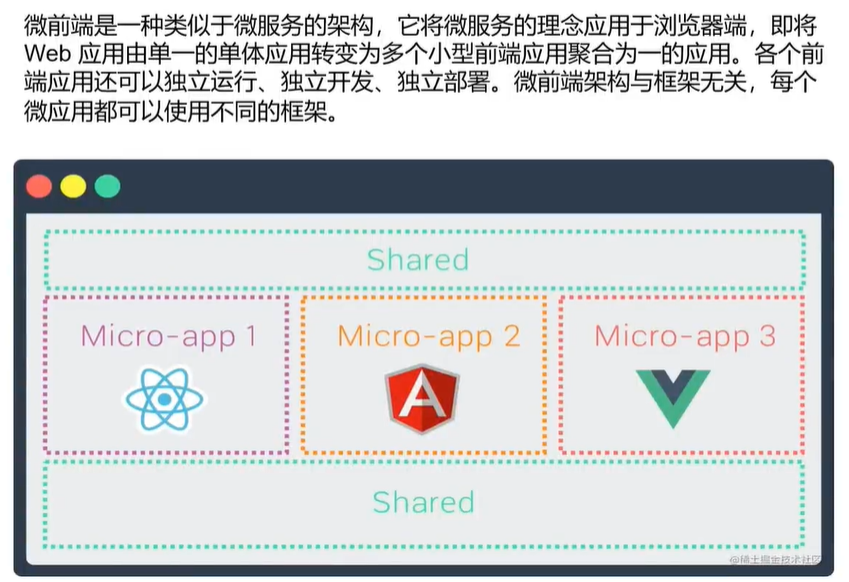

[top](#top)

- [概述](#概述)
- [Angular project](#angular-project)
- [Vite and Module Federation](#vite-and-module-federation)
  - [host Project](#host-project)
  - [remote Project](#remote-project)
- [Intergate with Webpack](#intergate-with-webpack)
------------------------------------------------------

## 概述

- 多个独立的构建可以组成一个应用程序，这些独立的构建之间不应该存在依赖关系，因此可以单独开发和部署它们
- 
- 微前端实现方案
  - 路由分发式微前端
  - iframe-spa
  - qiankun--[微前端--qiankun框架](https://www.kancloud.cn/ljh0508/vue11/2520781)
  - webpack5: module federation
  - Web component

[⬆ back to top](#top)

## Angular project

- [Angular Advanced学习笔记之--Micro Frontend.md](https://github.com/honggzb/Study-General/blob/master/Angular-Study/Angular%20Advanced%E5%AD%A6%E4%B9%A0%E7%AC%94%E8%AE%B0/Angular%20Advanced%E5%AD%A6%E4%B9%A0%E7%AC%94%E8%AE%B0%E4%B9%8B--Micro%20Frontend.md)

## Vite and Module Federation

- [vite-plugin-federation](https://github.com/originjs/vite-plugin-federation)
- 需要2个以上的工程:
  - 一个作为Host端，
  - 一个作为Remote端

[⬆ back to top](#top)

### host Project

- `npm create vite host --template react`
- `cd host` -> `npm i`
- `npm install @originjs/vite-plugin-federation --save-dev`
- modify 'vite.config.ts'
- modify 'src/app.tsx'

```ts
//vite.config.ts
import { defineConfig } from 'vite'
import react from '@vitejs/plugin-react'
import federation from "@originjs/vite-plugin-federation";
// https://vitejs.dev/config/
export default defineConfig({
  plugins: [
    react(),
    federation({
      name: "app",
      remotes: {
        remoteApp: "http://localhost:5001/assets/remoteEntry.js",
      },
      shared: ["react", "react-dom"],
    }),
  ],
  build: {
    modulePreload: false,
    target: "esnext",
    minify: false,
    cssCodeSplit: false,
  },
})
```

```ts
//src/app.tsx
import { useState } from 'react'

import Button from "remoteApp/Button";
import useStore from "remoteApp/store";
function App() {
  const [count, setCount] = useState(0)
  return (
    <div className="App">
      <h1>Host Application</h1>
      <Button />
      <br/>
      <div className="card">
        <button onClick={() => setCount((count) => count + 1)}>
          count is {count}
        </button>
      </div>
    </div>
  )
}
export default App
```

[⬆ back to top](#top)

### remote Project

- `npm create vite remote --template react`
- `cd remote` -> `npm i`
- `npm install @originjs/vite-plugin-federation --save-dev`
- modify 'package.json'
  - using different port number, such as 5001
  - add `"serve": "vite preview --port 5001 --strictPort"`
- modify 'vite.config.ts'
- create a new file 'src/Button.tsx'
- modify 'src/app.tsx'
- run `npm run build`
  - make sure there is 'remote\dist\assets\remoteEntry.js' file
  - **note: it need run redeploy for every changes**
- run `npm run serve`
- open a new command line --> go to host directory --> run `npm run dev`
- input `http://localhost:5001/` and `http://localhost:5173/` in browser address

```
"dev": "vite --port 5001 --strictPort",
"build": "tsc && vite build",
"preview": "vite preview --port 5001 --strictPort",
"serve": "vite preview --port 5001 --strictPort"
```

```ts
import { defineConfig } from 'vite'
import react from '@vitejs/plugin-react'
import federation from "@originjs/vite-plugin-federation";
// https://vitejs.dev/config/
export default defineConfig({
  plugins: [
    react(),
    federation({
      name: 'remote-app',
      filename: 'remoteEntry.js',
      // 需要暴露的模块
      exposes: {
          './Button': './src/Button.tsx',
      },
      shared: ['react','react-dom']
    })
  ],
  build: {
    modulePreload: false,
    target: "esnext",
    minify: false,
    cssCodeSplit: false,
  },
})
```

```ts
//src/Button.tsx
import { useState } from 'react'
const Button = ()  => {
  const [bcount, setState] = useState(0);
  return (
    <div className="card">
        <button onClick={() => setState((count) => count + 1)}>
          remote button: count is { bcount }
        </button>
    </div>
  )
}
export default Button
//src/app.tsx
import Button from './Button'
function App() {
  const [count, setCount] = useState(0)
  return (
    <div className='App'>
      <h1> Remote Application</h1>
      <Button />
      <br/>
      <div className="card">
        <h4> Remote Application</h4>
        <button onClick={() => setCount((count) => count + 1)}>
          count is {count}
        </button>
      </div>
    </div>
  )
}
```

[⬆ back to top](#top)

## intergate with Webpack

- 'wp-host' folder
1. modify 'webpack.config.js'
2. create new file in root --> 'index.ejs'

```ts
//webpack.config.js
plugins: [
    new ModuleFederationPlugin({
      name: "wp_host",
      library: { type: "module" },
      filename: "remoteEntry.js",
      remotes: {
        remote: "http://localhost:5001/assets/remoteEntry.js",
      },
      exposes: {},
      shared: {
        ...deps,
        react: {
          singleton: true,
          requiredVersion: deps.react,
        },
        "react-dom": {
          singleton: true,
          requiredVersion: deps["react-dom"],
        },
      },
    }),
    new HtmlWebPackPlugin({
      template: "./index.ejs",     // new ejs file 
      inject: false,
    }),
  ],
//index.ejs
<html>
<head>
    <% for (key in htmlWebpackPlugin.files.js) { %>
    <script type="module" src="<%= htmlWebpackPlugin.files.js[key] %>"></script>
    <% } %>
</head>
<body>
<div id="app"></div>
</body>
</html>
```

[⬆ back to top](#top)

> References
- [webpack-Module Federation](https://webpack.js.org/concepts/module-federation/)
- [vite-plugin-federation](https://github.com/originjs/vite-plugin-federation)
- [Vite guide-official](https://vitejs.dev/guide/)
- [React Micro Frontend Application With Module Federation: A Step-By-Step Guide](https://medium.com/@r.sipchenko/react-micro-frontend-application-with-module-federation-a-step-by-step-guide-6b432343d20)
> YouTube and Bilibili
- [Vite and Module Federation Makes Micro-Frontends EASY!](https://www.youtube.com/watch?v=t-nchkL9yIg)
  - https://github.com/jherr/vite-mod-fed
- [Micro-Frontends Course - Beginner to Expert](https://www.youtube.com/watch?v=lKKsjpH09dU)
- [Mastering Micro-Frontends With RSpack and Module Federation](https://www.youtube.com/watch?v=32_EikGKESk)
- [Angular Microfrontends with NX and Module Federation](https://www.youtube.com/watch?v=xL4hhZ6wKV8&t=626s)
- [Micro frontend introduction using Module Federation of Webpack 5 and Angular framework | Amar](https://www.youtube.com/watch?v=1FWAGSVsmrI&list=PL1UWPWOy5UlfLWfSstHBW-iVu6RWJtrG-)
- [Angular, Micro Frontends (Module Federation), and NX Monorepos - Shared Data, Libraries, and Builds](https://www.youtube.com/watch?v=edTA7amdvzI)
- [Angular Module Federation Micro-FE Speed Run](https://www.bilibili.com/video/BV1ag41177Ky/)
