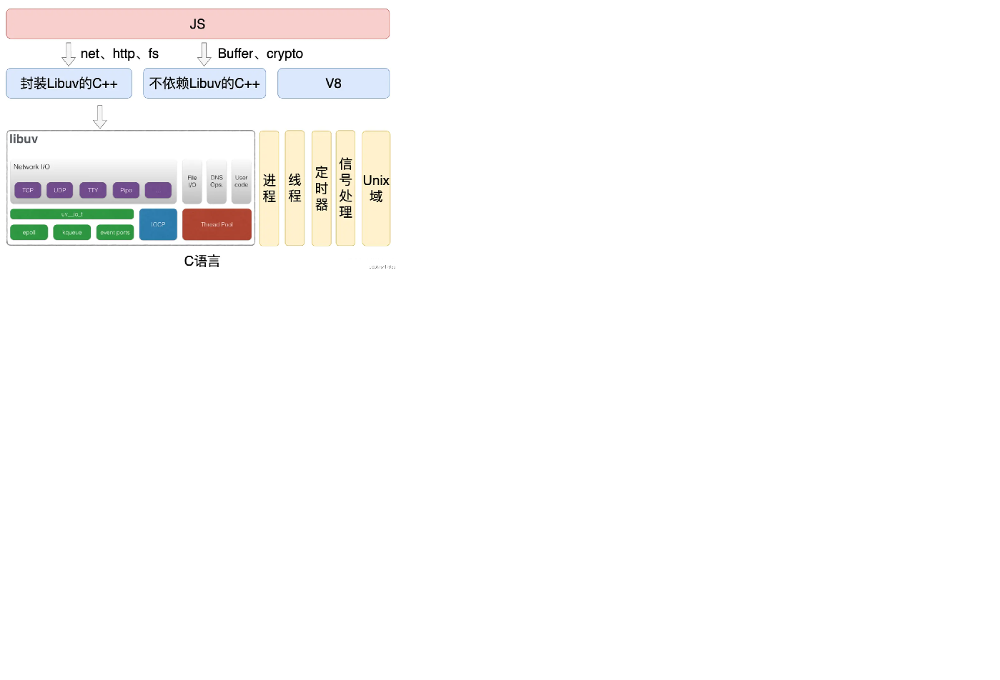

## nodejs 底层原理

Node.js 主要由 V8、Libuv 和第三方库组成：

- Libuv：跨平台的异步 IO 库，但它提供的功能不仅仅是 IO，还包括进程、线程、信号、定时器、进程间通信，线程池等。
- 第三方库：异步 DNS 解析（ cares ）、HTTP 解析器（旧版使用 http_parser，新版使用 llhttp）、HTTP2 解析器（ nghttp2 ）、 解压压缩库( zlib )、加密解密库( openssl )等等。
- V8：实现 JS 解析、执行和支持自定义拓展，得益于 V8 支持自定义拓展，才有了 Node.js。
也可以理解成 js应用层  桥C/C++  底层C/C++ 

- 
-  libuv源码地址[GitHub - libuv/libuv: Cross-platform asynchronous I/O](https://gitcode.com/libuv/libuv?utm_source=csdn_github_accelerator&isLogin=1)

[⬆ back to top](#top)
