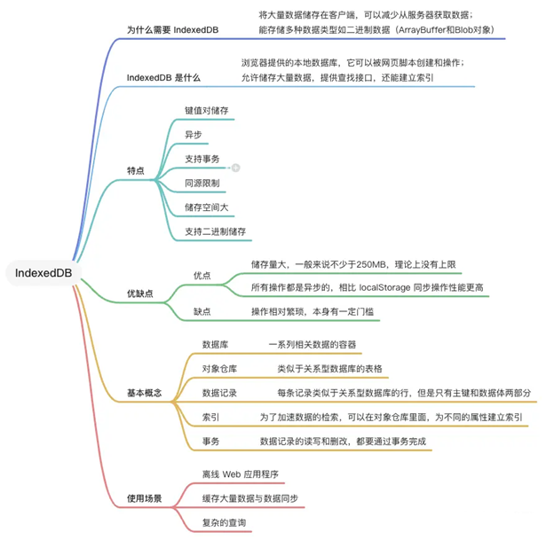
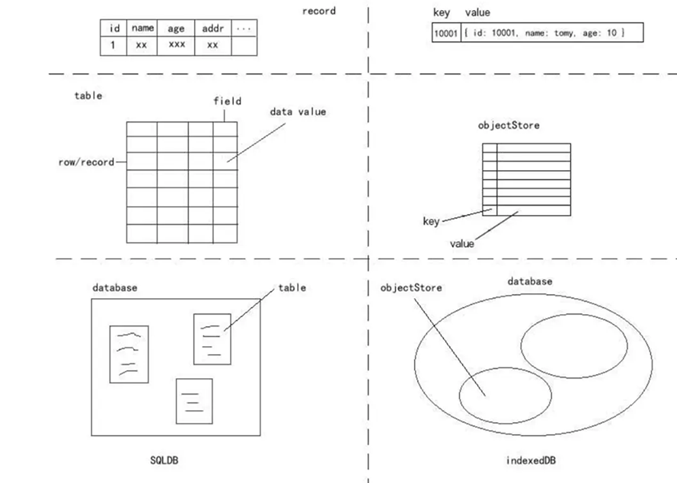

[PWA基础学习-IndexedDB](#top)

- [Introduction](#introduction)
- [IndexedDB terms](#indexeddb-terms)
  - [结构层面：database](#结构层面database)
  - [存储层面：objectStore](#存储层面objectstore)
  - [原子层面：key-value](#原子层面key-value)
  - [应用层面：index、cursor](#应用层面indexcursor)
  - [设计层面：transaction(事务)](#设计层面transaction事务)
- [check for IndexedDB support](#check-for-indexeddb-support)
- [操作流程](#操作流程)
  - [打开/连接数据库](#打开连接数据库)
  - [关闭数据库](#关闭数据库)
  - [删除数据库](#删除数据库)
  - [新建对象仓库（表）](#新建对象仓库表)
  - [新建索引](#新建索引)
  - [新建数据](#新建数据)
  - [更新数据](#更新数据)
  - [读取数据](#读取数据)
  - [查询数据（单条数据）](#查询数据单条数据)
  - [获取全量数据](#获取全量数据)
  - [查询含有某个字段值的全量数据](#查询含有某个字段值的全量数据)
  - [删除数据](#删除数据)
- [使用Promise封装IndexedDB](#使用promise封装indexeddb)
- [Dexie.js](#dexiejs)
  - [installation](#installation)
  - [Declare Database](#declare-database)
  - [use in project](#use-in-project)

---------------------------------------------------------

## Introduction

- IndexedDB is a client-side NoSQL database that allows web applications to store and retrieve structured data
- IndexedDB is particularly useful for web applications that need to work offline or have significant data storage requirements. It offers features such as data indexing, transactions, and cursor-based navigation, making it a powerful choice for managing data in web applications
- 
- IndexedDB 具有以下特点
  - **键值对储存**。 IndexedDB 内部采用对象仓库（object store）存放数据。所有类型的数据都可以直接存入，包括JavaScript对象。对象仓库中，数据以"**键值对**"的形式保存，每一个数据记录都有对应的主键，主键是独一无二的，不能有重复，否则会抛出一个错误
  - **异步**。 IndexedDB 操作时不会锁死浏览器，用户依然可以进行其他操作，这与 LocalStorage 形成对比，后者的操作是同步的。异步设计是为了防止大量数据的读写，拖慢网页的表现。
  - **支持事务（transaction）**。 这意味着一系列操作步骤之中，只要有一步失败，整个事务就都取消，数据库回滚到事务发生之前的状态，不存在只改写一部分数据的情况
  - **同源限制**，每一个数据库对应创建它的域名。网页只能访问自身域名下的数据库，而不能访问跨域的数据库。
  - **储存空间大** 一般来说不少于 250MB，甚至没有上限
    - Cookie- 4KB
    - LocalStorage -> 2.5MB-10MB
  - **支持二进制储存**。可以储存二进制数据（ArrayBuffer 对象和 Blob 对象）
- 应用场景
  - 需要大数据量的存储
  - 需要频繁的读写
  - 读写的内容不一定是规范化的数据库表结构
  - 希望读写过程是不影响主进程的

[⬆ back to top](#top)

## IndexedDB terms



|terms|对象|Explanation|
|---|---|---|
|Database|IDBDatabase 对象|每个域名（严格的说，是协议+域名+端口）都可以新建任意多个数据库|
|Object store|IDBObjectStore 对象|类似于关系型数据库的表格, 每个数据库可以有多个objectStore|
|Index|IDBIndex 对象|可以在对象仓库里面，为不同的属性建立索引|
|Transaction|IDBTransaction 对象|事务对象提供error、abort和complete三个事件，用来监听操作结果|
|Cursor|IDBCursor 对象|A mechanism for iterating over multiple records in a database|
|操作请求|IDBRequest 对象 ||
|主键集合|IDBKeyRange 对象||

### 结构层面：database

每个域名（严格的说，是协议+域名+端口）都可以新建任意多个数据库

### 存储层面：objectStore

- objectStore: 每个数据库可以有多个objectStore
- **objectStore的类型**(个人进行分类的，原则上没有这样的):
  - 对象型：`db.createObjectStore('mystore', {keyPath: 'id'})`
  - 非对象型 `db.createObjectStore('mystore', {autoIncrement: true})`
  - 混合型 `db.createObjectStore('mystore', {keyPath: 'id', autoIncrement: true})`
    - autoIncrement是indexedDB的可以自动生成机制(自动增长);
    - 当一个objectStore开启该功能后，在添加一条记录是，value不存在keyPath情况下，不会报错，而是被自动添加;
    - 当keyPath 和 autoIncrement两个配置选项同时传入时，一个被存入的对象如果不存在keyPath,这个对象会自动被添加该keyPath,对象被改写

### 原子层面：key-value

- objectStore就像一个对象，以key-value的形式存储所有数据
- **objectStore每一条记录格式**： key 和 value
  - key 是 value的标记值，通过key得到indexedDB中存储的对应值。要获得value，必须通过key来获得。key和value具有绑定关系，key相当于value的缩写、别名、标记
- indexedDB的**key** 有两种形态： inline 和 outline
  - inline key是指key被包含在value中，例如你存储的value是对象，就可以将key包含在 value中
  - outline key 则是不被包含在value中，例如你存储的是字符串或者ArrayBuffer，就不可能在value中包含key，这种情况下通过开启autoIncrement来实现的
- **keyPath** 是指在对象中，获取一个节点指的属性链式方法的字符串表达式
 - keyPath的作用是读取key。key是value的keyPath的值。
    - 在indexedDB中，keyPath是一个配置选项，在创建objectStore和index是传入，一经确定，不能再改。
    - 对于outline key的情况，在创建objectStore时，我们不传keyPath，开启autoIncrement功能。
  - value 可以是 String,Date,Object,Array,File,Blob,ImageData,Null,Number等，支持存储ArrayBuffer，不能存Function、类的实例;

```js
      const request = window.indexedDB.open('mydb', 1)
      request.onupgradeneeded = e => {
          const db = e.tareget.result
          if (!db.objectStoreNames.contains('mystore')) { // 先判断一下这个对象仓库(表),是否存在，不存在在新建
              db.createObjectStore('mystore', {keyPath: 'id'})
          }
      }
      request.onsuccess = e => {
          const db = e.target.result
          // .....
      }
```

[⬆ back to top](#top)

### 应用层面：index、cursor

- **index(索引)**
  - 索引是用于查询数据的补充方式;
  - 索引(存储空间)本质上是一种特殊的objectStore。也有自己的name,keyPath,key和value。特殊在于索引值可有一定的逻辑约束，例如  `unique`;
  - idnex 依附于 objectStore而存在。是objectStore的查询补充方式。
  - index的key 和 value 全部来自于objectStore。key为某条记录的keyPath(index.keyPath)的值，value为这条记录的key(objectStore.key)。
  - index中的一条记录对应objectStore中的一条记录。当objectStore的记录发生变化时，index中的记录会被自动污染(自动更新)
- **cursor游标**
  - 游标 是indexedDB的遍历工具。
  - 本质上，它是一个迭代器，可以通过 .value 读取当前值，通过 .continue 继续迭代。
  - 游标有方向，可以从最后的记录往前遍历
  - 游标的作用：遍历数据的需要；当indexedDB内置方法无法满足数据查询需要时，可以利用游标遍历数据，挑选需要的数据出来；快速寻找位于objectStore末尾的记录时使用

```js
// 使用游标的示例
let transaction = db.transaction(['myObjectStore'], 'readonly') // 发起事务
let objectStore = transaction.objectStore('myObjectStore')
let request = objectStore.openCursor()
let results = []
request.onsuccess = e => {
    let cursor = e.target.result
    if (cursor) {
        results.push(cursor.value)
        cursor.continue()
    } else {
        // 所有的object都在results里面
    }
}
```

- range(域)：
  - 用于挑选一定域内记录的工具。indexedDB内置了`IDBKeyRange`作为range内置工具对象.
  - 一般我们在能使用key的地方都能使用range,用range代替key来进行查询。
  - 在使用cursor时，可以通过range来前置遍历的范围

```js
var transaction = db.transaction(['fThings'], 'readonly')
var objectStore = transaction.objectStore('fThings')
objectStore.openCursor(keyRangeValue).onsuccess = e => {
    var cursor = e.target.result
    if (cursor) {
        // ---
    }
}
```

[⬆ back to top](#top)

### 设计层面：transaction(事务)

- 事务是一个状态机，它是一系列事件请求(request)的队列，并有权决定一系列事件是否可以操作成功(或放弃操作)。
- indexedDB的事务处理是内置的，自动的
- 处于同一事务中的事件请求按进入队列的顺序依次执行，但对于数据的修改进行确定，却是在事务结束时，一旦中间有事件导致报错，中断事务，所有的事件操作都被废弃，没有一个修改是成功的。它对数据有保护性，防止写入操作造成已有数据坏掉
  - request：
    - 当一个事务开启后，它具有一定的持续性。
    - indexedDB的一切数据操作都在一个事务中进行。你可以在一个事务中做一件或多件事。要做一件事的时候，你需要在这个事务过程中，发起一个request.
    - 一个request只做一件事。
    - 事务是request的队列。
    - indexedDB的任何一个操作都在一个仅包含自己的request中完成。
  - 四种request:
    - database request
    - objectStore request
    - index request
    - cursor request
- 事务开启时，需要传入mode(只读,读写) 和 scope, 这个scope包含一个以上的objectStore.
- 事务中的数据操作，仅能对scope中的objectStore进行数据操作

[⬆ back to top](#top)

## check for IndexedDB support

```js
function indexedDBStuff () {
  // Check for IndexedDB support:
  window.indexedDB = window.indexedDB || window.mozIndexedDB || window.webkitIndexedDB || window.msIndexedDB
  if (!window.indexedDB)) {
    console.log("This browser doesn't support IndexedDB");  // Can't use IndexedDB
    return;
  } else {
    // Do IndexedDB stuff here:
    // ...
  }
}
// Run IndexedDB code:
indexedDBStuff();
```

## 操作流程

1. 首先打开数据库 -> `indexedDB.open()` -> IDBDatabase
2. 开始一个事务 -> `IDBDatabase.transaction()` -> IDBTransaction ->IDBObjectStore
3. 新建数据库 `IDBObjectStore.createObjectStore()`
4. 新增数据 `IDBObjectStore.add()`、读取数据 `IDBObjectStore.get()`、更新数据 `IDBObjectStore.put()`、删除数据 `IDBObjectStore.delete()`
5. 遍历数据 `IDBObjectStore.openCursor()`


### 打开/连接数据库

- `const request = window.indexedDB.open(name, version)`
  - **name**：数据库名称。如果指定的数据库不存在，就会新建数据库。
  - **version**：指定数据库版本（整数）。如果省略，打开已有数据库时，默认为当前版本；新建数据库时，默认为 1。当想要更改数据库格式（比如增加对象存储，非增加记录），必须指定更高版本。
  - **返回值**：**IDBOpenDBRequest 对象**，这个对象通过三种事件 error、success、upgradeneeded，处理打开数据库的操作结果

```js
const request = window.indexedDB.open('myIndexedDB')
// success 事件表示成功打开数据库
request.onsuccess = (event) => {
  db = event.target.result
  console.log('打开 IndexedDB 成功')
}
// error 事件表示打开数据库失败
request.onerror = (event) => {
  console.log('打开 IndexedDB 失败')
}
// 如果指定的版本号，大于数据库的实际版本号，就会发生数据库升级事件 upgradeneeded request.onupgradeneeded = function (e) {
  console.log('当前数据库版本号为' + e.newVersion)
}
```

### 关闭数据库

```js
let db
const request = window.indexedDB.open('myIndexedDB')
request.onsuccess = (event) => {
  db = event.target.result
  console.log('打开 IndexedDB 成功')
  db.close()
  console.log('关闭数据库成功')
}
```

[⬆ back to top](#top)

### 删除数据库

```js
window.indexedDB.deleteDatabase('myIndexedDB')
```

[⬆ back to top](#top)

### 新建对象仓库（表）

```js
const objectStore = IDBDatabase.createObjectStore(name)
const objectStore = IDBDatabase.createObjectStore(name, options)
request.onupgradeneeded = function (e) {
  const objectStore = db.createObjectStore('persons', { keyPath: 'id' })
}
```

- name：被创建的 object store 的名称
- options：
  - keyPath：存储使用的主键
  - autoIncrement：是否使用自动递增的整数作为主键，默认为 false
- 该方法创建并返回一个新的 object store 或 index


[⬆ back to top](#top)

### 新建索引

- `IDBObject.createIndex`: 通过数据对象的某个属性来创建索引，在数据库中进行检索时，只能通过被设为索引的属性进行检索
  - indexName：索引名称
  - keyPath：索引所在的属性
  - options：配置对象。常用参数是 unique，表示该字段值是否唯一不重复

```js
IDBObject.createIndex(indexName, keyPath, options)
request.onupgradeneeded = function (e) {
  db = e.target.result
  const objectStore = db.createObjectStore('persons', { keyPath: 'id' })
  // 创建索引
  objectStore.createIndex('name', 'name')
  objectStore.createIndex('age', 'age')
}
```

[⬆ back to top](#top)

### 新建数据

- 新增数据指的是向对象仓库（表）写入数据记录，使用 `IDBObjectStore.add()` 方法。
- 数据库的操作都是基于事务（transaction）来进行的，所以对于增删改查都会用到 `IDBTransaction`

```js
request.onsuccess = (event) => {
  db = event.target.result

  const items = [{ id: 1, name: '张三', age: 18 }]
  // 创建一个读写事务
  const transaction = db.transaction(['persons'], 'readwrite')
  // 获取对象存储区，返回 IDBObjectStore 对象
  const objectStore = transaction.objectStore('persons')
  // 向表格写入一条记录
  const request = objectStore.add(items[0])
  request.onsuccess = function (e) {
    console.log('写入数据成功')
  }
  request.onerror = function (e) {
    console.log('写入数据失败')
  }
}
```

[⬆ back to top](#top)

### 更新数据

- `IDBObjectStore.put()`: 用于更新一条给定的数据库记录，如果给出的值不存在，则插入一个新的记录

```js
function update() {
  // 创建一个读写事务
  const transaction = db.transaction(['persons'], 'readwrite')
  // 获取对象存储区
  const objectStore = transaction.objectStore('persons')
  // 更新数据
  const request = objectStore.put({ id: 1, name: '李四', age: 30 })
  request.onsuccess = function (e) {
    console.log('更新数据成功')
  }
  request.onerror = function (e) {
    console.log('更新数据失败')
  }
}
```

[⬆ back to top](#top)

### 读取数据

- 数据库读取使用到的 API是`IDBCursor`，IDBCursor接口表示一个游标，用于遍历或迭代数据库中的多条记录
- 使用的时候可以使用存储对象的 `openCursor()` 方法来打开游标
- 也可以使用 `IDBObjectStore.get()`，传入标识要检索的记录的键或键范围

```js
function read() {
  // 创建一个读写事务
  const transaction = db.transaction(['persons'])
  // 获取对象存储区
  const objectStore = transaction.objectStore('persons')
  // 读取数据
  objectStore.openCursor().onsuccess = function (e) {
    const cursor = e.target.result // 数据对象
    if (cursor) {
      console.log('读取数据成功：', cursor.value)
      // 游标没有遍历完则继续遍历
      cursor.continue()
    } else {
      // 如果全部遍历完毕...
    }
  }
}
// 使用 IDBObjectStore.get()，传入标识要检索的记录的键或键范围
// 创建一个读写事务
const transaction = db.transaction(['persons'])
// 获取对象存储区
const objectStore = transaction.objectStore('persons')
// 获取存储键值为1的存储对象
const objectStoreRequest = objectStore.get(1)
objectStoreRequest.onsuccess = function (e) {
  // 当前数据
  const record = objectStoreRequest.result
  console.log('record', record)
}
```

[⬆ back to top](#top)

### 查询数据（单条数据）

```js
const db = window.indexedDB.open("MyDatabase", 1);
const request = db.transaction([表名], "readwrite").objectStore(表名).get(主键或者索引值);
//通过索引值来进行查询，不过首先得有索引
// 创建索引
objectStore.createIndex("email", "email", { unique: true });
const db = window.indexedDB.open("MyDatabase", 1);
// cursorKey 为索引的键，比如上面的 email
const request = db.transaction([表名], "readonly").objectStore(表名).index(索引键).get(索引值);
```

[⬆ back to top](#top)

### 获取全量数据

```js
const db = window.indexedDB.open("MyDatabase", 1);
const request = db.transaction([表名], "readonly").objectStore(表名).getAll();
// 或者使用 openCursor
const request = db.transaction([表名], "readonly").objectStore(表名).openCursor();
```

[⬆ back to top](#top)

### 查询含有某个字段值的全量数据

- 可定义 IDBKeyRange 来定义更加确切的范围
- `const request = db.transaction([表名], "readonly").objectStore(表名).index(cursorKey).openCursor(IDBKeyRange);`

```js
// 仅匹配 "Donna"
const singleKeyRange = IDBKeyRange.only("Donna");
// 匹配所有超过“Bill”的，包括“Bill”
const lowerBoundKeyRange = IDBKeyRange.lowerBound("Bill");
// 匹配所有超过“Bill”的，但不包括“Bill”
const lowerBoundOpenKeyRange = IDBKeyRange.lowerBound("Bill", true);
// 匹配所有不超过“Donna”的，但不包括“Donna”
const upperBoundOpenKeyRange = IDBKeyRange.upperBound("Donna", true);
// 匹配所有在“Bill”和“Donna”之间的，但不包括“Donna”
const boundKeyRange = IDBKeyRange.bound("Bill", "Donna", false, true);
```

[⬆ back to top](#top)

### 删除数据

```js
// IDBObjectStore: delete()，传入要删除的键或者IDBKeyRange范围
db.transaction(['persons'], 'readwrite').objectStore('persons').delete(1)
```

## 使用Promise封装IndexedDB

```js
//db.js
class DB {
 constructor(databaseName, version, storeOptions) {
  // 缓存数据库名称：name + version为key
 this._dbs = {};
 this._databaseName = databaseName;
 this.open(databaseName, version, storeOptions);
 }
//打开数据库
  open(databaseName, version, storeOptions) {
    return new Promise((resolve, reject) => {
      // 有缓存的情况
      if (this._dbs[databaseName + version]) {
        resolve(this._dbs[databaseName + version]);
        return;
      }
        const request = indexedDB.open(databaseName, version);
        // 版本更新，创建新的store的时候
        request.onupgradeneeded = (event) => {
            // IDBDatabase
          const database = event.target.result;
          // 缓存起来
          this._dbs[databaseName + version] = database;
          for (const key in storeOptions) {
            if (database.objectStoreNames.contains(key) === false) {
              const keyPath = storeOptions[key] ? storeOptions[key] : [];
              database.createObjectStore(key, { keyPath });
              }
          }
          resolve(database);
        };
      request.onsuccess = (event) => {
        // IDBDatabase
        const database = event.target.result;
        // 缓存起来
        this._dbs[databaseName + version] = database;
        resolve(database);
      };
      request.onerror = (event) => {
        reject(event);
        console.error('IndexedDB', event);
      };
    });
  }
  // 获取store- 通过事务得到ObjectStore对象
  async _getTransaction(storeName, version) {
    let db;
    // 先从缓存获取
    if (this._dbs[this._databaseName + version]) {
      db = this._dbs[this._databaseName + version];
    } else {
      db = this.open(this._databaseName, version);
    }
    return db.transaction( [ storeName ], 'readwrite' );
  }
  //获取store: ObjectStore: 表示允许访问IndexedDB数据库中的一组数据的对象存储
  async _getObjectStore(storeName, version) {
    let transaction = await this._getTransaction(storeName, version);
    return transaction.objectStore( storeName );
  }
  // 获取一个store
  collection(storeName, version) {
    this.currentStore = storeName;
    this._getObjectStore(storeName, version);
    return this;
  }
 //增删改查
  async get(data) {
    return new Promise((resolve, reject) => {
      this._getObjectStore(this.currentStore).then((objectStore) => {
        const request = objectStore.get(data);
        request.onsuccess = function ( event ) {
          resolve(event.target.result);
        };
        request.onerror = (event) => {
          reject(event);
        }
        });
    });
  }
  async add(data) {
    return new Promise((resolve, reject) => {
      this._getObjectStore(this.currentStore).then((objectStore) => {
        const request = objectStore.add(data);
        request.onsuccess = function ( event ) {
          resolve(event.target.result);
        };
        request.onerror = (event) => {
          reject(event);
        }
      });
    });
  }
  async delete(data) {
    return new Promise((resolve, reject) => {
      this._getObjectStore(this.currentStore).then((objectStore) => {
        const request = objectStore.delete(data);
        request.onsuccess = function ( event ) {
          resolve(event.target.result);
        };
        request.onerror = (event) => {
          reject(event);
        }
      });
    });
  }
  async put(data) {
    return new Promise((resolve, reject) => {
      this._getObjectStore(this.currentStore).then((objectStore) => {
        const request = objectStore.put(data);
        request.onsuccess = function ( event ) {
          resolve(event.target.result);
        };
        request.onerror = (event) => {
          reject(event);
        }
      });
    });
  }
  async clear(storeName) {
    return new Promise((resolve, reject) => {
      this._getObjectStore(this.currentStore).then((objectStore) => {
        const request = objectStore.clear(data);
        request.onsuccess = function ( event ) {
          resolve(event.target.result);
        };
        request.onerror = (event) => {
          reject(event);
        }
      });
    });
  }
  async each(callback) {

  }
}
```


```js
import DB from './BD';
/* 打开数据库并开始一个事务 */
// open -> transaction -> objectStore
const db = new DB('db', { store: 'id' });
const store = db.collection('store');
const data = [
    { name: '甲', id: 100 },
    { name: '乙', id: 1001 },
];
/* 增 */
store.add(data[1]).then(ev => {
 store.add(data[0])
 store.add(data[1])
});
/* 删 */
store.delete(data[0].id).then(ev => {
 console.log(ev);
});
/* 改 */
store.put(data[0]).then((ev) => {
 // store.put(data[0]).then(ev => {
 // });
 store.get(data[0].id).then((result) => {
   console.log(result);
 });
});
/* 查 */
store.get(data[0].id).then((result) => {
 console.log(result);
});
/* 遍历 */
store.each((result) => {
 console.log(result);
});
```

[⬆ back to top](#top)

## Dexie.js

- [Dexie for react](https://dexie.org/docs/Tutorial/React)
- a binary range tree algorithm will efficiently detect whether those changes would affect your queries
- `useLiveQuery()`   ->  observes the result of a promise-returning function that queries Dexie

### installation

- `npm install dexie`
- `npm install dexie-react-hooks`

### Declare Database

- [Declare Database](https://dexie.org/docs/API-Reference#quick-reference)
- Note: **Don’t declare all columns like in SQL. You only declare properties you want to index, that is properties you want to use in a where(…) query**

|||
|---|---|
|`++`	|Auto-incremented primary key|
|`&`	|Unique|
|`*`|	Multi-entry index|
|`[A+B]`|Compound index|

```js
var db = new Dexie("MyDatabase");
db.version(1).stores({
    friends: "++id, name, age, *tags",
    gameSessions: "id, score"
});
```

### use in project

```js
//1) db.js
import Dexie, { type EntityTable } from 'dexie';
// Using Typescript
interface Friend {
  id: number;
  name: string;
  age: number;
}
const db = new Dexie('FriendsDatabase') as Dexie & {
  friends: EntityTable<
    Friend,
    'id' // primary key "id" (for the typings only)
  >;
};
// Schema declaration: 定义数据库结构Declare Database
db.version(1).stores({
  friends: '++id, name, age' // primary key "id" (for the runtime!)
});
export type { Friend };
export { db };
// 2) Create a component that adds some data
// Table.add(), Table.put(), Table.update() , Collection.modify()
export function AddFriendForm({ defaultAge } = { defaultAge: 21 }) {
  const [name, setName] = useState('');
  const [age, setAge] = useState(defaultAge);
  const [status, setStatus] = useState('');
  async function addFriend() {
    try {
      const id = await db.friends.add({  // Add the new friend!
        name,
        age
      });
      setStatus(`Friend ${name} successfully added. Got id ${id}`);
      setName('');
      setAge(defaultAge);
    } catch (error) {
      setStatus(`Failed to add ${name}: ${error}`);
    }
  }
  return (
    <>
      <p>{status}</p>
      Name:
      <input type="text" value={name} onChange={(ev) => setName(ev.target.value)} />
      Age:
      <input type="number" value={age} onChange={(ev) => setAge(Number(ev.target.value))} />
      <button onClick={addFriend}>Add</button>
    </>
  );
}
// 3) Create a component that queries data
// 3.1) query all data
export function FriendList() {
  // passed to useLiveQuery() queries dexie for all friends
  const friends = useLiveQuery(() => db.friends.toArray());
  return (
    <ul>
      {friends?.map((friend) => (
        <li key={friend.id}>
          {friend.name}, {friend.age}
        </li>
      ))}
    </ul>
  );
}
// 3.2) query some data by passing some query params
export function FriendList({ minAge, maxAge }) {
  const friends = useLiveQuery(
    async () => {
      const friends = await db.friends
        .where('age')
        .between(minAge, maxAge)
        .toArray();
      return friends;
    }, [minAge, maxAge]);  // specify vars that affect query:
  return (
    <ul>
      {friends?.map((friend) => (
        <li key={friend.id}>
          {friend.name}, {friend.age}
        </li>
      ))}
    </ul>
  );
}
//
export const App = () => (
  <>
    <h1>My simple Dexie app</h1>
    <h2>Add Friend</h2>
    <AddFriendForm defaultAge={21} />
    <h2>Friend List</h2>
    <FriendList minAge={18} maxAge={65} />
  </>
);
```

[⬆ back to top](#top)

> References
- https://github.com/PompolutZ/wuclub_monorepo
- [Work with IndexedDB API-webDev](https://web.dev/articles/indexeddb)
- [IndexedDB Tutorial for Beginners](https://medium.com/@kamresh485/indexeddb-tutorial-for-beginners-a-comprehensive-guide-with-coding-examples-74df2914d4d5)
- [一文看懂 IndexedDB](https://juejin.cn/post/7249386837369159735)
- [浏览器数据库 IndexedDB 入门教程](https://www.ruanyifeng.com/blog/2018/07/indexeddb.html)
- [How I power my React app with IndexedDB-youtube](https://www.youtube.com/watch?v=kImH1afFRNk)
- [Service Workers - Integrating a Database](https://www.youtube.com/watch?v=4NkDiGd0mWc)
