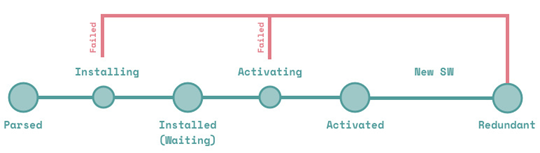
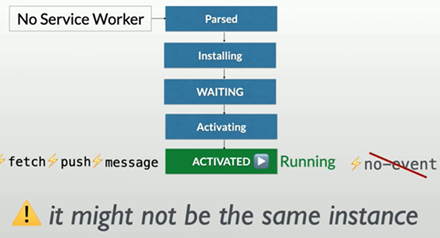
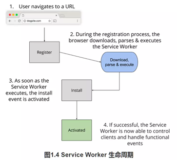
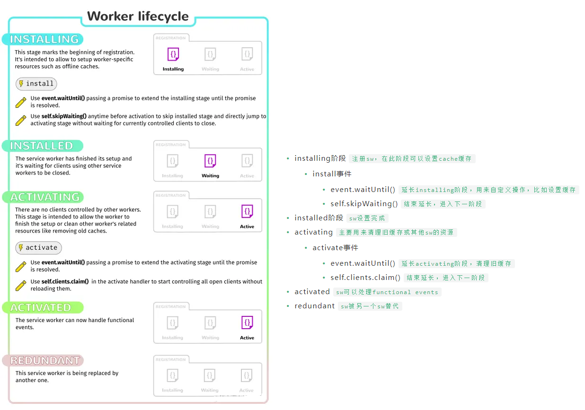
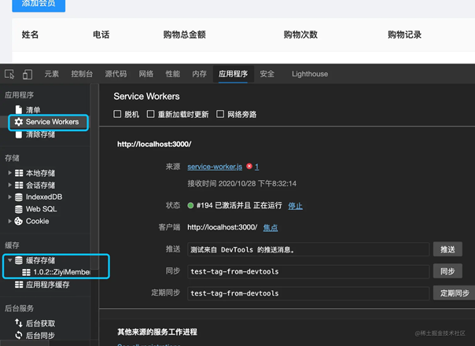

[progressive web application (PWA)](#top)

- [Concepts](#concepts)
- [Components of a PWA](#components-of-a-pwa)
  - [PWA的核心技术](#pwa的核心技术)
  - [tools+调试](#tools调试)
- [Web App Manifest](#web-app-manifest)
- [Other](#other)
  - [make button not select in mobile app](#make-button-not-select-in-mobile-app)
  - [css safe Area in media query](#css-safe-area-in-media-query)
- [Service worker](#service-worker)
  - [Service workers生命周期](#service-workers生命周期)
  - [View installed Service workers](#view-installed-service-workers)
  - [Create a service workers](#create-a-service-workers)
- [Service workers workflow](#service-workers-workflow)
  - [1. Caching and Serving PWA Resources](#1-caching-and-serving-pwa-resources)
  - [2. Serving Resources](#2-serving-resources)
  - [3. Cache Serving Strategies](#3-cache-serving-strategies)
  - [4. Updating Resources](#4-updating-resources)
- [Distribution Buttons-share/install btn](#distribution-buttons-shareinstall-btn)
- [Launch/Publish PWA app](#launchpublish-pwa-app)
- [消息推送](#消息推送)

-------------------------------------

## Concepts

- PWA is a framework for building e-commerce websites that look, feel and perform like native apps on mobile platforms while also functioning like regular websites on standard browsers
- Benefits
  - Improved Customer Reach
  - Increased Engagement: push notifications provide an enormous range of advantages
  - Better Conversion Rates: PWA works equally well in mobile and desktop environments
  - Faster Speeds: 
  - Greater Reliability
  - Streamlined Marketing
  - Higher Customer Lifetime Values
- PWA的三个关键词
  - Reliable(可靠的)：当用户从手机屏幕启动时，无需考虑网络状态，可以立刻加载出PWA
  - Fast(快速的)：加载速度快
  - Engaging(可参与的)：PWA可以添加在用户的主屏幕上，无需从应用商店里下载，他们通过网络应用程序Manifest file提供类似于APP的使用体验（android上可设置全屏显示，由于Safari支持度的问题ios不可以），可以进行“推送通知”
- 小小总结：
  - 解决的问题：
    - 可添加至主屏幕
    - 实现离线缓存功能
    - 实现消息推送
  - 优势：几乎瞬间加载，但安全且富有弹性
  - 核心：manifest文件清单、Service Workers

## Components of a PWA

1. Web App
2. Web App Manifest
3. Service Worker

### PWA的核心技术

1. Service worker
2. Web App Manifest 
3. Push Notifications

### tools+调试

- Lighthouse: How do you know if a URL is a PWA
- - Cross origin requests are only supported for HTTP issue
- 通过 http-server 和 ngrok（https）进行调试查看
  - `npm install http-server -g`
  - 安装 [ngrok](https://ngrok.com/download)
    - `ngrok authtoken yourAuthtoken`
  - 在项目目录下执行如下命令: `http-server -c-1  // -c-1 会关闭缓存`
  - 再开启另外一个终端在 ngrok 文件的目录下执行如下命令: `ngrok http 8080 // http-server 默认开启8080端口`
- 通过live-server和 ngrok（https）进行调试查看
  - `npm install -g live-server`
  - go to project folder and `live-server`

[⬆ back to top](#top)

## Web App Manifest

- 能够将你浏览的网页添加到你的手机屏幕上
- 在 Android 上能够全屏启动，不显示地址栏 （ 由于 Iphone 手机的浏览器是 Safari ，所以不支持）
- 控制屏幕 横屏 / 竖屏 展示
- 定义启动画面
- 可以设置你的应用启动是从主屏幕启动还是从 URL 启动
- 可以设置你添加屏幕上的应用程序图标、名字、图标大小

```json
{
  "short_name": "Weather",       // 可选  在APP launcher和新的tab页显示，如果没有设置，则使用name       
  "name": "Weather: Do I need an umbrella?",
  "icons": [
    {
      "src": "/images/icons-vector.svg",
      "type": "image/svg+xml",
      "sizes": "512x512"
    },
    {
      "src": "/images/icons-192.png",
      "type": "image/png",
      "sizes": "192x192"
    },
    {
      "src": "/images/icons-512.png",
      "type": "image/png",
      "sizes": "512x512"
    }
  ],
  "id": "/?source=pwa",            //
  "start_url": "/?source=pwa",     //where your app should start when it launches, and prevents the app from starting on whatever page the user was on when they added your app to their home screen
  "background_color": "#3367D6",
  "display": "standalone", 
  "scope": "/", 
  "theme_color": "#3367D6",      //the color of the tool bar
  "shortcuts": [
    {
      "name": "How's the weather today?",
      "short_name": "Today",
      "description": "View weather information for today",
      "url": "/today?source=pwa",
      "icons": [{ "src": "/images/today.png", "sizes": "192x192" }]
    },
    {
      "name": "How's the weather tomorrow?",
      "short_name": "Tomorrow",
      "description": "View weather information for tomorrow",
      "url": "/tomorrow?source=pwa",
      "icons": [{ "src": "/images/tomorrow.png", "sizes": "192x192" }]
    }
  ],
  "description": "Weather forecast information",
  "screenshots": [
    {
      "src": "/images/screenshot1.png",
      "type": "image/png",
      "sizes": "540x720",
      "form_factor": "narrow"
    },
    {
      "src": "/images/screenshot2.jpg",
      "type": "image/jpg",
      "sizes": "720x540",
      "form_factor": "wide"
    }
  ]
}
```

**display** values|Behavior
---|---
fullscreen|Opens the web app without any browser UI and takes up all of the available display area.
standalone|Opens the web app to look and feel like a standalone app.<br> The app runs in its own window, separate from the browser, and hides standard browser UI elements such as the address bar.
minimal-ui|This mode is similar to standalone, but provides the user with a minimal set of UI elements for controlling navigation, <br>such the as back and reload buttons.
browser|A standard browser experience

- **theme_color**: can adjust theme_color in a media query using the media attribute of the meta theme color element
  - `<meta name="theme-color" media="(prefers-color-scheme: light)" content="white">`
  - `<meta name="theme-color" media="(prefers-color-scheme: dark)"  content="black">`
- **scope**: controls the URL structure that includes all entry and exit points to the app, and the browser uses it to determine when the user has left the app
  - If don't include a scope in manifest, then the default implied scope is the start URL, but with its filename, query, and fragment removed.
  - The scope attribute can be a relative path (`../`), or any higher level path (`/`) that would allow for an increase in coverage of navigations in web app
  - The start_url must be in the scope
  - The start_url is relative to the path defined in the scope attribute
  - A start_url starting with `/` will always be the root of the origin
- add Manifest to app: `<link rel="manifest" href="/manifest.json">`
- Test your manifest: 'Application' panel of 'Chrome DevTools'

> References
- https://web.dev/articles/add-manifest
- [添加至主屏幕的动图](https://developers.google.cn/web/showcase/2015/chrome-dev-summit)
- https://developer.mozilla.org/zh-CN/docs/Web/Manifest

[⬆ back to top](#top)

## Other

### make button not select in mobile app 

- add following css in button:    `user-select: none;`

### css safe Area in media query

- in styles.css, adding following codes

```css
@media (display-mode: standalone) {
  .container {
    margin: env(safe-area-inset-top) 
            env(safe-area-inset-right) 
            env(safe-area-inset-bottom) 
            env(safe-area-inset-left) !important;
  }
}
```

- in index.html, adding `<meta name="viewport" content="width=device-width, initial-scale=1.0, viewport-fit=cover">`

[⬆ back to top](#top)

## Service worker

- A JavaScript file running in its own thread that will act as a middleware offering a local installed web server or web proxy for your PWA, including resources and API calls, 
- Developer is in full control of how to cache and **serve the resources of the PWA**, and how to **manage API calls**
- 基本特点
  - 运行在它自己的全局脚本上下文中, 这意味着不能直接访问页面中的 DOM 元素。因此，需要一个间接的方式来让 Service Worker 与它控制的页面进行通信。这个可以通过使用[postMessage](https://developer.mozilla.org/en-US/docs/Web/API/Client/postMessage)接口来实现
  - 不绑定到具体的网页
  - 无法修改网页中的元素，因为它无法访问 DOM
  - 只能使用 HTTPS(除了在localhost下运行时)
  - 拦截进出的 HTTP 请求，从而完全控制你的网站
  - 与主JS线程独立，不会被阻塞
  - 完全异步，无法使用localStorage, 这意味着一旦它们运行结束就不能保留任何信息。为了访问先前状态的信息，需要使用 [IndexedDB API](https://developer.mozilla.org/en-US/docs/Web/API/IndexedDB_API)
- 功能(还是比较逆天的)
  - 后台数据的同步
  - 从其他域获取资源请求
  - 接受计算密集型数据的更新，多页面共享该数据
  - 客户端编译与依赖管理
  - 后端服务的hook机制
  - 根据URL模式，自定义模板
  - 性能优化
  - 消息推送
  - 定时默认更新
  - 地理围栏
- Updating the app doesn't require full reinstallation; we can just replace the updated files silently or with a user's notification.
  - Runs client-side in browser's engine
  - HTTPS required
  - Installed by a web page
  - Own thread and lifecycle
  - Acts as a network proxy or local web server in the name of the real server
  - Abilities to run in the background
  - No need for user's permission
- Scopes: An origin (host and port) and a path `https://mydomain.com` or https://domain.com/myapp
  - It manages all pages within browser and within installed app from scope
  - It's installed by any page in the scope
  - After installed, it can serve all files requested from the scope
  - Only one service worker is allowed
  - WebKit adds partition management

### Service workers生命周期

- 
- 
  - **Parsed** 解析成功： 首次注册 SW 时，浏览器解决脚本并获得入口点，如果解析成功，就可以访问到 SW 注册对象，在这一点中我们需要在 HTML 页面中添加一个判断，判断该浏览器是否支持 SW 。
  - **Installing** 正在安装：SW 脚本解析完成之后，浏览器会尝试进行安装，`installing` 中 `install` 事件被执行，如果其中有 event. - `waitUntil()` 方法，则 `installing` 事件会一直等到该方法中的 `Promise` 完成之后才会成功，如果 `Promise` 被拒绝，则安装失败，SW会进入 `Redundant（废弃）`状态。
  - **Installed / Waiting** 安装成功/等待中：如果安装成功，SW 将会进入这个状态。
  - **Activating** 正在激活：处于 waiting 状态的 SW 发生以下情况，将会进入 activating 状态中：
    - 当前已无激活状态的 worker 、 SW脚本中的 self.skipWaiting（）方法被调用 （ ps： self 是 SW 中作用于全局的对象，这个方法根据英文翻译过来也能明白什么意思啦，跳过等待状态 ）、用户已关闭 SW 作用域下的所有页面，从而释放了当前处于激活状态的 worker、超出指定时间，从而释放当前处于激活状态的 worker
  - **Activated** 激活成功：该状态，其成功接收了 document 全面控制的激活态 worker 。
  - **Redundant** 废弃 ：这个状态的出现时有原因的，如果 installing 事件失败或者 activating 事件失败或者新的 SW 替换其成为激活态 worker 。installing 事件失败和 activating 事件失败的信息我们可以在 Chrome 浏览器的 DevTools 中查看
- 
- 把sw的生命周期看成红绿灯
  - **register** (需要下载和解析，红灯)
  - **install** (执行，黄灯)
  - **activated**( 成功，绿灯)
- 当用户首次导航至 URL 时，服务器会返回响应的网页
  1. 当你调用 register() 函数时， Service Worker 开始下载。
  2. 在注册过程中，浏览器会下载、解析并执行 Service Worker ()。如果在此步骤中出现任何错误，register() 返回的 promise 都会执行 reject 操作，并且 Service Worker 会被废弃。
  3. 一旦 Service Worker 成功执行了，install 事件就会激活
  4. 安装完成，Service Worker 便会激活，并控制在其范围内的一切。如果生命周期中的所有事件都成功了，Service Worker 便已准备就绪，随时可以使用了
- 

### View installed Service workers

- 查看所有的:   `chrome://serviceworker-internals/`
- chrome DevTools下查看service-worker和cache
  - 
- type `this` will show `ServiceWorkerGlobalScope` in console

### Create a service workers

- service worker可使用的event
- 

```js
// 注册 service worker
      if ('serviceWorker' in navigator) {           
        navigator.serviceWorker.register('/service-worker.js', {scope: '/'}).then(function (registration) {
          console.log('ServiceWorker registration successful with scope: ', registration.scope);
        }).catch(function (err) {                   

          console.log('ServiceWorker registration failed: ', err);
        });
      }
//service-worker.js
var cacheName = 'helloWorld';     // 缓存的名称  
// install 事件，它发生在浏览器安装并注册 Service Worker 时        
self.addEventListener('install', event => { 
/* event.waitUtil 用于在安装成功之前执行一些预装逻辑
 但是建议只做一些轻量级和非常重要资源的缓存，减少安装失败的概率
 安装成功后 ServiceWorker 状态会从 installing 变为 installed */
  event.waitUntil(
    caches.open(cacheName)                  
    .then(cache => cache.addAll([    // 如果所有的文件都成功缓存了，便会安装完成。如果任何文件下载失败了，那么安装过程也会随之失败。        
      '/js/script.js',
      '/images/hello.png'
    ]))
  );
});
  
/**
为 fetch 事件添加一个事件监听器。接下来，使用 caches.match() 函数来检查传入的请求 URL 是否匹配当前缓存中存在的任何内容。如果存在的话，返回缓存的资源。
如果资源并不存在于缓存当中，通过网络来获取资源，并将获取到的资源添加到缓存中。
*/
self.addEventListener('fetch', function (event) {
  event.respondWith(
    caches.match(event.request)                  
    .then(function (response) {
      if (response) {                            
        return response;                         
      }
      var requestToCache = event.request.clone();  //          
      return fetch(requestToCache).then(                   
        function (response) {
          if (!response || response.status !== 200) {      
            return response;
          }
          var responseToCache = response.clone();          
          caches.open(cacheName)                           
            .then(function (cache) {
              cache.put(requestToCache, responseToCache);  
            });
          return response;             
    })
  );
});
```

- 注：Service Worker 的注册路径决定了其 scope 默认作用页面的范围。
  - 如果 service-worker.js 是在 /sw/ 页面路径下，这使得该 Service Worker 默认只会收到 页面/sw/ 路径下的 fetch 事件。
  - 如果存放在网站的根路径下，则将会收到该网站的所有 fetch 事件。
  - 如果希望改变它的作用域，可在第二个参数设置 scope 范围。示例中将其改为了根目录，即对整个站点生效
- 注：为什么用request.clone()和response.clone()
  - 因为request和response是一个流，它只能消耗一次。因为我们已经通过缓存消耗了一次，然后发起 HTTP 请求还要再消耗一次，所以需要在此时克隆请求Clone the request—a request is a stream and can only be consumed once

[⬆ back to top](#top)

## Service workers workflow

### 1. Caching and Serving PWA Resources

- Service worker has a local cache
- We can cache all or some resources
- JavaScript promise
- Prefetch on installation
- Cache on request
- App Shell pattern

[⬆ back to top](#top)

### 2. Serving Resources

- The service worker will respond for every request the PWA make
- It can serve from the cache
- It can forward the request to the network
- It can synthesize a response
- Any mixed algorithm is possible

### 3. Cache Serving Strategies

- Cache first
- Network first
- stale while revalidate

### 4. Updating Resources

- Files are saved in the client
- Updating files in the server won't trigger any automatic change in the client
- We need to define and code an update algorithm
- It will need a process within your build system for hashing or versioning files
- **Method 1**: using version `//v1`  --> `//v2`
- **Method 2**: State while revalidate strategy

```js
// 1. add save() function in app.js
// updating cache resources
    if (localStorage.getItem("notes")) {
        notes = JSON.parse(localStorage.getItem("notes"));
    }
    //...
   save();
   //...
   function save() {
    localStorage.setItem("notes", JSON.stringify(notes));
   }
// 2. sw.js  --- State while revalidate strategy
event.respondWith(
    caches.match(event.request)
        .then( cachedResponse => {
            // Even if the response is in the cache, we fetch it
            // and update the cache for future usage
            const fetchPromise = fetch(event.request).then(
                 networkResponse => {
                    caches.open("assets").then( cache => {
                        cache.put(event.request, networkResponse.clone());
                        return networkResponse;
                    });
                });
            // We use the currently cached version if it's there
            return cachedResponse || fetchPromise; // cached or a network fetch
        })
    );
```

[⬆ back to top](#top)

## Distribution Buttons-share/install btn

```js
// app.js
document.addEventListener("DOMContentLoaded", event => {
  //...
  // 1. share button
  document.querySelector("#btnShare").addEventListener("click", event => {
        let notesString = "";
        for (let note of notes) {
            notesString += note + " | "
        }
        navigator.share({
            title: "CodePad",
            text: notesString
        })
    })
  // 2. install button
    let bipEvent = null;
    window.addEventListener("beforeinstallprompt", event => {
        event.preventDefault();
        bipEvent = event;
    })
    document.querySelector("#btnInstall").addEventListener("click", event => {
        if (bipEvent) {
            bipEvent.prompt();
        } else {
            // incompatible browser, your PWA is not passing the criteria, the user has already installed the PWA
            //TODO: show the user information on how to install the app
            alert("To install the app look for Add to Homescreen or Install in your browser's menu");
        }
    })
  //...
})
```

- css for install button

```css
@media (display-mode: standalone), (display-mode: minimal-ui) {
  #itemInstall {
    display: none;
  }
}
```

- manifest file for install button in Android

```json
"description": "This app lets you add notes while you are coding",
"screenshots": [
    {
      "src": "icons/screenshot.png",
      "sizes": "1170x2532",
      "type": "image/png"
    }
]
```

[⬆ back to top](#top)

## Launch/Publish PWA app

- Distribution Models
  - Browser
  - Enterprise
  - App Stores/Google Play Store
- Tools to create PWA Launchers
  - IDEs for native development
  - CLIs
  - PWA Builder - pwabuilder.com

[⬆ back to top](#top)

## 消息推送

1. 提示用户并获得他们的订阅详细信息: index.html
2. 将这些详细信息保存在服务器上: index.html
3. 在需要时发送任何消息: app.js

```html
<!DOCTYPE html>
<html>
  <head>
    <meta charset="UTF-8">
    <title>Progressive Times</title>
    <link rel="manifest" href="/manifest.json">                                      
  </head>
  <body>
    <script>
      var endpoint;
      var key;
      var authSecret;
      var vapidPublicKey = 'BAyb_WgaR0L0pODaR7wWkxJi__tWbM1MPBymyRDFEGjtDCWeRYS9EF7yGoCHLdHJi6hikYdg4MuYaK0XoD0qnoY';
      // 方法很复杂，但是可以不用具体看，知识用来转化vapidPublicKey用
      function urlBase64ToUint8Array(base64String) {                                  
        const padding = '='.repeat((4 - base64String.length % 4) % 4);
        const base64 = (base64String + padding).replace(/\-/g, '+').replace(/_/g, '/');
        const rawData = window.atob(base64);
        const outputArray = new Uint8Array(rawData.length);
        for (let i = 0; i < rawData.length; ++i) {
          outputArray[i] = rawData.charCodeAt(i);
        }
        return outputArray;
      }
      if ('serviceWorker' in navigator) {
        navigator.serviceWorker.register('sw.js').then(function (registration) {
          return registration.pushManager.getSubscription()                            
            .then(function (subscription) {
              if (subscription) {                                                      
                return;
              }
              return registration.pushManager.subscribe({                              
                  userVisibleOnly: true,
                  applicationServerKey: urlBase64ToUint8Array(vapidPublicKey)
                })
                .then(function (subscription) {
                  var rawKey = subscription.getKey ? subscription.getKey('p256dh') : '';
                  key = rawKey ? btoa(String.fromCharCode.apply(null, new Uint8Array(rawKey))) : '';
                  var rawAuthSecret = subscription.getKey ? subscription.getKey('auth') : '';
                  authSecret = rawAuthSecret ?
                    btoa(String.fromCharCode.apply(null, new Uint8Array(rawAuthSecret))) : '';
                  endpoint = subscription.endpoint;
                  return fetch('./register', {                                         
                    method: 'post',
                    headers: new Headers({
                      'content-type': 'application/json'
                    }),
                    body: JSON.stringify({
                      endpoint: subscription.endpoint,
                      key: key,
                      authSecret: authSecret,
                    }),
                  });
                });
            });
        }).catch(function (err) {
          // 注册失败 :(
          console.log('ServiceWorker registration failed: ', err);
        });
      }
    </script>
  </body>
</html>
```

```js
//app.js
const webpush = require('web-push');                 
const express = require('express');
var bodyParser = require('body-parser');
const app = express();
webpush.setVapidDetails(                             
  'mailto:contact@deanhume.com',
  'BAyb_WgaR0L0pODaR7wWkxJi__tWbM1MPBymyRDFEGjtDCWeRYS9EF7yGoCHLdHJi6hikYdg4MuYaK0XoD0qnoY',
  'p6YVD7t8HkABoez1CvVJ5bl7BnEdKUu5bSyVjyxMBh0'
);
app.post('/register', function (req, res) {           
  var endpoint = req.body.endpoint;
  saveRegistrationDetails(endpoint, key, authSecret); 
  const pushSubscription = {                          
    endpoint: req.body.endpoint,
    keys: {
      auth: req.body.authSecret,
      p256dh: req.body.key
    }
  };
  var body = 'Thank you for registering';
  var iconUrl = 'https://example.com/images/homescreen.png';
  // 发送 Web 推送消息
  webpush.sendNotification(pushSubscription,          
      JSON.stringify({
        msg: body,
        url: 'http://localhost:3111/',
        icon: iconUrl
      }))
    .then(result => res.sendStatus(201))
    .catch(err => {
      console.log(err);
    });
});
app.listen(3111, function () {
  console.log('Web push app listening on port 3111!')
});
//service-worker.js  -> service worker监听push事件，将通知详情推送给用户
self.addEventListener('push', function (event) {
 // 检查服务端是否发来了任何有效载荷数据
  var payload = event.data ? JSON.parse(event.data.text()) : 'no payload';
  var title = 'Progressive Times';
  event.waitUntil(
    // 使用提供的信息来显示 Web 推送通知
    self.registration.showNotification(title, {                           
      body: payload.msg,
      url: payload.url,
      icon: payload.icon
    })
  );
});
```

[⬆ back to top](#top)

samsung iTest  -> ios

> Referencs
- [H5 PWA技术以及小demo](https://www.cnblogs.com/yangyangxxb/p/9964959.html)
  - [离线缓存网页demo](https://github.com/yangTwo100/PWA_search_demo)
- [Transform a React App into a Progressive Web App (PWA)](https://www.linkedin.com/pulse/transform-react-app-progressive-web-pwa-shankhadeep-bhadra/)

> Resources
- [在 React 中使用 Service Worker](https://juejin.cn/post/6881616183158636552)
- [基于React SSR实现的仿MOO音乐风格的音乐网站，支持PWA](https://juejin.cn/post/6864204617152987150)
- https://codesandbox.io/examples/package/next-pwa
- https://github.com/MacKentoch/react-redux-nextjs-bootstrap-pwa-starter/tree/master
- [前端学习资料网址汇总](https://juejin.cn/post/7218369118788010044)
