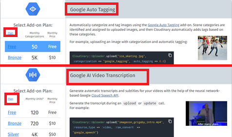

[AI image transformation-Next-clerk-cloudinary-stripe](#top)

- [Route Group](#route-group)
- [Clerk auth + NextJS](#clerk-auth--nextjs)
- [MongoDB by using mongoose](#mongodb-by-using-mongoose)
  - [NextJS - Server Actions and Mutations](#nextjs---server-actions-and-mutations)
  - [Sync Clerk data to MongoDB with webhooks](#sync-clerk-data-to-mongodb-with-webhooks)
- [Reactive Form - React-Hook-Form+Zod-Validation](#reactive-form---react-hook-formzod-validation)
- [Cloudinary](#cloudinary)
  - [Cloudinary Media Uploader](#cloudinary-media-uploader)
  - [Transformed Image Components](#transformed-image-components)
- [Home page](#home-page)
- [Checkout \& Pay with Stripe](#checkout--pay-with-stripe)

---------------------------------------------------------------------------------


- `npx create-next-app@latest`

```
📂src/
├── 📂 app/
│   ├── 📂 (auth)/                        - Route Group
│   │    ├── 📂 sign-in/[[...sign-in]]/
│   │    │         └── 📄 page.tsx             - custom sign-in page
│   │    ├── 📂 sign-up/[[...sign-up]]/
│   │    │         └── 📄 page.tsx             - custom sign-up page
│   │    └── 📄 layout.tsx                - auth layout
│   ├── 📂 (root)/                        - Route Group
│   │    ├── 📂 credits/
│   │    │         └── 📄 page.tsx
│   │    ├── 📂 profile/
│   │    │         └── 📄 page.tsx
│   │    ├── 📂 transformtions/
│   │    │         ├── 📂 [id]/
│   │    │         │    ├── 📂 update/
│   │    │         │    │    └── 📄 page.tsx
│   │    │         │    └── 📄 page.tsx
│   │    │         └── 📂 add/[type]/
│   │    │              └── 📄 page.tsx
│   │    ├── 📄 layout.tsx                     - main layout
│   │    └── 📄 page.tsx
│   ├── 📂 api/webhooks/
│   │    ├── 📂 clerk/
│   │    │         └── 📄 route.ts
│   │    └── 📂 stripe/
│   │              └── 📄 route.ts
│   ├── 📄 globals.css
│   ├── 📄 layout.tsx                          - root layout
│   └── 📄 page.tsx
├── 📂 components/
│   │    ├── 📂 shared/
│   │    │         ├── 📄 mobileNav.tsx
│   │    │         ├── 📄 sidebar.tsx
│   │    │         └── 📄 ...
│   │    └── 📂 ui/                            - shadcn
│   ├── 📄 chats-store.ts
│   └── 📄 users-store.ts
├── 📂 constants/
│   └── 📄 index.ts
├── 📂 lib/
│   │    ├── 📂 actions/
│   │    │         ├── 📄 image.actions.ts
│   │    │         ├── 📄 transaction.actions.ts
│   │    │         └── 📄 user.actions.ts
│   │    ├── 📂 database/
│   │    │         ├── 📂 models/
│   │    │         │     ├── 📄 image.model.ts
│   │    │         │     ├── 📄 image.model.ts
│   │    │         │     └── 📄 image.model.ts
│   │    │         └── 📄 user.actions.ts
│   │    └── 📄 utils.ts
├── 📂 types/
│   └── 📄 index.d.ts
├── 📄 middleware.ts                - clerkMiddleware
```


## Route Group

- to prevent the folder from being included in the route's URL path
- Route groups are useful for:
  - Organizing routes into groups e.g. by site section, intent, or team
    - 
  - Enabling nested layouts in the same route segment level
    - 
    - Creating multiple nested layouts in the same segment, including multiple root layouts
    - Adding a layout to a subset of routes in a common segment

[⬆ back to top](#top)

## Clerk auth + NextJS

https://github.com/honggzb/Study-General/blob/master/React/NextJS/NextJs%E5%AD%A6%E4%B9%A0-authentication-clerk.md

## MongoDB by using mongoose

- in MongoDB console
  - network Access --> add IP address --> allow access from anywhere
  - overview --> connect --> select 'driver' in popup
- add url to '.env.local'
- `npm install mongodb mongoose`
- create 'src\lib\database\mongoose.ts'
- create models: 'src\lib\database\models\image.model.ts', ...


### NextJS - Server Actions and Mutations

- [Server Actions and Mutations](https://nextjs.org/docs/app/building-your-application/data-fetching/server-actions-and-mutations)
  - [Server Actions](https://react.dev/reference/rsc/server-actions) are asynchronous functions that are executed on the server
- create models instances(actions-CRUD): 'src\lib\actions\user.actions.ts', ...
- add Types: 'src\types\index.d.ts'

[⬆ back to top](#top)

### Sync Clerk data to MongoDB with webhooks

- A webhook is an event-driven method of communication between applications
- Clerk webhooks allow to receive event notifications from Clerk, such as when a user is created or updated
- Clerk uses [Svix](https://svix.com/) to send our webhooks
- 
- Need deploy your application firstly, for example deploying at github
  1. create a new repository
  2. `npm i qs`
  3. `git init`
  4. `git add .`
  5. `git commit -m 'init comit'`
  6. `git branch -M main`
  7. `git remote add origin https://github.com/xxx/imaginity.git`
  8. `git push -u origin main`
  9. 
- deploy to Versel Console
  1. https://vercel.com/honggzbs-projects
  2. 'add New..'
- [Sync Clerk data to your application with webhooks](https://clerk.com/docs/integrations/webhooks/sync-data)
  - 
  - 
  - Add your signing secret to '.env.local' file
  - Set webhook route as public in Middleware
  - Install svix: `npm install svix`
  - Create the endpoint in application: 'src\app\api\webhooks\clerk\route.ts'
- submit new git

[⬆ back to top](#top)

## Reactive Form - React-Hook-Form+Zod-Validation

- 'src\components\shared\TransformationForm.tsx'
- 'src\components\shared\CustomField.tsx'

[⬆ back to top](#top)

## Cloudinary

### Cloudinary Media Uploader

- [cloudinary](https://console.cloudinary.com/)
- `npm i next-cloudinary`
- add following to '.env.local'
  - `NEXT_PUBLIC_CLOUDINARY_CLOUD_NAME=xxx`
  - `CLOUDINARY_API_KEY=xxx`
  - `CLOUDINARY_API_SECRET=xxx`
- click 'setting' on left-bottom in console  ->
  - click 'upload' -->
  - click 'Unsigned uploading enabled'
  - click 'Add upload preset'
    - 
- click 'Add-ons' on left menu in console  ->
  - choose 'Cloudinary AI Background Removal'  --> click 'free' plan
  - choose 'Google Auto Tagging'  --> click 'free' plan
  - 
- create 'src\components\shared\MediaUploader.tsx'
  - add upload field to 'src\components\shared\TransformationForm.tsx'
- `npm install next-cloudinary`
  - [next-cloudinary](https://next.cloudinary.dev/)
  - [Getting Started with CldUploadWidget](https://next.cloudinary.dev/clduploadwidget/basic-usage)

### Transformed Image Components

- create 'src\components\shared\TransformedImage.tsx'
- add TransformedImage field to 'src\components\shared\TransformationForm.tsx'
- create server action file: 'src\lib\actions\image.actions.ts'

[⬆ back to top](#top)

## Home page

- 'src\app\(root)\page.tsx'
- 'src\components\shared\Collection.tsx'  -> recently edit images
- 'src\components\shared\Search.tsx'
- 'src\lib\actions\image.actions.ts'

[⬆ back to top](#top)

## Checkout & Pay with Stripe

- [Stripe docs](https://docs.stripe.com/)
- add key to '.env.local'
  - `NEXT_PUBLIC_STRIPE_PUBLISHABLE_KEY=pk_test_xxxxx`
  - `STRIPE_SECRET_KEY=sk_test_xxxxxxxxxxx`
- Create 'a webhook endpoint' on stripe dashboard
- `npm i stripe @stripe/stripe-js`
- create server action: 'src\lib\actions\transaction.actions.ts'


[⬆ back to top](#top)

> references
- https://github.com/adrianhajdin/ai_saas_app/tree/main
- https://www.youtube.com/watch?v=Ahwoks_dawU
- [Build a File Storage App with Role Based Authorization (Next.js, Shadcn, Typescript)](https://www.youtube.com/watch?v=27hMNWcsa-Y)


00:00:00 — Intro
00:03:49 — Project Setup
00:12:12 — Next.js Routing & folder structure
00:23:21 — Clerk Authentication
00:37:15 — Layout Sidebar & Mobile Navigation
01:02:06 — Database & Models Setup
01:18:54 — Server Actions & Webhook
01:47:50 — Add Image Form (React Hook Form + Zod Validation)
02:26:05 — Cloudinary Media Uploader
02:49:00 — Transformed Image Components
03:01:10 — Image Server Action
03:33:25 — Homepage + Search & Pagination
03:52:10 — Image details, Update & Delete Image
04:12:21 — Checkout & Pay with Stripe
04:30:10 — Final Deployment & Production fixes

✅
