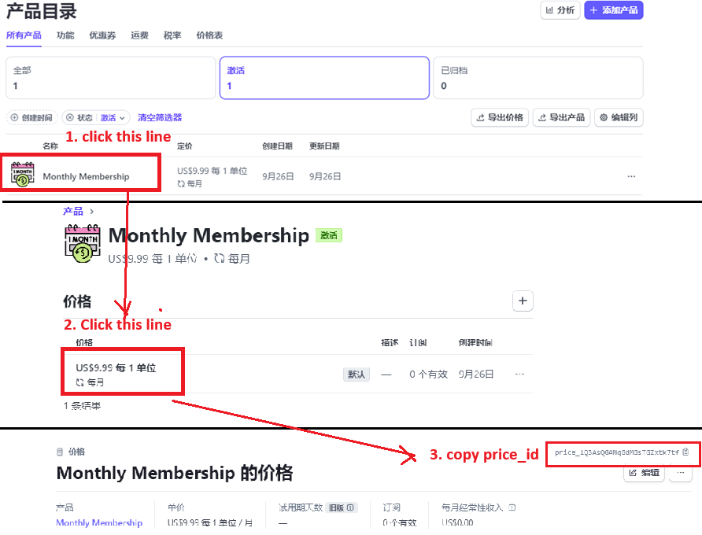

[Google-AI-GEN](#top)

- [Getting Started](#getting-started)
- [Google Gemini AI](#google-gemini-ai)
- [markdown library](#markdown-library)
- [Clerk auth](#clerk-auth)
- [Static Template data](#static-template-data)
- [toggle theme by using shadcn+next](#toggle-theme-by-using-shadcnnext)
- [rich text Editor for generated content](#rich-text-editor-for-generated-content)
- [Searching \& Filtering in dashboard](#searching--filtering-in-dashboard)
- [MongoDB](#mongodb)
- [useful layout](#useful-layout)
  - [progressing bar](#progressing-bar)
  - [search input](#search-input)
- [Stripe](#stripe)
  - [setup](#setup)
  - [stripe checkout session](#stripe-checkout-session)
  - [Stripe webhook](#stripe-webhook)
  - [stripe usage and subscription](#stripe-usage-and-subscription)


---------------------------------------------------------------------------

## Getting Started

```
   project     |       Tech Stack       |     function      |  implementation
---------------|------------------------|-------------------|-------------------------
               | @clerk/nextjs          | authentication    | login/logout auth
               | Shadcn ui              | ui library        | toggle theme
               | Mongoose               | database          | paginate, loadmore
google-ai-gen  | Stripe                 | payments          |
               | @toast-ui/react-editor | richText Editor   |
               | @google/generative-ai  | Google Gemini AI  |
               | react-markdown         | Markdown handle/AI|
               | react                  | useUsage,
---------------|------------------------|-------------------|--------------------------
```

- `npx create-next-app@latest`
- `npx shadcn@latest init`
- `npx shadcn@latest add input button textarea dropdown-menu sheet dialog`
- <mark>icon</mark>:
  - `npm i lucide-react`  -->   using directly `<LayoutDashboard />`
  - https://www.flaticon.com/   --> using in `<Image src={item.icon} alt={item.name} width={50} height={50} />`
- <mark>image</mark>: https://pixabay.com/

```
├── 📂actions/
│   ├── 📄ai.ts
│   └── 📄stripe.ts
├── 📂app/
│   ├── 📂api/webhook/
│   │    └── 📄route.ts                 - stripe webhook route
│   ├── 📂dashboard/
│   │    ├── billing/
│   │    │     └── 📄page.tsx
│   │    ├── 📂history/
│   │    │     └── 📄page.tsx
│   │    ├── 📂settings/[[...rest]]/
│   │    │     └── 📄page.tsx
│   │    ├── 📂 template/[slug]/
│   │    │     └── 📄page.tsx
│   │    ├── 📄layout.tsx                - dashbord layout
│   │    └── 📄page.tsx                  - dashbord page
│   ├── 📂gen-ai/
│   │    └── 📄page.tsx                  - old home page
│   ├── 📂membership/
│   │    └── 📄page.tsx
│   ├── 📄globals.css
│   ├── 📄layout.tsx
│   └── 📄page.tsx                       - home page
├── 📂 components/
│   │    ├── 📂cards/
│   │    │      └── 📄promo-card.tsx
│   │    ├── 📂modal/
│   │    │      ├── 📄sign-in-modal.tsx
│   │    │      └── 📄sign-up-modal.tsx
│   │    ├── 📂nav/
│   │    │      ├── 📄mobile-nav.tsx
│   │    │      ├── 📄side-nav.tsx
│   │    │      ├── 📄theme-toggle.tsx
│   │    │      ├── 📄top-nav.tsx
│   │    │      └── 📄usage.tsx
│   │    ├── 📂plan/
│   │    │      └── 📄plan-card.tsx
│   │    ├── 📂table/
│   │    │      └── 📄query-table.tsx
│   │    └── 📂ui/
│   └── 📄theme-provider.tsx             - theme toggle provider
├── 📂 context/                          - context
│   └── 📄usage.ts
├── 📂 lib/
├── 📂 models/                           - MongoDB schema/model
│   ├── 📄query.ts
│   └── 📄transaction.ts
├── 📂 utils/
│   ├── 📄db.ts                         - MongoDB connection
│   ├── 📄stripe-util.ts                - Stripe connection/setup
│   └── 📄templates.ts                  - static template resources
├── 📄 middleware.ts                    - clerkMiddleware
```


## Google Gemini AI

- https://ai.google.dev/
- https://aistudio.google.com/
- [Gemini API quickstart](https://ai.google.dev/gemini-api/docs/quickstart?lang=node)
  1. `npm install @google/generative-ai`
  2. 
  3. create server action: 'actions\ai.ts'
  4. modify 'app\page.tsx'

```ts
// actions\ai.ts
"use server";
const {
  GoogleGenerativeAI,
  HarmCategory,
  HarmBlockThreshold,
} = require("@google/generative-ai");
const apiKey = process.env.GEMINI_API_KEY;
const genAI = new GoogleGenerativeAI(apiKey);
const model = genAI.getGenerativeModel({
  model: "gemini-1.5-flash",
});
const generationConfig = {
  temperature: 1,
  topP: 0.95,
  topK: 64,
  maxOutputTokens: 8192,
  responseMimeType: "text/plain",
};
export async function runAi(text: string) {
  const chatSession = model.startChat({
    generationConfig,
    history: [],
  });
  const result = await chatSession.sendMessage(text);
  return result.response.text();
}
// app\page.tsx
const [query, setQuery] = useState('');
const handleClick = async (e: React.ChangeEvent<HTMLFormElement>) => {
    e.preventDefault();
    try {
      const data = await runAi(query);
      setResponse(data);
    } catch (error) {
      console.error(error);
    }
  };
<Input value={query} onChange={(e) => setQuery(e.target.value)} />
```

## markdown library

-`npm i react-markdown`
- `<ReactMarkdown children={response} />`
  - [Understanding the components prop in react-markdown](https://www.singlehanded.dev/blog/understanding-the-components-prop-in-react-markdown)
  - [Building a Markdown-driven blog using Next.js 13 and App Router](https://www.singlehanded.dev/blog/building-markdown-blog-with-nextjs-app-router)

```js
//app\dashboard\template\[slug]\page.tsx
//------rich textEditor-----------------------------
import { Editor } from '@toast-ui/react-editor';
const editorRef = useRef<any>(null);
const [content, setContent] = useState("");
useEffect(() => {
  if(content) {
    const editorInstance = editorRef.current.getInstance();
    editorInstance.setMarkdown(content);
  }
}, [content]);

<Editor ref={editorRef}
        initialValue="Generated content will appear here."
        initialEditType='wysiwyg'
        previewStyle="vertical"
        height="600px"
        useCommandShortcut={true}
/>
//----copy feature---------------
const handleCopy = async () => {
    const editorInstance = editorRef.current.getInstance();
    const c = editorInstance.getMarkdown();   //getHTML()
    try {
      await navigator.clipboard.writeText(c)
      toast.success("Content copied to clipboard")
    } catch (error) {
      toast.error("An error ocurred. Please try again!")
    }
  }
<Button onClick={handleCopy}>
  <Copy /><span className="ml-2">Copy</span>
</Button>
// app\gen-ai\page.tsx  --old home page
import ReactMarkdown from 'react-markdown';
const [response, setResponse] = useState('');
const [loading, setLoading] = useState(false);
const handleClick = async (e: React.ChangeEvent<HTMLFormElement>) => {
    e.preventDefault();
    setLoading(true);
    try {
      const data = await runAi(query);
      setResponse(data);
    } catch (error) {
      console.error(error);
    } finally {
      setLoading(false);
    }
};
<form onSubmit={handleClick}>
  <CardContent>
    {loading ? (<div>Loading...</div>) : (<ReactMarkdown children={response} />)}
  </CardContent>
</form>
```

[⬆ back to top](#top)

## Clerk auth

- `npm install @clerk/nextjs`
- add keys into your '.env.local' file
- Add Middleware to application
  - Create a 'middleware.ts' file in root directory
  - add protectedRoute to middleware
  - https://clerk.com/docs/references/nextjs/clerk-middleware#clerk-middleware-next-js
- Add `<ClerkProvider>` and components to 'app\layout.tsx'
- Add `SignInButton, SignedIn, SignedOut, UserButton, useUser` to 'components\nav\top-nav.tsx'
- https://clerk.com/docs/quickstarts/nextjs

[⬆ back to top](#top)

## Static Template data

- create 'utils\template.ts'
  - can generated automatically by using 'https://chatgpt.com/'
  - using prompt:
    - 'this is the project. give me similar object, 12 of them. This is for my web development project where i need to provide static options for users'
  - give a sample of one object
- [`next/image` Un-configured Host](https://nextjs.org/docs/messages/next-image-unconfigured-host)
  - modify 'next.config.mjs'

```js
//next.config.mjs
const nextConfig = {
  images: {
    remotePatterns: [
      {
        protocol: 'https',
        hostname: 'cdn-icons-png.flaticon.com',
      },
    ],
  },
};
```

[⬆ back to top](#top)

## toggle theme by using shadcn+next

- https://ui.shadcn.com/docs/dark-mode/next
1. `npm install next-themes`
2. Create a theme provider --> 'components/theme-provider.tsx'
3. Wrap root layout  --> 'app/layout.tsx'
4. Add a mode toggle   -->
   1. `npx shadcn@latest add dropdown-menu`
   2. 'components\nav\theme-toggle.tsx', 'components\nav\top-nav.tsx'

[⬆ back to top](#top)

## rich text Editor for generated content

1. `npm install --save @toast-ui/react-editor`
   1. https://www.npmjs.com/package/@toast-ui/react-editor
2. create dynamic route page -->  'app\dashboard\template\[slug]\page.tsx'
3. modify dashboard page  --> 'app\dashboard\page.tsx'
4. TOAST UI Editor provides **Markdown** mode and **WYSIWYG** mode
5. `npm i react-hot-toast`

```ts
const [content, setContent] = useState("");
const editorRef = useRef<any>(null);   // define a ref
useEffect(() => {                      // for content change by using useEffect
  if(content) {
    const editorInstance = editorRef.current.getInstance();
    editorInstance.setMarkdown(content);
  }
}, [content]);
// copy functionality
const handleCopy = async () => {
    const editorInstance = editorRef.current.getInstance();
    const c = editorInstance.getMarkdown();   //getHTML()
    try {
      await navigator.clipboard.writeText(c)
      toast.success("Content copied to clipboard")
    } catch (error) {
      toast.error("An error ocurred. Please try again!")
    }
  }
// template part
<Button onClick={handleCopy}>Copy</Button>
<Editor
  ref={editorRef}    // using ref
  initialValue="Generated content will appear here."
  initialEditType='wysiwyg'
  previewStyle="vertical"
  height="600px"
  useCommandShortcut={true}
/>
```

[⬆ back to top](#top)

## Searching & Filtering in dashboard

1. modify dashboard page  --> 'app\dashboard\page.tsx'

```ts
const [search, setSearch] = useState("");
const filteredTemplates = template.filter((item) => item.name.toLowerCase().includes(search.toLowerCase()));
// template part
<input type="text" value={search} onChange={e => setSearch(e.target.value)} />
{filteredTemplates.map((item) => (...)) }
```

## MongoDB

- `npm i mongoose`
- 'utils\db.ts'   --> connect to mongoDB
- Schemas:
  - 'models\query.ts'
  - 'models\transaction.ts'

## useful layout

### progressing bar

```html
<div className='h-2 bg-slate-500 w-full rounded-full mt-3'>
  <div className='h-2 bg-slate-200 rounded-full' style={{width: `${percentage}%`}}></div>
</div>
```

### search input

```html
<!-- components\modal\sign-in-modal.tsx -->
 <div className="flex items-center justify-between border border-slate-300 rounded-full bg-transparen px-4 py-2 w-1/2 mx-auto mb-4 hover:bg-slate-500 hover:bg-opacity-30 cursor-pointer"
    <span className="text-slate-100"> Join free membership</span>
    <span className="bg-slate-500 text-slate-100 rounded-full w-8 h-8 flex items-center justify-center">
        <ChevronRight />
    </span>
</div>
```

[⬆ back to top](#top)

## Stripe

### setup

- https://dashboard.stripe.com/
1. create a new account and get key, add to '.env.local'
  - 
2. select 'Product catalog' from left menu --> 'Add Product' button on right-top
   1. 
   2. 
3. get price_id:
   1. click 'product' in the list ->
   2. 
4. `npm i stripe @stripe/stripe-js`
5. `npm i @types/stripe -D`

### stripe checkout session

1. Transaction Model for DB  --> 'models\transaction.ts'
2. Server Action for stripe checkout session  --> 'actions\stripe.ts'
3. 'utils\stripe-util.ts'
4. modify 'components\plan\plan-card.tsx'

### Stripe webhook

1. [Webhooks docs](https://docs.stripe.com/webhooks)
2. [webhooks workbench](https://dashboard.stripe.com/test/workbench/webhooks)
3. [webhooks workbench docs](https://docs.stripe.com/stripe-cli)
4. 
5. cmd: `stripe login`
6. cmd: `stripe listen --forward-to localhost:3000/api/webhook`
7. create 'app\api\webhook\route.ts'

### stripe usage and subscription

1. create 'context\usage.tsx'

[⬆ back to top](#top)


> references
- Building AI App with React NextJs TypeScript Google & Stripe
